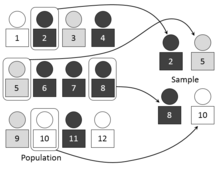

  <h1>📈 Statistics/Math 📈</h1>

> 질문은 <strong>[zzsza님의 Datascience-Interview-Questions](https://github.com/zzsza/Datascience-Interview-Questions)</strong>를 참고하였습니다.

## Table of Contents

- [고유값 (eigen value) 와 고유벡터 (eigen vector)에 대해 설명해주세요. 그리고 왜 중요할까요?](#1)
- [샘플링(Sampling)과 리샘플링(Resampling)에 대해 설명해주세요. 리샘플링은 무슨 장점이 있을까요?](#2)
- [누적 분포 함수와 확률 밀도 함수는 무엇일까요? 수식과 함께 표현해주세요!](#3)
- [공분산과 상관계수는 무엇일까요? 수식과 함께 표현해주세요](#6)

## #1

#### 고유값 (eigen value) 와 고유벡터 (eigen vector)에 대해 설명해주세요. 그리고 왜 중요할까요?

선형대수학에서, 선형 변환의 고유 벡터는 그 선형 변환이 일어난 후에도 방향이 변하지 않는, 영벡터가 아닌 벡터입니다. 

고유 벡터의 길이가 변하는 배수를 그 고유 벡터에 대응하는 고유값이라고 합니다.
$$
A\vec{x} = \lambda\vec{x}
$$

어떤 정방행렬 $ A$ 는 임의의 $ \vec{x}$ 에 곱해져서 $ \vec{x}$ 의 위치나 방향을 변환시키는 역할을 합니다. 이 때, 어떤 특정 벡터들은 $ A$ 에 곱해져도 자신과 평행한 방향을 갖는데, 이러한 벡터들을 고유벡터라고 합니다. 변환 전후의 크기 차이는 특정 상수를 곱한 정도로 존재하는데, 이 특정 상수가 고유값입니다.

n x n 행렬에서 고유값은 일반적으로 n개이고, 고유벡터는 무수히 많습니다. 이 무수히 많은 고유벡터는 하나의 부분 공간을 형성하고, 이 부분공간이 고유공간이 됩니다. 

행렬이 벡터에 가하는 변환을 고유벡터들이 기저를 이루는 고유공간에서의 변환으로 해석함으로써, 회전 변환은 배제하고 확대/축소 변환만으로 이해하고 응용할 수 있게 되었다는 점에서 중요하다고 할 수 있습니다.

고유값 & 고유벡터의 응용 - 대각화

고유값과 고유벡터를 활용해서 행렬을 대각화함으로써 계산하기 쉬운 기저를 선택해 문제해결의 복잡도를 줄일 수 있습니다.

##### References

- [wikipedia](https://ko.wikipedia.org/wiki/%EA%B3%A0%EC%9C%B3%EA%B0%92%EA%B3%BC_%EA%B3%A0%EC%9C%A0_%EB%B2%A1%ED%84%B0#:~:text=%EA%B3%A0%EC%9C%A0%20%EB%B2%A1%ED%84%B0%EC%9D%98%20%EA%B8%B8%EC%9D%B4%EA%B0%80,%EC%95%84%EC%9D%B4%EA%B1%B4%EB%B0%B8%EB%A5%98)
- [고유값과 고유벡터](https://twlab.tistory.com/46?category=668741)
- [선형대수기초](https://blog.daum.net/jungjin1980/148)

​	

## #2

#### 샘플링(Sampling)과 리샘플링(Resampling)에 대해 설명해주세요. 리샘플링은 무슨 장점이 있을까요?

**샘플링이란?**

- 전체 모집단에서 표본 추출을 하는 것
- 쉽게 말하자면 모집단에서 일부분을 추출하여 사용하는 것
- 

**왜 샘플링을 할까?** 많은 이유들이 있겠지만 대표적으로,

- 모집단 전체를 전수조사하는것은 어렵고 시간과 비용이 많이 들어간다.
- 모든 관측치를 하나로 모으는 것은 매우 어려울 수 있다.
- 더 많은 관측은 미래에 만들어질 예정일 수 있다.

위와 같은 이유로 모집단 전체를 조사하는 것이 불가능하기 때문에 샘플(sample)을 이용하여 모집단(population)에 대한 추론(inference)을 하는 것이다. 표본은 모집단을 닮은 mirror 같은 존재이지만, 모집단 그 자체는 아니다. 따라서 표본에서는 모집단의 패턴이나 속성을 놓치는 부분이 존재한다. 위 그림의 표본을 보면 검은색 사람들은 모두 짝수 번호를 갖고 있다고 추정(estimate)하는 오류를 범할 수 있다. 실제 모집단을 확인해보면 검은색 사람들 중 홀수 번호를 갖고 있는 사람들도 존재하기 때문이다.

그럼에도 불구하고, 전체/완전한 데이터셋을 사용하는 것과 비교했을 때, 샘플링된 데이터를 사용하는 것은 발생하는 비용과 속도 측면에서 상당한 이점을 갖고 있다.

통계학적 샘플링은 광범위한 연구 분야이지만, 머신러닝에서는 3가지 주요 샘플링 기법을 사용합니다.

- **Simple Random Sampling**: 도메인에서 균일한 확률로 표본을 추출하는 방법
- **Systematic Sampling**: Intervals 같이 미리 정해 놓은 패턴을 사용하여 추출하는 방법. 
- **Stratified Sampling**: 미리 정해놓은 카테고리(범주) 내에서 샘플을 추출하는 방법.

**리샘플링이란?**

## #3

#### 누적 분포 함수와 확률 밀도 함수는 무엇일까요? 수식과 함께 표현해주세요!

누적 분포 함수(cumulative distribution function, cdf)를 알기 위해서는 먼저 확률 밀도 함수(probability density function, pdf)를 집고 넘어가야 합니다.

확률 밀도 함수 $$ f(x) $$ ​​​​와 구간 $$[a, b]$$​​​에 대해서 확률 변수 $$X$$​​​가 구간에 포함될 확률 $$P(a\leq X \leq B)$$​​​는 아래의 수식으로 정의합니다.​

$$
P(a \leq X \leq b) = \int_{a}^{b}{f(x)dx}
$$

확률 밀도 함수는 확률변수 $X$가 **연속 확률 변수** 라는 점에서 확률 질량 함수와 큰 차이점을 갖습니다.

확률 질량 함수의 확률 변수는 이산 확률 변수로 이산 확률 변수 $X$에 대하여 $X=x$일 사건이 일어날 확률 $P(X=x)$​​​에 대응하는 함수로 정의합니다. 확률을 가능성의 크기로 생각하는 질량으로 간주하면, 그 확률(질량)을 나타내기 때문에 확률 질량 함수라고 부릅니다.

하지만 확률 밀도 함수의 확률변수 $X$는 연속 확률 변수이기 때문에 구간이 정의되어야 확률을 의미할 수 있습니다. 그래서 확률 $f(x)dx$를 구간 $[a, b]$에서 연속적으로 더해줍니다. 따라서 확률 밀도 함수 $f(x)$​는 그 자체로 확률을 의미하지 않고, 특정 구간에 대한 정의가 필요합니다.

통계학에서 확률 밀도 함수를 $f(x) = \dfrac{확률(질량)}{구간길이(부피)} = \dfrac{f(x)dx}{dx}$​​로 파악하고​​​​​​​​, 이는 물리학에서 밀도의 개념과 비슷하기에 확률 밀도 함수라고 부릅니다.

누적 분포 함수는 말 그대로 확률 밀도 함수를 특정 값 a까지 누적한 함수입니다. 누적 분포 함수 $F(a)$​는 아래와 같이 정의합니다.

$$
F(a) = P(X\le a) = \int_{-\infty}^{a}{f(x)dx}
$$

확률 밀도 함수와 누적 분포 함수는 서로 미분과 적분의 관계를 갖습니다.

##### References

- [확률 밀도 함수의 정의 in 위키백과](https://ko.wikipedia.org/wiki/%ED%99%95%EB%A5%A0_%EB%B0%80%EB%8F%84_%ED%95%A8%EC%88%98)

- [확률 분포 함수와 확률 밀도 함수의 의미](https://velog.io/@groovallstar/%ED%99%95%EB%A5%A0-%EB%B6%84%ED%8F%AC-%ED%95%A8%EC%88%98%EC%99%80-%ED%99%95%EB%A5%A0-%EB%B0%80%EB%8F%84-%ED%95%A8%EC%88%98%EC%9D%98-%EC%9D%98%EB%AF%B8)

## #5

#### 조건부 확률을 무엇일까요?

**조건부 확률(conditional probability)**란 주어진 사건(**D**)이 일어났다는 가정 하에 다른 사건**($\theta$​)**이 일어난 확률을 말한다.

수식으로 표현하자면 아래와 같이 나타 낼 수 있다.

$$
P(\theta | D) = \frac{P(\theta \ \cap D)}{P(D)}
$$

만약 주어진 사건(**D**)과 다른 사건**($\theta$)**이 독립적으로 일어난다면

$$
P(\theta | D) = \frac{P(\theta \ \cap D)}{P(D)} = \frac{P(\theta)( D)}{P(D)} = P(\theta)
$$

가 되어 주어진 사건은 다른 사건이 일어나는 확률에 영향을 주지 못한다.

추가적으로 조건부 확률을 이용해서 **베이즈 정리(Bayes' theorem)** 에 적용할 수도 있다.

> #### 베이즈 정리(Bayes' theorem)

**베이즈 정리(Bayes' theorem)**란 두 확률 변수의 사전 확률과 사후 확률 사이의 관계를 나타낸 정리다.

베이즈 정리의 사용 목적은 _조건부 확률_ 을 이용하여 **정보를 갱신**하는데 있다.

$$
P(\theta | D) = P(\theta) \frac{P(D|\theta)}{P(D)}
$$

$D$ : 새로 관찰하는 데이터

$\theta$ : 모델에서 계산하고 싶어하는 모수 (가설)

$P(\theta | D)$ : **사후 확률(posterior)** - 데이터를 관찰 했을 때, 이 가설이 성립할 확률

$P(\theta)$ : **사전확률** - 데이터가 주어지지 않은 상황에서 가설에 대해 사전에 세운 확률

$P(D | \theta)$​ = $\mathcal{L}(\theta|D)$​ : **가능도(likelihood)** - 현재 주어진 모수(가정 : $\theta$​ ) 에서 이 데이터(**D**) 가 관찰 될 확률 = D가 주어졌을 때 $\theta$ 의 가능도

$P(D)$​​​​ : **Evidence** : 데이터 전체의 분포, D의 사전확률이라 볼 수 있다. 정규화 상수 역할을 하며 $P(D) = \int_\theta P(D|\theta)$​​ 를 이용해 구할 수 있다.

##### 베이즈 정리 정보의 갱신

데이터가 새로 들어왔을 때 이전에 구한 사후확률 $P(\theta | D)$​​이 사전확률 $P(\theta)$​​​ 로 사용하면서 갱신된 사후 확률 계산이 가능해진다

이는 데이터가 새로 들어왔을 때 정보를 갱신했다고 볼 수 있다.

##### References

- [조건부 확률 in 위키백과](https://ko.wikipedia.org/wiki/조건부_확률)
- [베이즈 정리 in 위키백과](https://ko.wikipedia.org/wiki/베이즈_정리)

## #6

#### 공분산과 상관계수는 무엇일까요? 수식과 함께 표현해주세요

**공분산**
$$
\begin{aligned}
Cov(X,Y) &= E[(X-E[X])(Y-E[Y])] \\
&=E[XY - YE[X] -XE[Y]+E[X]E[Y]] \\
&=E[XY] -E[Y]E[X]-E[X]E[Y] + E[X]E[Y] \hspace{0.2cm}(E[X], \hspace{0.2cm} E[Y]\text{는 상수})\\
&=E[XY] - E[X]E[Y]
\end{aligned}
$$
2개의 (확률)변수의 선형 관계를 나타내는 값. 공분산 값이 양수라면 하나의 변수가 커지면 다른 변수도 값이 커지는 경향이 있고, 공분산 값이 음수라면 하나의 값이 상승할때 다른 변수는 하강하는 경향이 있다. 

**상관계수**
$$
\begin{aligned}
\rho_{X,Y} = corr(X,Y) &= \frac{Cov(X,Y)}{\sigma_X\sigma_Y}\\
&=\frac{E[XY]-E[X]E[Y]}{\sqrt{E[X^2]-E[X]^2}\sqrt{E[Y^2]-E[Y]^2}}
\end{aligned}
$$

두 변수간의 관계를 표현하기 위한 값으로 우리가 흔히 사용하는 피어슨 상관계수의 경우 두 변수간의 선형관계를 나타냅니다. 즉 상관계수가 양수면 두 변수가 모두 증가하는 경향이 있고 상관계수가 음수면 하나의 값이 작아지는 경향이 있습니다. 절대값이 1에 가까울 수록 강한 선형 상관관계 있고 0에 가까울 수록 선형 상관관계가 없다고 한다. 

> 공분산은 변수의 측정 단위에 크기에 따라 값이 달라지므로 공분산통해 두 변수간의 관계를 파악하기에는 부적절하다. 따라서 상관계수를 이용하여 두 변수간의 관계 파악 !! 

~~**스피어만 상관 계수**~~

~~두 변수의 순위 사이의 관계를 나타내는 값으로 비모수적인 척도. 이상치에 덜 민감~~

##### References

- [공분산 - 나무위키](https://ko.wikipedia.org/wiki/%EA%B3%B5%EB%B6%84%EC%82%B0)
- [correlation - wikipedia](https://en.wikipedia.org/wiki/Correlation)
- [스피어먼 상관 계수 - wikipedia](https://ko.wikipedia.org/wiki/%EC%8A%A4%ED%94%BC%EC%96%B4%EB%A8%BC_%EC%83%81%EA%B4%80_%EA%B3%84%EC%88%98)

