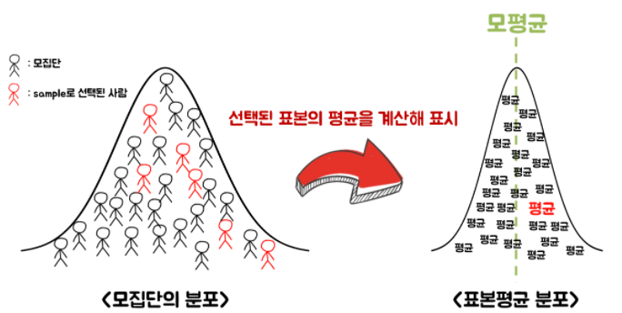
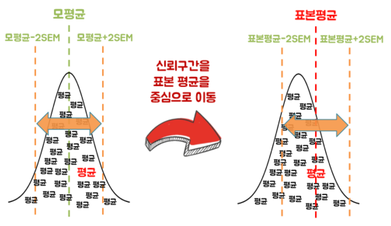
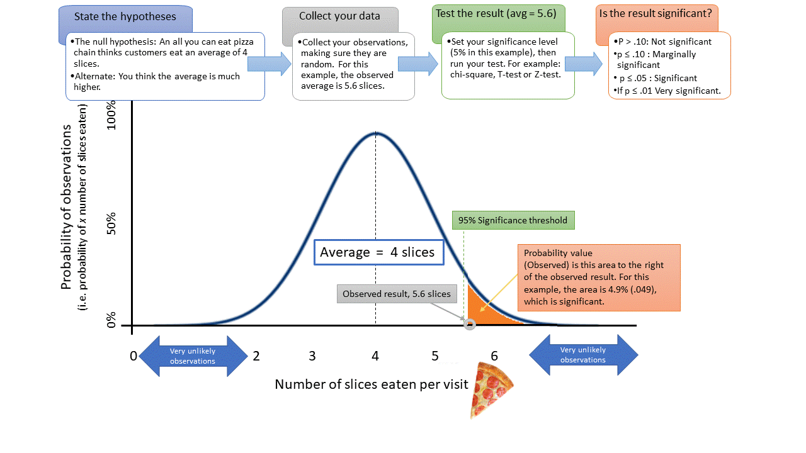
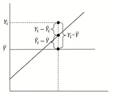
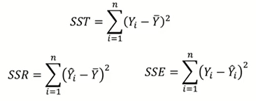
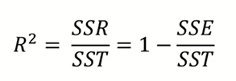
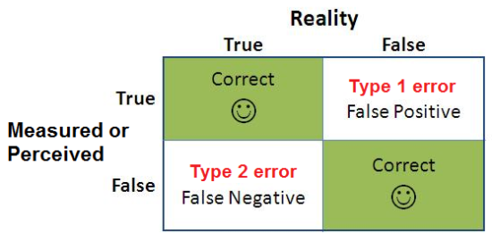
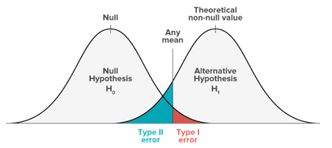
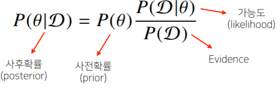

  <h1>📈 Statistics/Math 📈</h1>

> 질문은 <strong>[zzsza님의 Datascience-Interview-Questions](https://github.com/zzsza/Datascience-Interview-Questions)</strong>를 참고하였습니다.

## Table of Contents

- [고유값 (eigen value) 와 고유벡터 (eigen vector)에 대해 설명해주세요. 그리고 왜 중요할까요?](#1)
- [샘플링(Sampling)과 리샘플링(Resampling)에 대해 설명해주세요. 리샘플링은 무슨 장점이 있을까요?](#2)
- [누적 분포 함수와 확률 밀도 함수는 무엇일까요? 수식과 함께 표현해주세요!](#3)
- [평균(mean)과 중앙값(median)중에 어떤 케이스에서 뭘 써야할까요?](#4)
- [조건부 확률을 무엇일까요?](#5)
- [공분산과 상관계수는 무엇일까요? 수식과 함께 표현해주세요](#6)
- [신뢰 구간의 정의는 무엇인가요?](#7)
- [P-value를 모르는 사람에게 설명한다면 어떻게 설명하실 건가요?](#8)
- [R squared 의 의미는 무엇인가요?](#9)
- [평균(mean)과 중앙값(median)중에 어떤 케이스에서 뭘 써야할까요?](#10)
- [중심극한정리는 왜 유용한걸까요?](#11)
- [엔트로피(entropy)에 대해 설명해주세요. 가능하면 Information Gain도요](#12)
- [검정력(statistical power)은 무엇인가요?](#13)
- [베이지안과 프리퀀티스트 간의 입장차이를 설명해주실 수 있나요?](#14 )
- [missing value가 있을 경우 채워야 할까요? 그 이유는 무엇인가요?](#15)
- [어떨 때 모수적 방법론을 쓸 수 있고, 어떨 때 비모수적 방법론을 쓸 수 있나요?](#16)
- [모수가 매우 적은 (수십개 이하) 케이스의 경우 어떤 방식으로 예측 모델을 수립할 수 있을까요?](#17)
- [아웃라이어의 판단하는 기준은 무엇인가요?](#18)

## #1

#### 고유값 (eigen value) 와 고유벡터 (eigen vector)에 대해 설명해주세요. 그리고 왜 중요할까요?

선형대수학에서, 선형 변환의 고유 벡터는 그 선형 변환이 일어난 후에도 방향이 변하지 않는, 영벡터가 아닌 벡터입니다. 

고유 벡터의 길이가 변하는 배수를 그 고유 벡터에 대응하는 고유값이라고 합니다.
$$
A\vec{x} = \lambda\vec{x}
$$

어떤 정방행렬 $ A$ 는 임의의 $ \vec{x}$ 에 곱해져서 $ \vec{x}$ 의 위치나 방향을 변환시키는 역할을 합니다. 이 때, 어떤 특정 벡터들은 $ A$ 에 곱해져도 자신과 평행한 방향을 갖는데, 이러한 벡터들을 고유벡터라고 합니다. 변환 전후의 크기 차이는 특정 상수를 곱한 정도로 존재하는데, 이 특정 상수가 고유값입니다.

n x n 행렬에서 고유값은 일반적으로 n개이고, 고유벡터는 무수히 많습니다. 이 무수히 많은 고유벡터는 하나의 부분 공간을 형성하고, 이 부분공간이 고유공간이 됩니다. 

행렬이 벡터에 가하는 변환을 고유벡터들이 기저를 이루는 고유공간에서의 변환으로 해석함으로써, 회전 변환은 배제하고 확대/축소 변환만으로 이해하고 응용할 수 있게 되었다는 점에서 중요하다고 할 수 있습니다.

고유값 & 고유벡터의 응용 - 대각화

고유값과 고유벡터를 활용해서 행렬을 대각화함으로써 계산하기 쉬운 기저를 선택해 문제해결의 복잡도를 줄일 수 있습니다.

##### References

- [wikipedia](https://ko.wikipedia.org/wiki/%EA%B3%A0%EC%9C%B3%EA%B0%92%EA%B3%BC_%EA%B3%A0%EC%9C%A0_%EB%B2%A1%ED%84%B0#:~:text=%EA%B3%A0%EC%9C%A0%20%EB%B2%A1%ED%84%B0%EC%9D%98%20%EA%B8%B8%EC%9D%B4%EA%B0%80,%EC%95%84%EC%9D%B4%EA%B1%B4%EB%B0%B8%EB%A5%98)
- [고유값과 고유벡터](https://twlab.tistory.com/46?category=668741)
- [선형대수기초](https://blog.daum.net/jungjin1980/148)

## #2

### 샘플링(Sampling)과 리샘플링(Resampling)에 대해 설명해주세요. 리샘플링은 무슨 장점이 있을까요?

**샘플링이란?**

- 전체 모집단에서 표본 추출을 하는 것
- 쉽게 말하자면 모집단에서 일부분을 추출하여 사용하는 것
- 

**왜 샘플링을 할까?** 많은 이유들이 있겠지만 대표적으로,

- 모집단 전체를 전수조사하는것은 어렵고 시간과 비용이 많이 들어간다.
- 모든 관측치를 하나로 모으는 것은 매우 어려울 수 있다.
- 더 많은 관측은 미래에 만들어질 예정일 수 있다.

위와 같은 이유로 모집단 전체를 조사하는 것이 불가능하기 때문에 샘플(sample)을 이용하여 모집단(population)에 대한 추론(inference)을 하는 것이다. 

**Sampling Error**

표본은 모집단을 닮은 mirror 같은 존재이지만, 모집단 그 자체는 아니다. 따라서 표본에서는 모집단의 패턴이나 속성을 놓치는 부분이 존재한다. 위 그림의 표본을 보면 검은색 사람들은 모두 짝수 번호를 갖고 있다고 추정(estimate)하는 오류를 범할 수 있다. 실제 모집단을 확인해보면 검은색 사람들 중 홀수 번호를 갖고 있는 사람들도 존재하기 때문이다.

그럼에도 불구하고, 전체/완전한 데이터셋을 사용하는 것과 비교했을 때, 샘플링된 데이터를 사용하는 것은 발생하는 비용과 속도 측면에서 상당한 이점을 갖고 있다.

통계학적 샘플링은 광범위한 연구 분야이지만, 머신러닝에서는 3가지 주요 샘플링 기법을 사용합니다.

- **Simple Random Sampling**: 도메인에서 균일한 확률로 표본을 추출하는 방법
- **Systematic Sampling**: Intervals 같이 미리 정해 놓은 패턴을 사용하여 추출하는 방법. 
- **Stratified Sampling**: 미리 정해놓은 카테고리(범주) 내에서 샘플을 추출하는 방법.

-----

**리샘플링이란?**

앞서 샘플링에서 추출한 표본(sample)이 얼마나 모집단을 represent 한다고 볼 수 있을까? 이 질문을 바탕으로 리샘플링은 시작한다. 샘플링 에러에서 말한 것처럼 표본은 모집단을 닮아있다고 할 수 있지만 모집단 그 자체는 아니기 때문에 표본에는 기존 모집단에서 놓친 패턴, Noise가 존재할 수 밖에 없다.

리샘플링은 **모집단의 분포 형태를 알 수 없을 때 주로 사용하는 방법**이다. 즉, 모분포를 알 수 없으므로 일반적인 통계적 공식들을 사용하기 힘들 때, 현재 갖고 있는 데이터를 이용하여 모분포와 비슷할 것으로 추정되는 분포를 만들어 보자는 것이다. 리샘플링은 **가지고 있는 샘플에서 다시 샘플 부분집합을 뽑아서 통계량의 변동성(variability of statistics)을 확인하는 것**이라고 할 수 있다. 즉, 같은 샘플을 여러 번 사용해서 성능을 측정하는 방식이다. 가장 많이 사용되는 방법이며 종류로는 K-fold 교차 검증, 부트스트래핑이 있다.

리샘플링은 표본을 추출하면서 원래 데이터 셋을 복원하기 때문에 이를 통해서 모집단의 분포에 어떤 가정도 필요 없이 표본만으로 추론이 가능하다는 장점이 있다.

**References**

- [(데이터과학 인터뷰 질문)(2) 샘플링과 리샘플링, 1편](https://cnp-0717.tistory.com/7?category=838077)
- [샘플링과 리샘플링의 차이는 무엇일까?](https://kejdev.github.io/posts/sampling-resampling/)
- [Wikipedia](https://en.wikipedia.org/wiki/Resampling_(statistics))

## #3

#### 누적 분포 함수와 확률 밀도 함수는 무엇일까요? 수식과 함께 표현해주세요!

누적 분포 함수(cumulative distribution function, cdf)를 알기 위해서는 먼저 확률 밀도 함수(probability density function, pdf)를 집고 넘어가야 합니다.

확률 밀도 함수  와 구간 에 대해서 확률 변수 가 구간에 포함될 확률 는 아래의 수식으로 정의합니다.

확률 밀도 함수는 확률변수 가 **연속 확률 변수** 라는 점에서 확률 질량 함수와 큰 차이점을 갖습니다.

확률 질량 함수의 확률 변수는 이산 확률 변수로 이산 확률 변수 에 대하여 일 사건이 일어날 확률 에 대응하는 함수로 정의합니다. 확률을 가능성의 크기로 생각하는 질량으로 간주하면, 그 확률(질량)을 나타내기 때문에 확률 질량 함수라고 부릅니다.

하지만 확률 밀도 함수의 확률변수 는 연속 확률 변수이기 때문에 구간이 정의되어야 확률을 의미할 수 있습니다. 그래서 확률 를 구간 $[a, b]$에서 연속적으로 더해줍니다. 따라서 확률 밀도 함수 는 그 자체로 확률을 의미하지 않고, 특정 구간에 대한 정의가 필요합니다.

통계학에서 확률 밀도 함수를  ​로 파악하고, 이는 물리학에서 밀도의 개념과 비슷하기에 확률 밀도 함수라고 부릅니다.

누적 분포 함수는 말 그대로 확률 밀도 함수를 특정 값 a까지 누적한 함수입니다. 누적 분포 함수 는 아래와 같이 정의합니다.

확률 밀도 함수와 누적 분포 함수는 서로 미분과 적분의 관계를 갖습니다.

##### References

- [확률 밀도 함수의 정의 in 위키백과](https://ko.wikipedia.org/wiki/%ED%99%95%EB%A5%A0_%EB%B0%80%EB%8F%84_%ED%95%A8%EC%88%98)

- [확률 분포 함수와 확률 밀도 함수의 의미](https://velog.io/@groovallstar/%ED%99%95%EB%A5%A0-%EB%B6%84%ED%8F%AC-%ED%95%A8%EC%88%98%EC%99%80-%ED%99%95%EB%A5%A0-%EB%B0%80%EB%8F%84-%ED%95%A8%EC%88%98%EC%9D%98-%EC%9D%98%EB%AF%B8)

## #4

#### 확률 모형이란?

확률 분포를 보다 단순하게 묘사하기 위해 고안한 것이 **확률 모형(probability model)**이다.

확률 모형은 **분포 함수(distribution function)** 또는 **밀도 함수(density function)**라고 불리우는 미리 정해진 함수의 수식을 사용하여 분포의 모양을 정의(define)하는 방법이다. 이 때 분포의 모양을 결정하는 함수의 계수를 분포의 **모수(parameter)**라고 부른다.

예를 들어 가장 널리 쓰이는 정규 분포(Normal distribution)는 다음과 같은 수식으로 정의된다. 이 수식 자체의 이름은 $N$이고 함수의 독립 변수는 자료의 값을 의미하는 변수 $x$이다. 식에서 사용된 문자 $\mu$와 $\sigma$는 평균(mean)과 표준편차(standard deviation)이라는 이름의 모수이다.

$$
N(x; \mu, \sigma) = \frac{1}{\sigma\sqrt{2\pi}}\, e^{-\frac{(x - \mu)^2}{2 \sigma^2}}
$$

#### 확률 변수란?

어떤 자료의 값이 분포가 특정한 확률 모형과 일치하는 경우 그 자료를 **확률 변수(random variable)**라고 하고 해당 확률 모형을 따른다고 말한다.

확률 변수는 보통 $X$, $Y$와 같이 알파벳 대문자로 표시하며 확률 변수 $X$가 정규 분포를 따른 경우 수학적으로 다음과 같이 표기한다.

$$
X \sim N(\mu, \sigma)
$$
중요한 점은 확률 모형은 사람에 의해 정의된 분포일 뿐이라는 점이다. 어떤 자료의 확률 분포가 특정한 확률 모형을 따르리라는 것은 어디까지나 여러가지 편의를 위해 그렇게 가정(assumption)한 것인 뿐인 경우가 많다.

## #5

#### 조건부 확률을 무엇일까요?

**조건부 확률(conditional probability)**란 주어진 사건(**D**)이 일어났다는 가정 하에 다른 사건**($\theta$​)**이 일어난 확률을 말한다.

수식으로 표현하자면 아래와 같이 나타 낼 수 있다.

  

만약 주어진 사건(**D**)과 다른 사건**()**이 독립적으로 일어난다면

  

가 되어 주어진 사건은 다른 사건이 일어나는 확률에 영향을 주지 못한다.

추가적으로 조건부 확률을 이용해서 **베이즈 정리(Bayes' theorem)** 에 적용할 수도 있다.

> #### 베이즈 정리(Bayes' theorem)

**베이즈 정리(Bayes' theorem)**란 두 확률 변수의 사전 확률과 사후 확률 사이의 관계를 나타낸 정리다.

베이즈 정리의 사용 목적은 _조건부 확률_ 을 이용하여 **정보를 갱신**하는데 있다.

  

D : 새로 관찰하는 데이터

: 모델에서 계산하고 싶어하는 모수 (가설)

: **사후 확률(posterior)** - 데이터를 관찰 했을 때, 이 가설이 성립할 확률 

 : **사전확률** - 데이터가 주어지지 않은 상황에서 가설에 대해 사전에 세운 확률

  : **가능도(likelihood)** - 현재 주어진 모수(가정 :  ) 에서 이 데이터(**D**) 가 관찰 될 확률 = D가 주어졌을 때  의 가능도

 : **Evidence** : 데이터 전체의 분포, D의 사전확률이라 볼 수 있다. 정규화 상수 역할을 하며 ​​ 를 이용해 구할 수 있다.

##### 베이즈 정리 정보의 갱신

데이터가 새로 들어왔을 때 이전에 구한 사후확률 ​​이 사전확률 ​​ 로 사용하면서 갱신된 사후 확률 계산이 가능해진다

이는 데이터가 새로 들어왔을 때 정보를 갱신했다고 볼 수 있다.

##### References

- [조건부 확률 in 위키백과](https://ko.wikipedia.org/wiki/조건부_확률)
- [베이즈 정리 in 위키백과](https://ko.wikipedia.org/wiki/베이즈_정리)

## #6

#### 공분산과 상관계수는 무엇일까요? 수식과 함께 표현해주세요

**공분산**

2개의 (확률)변수의 선형 관계를 나타내는 값. 공분산 값이 양수라면 하나의 변수가 커지면 다른 변수도 값이 커지는 경향이 있고, 공분산 값이 음수라면 하나의 값이 상승할때 다른 변수는 하강하는 경향이 있다. 

**상관계수**

두 변수간의 관계를 표현하기 위한 값으로 우리가 흔히 사용하는 피어슨 상관계수의 경우 두 변수간의 선형관계를 나타냅니다. 즉 상관계수가 양수면 두 변수가 모두 증가하는 경향이 있고 상관계수가 음수면 하나의 값이 작아지는 경향이 있습니다. 절대값이 1에 가까울 수록 강한 선형 상관관계 있고 0에 가까울 수록 선형 상관관계가 없다고 한다. 

> 공분산은 변수의 측정 단위에 크기에 따라 값이 달라지므로 공분산통해 두 변수간의 관계를 파악하기에는 부적절하다. 따라서 상관계수를 이용하여 두 변수간의 관계 파악 !! 

~~**스피어만 상관 계수**~~

~~두 변수의 순위 사이의 관계를 나타내는 값으로 비모수적인 척도. 이상치에 덜 민감~~

##### References

- [공분산 - 나무위키](https://ko.wikipedia.org/wiki/%EA%B3%B5%EB%B6%84%EC%82%B0)
- [correlation - wikipedia](https://en.wikipedia.org/wiki/Correlation)
- [스피어먼 상관 계수 - wikipedia](https://ko.wikipedia.org/wiki/%EC%8A%A4%ED%94%BC%EC%96%B4%EB%A8%BC_%EC%83%81%EA%B4%80_%EA%B3%84%EC%88%98)

## #7

#### 신뢰 구간의 정의는 무엇인가요?

신뢰 구간(Confidence Interval)은 모수가 어느 범위 안에 있는지를 확률적으로 보여주는 방법입니다.

그럼 신뢰 구간이 필요한 이유는 무엇일까요? 우리는 모수를 정확히 알 수 없고, 알 수 있어도 알아내는 데 큰 비용이 들기 때문입니다. 다만 '그나마 확실히 말 할 수 있는 정도'는 알 수 있고, 이를 신뢰 구간을 이용해 표현합니다. 신뢰구간은 표본평균으로 모평균을 추정할 때 쓰는 방법 중 하나라고 할 수 있습니다.

우리는 모집단의 평균을 알 순 없지만, 모집단에서 임의로 선정한 표본을 반복하여 표본평균의 분포를 추정할 수 있습니다. 그리고 이 표본평균의 분포는 중심극한정리에 의해 정규분포 모양을 갖습니다.(모집단의 분포가 어떠하든!) 

표본 평균의 표준 편차는 '표준 오차(Standard Error of Mean)'라고 부르며

입니다.

여러번 추출한 표본 평균은 모평균의 ±2 SEM 범위 안에 95% 확률로 들어온다고 말할 수 있습니다.  여기서 모평균의 ±2 SEM이 신뢰 구간이 되고 95%가 신뢰수준이 되는 것입니다. 하지만 우리는 모평균을 알지 못하기 때문에 신뢰구간을 표본평균을 중심으로 이동시키고, '모평균이 신뢰구간 안에 들어올 확률이 95%이다'라고 표현할 수 있습니다.

##### References

- [신뢰 구간 - 위키백과](https://ko.wikipedia.org/wiki/%EC%8B%A0%EB%A2%B0_%EA%B5%AC%EA%B0%84)

- [신뢰 구간 쉬운 설명 및 사진 출처 - 공돌이의 수학정리노트](https://angeloyeo.github.io/2021/01/05/confidence_interval.html)

- [empirical rule](https://ko.wikipedia.org/wiki/68-95-99.7_%EA%B7%9C%EC%B9%99)

## #8 
### P-value를 모르는 사람에게 설명한다면 어떻게 설명하실 건가요?

p-value는 우리가 기존에 받아들여지는 사실 또는 나의 주장과 다른 사실(귀무가설)이 아니라,  내가 증명하고자 하는 주장(대립가설)이 맞다고 통계적으로 유의미함을 보이고 싶을 때 사용되는 값으로, 실험이나 표본추출을 해서 **귀무가설이 맞다는 가정하에서 내가 얻은 결론(통계치)이 귀무가설을 지지하는 확률**. 즉 확률이 작다면 기존에 사실이 맞지 않으므로 내가 주장하는 사실이 맞다고 할 수 있다. 
+ 여기서 작다의 기준은 유의수준(귀무가설 맞는데 기각하는 확률) 보다 p-value가 작다면 작다고 판단한다. 보통은 0.05

평균적으로 피자를 4조각 먹는다고 알려졌는데 내 생각에는 4조각 보다는 더 많이 먹는거같다. 내 생각을 통계적으로 증명해보자.
sampling을 통해 사람들에게 물어본 결과 평균적으로 5.6조각을 먹었다. 이 때 유의수준(0.05)을 설정하고 p-value를 계산했을떄 0.05보다 작다면 대립가설을 채책한다. 즉 평균적으로 피자를 4조각보다 피자를 더 먹는것으로 결론을 내린다.

**P-value 한 줄 정리**

> P-value는 내가 주장하고자 하는 것을 통계적으로 유의미함을 보이기 위해 사용되는 것이다.

명확한 정의는  **"귀무가설이 맞다는 가정하에서 내가 얻은 결론(통계치)이 귀무가설을 지지하는 확률"** 이 정의가 맞으나 이정의를 풀어서 해석하면 P-value 낮다는것은 귀무가설을 지지하는 확률이 낮은것이니 대립가설(나의 주장)이 맞다고 할 수 있다. 따라서 나의 주장의 통계적으로 유의미함을 보이는데 사용되는 것이다.

p-value의 사용 예시: 
- 약의 유효성을 입증하거나(약이 효과 없다 VS 약이 효과 있다) 
- 회귀계수의 유의미함 증명(회귀 계수가 0이다 vs 회귀 계수가 0이 아니다.)

#### Reference

- [공돌이의 수학노트 - P-value의 의미](https://angeloyeo.github.io/2020/03/29/p_value.html)
- [기초통계 설명 - 네이버 블로그](https://m.blog.naver.com/moses3650/221217938069)

## #9

#### R squared 의 의미는 무엇인가요?

 SST = Y의 총 변동량

 SSR =  X변수에 의해 설명된 양

 SSE = 에러에 의해 설명된 양

 = 1 은 SSE=0이라는 것이다. 에러가 하나도 없다는 것. 모델 설명력이 100%

 = 0 은 SSR =0 이라는 것이다. Y 평균값 대비 X를 이용해도 얻을 수 있는 것이 없다는 것. 모델 설명력이 0

은 0-1 사이 값이다.

##### Reference

- [결정계수를 어떻게 해석해야 할까](https://www.youtube.com/watch?v=__SRJAPvR_k)
- [선형회귀모델](https://www.youtube.com/watch?v=ClKeKeNz7RM)

## #10

#### 평균(mean)과 중앙값(median)중에 어떤 케이스에서 뭘 써야할까요?

- 평균(mean): 모든 관측값의 합을 자료의 개수로 나눈 것
- 중앙값(median): 전체 관측값을 크기 순서로 배열했을 때 가운데 위치하는 값

평균은 전체 관측값이 골고루 반영되므로 대표값으로서 가치가 있다. 평균 근처에 표본이 몰려 있는 상황에서 대표값으로 유용하지만 극단적인 값에 영향을 많이 받는다.

중앙값에서는 관측값을 크기 순서로 배열할 때 관측값의 위치가 중요하고, 가운데 위치한 관측값 이외의 관측값들의 크기는 중요하지 않다. 따라서 평균과는 달리 중앙값은 관측값들의 변화에 민감하지 않고 특히 아주 큰 관측값이나 아주 작은 관측값에 영향을 받지 않는다. 

 표본의 편차, 혹은 왜곡이 심하게 나타나는 경우는 평균보다 중앙값이 유용하다. 예를들면 경제적 수입을 들 수 있는데 동북아학생 전체의 1년간 경제 수입과 삼성 회장의 1년 수입을 평균하는 것은 사실상 의미가 없으므로 이런경우 중앙값을 쓴다. 또한 올림픽에서 여러 심판들의 주관적인 점수로 판정하는 경우 편차가 심할수 있으므로 양 끝값을 제외시키고 평균을 내는데  중앙값과 평균의 특성을 적절하게 사용했다고 볼수있다.

#### References

- [평균과 중앙값에 대한 이해 - 모두,전진!](https://m.blog.naver.com/PostView.naver?isHttpsRedirect=true&blogId=xodh16&logNo=220505136752)

- [평균 vs  중간값| 통계상의 오류가능성 - 슈퍼짱짱](https://blog.naver.com/ricemankr/220796823014)

## #11

### 중심극한정리는 왜 유용할까요?

중심극한정리란(Central Limit Theorem)는 동일한 확률분포를 가진 독립변수 n개의 평균의 분포는 n이 적당히 크면 정규분포에 가까워진다는 정리이다. 

많은 사람들이 중심극한정리에 대해 헷갈리는 부분이 있다. "**내가 수집한 표본의 크기가 크면, 그 표본의 평균이 모집단의 평균과 같고, 표본의 표준편차가 모집단의 표준편차를 표본수로 나눈 값과 같게 된다**."라고 이해하곤 한다. 이것은 중심극한정리를 잘못 이해한 것이다. **표본은 매번 추출할 때마다 달라지게 되고, 그에 따라 표본의 평균값도 매번 달라지기 때문이다.** 쉽게 말해, 1~10까지의 숫자가 모집단이라고 가정하고 3개를 샘플링하게 되면(e.g. {1,3,5}, {1,2,3} ... ) 매번 표본 추출을 할 때마다 평균값이 달라지는 것은 쉽게 이해할 수 있다.

그렇다면 중심극한정리에서 말하는 **표본평균분포** 란 무엇일까? 영어로된 표현을 보면 직관적으로 이해할 수 있다. 영어로 표본평균분포는 **Sampling distribution of sample mean** 이다. 즉, 표본평균분포는 "모집단에서 표본의 크기가 n인 표본(e.g. n = 30)을 **여러번 반복해서 추출**(e.g. 100회)" 했을 때 (e.g. X1(n=30), X2(n=30), ... X100(n=30), **각 표본의 평균이 이루는 분포**를 말한다. 따라서 중심극한정리는 추출한 표본의 크기가 커질수록, 각 표본들의 평균이 이루는 분포가 모집단의 평균 $ \mu $ 그리고 표준편차가 $ \sigma / \sqrt{n} $ 인 정규분포에 가까워진다는 정리이다.

이해하기 쉽게 예를 들자면, 주사위가 있다고 가정해보자. 각각의 숫자는 동일한 확률분포를 가진 독립변수 6개가 있다는 것이다. **우리는 이 모집단을 모른다고 가정해도 모집단의 평균과 표준편차를 중심극한정리를 사용해서 근사할 수 있다.** 주사위를 던졌을 때 평균적으로 얼마가 나올 것인지 생각해보자. 1~6을 6으로 나누면 3.5, 분산은 2.92가 된다. n=30이고 10번 샘플링을 하게되면 X1(1,3,5,3,4,....2,4, 30개), X2(2,4,6,....,5,1, 30개 ),...,X10(1,2,3,....,4,5, 30개) 가 있다고 가정해보자. 중심극한정리에 따르면 30번씩 던진 주사위의 수를 모두 더해서 평균을 내면, 즉, 각 표본들의 평균이 이루는 분포가 모집단의 평균 3.5 그리고 표준편차가 $\sigma / \sqrt{n}$​​​​​​​ 인 정규분포를 근사할 수 있다.

**Reference**

- [Wikipedia](https://ko.wikipedia.org/wiki/%EC%A4%91%EC%8B%AC_%EA%B7%B9%ED%95%9C_%EC%A0%95%EB%A6%AC)
- [[개념 통계 17] 중심극한정리는 무엇이고 왜 중요한가?](https://drhongdatanote.tistory.com/57)
- [[확률과 통계] 48. 중심극한정리, Central Limit Theorem](https://m.blog.naver.com/mykepzzang/220851280035)

## #12 

#### 엔트로피(entropy)에 대해 설명해주세요. 가능하면 Information Gain도요

##### 엔트로피 (Entropy)

엔트로피는 주어진 데이터 집합의 혼잡도를 의미한다.

즉, 주어진 데이터 집합에서 서로 다른 종류의 레코드들이 섞여 있으면 엔트로피가 높고, 같은 종류의 레코드들이 섞여있으면 엔트로피가 낮다.

이때 **엔트로피의 값은 0과 1사이의 값**을 가지며, 가장 혼잡도가 높은 상태의 값이 1, 반대는 0이다.

Entropy에 대한 **계산**은 아래와 같이 나타 낼 수 있다.

  

  S : 주어진 데이터들의 집합 
  C : 레코드(클래스) 값들의 집합 
    
   : S에서 에 속하는 레코드의 수 
  |S| : 주어진 데이터들의 집합의 데이터 개수  

즉, 엔트로피 값은 레코드 값의 포함 비율(확률)에 로그를 적용하고 다시 가중치로 곱한 값을 모두 더한 식이다.

> Entropy 식에서 log term이 들어가는 이유?

이것에 대해 알기 위해서는 우선 `정보량`에 대해 알아야한다.

정보 이론에서 정보량이 가져야 하는 **성질**들은 다음과 같다.

1. 자주 일어나는 사건일수록 정보량은 낮다.
2. 따라서 ‘항상’ 일어나는 사건이 있다면, 그 사건의 정보량은 0이다.
3. 정보량은 항상 0 이상의 값을 가진다.
4. 독립적인 사건들의 전체 정보량은 개별 사건의 정보량의 합이어야 한다.
   예를 들어, 동전의 앞면이 두번 연속 나오는 사건 {Head,Head}의 정보량은 앞면이 한번 나온 사건 {Head}가 가지는 정보량의 두배이다.

이를 만족하는 식은

  

여기서 P(x)는 사건 x가 나타날 확률로 0과 1사이 값을 가진다. 그리고 I(x)는 P(x)가 0으로 가면 커지고 1에 갈수록 0에 가까운 값을 가진다.

여기서 하필 **log**를 쓰는 이유는 _엔트로피_ 가 **additive** 해야하기 때문이다.

두 `독립적인 물리계` (질량, 부피 등)에서는 두 계를 합칠 때 단순히 물리량을 **더하면** 되는 성질을 가지고 있는 것이 몇가지 있다. 하지만 `경우의 수` 의 경우 **곱셈**으로 표현이 되는데이는 물리량이 늘어날 경우 계산이 매우 복잡해진다. 따라서 `log의 성질`을 이용해 **곱셈을 덧셈 연산**으로 바꿔준다.

  + 

> 정보량 관점에서 엔트로피

위에서 구한 엔트로피 식은 정보량을 기댓값으로 구해진다

  

##### Information Gain

정보이득 (information gain)은 **어떤 분류**를 통해서 얼마나 **정보**( **information** )에 대해서 **이득**( **gain** ) 생겼는지를 나타낸다.

Information gain에 대한 **식**은 아래와 같다.

  

S집합의 엔트로피에서 A라는 속성을 가진 집합T에 대한 엔트로피를 뺀다면 그 값이 정보이득이다

속성 A라는 값을 가지게된 집합의 엔트로피()가 낮으면 빼지는 값이 작으니 IG 값이 커지게 되어 **불확실성**, **데이터 집합의 혼잡도**를 많이 줄여 정보의 이득이 높아졌다 볼 수 있다.

##### Reference

- [[인공지능] 엔트로피(Entropy) 와 정보이득(Information Gain) 계산](https://eehoeskrap.tistory.com/13)
- [Decision Tree에서의 Entropy와 Information Gain](https://frontjang.info/entry/Entropy와-Information-Gain)
- [[머신러닝] 의사결정 나무(Decision tree) - 3 : C4.5와 엔트로피(Entropy) 지수 활용사례, 계산](https://bigdaheta.tistory.com/26)
- [What is Entropy? (1)](https://jiminsun.github.io/2018-01-26/Entropy-1/)

## #13

#### 검정력(statistical power)은 무엇일까요?

검정력은 **대립가설 H1이 참인 경우 대립가설 H1을 채택할 확률**입니다.

검정력을 설명하기 위해 귀무가설과 대립가설을 간단히 집고 넘어가려 합니다.

- 귀무가설, H0 : 모집단의 특성에 대해 옳다고 제안하는 주장. 즉 변화나 차이가 없음을 주장.

  - '~와 차이가 없다', '~의 효과는 없다', '~와 같다'라는 형식으로 설정

    ex) 새로운 코로나 진단 방법은 기존의 방법과 차이가 없다.

- 대립가설, H1 : 귀무가설이 기각 되었을 때, 받아들여지는 가설. 새로 주장하고자 하는 가설

  - '~와 차이가 있다', '~의 효과는 있다', '~와 다르다'

    ex) 새로운 코로나 진단 방법은 기존의 방법과 차이가 있다.

위 그림에서 Measured or Perceived는 귀무가설이라고 생각하면 됩니다. 그러면 귀무가설과 현실 사이에서 2개의 오류를 볼 수 있습니다.

- 1종오류 : H0가 맞다했는데, 실제는 H0가 틀린 경우
  - 유의수준 α와 같음
- 2종오류 : H0가 틀리다했는데, 실제는 H0가 맞는 경우
  - β로 표시

β를 H1입장에서 다시 쓰면 **H1이 맞는다 했는데, 실제는 H1이 틀린 경우**라고 할 수 있습니다.

앞서, 검정력은 대립가설 H1이 참인 경우 대립가설 H1을 채택할 확률이라고 했습니다. 즉 검정력은 **1-β**로 표현할 수 있습니다.

검정력에 영향을 끼치는 요소는 다음과 같습니다.

  

그 이유는... 함께 알아봐요

#### References

- [검정력 위키백과](https://ko.wikipedia.org/wiki/%EA%B2%80%EC%A0%95%EB%A0%A5)

- [1종오류와 2종오류](https://www.abtasty.com/blog/type-1-and-type-2-errors/)

- [귀무가설과 대립가설](https://drhongdatanote.tistory.com/59)

- [검정력의 의미](https://m.blog.naver.com/PostView.nhn?blogId=hancury&logNo=220854934914&proxyReferer=https:%2F%2Fwww.google.com%2F)

  

## #14

### 베이지안과 프리퀀티스트 간의 입장차이를 설명해주실 수 있나요?

**Frequentist**: 모수는 정해진 값이다. 우리가 얻은 sample로 알 수 있는것은 이미 내린 결론에 부합하는지를 확인하는 것이다. 확률을 객관적으로 발생하는 현상의 빈도수로 바라본다.

**Bayesian**: 모수는 확률변수이다. 우리가 얻은 sample로 알 수 있는것은 기존에 갖고 있던 결론을 sample 정보를 통해 업데이트 함으로써 새로운 모수를 추정할 수 있다. 확률을 현상에 대한 관찰자의 주관적인 믿음의 체계로 본다.

##### 상황을 바라보는 입장 차이 예시

 Q) fair한 6면 주사위가 하나 있을때, 이 주사위를 던져서 1의 눈이 나올 확률은?

**Frequentist** : 1/6 (∵ 주사위는 fair하므로 6개의 경우들은 모두 같은 빈도로 발생할 것이다.)

**bayesian** 우선 사전 확률을 정의한다. 1/6이라고 하자

이제 주사위를 실제로 60번 던졌더니  1이 총 12번  나왔다.  이 사건에대해 두 파간 바라보는 관점이 다르다!

**Frequentist**

12/60 = 0.2 이므로 모비율 검정을 통해 이값이 1/6과 다른지 확인다. 모비율 검정을 실시한다.

  

  

Z=1.2일때 양측검정에 대한 p-value를 계산하면 귀무가설을 기각하지 못한다. 즉 p=1/6이라는 것을 확인 할 수 있다.

> Frequentist의 이러한 action은 이미 내린 결론에 부합하는지를 확인하는 행동이다.

**Beyesian**

베이지안의 패러다임은 다음과 같다.

1)  모수의 사전분포 결정
2) 베이즈 정리를 통한 계산
3) 사후분포를 이용한 모수 추정

  

위의 값을 이용하여 사후 확률을 계산하여 모수에대한 정보를 업데이트 한다.

  

따라서 모수에 대한 추정값을 주어진 정보(Evidence, 데이터)를 이용하여 업데이트한다.

#### 예시 2

(베이지안 패러다임)[https://freshrimpsushi.github.io/posts/bayesian-paradigm/]

#### Reference

- (Statistics: Are you Baysian or Frequentist ?)[https://towardsdatascience.com/statistics-are-you-bayesian-or-frequentist-4943f953f21b]
- (Frequentist and Bayesian)[https://www.ibric.org/myboard/read.php?id=19818&Page=&Board=SORI&FindIt=&FindText]
