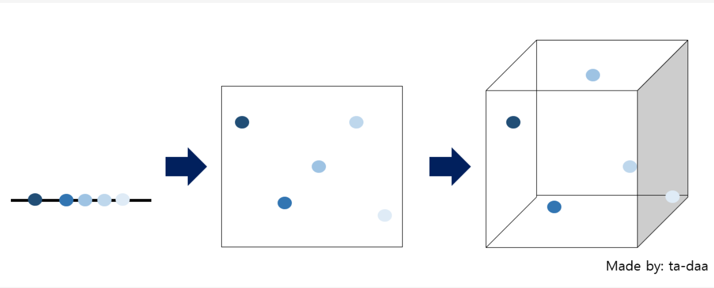
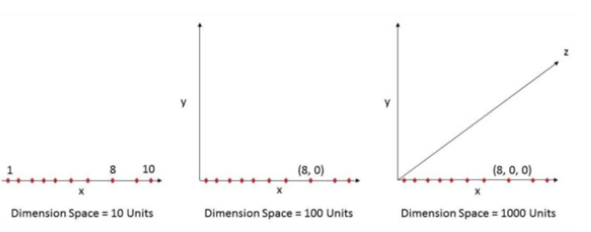

  <h1>🏃‍♀️ Machine Learning 🏃‍♂️</h1>

> 질문은 <strong>[zzsza님의 Datascience-Interview-Questions](https://github.com/zzsza/Datascience-Interview-Questions)</strong>를 참고하였습니다.

---

## Table of Contents

- [알고 있는 metric에 대해 설명해주세요. (ex. RMSE, MAE, recall, precision ...)](#1)
- [정규화를 왜 해야할까요? 정규화의 방법은 무엇이 있나요?](#2)
- [Local Minima와 Global Minima에 대해 설명해주세요.](#3)
- [차원의 저주에 대해 설명해주세요.](#4)
- [dimension reduction 기법으로 보통 어떤 것들이 있나요?](#5)
- [PCA는 차원 축소 기법이면서, 데이터 압축 기법이기도 하고, 노이즈 제거기법이기도 합니다. 왜 그런지 설명해주실 수 있나요?](#6)
- [LSA, LDA, SVD 등의 약자들이 어떤 뜻이고 서로 어떤 관계를 가지는지 설명할 수 있나요?](#7)
- [Markov Chain을 고등학생에게 설명하려면 어떤 방식이 제일 좋을까요?](#8)
- [텍스트 더미에서 주제를 추출해야 합니다. 어떤 방식으로 접근해 나가시겠나요?](#9)
- [SVM은 왜 반대로 차원을 확장시키는 방식으로 동작할까요? SVM은 왜 좋을까요?](#10)
- [다른 좋은 머신 러닝 대비, 오래된 기법인 나이브 베이즈(naive bayes)의 장점을 옹호해보세요.](#11)
- [회귀 / 분류시 알맞은 metric은 무엇일까?](#12)
- [Association Rule의 Support, Confidence, Lift에 대해 설명해주세요.](#13)
- [최적화 기법중 Newton’s Method와 Gradient Descent 방법에 대해 알고 있나요?](#14)
- [머신러닝(machine)적 접근방법과 통계(statistics)적 접근방법의 둘간에 차이에 대한 견해가 있나요?](#15)
- [인공신경망(deep learning이전의 전통적인)이 가지는 일반적인 문제점은 무엇일까요?](#16)
- [지금 나오고 있는 deep learning 계열의 혁신의 근간은 무엇이라고 생각하시나요?](#17)
- [ROC 커브에 대해 설명해주실 수 있으신가요?](#18)
- [여러분이 서버를 100대 가지고 있습니다. 이때 인공신경망보다 Random Forest를 써야하는 이유는 뭘까요?](#19)
- [K-means의 대표적 의미론적 단점은 무엇인가요? (계산량 많다는것 말고)](#20)
- [L1, L2 정규화에 대해 설명해주세요.](#21)
- [Cross Validation은 무엇이고 어떻게 해야하나요?](#22)
- [XGBoost을 아시나요? 왜 이 모델이 캐글에서 유명할까요?](#23)
- [앙상블 방법엔 어떤 것들이 있나요?](#24)
- [feature vector란 무엇일까요?](#25)
- [좋은 모델의 정의는 무엇일까요?](#26)
- [50개의 작은 의사결정 나무는 큰 의사결정 나무보다 괜찮을까요? 왜 그렇게 생각하나요?](#27)
- [스팸 필터에 로지스틱 리그레션을 많이 사용하는 이유는 무엇일까요?](#28)
- [OLS(ordinary least squre) regression의 공식은 무엇인가요?](#29)

---

## #1

### 알고 있는 metric에 대해 설명해주세요. (ex. RMSE, MAE, recall, precision ...)

week4 민규님

## #2

### 정규화를 왜 해야할까요? 정규화의 방법은 무엇이 있나요?

normalization, regularization, standardization. 세 용어가 모두 정규화로 번역됩니다. 여기서는 normalization을 집고 넘고 넘어가겠습니다.

#### Normalization

ML 알고리즘의 목적 중 하나는 feature들을 비교하여 데이터의 패턴을 찾는 것입니다. 하지만 feature의 scale이 심하게 차이나는 경우 문제가 발생합니다. 그래서 **모든 데이터가 동일한 정도의 sclae(중요도)로 반영되도록 해주는 게 normalization의 목표**입니다.

1. **Min - Max normalization**

   

     
   

   - 최소값과 최대값을 이용해 값의 범위를 0~1 사이 값으로 바꿉니다.
   - 하지만 outlier(이상치)에 너무 많은 영향을 받습니다.

2. **Z-score normalization**

   

     
   

   - standartdization을 활용해 outlier 문제를 어느정도 해결합니다.
   - 하지만 동일한 척도로 정규화된 데이터를 생성하지 않는다는 문제가 있습니다.

##### References

- [정규화 : normalization, standardization, regularization](https://realblack0.github.io/2020/03/29/normalization-standardization-regularization.html)
- [normalization 쉽게 이해하기](https://hleecaster.com/ml-normalization-concept/)

## #3

### Local Minima와 Global Minima에 대해 설명해주세요.

오차를 줄이기 위해 경사하강법을 이용하는데, 이는 오차를 계산하는 함수의 최소값을 찾기 위함이다. 이 때 경사하강법은 초기화된 위치에서부터 기울기를 구해 더 아래로 아래로 내려가려 한다.

이구간에서 최소값을 찾기위해 아래로 내려간다면 global minima에 도달하겠지만

이부분에서 내려간다면 localminimum에 빠져 gradient가 0이 되어도, 오차를 최대로 줄일 수 없다.

##### References

- [Wikipedia](https://en.wikipedia.org/wiki/Maxima_and_minima)

## # 4

#### 차원의 저주에 대해 설명해주세요

**차원의 저주(Curse of dimensionality)** 란, 데이터 학습을 위해 차원이 증가하면서 고차원 데이터 공간에서 데이터 표본이 희박해지는 것을 의미한다. 즉, 차원이 증가함에 따라(=변수의 수 증가) 모델의 성능이 안좋아지는 현상을 의미한다.

무조건 변수의 수가 증가한다고 해서 차원의 저주 문제가 있는 것이 아니라, 관측치 수보다 변수의 수가 많아지면 발생한다.

예를 들어 아래의 그래프을 봤을 때 **8** 을 표현하기 위해서는 1차원에서는 (8), 2차원에서는 (8,0), 3차원에서는 (8,0,0) 으로 표현해야한다.

따라서 차원이 커질수록, 설명 공간이 지수적으로 늘어나게 된다. 이는 Feature가 많아질수록 동일한 데이터를 설명하는 빈공간이 늘어난다는 것을 의미하며 이는 차원의 저주로 인해 알고리즘 모델링 과정에서 저장 공간과 처리 시간이 불필요하게 증가됨에 따라 결국 성능이 저하되는 것을 의미한다.

##### References

- [차원의 저주(Curse of dimensionality)](https://bioinformaticsandme.tistory.com/197)
- [[빅데이터] 차원의 저주](https://datapedia.tistory.com/15)
- [빅데이터: 큰 용량의 역습 – 차원의 저주 (Curse of dimensionality)](https://thesciencelife.com/archives/1001)

## #5

### dimension reduction기법으로 보통 어떤 것들이 있나요?

week4 민규님

## #6

### PCA는 차원 축소 기법이면서, 데이터 압축 기법이기도 하고, 노이즈 제거기법이기도 합니다. 왜 그런지 설명해주실 수 있나요?

PCA(Pricipal Component Analysis: 주성분 분석)는 고차원의 데이터를, 데이터들의 분산을 잘 유지하는 주성분(데이터들의 선형결합으로 이뤄짐)들을 구하고, 이 주성분을 이용해 저차원으로 데이터들을 표현하는 방법이다. 여기서 주성분들은 서로 직교한다.

주성분 분석은 기존의 고차원 데이터들을, 더 적은 차원의 주성분으로 데이터를 표현하므로 차원 축소 기법이라 할 수 있다. 주성분을 구할 때 데이터의 기존의 분산을 전체 다 이용하는 것이 아닌 분산을 설명하는 정도가 큰 몇개의 주성분만을 이용하므로 데이터를 압축한다고 할 수 있고, 이 과정에서 어느정도의 분산이 제거되므로 노이즈가 감소할 수 있다.

##### References

- [공돌이의 수학 노트 PCA](https://angeloyeo.github.io/2019/07/27/PCA.html)
- [주성분분석(PCA)의 이해와 활용-다크 프로그래머 블로그](https://darkpgmr.tistory.com/110)
- [PCA Eliminate noise in the data - stackExchange](https://stats.stackexchange.com/questions/247260/principal-component-analysis-eliminate-noise-in-the-data/247271)

## #7

### LSA, LDA, SVD 등의 약자들이 어떤 뜻이고 서로 어떤 관계를 가지는지 설명할 수 있나요?

week4 재욱님

## #11

### 다른 좋은 머신 러닝 대비, 오래된 기법인 나이브 베이즈(naive bayes)의 장점을 옹호해보세요.

> 기하학에 피타고라스 정리가 있다면 확률론에는 베이즈 정리가 있다
>
> -해럴드 제프리스 경
제프리스 경이 말한 것처럼 베이즈 정리는 AI와 통계학에 엄청난 영향을 끼친 이론입니다.
- Naive : 예측한 특징이 상호 독립적이라는 가정 하에 확률 계산을 단순화. naive의 순진하다라는 의미를 모든 변수들이 동등하다는 것으로 사용하고 있습니다.
- Bayes : 추론 대상의 사전 확률과 추가적인 정보를 기반으로 사후확률을 추론하는 방법입니다. Statistics/Math 카테고리의
[Bayesian Estimation](.\1-statistics-math.md\#14)에서 좀 더 자세히 알 수 있습니다.
나이브 베이지안에 대한 더 자세한 예시와 적용은 3번째 reference를 참고하면 됩니다.
> 나이브 베이지안 장점
>> 간단하고 빠르고 효율적인 알고리즘
>> 잡으모가 누락 데이터를 잘 처리
>> 데이터 크기에 상관 없음
>> 예측을 위한 추정 확률을 쉽게 얻음

> 나이브 베이지안 단점
>> 모든 데이터가 독립이라는 가정이 전제 되어야 함
>> nummeric feature이 많은 dataset에는 이상적이지 않음
>> 추정된 확률이 예측된 클래스보다 덜 신뢰

이러한 나이브 베이지안의 단점을 보완하기 위해 Laplace Smoothing, Underflow 등 보정 방법을 활용하곤 한다.
##### References

- [나이브 베이즈 분류](https://needjarvis.tistory.com/621)
- [베이즈 추정](https://bkshin.tistory.com/entry/dd?category=1042793)
- [딥 러닝을 이용한 자연어 처리 입문 : 나이브 베이즈 분류기](https://wikidocs.net/22892)

## #19

### 여러분이 서버를 100대 가지고 있습니다. 이때 인공신경망보다 Random Forest를 써야하는 이유는 뭘까요?

   

     
   

Random Forest는 수많은 의사결정 트리(Decision Tree)로 만들어진 모델입니다. 새로운 데이터 포인트를 각 트리에 동시에 통과시키며 각 트리가 분류한 결과에서 가장 많이 결과를 최종 분류 결과로 선택합니다. 많은 Tree를 만들기 때문에 Forest라는 단어를 쓰기 시작한거죠. random이라는 요소 때문에 overfitting을 방지하는 ensemble효과를 가져옵니다. 수많은 Decision Tree를 만들기 위해 Bagging, Bagging Features 등의 과정을 거칩니다.
인공신경망(Neural Network)은 각 단계별로 의존적인 end-to-end 구조로 하나의 서버에서 이뤄져야 합니다.
서버수의 여유가 있다면 많은 Decision Tree 모델을 병렬적으로 처리하도록 하여 Random Forest를 활용하는 것이 효율적입니다. 
##### References
- [Random Forest : iris 데이터 예측](https://myjamong.tistory.com/79)
- [Random Forest 개념 정리](https://eunsukimme.github.io/ml/2019/11/26/Random-Forest/)
- [Interview Question & Answer출근 루틴, 하루 3문제](https://yongwookha.github.io/MachineLearning/2021-01-29-interview-question) : 다른 문항들도 보는 것을 추천!

## #22

### Cross Validation은 무엇이고 어떻게 해야하나요?

**Cross Validation**(교차검증)은 test set은 하나로 고정하는 대신 데이터의 모든 부분을 사용하여 모델을 검증하는 것을 말합니다. train set의 일부를 validation set으로 분리하는 것을 말합니다. 이렇게 dataset을 나눈다면, epoch마다 train set으로 학습한 후, validation set으로 검증하여 모델의 예측을 train하면서 알 수 있게 됩니다.

   

     
   

cross validation을 하지 않으면 dataset은 고정된 train set과 test set만 존재하게 됩니다. 그러면 오로지 train set에 대해서만 잘 작동하는 overfitting이 됩니다. 이를 막기위해 데이터의 모든 부분을 사용하여 모델을 검증하여, 변동성을 낮추고 여러 번의 검증 결과를 결합하여 모델의 예측 성능을 추정하는 cross validation을 사용하게 됩니다.

#### K-fold Cross Validation

   

     
   

대표적인 cross validation입니다. train set을 k개의 fold로 나눕니다. (k-1)개의 fold는 train에 사용하고, 1개의 fold는 validation에 사용합니도. 모든 fold를 validation에 한번씩 사용하요 총 k번의 lteration을 하고 난 후, validation 결과를 평균하여 최종 validation 결과를 도출하게 됩니다.

#### Stratified K-fold Cross Validation

   

     
   

K-fold Cross validation의 매커니즘을 그대로 가져오면서 label 분포가 각 클래스 별로 불균형한 경우 활용할 수 있는 Cross Validation입니다. label 분포가 불균형한 상태에서 sample의 index 순으로 fold를 구성한다면 validation에서 오류가 생깁니다. 이때 label 분포를 고려하여 각 fold가 전체 dataset분포에 근사하여 구성하도록 한 방법을 **Stratified K-fold Cross Validation**이라고 부릅니다.

#### Cross Validation의 장단점
**장점**
- 모든 dataset을 train/validation에 활용할 수 있다.
  - 특정 dataset(test dataset)만 학습하는 data 편중을 막고
  - 좀 더 일반화된 모델을 만들 수 있다.
  
**단점**
- iteration 횟수가 많기 때문에 시간이 오래 걸린다.
- train dataset에서 validation dataset을 할애해야하기 때문에 train dataset 수가 줄어듬
  - 하지만 train data의 감소보다 Cross Validation의 효과가 더 가치 있다고 평가됨 
  

##### References
- [네이버 블로그 : cross validation](https://m.blog.naver.com/ckdgus1433/221599517834)
- [CLICK AI : cross validation](https://www.clickai.ai/resource/wiki/modeling/crossvalidation_kor)