

  <h1>🏃‍♀️ Machine Learning 🏃‍♂️</h1>

> 질문은 <strong>[zzsza님의 Datascience-Interview-Questions](https://github.com/zzsza/Datascience-Interview-Questions)</strong>를 참고하였습니다.

---

## Table of Contents

- [알고 있는 metric에 대해 설명해주세요. (ex. RMSE, MAE, recall, precision ...)](#1)
- [정규화를 왜 해야할까요? 정규화의 방법은 무엇이 있나요?](#2)
- [Local Minima와 Global Minima에 대해 설명해주세요.](#3)
- [차원의 저주에 대해 설명해주세요.](#4)
- [dimension reduction 기법으로 보통 어떤 것들이 있나요?](#5)
- [PCA는 차원 축소 기법이면서, 데이터 압축 기법이기도 하고, 노이즈 제거기법이기도 합니다. 왜 그런지 설명해주실 수 있나요?](#6)
- [LSA, LDA, SVD 등의 약자들이 어떤 뜻이고 서로 어떤 관계를 가지는지 설명할 수 있나요?](#7)
- [Markov Chain을 고등학생에게 설명하려면 어떤 방식이 제일 좋을까요?](#8)
- [텍스트 더미에서 주제를 추출해야 합니다. 어떤 방식으로 접근해 나가시겠나요?](#9)
- [SVM은 왜 반대로 차원을 확장시키는 방식으로 동작할까요? SVM은 왜 좋을까요?](#10)
- [다른 좋은 머신 러닝 대비, 오래된 기법인 나이브 베이즈(naive bayes)의 장점을 옹호해보세요.](#11)
- [회귀 / 분류시 알맞은 metric은 무엇일까?](#12)
- [Association Rule의 Support, Confidence, Lift에 대해 설명해주세요.](#13)
- [최적화 기법중 Newton’s Method와 Gradient Descent 방법에 대해 알고 있나요?](#14)
- [머신러닝(machine)적 접근방법과 통계(statistics)적 접근방법의 둘간에 차이에 대한 견해가 있나요?](#15)
- [인공신경망(deep learning이전의 전통적인)이 가지는 일반적인 문제점은 무엇일까요?](#16)
- [지금 나오고 있는 deep learning 계열의 혁신의 근간은 무엇이라고 생각하시나요?](#17)
- [ROC 커브에 대해 설명해주실 수 있으신가요?](#18)
- [여러분이 서버를 100대 가지고 있습니다. 이때 인공신경망보다 Random Forest를 써야하는 이유는 뭘까요?](#19)
- [K-means의 대표적 의미론적 단점은 무엇인가요? (계산량 많다는것 말고)](#20)
- [L1, L2 정규화에 대해 설명해주세요.](#21)
- [Cross Validation은 무엇이고 어떻게 해야하나요?](#22)
- [XGBoost을 아시나요? 왜 이 모델이 캐글에서 유명할까요?](#23)
- [앙상블 방법엔 어떤 것들이 있나요?](#24)
- [feature vector란 무엇일까요?](#25)
- [좋은 모델의 정의는 무엇일까요?](#26)
- [50개의 작은 의사결정 나무는 큰 의사결정 나무보다 괜찮을까요? 왜 그렇게 생각하나요?](#27)
- [스팸 필터에 로지스틱 리그레션을 많이 사용하는 이유는 무엇일까요?](#28)
- [OLS(ordinary least squre) regression의 공식은 무엇인가요?](#29)

---

## #1

### 알고 있는 metric에 대해 설명해주세요. (ex. RMSE, MAE, recall, precision ...)

#### Classification Metrics

1. Accuracy

   분류기의 성능을 측정할 때 가장 간단히 사용할 수 있다. (예측결과가 동일한 데이터 수)/(전체 예측 데이터 수)로 계산한다. 라벨 불균형이 있는 데이터에서는 accurcy를 사용하는 것은 바람직하지 않다.

2. Logloss

   분류 모델 평가시 사용한다. 확률 값을 음의 log함수에 넣어 변환을 시킨 값으로 평가하는데, 이는 잘못 예측할 수록, 패널티를 부여하기 위함이다. 모델 전체의 Logloss를 구하려면 확률 값을 음의 로그를 취해 모두 더하고 1/n해서 평균을 내면된다.

3. Confusion Matrix

   

     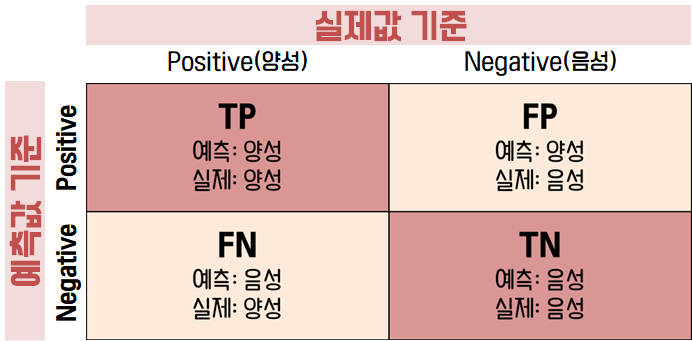
   

   confusion matrixs는 모델이 예측을 하면서 얼마나 헷갈리고 있는지를 보여주는 지표이다. 주로 이진 분류에서 많이 사용하며 이진 분류에 대한 오차 행렬은 위의 그림처럼 같이 나타낼 수 있다. True Positive는 긍정으로 예측을 했는데 실제로 긍정인 경우를, False Negative는 긍정으로 예측했는데 실제로 부정인 경우를, False Negative는 부정으로 예측했는데 실제로 긍정인 경우를, True Negative는 부정으로 예측했는데 실제로 부정인 경우를 말한다. 위의 값을 바탕으로 모델이 어떤 오류를 발생시켰는지를 살펴볼 수 있다.

4. precision, recall

   precisionrhk recall은 긍정 데이터 예측 성능에 초점을 맞춘 평가지표이다. precision은 예측을 긍정으로 한 데이터 중 실제로 긍정인 비율을 말하며, recall은 실제로 긍정인 데이터 중 긍정으로 예측한 비율을 말한다. 오차 행렬을 기준으로 precission = TP / (FP + TP), recall = TP / (FN + TP)으로 계산할 수 있다.

   precision과 recall은 trade-off 관계를 갖는다. 정밀도는 FP를, 재현율은 FN을 낮춤으로써 긍정 예측의 성능을 높인다. 이 같은 특성 때문에 정밀도가 높아지면 재현율은 낮아지고 재현율이 높아지면 정밀도는 낮아진다. 가장 좋은 경우는 두 지표 다 적절히 높은 경우이다.

5. F1-score

   정밀도와 재현율 한 쪽에 치우치지 않고 둘 다 균형을 이루는 것을 나타낸 것이 **F1-Score**이다. F1-Score는 정밀도와 재현율의 조화평균으로 계산할 수 있다.

6. Area Under Curve(AUC, ROC)

   

     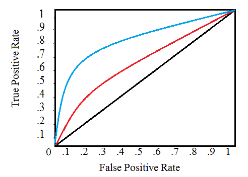
   

   ROC는 FPR(False Positive Rate)가 변할 때 TPR(True Positive Rate)가 어떻게 변하는지를 나타내는 곡선을 말한다. 여기서 FPR이란 FP / (FP + TN)이고, TPR은 TP / (FN + TP)으로 재현율을 말한다. 그럼 어떻게 FPR을 움직일까? 바로 분류 결정 임계값을 변경함으로써 움직일 수 있다. FPR이 0이 되려면 임계값을 1로 설정하면 된다. 그럼 긍정의 기준이 높으니 모두 부정으로 예측될 것이다. 반대로 1이 되려면 임계값을 0으로 설정하여 모두 긍정으로 예측시키면 된다. 이렇게 임계값을 움직이면서 나오는 FPR과 TPR을 각각 x와 y 좌표로 두고 그린 곡선이 ROC이다.

   AUC는 ROC 곡선의 넓이를 말한다. AUC가 높을수록 즉, AUC가 왼쪽 위로 휘어질수록 좋은 성능이 나온다고 판단한다. 즉, TPR이 높고 FPR이 낮을수록 예측 오류는 낮아지기 때문에 성능이 잘 나온다 볼 수 있다.

#### Regression Metrics

1. MSE

   예측값과 정답값 사이의 차이의 제곱의 평균으로 정의한다. 제곱을 했기 때문에 특이치(아웃라이어)에 민감하다.

   

     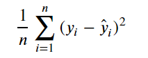
   

2. RMSE

   MSE에 루트를 씌운 값을 말한다. 오류 지표를 실제 값과 유사한 단위로 다시 변환하기에 해석이 다소 용이해진다.

   

     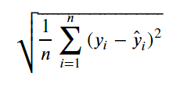
   

3. R-squared

   분산을 기반으로 예측 성능을 평가하는 지표를 말한다. 정답값의 분산 대비 예측값의 분산 비율을 지표로 하며, 1에 가까울수록 정확도가 높다.

4. MAE

   예측값과 정답값 사이의 차이의 절대값의 평균을 말한다.
   

     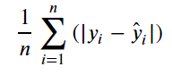
   

##### References

- [Metric 종류](https://wooono.tistory.com/99)
- [Log loss란?](https://seoyoungh.github.io/machine-learning/ml-logloss/)
- [ROC curve와 AUC이해하기](https://dsdoris.medium.com/roc-curve%EC%99%80-auc-%EC%9D%B4%ED%95%B4%ED%95%98%EA%B8%B0-126978d80a9e)
- [Regression - 모델 평가 : MSE, MAE, RMSE, RMSLE, R-Squared](https://steadiness-193.tistory.com/277)

## #2

### 정규화를 왜 해야할까요? 정규화의 방법은 무엇이 있나요?

normalization, regularization, standardization. 세 용어가 모두 정규화로 번역됩니다. 여기서는 normalization을 집고 넘고 넘어가겠습니다.

#### Normalization

ML 알고리즘의 목적 중 하나는 feature들을 비교하여 데이터의 패턴을 찾는 것입니다. 하지만 feature의 scale이 심하게 차이나는 경우 문제가 발생합니다. 그래서 **모든 데이터가 동일한 정도의 sclae(중요도)로 반영되도록 해주는 게 normalization의 목표**입니다.

1. **Min - Max normalization**

   

     
   

   - 최소값과 최대값을 이용해 값의 범위를 0~1 사이 값으로 바꿉니다.
   - 하지만 outlier(이상치)에 너무 많은 영향을 받습니다.

2. **Z-score normalization**

   

     
   

   - standartdization을 활용해 outlier 문제를 어느정도 해결합니다.
   - 하지만 동일한 척도로 정규화된 데이터를 생성하지 않는다는 문제가 있습니다.

##### References

- [정규화 : normalization, standardization, regularization](https://realblack0.github.io/2020/03/29/normalization-standardization-regularization.html)
- [normalization 쉽게 이해하기](https://hleecaster.com/ml-normalization-concept/)

## #3

### Local Minima와 Global Minima에 대해 설명해주세요.

오차를 줄이기 위해 경사하강법을 이용하는데, 이는 오차를 계산하는 함수의 최소값을 찾기 위함이다. 이 때 경사하강법은 초기화된 위치에서부터 기울기를 구해 더 아래로 아래로 내려가려 한다.

이구간에서 최소값을 찾기위해 아래로 내려간다면 global minima에 도달하겠지만

이부분에서 내려간다면 localminimum에 빠져 gradient가 0이 되어도, 오차를 최대로 줄일 수 없다.

##### References

- [Wikipedia](https://en.wikipedia.org/wiki/Maxima_and_minima)

## # 4

#### 차원의 저주에 대해 설명해주세요

**차원의 저주(Curse of dimensionality)** 란, 데이터 학습을 위해 차원이 증가하면서 고차원 데이터 공간에서 데이터 표본이 희박해지는 것을 의미한다. 즉, 차원이 증가함에 따라(=변수의 수 증가) 모델의 성능이 안좋아지는 현상을 의미한다.

무조건 변수의 수가 증가한다고 해서 차원의 저주 문제가 있는 것이 아니라, 관측치 수보다 변수의 수가 많아지면 발생한다.

예를 들어 아래의 그래프을 봤을 때 **8** 을 표현하기 위해서는 1차원에서는 (8), 2차원에서는 (8,0), 3차원에서는 (8,0,0) 으로 표현해야한다.

따라서 차원이 커질수록, 설명 공간이 지수적으로 늘어나게 된다. 이는 Feature가 많아질수록 동일한 데이터를 설명하는 빈공간이 늘어난다는 것을 의미하며 이는 차원의 저주로 인해 알고리즘 모델링 과정에서 저장 공간과 처리 시간이 불필요하게 증가됨에 따라 결국 성능이 저하되는 것을 의미한다.

##### References

- [차원의 저주(Curse of dimensionality)](https://bioinformaticsandme.tistory.com/197)
- [[빅데이터] 차원의 저주](https://datapedia.tistory.com/15)
- [빅데이터: 큰 용량의 역습 – 차원의 저주 (Curse of dimensionality)](https://thesciencelife.com/archives/1001)

## #5

### dimension reduction기법으로 보통 어떤 것들이 있나요?

차원 축소는 매우 많은 feature로 구성된 다차원 dataset의 차원을 축소해 새로운 차원의 dataset을 생성하는 것이다. 일반적으로 차원이 증가할수록 데이터 포인트 간의 거리가 기하급수적으로 멀어지게 되고, 희소(sparse)한 구조를 가지게 된다. 즉, 데이터가 넓게 분포되어 있어 지역적으로 밀도가 적게 분포되어 있는 구조를 말한다.

차원 축소는 피처 선택(feature selection)과 피처 추출(feature extraction)으로 나눌 수 있다. 피처 선택이란 특정 feature에 종속성이 강한 불필요한 feature는 아예 제거하고, 데이터의 특성을 잘 나타내는 주요 feature만 선택하는 것이다. 피처 추출은 기존 feature를 저차원의 중요 feature로 압축해서 추출하는 것이다. 이렇게 새로 추출된 중요 특성은 기존 feature와는 완전히 다른 값이 된다.

PCA, SVD, NMF는 잠재적인 요소를 찾는 대표적인 차원 축소 알고리즘이다. 매우 많은 의미를 가지는 이미지나 텍스트에서 차원 축소를 통해 잠재적인 의미를 찾아 주는 데 이러한 알고리즘들이 잘 활용되고 있다.

##### References

- [머신러닝 스터디 - 차원축소](https://blog.mathpresso.com/mathpresso-%EB%A8%B8%EC%8B%A0-%EB%9F%AC%EB%8B%9D-%EC%8A%A4%ED%84%B0%EB%94%94-15-%EC%B0%A8%EC%9B%90-%EC%B6%95%EC%86%8C-dimensionality-reduction-76b13460506f)
- [차원 축소 개요](https://velog.io/@sset2323/06-01.-%EC%B0%A8%EC%9B%90-%EC%B6%95%EC%86%8CDimension-Reduction-%EA%B0%9C%EC%9A%94)

## #6

### PCA는 차원 축소 기법이면서, 데이터 압축 기법이기도 하고, 노이즈 제거기법이기도 합니다. 왜 그런지 설명해주실 수 있나요?

PCA(Pricipal Component Analysis: 주성분 분석)는 고차원의 데이터를, 데이터들의 분산을 잘 유지하는 주성분(데이터들의 선형결합으로 이뤄짐)들을 구하고, 이 주성분을 이용해 저차원으로 데이터들을 표현하는 방법이다. 여기서 주성분들은 서로 직교한다.

주성분 분석은 기존의 고차원 데이터들을, 더 적은 차원의 주성분으로 데이터를 표현하므로 차원 축소 기법이라 할 수 있다. 주성분을 구할 때 데이터의 기존의 분산을 전체 다 이용하는 것이 아닌 분산을 설명하는 정도가 큰 몇개의 주성분만을 이용하므로 데이터를 압축한다고 할 수 있고, 이 과정에서 어느정도의 분산이 제거되므로 노이즈가 감소할 수 있다.

##### References

- [공돌이의 수학 노트 PCA](https://angeloyeo.github.io/2019/07/27/PCA.html)
- [주성분분석(PCA)의 이해와 활용-다크 프로그래머 블로그](https://darkpgmr.tistory.com/110)
- [PCA Eliminate noise in the data - stackExchange](https://stats.stackexchange.com/questions/247260/principal-component-analysis-eliminate-noise-in-the-data/247271)

## #7

### LSA, LDA, SVD 등의 약자들이 어떤 뜻이고 서로 어떤 관계를 가지는지 설명할 수 있나요?

**LSA**

Latent Semantic Analysis는 토픽 모델링을 위해 최적화 된 알고리즘은 아니지만, 토픽 모델링이라는 분야에 아이디어를 제공한 알고리즘이라고 볼 수 있다. 뒤에 나올 **LDA**는 LSA의 단점을 개선하여 탄생한 알고리즘으로 토픽 모델링에 보다 적합한 알고리즘이다. 

BoW (Bag of Words)에 기반한 알고리즘은 기본적으로 단어의 빈도 수를 이용한 수최화 방법이기 때문에 단어의 의미를 고려하지 못한다는 단점이 있다. 이를 토픽 모델링 관점에서는 단어의 토픽을 고려하지 못한다고 한다. 이를 위한 대안으로 잠재된 의미를 이끌어내는 방법으로 잠재 의미 분석(LSA)이 사용된다.

**LSA는 DTM(Document-Term Matrix)나 TF-IDF(Term Frequency-Inverse Document Frequency) 행렬에 Truncated SVD를 적용하여 차원을 축소시키고 단어들의 잠재적인 의미를 이끌어낸다. Full-SVD는 모든 특이값을 사용하는 것이고 Truncated SVD는 상위 N개의 특이값만 사용하는 축소 방법이다. 이 방법을 쓸 경우 원 행렬로 복원이 불가능하다.**

이 방법을 이해하기 위해서는 선형대수학의 특이값 분해(Singular Value Decomposition, SVD)를 이해해야할 필요가 있다. 

**SVD** 

A가 m x n 행렬일 때, 3개의 행렬의 곱으로 분해하는 것을 말한다.

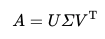

여기서 각 3개의 행렬은 다음과 같은 조건을 만족한다.

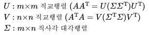

SVD를 통해 나온 m x n 대각행렬의 대각 원소의 값을 행렬 A의 특이값(singular value)라고 한다.

**LDA**

**Latent Dirichlet Allocation** 혹은 **Linear Discriminant Analysis**의 약자이다. 전자는 토픽모델링에 사용되는 기법 중 하나로 LSA와는 달리 단어가 특정 토픽에 존재할 확률과 문서에 특정 토픽이 존재할 확률을 결합확률로 추정하여 토픽을 추정하는 기법을 말한다. 후자는 차원축소기법 중 하나로 분류하기 쉽도록 클래스 간 분산을 최대화하고 클래스 내부의 분산은 최소화하는 방식을 말한다.

##### References

- https://wikidocs.net/24949
- https://bkshin.tistory.com/entry/NLP-9-%EC%BD%94%EC%82%AC%EC%9D%B8-%EC%9C%A0%EC%82%AC%EB%8F%84%EB%A5%BC-%ED%99%9C%EC%9A%A9%ED%95%9C-%EC%98%81%ED%99%94-%EC%B6%94%EC%B2%9C-%EC%8B%9C%EC%8A%A4%ED%85%9C

## #8

#### Markov Chain을 고등학생에게 설명하려면 어떤 방식이 제일 좋을까요?

마르코프 체인이란 각 사건의 확률이 이전 사건에서 얻은 상태에 따라서만 달라지는 일련의 가능한 사건들을 설명하는 확률적 모델이다. 고등학생에게 설명하기 위해 쉽게 표현하자면, 오늘의 날씨가 맑을 때, 내일의 날씨가 맑을지 비가 내릴지를 확률적으로 표현하는 것이다.

위 그림을 풀어서 말하면 아래와 같다.

E가 연속적으로 발생할 확률 : 0.3

E다음에 A가 발생할 확률 : 0.7

A다음에 E가 발생할 확률 : 0.4

A가 연속적으로 발생할 확률 : 0.6

**간단한 날씨 예측 모델을 마르코프 체인으로 구현한다고 가정해보자**

| 오늘/내일 | 맑음 | 비  |
| :-------: | :--: | :-: |
|   맑음    | 0.7  | 0.3 |
|    비     | 0.5  | 0.5 |

_오늘 맑고 내일 맑고 모레 비가올 확률은?_

0.7 (오늘 맑고 내일 맑을 확률) \* 0.3(맑은 다음 비올 확률) = 0.21

##### References

- https://en.wikipedia.org/wiki/Markov_chain
- https://www.puzzledata.com/blog190423/

## #9

### 텍스트 더미에서 주제를 추출해야 합니다. 어떤 방식으로 접근해 나가시겠나요?

#### 잠재 디클레레 할당(Latent Dirichlet Allocation, LDA)

LDA는 문서가 있고, 그안에 단어가 있다면 확률분포 중 하나인 디클레레의 분포를 가정하고, 번호가 매겨진 토픽 안에 문서와 단어들을 하나씩 넣어보며 잠재적인 의미들을 찾아주는 과정입니다. 

  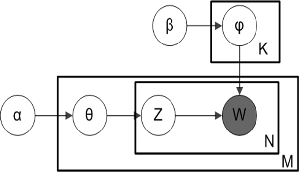

α, β, K : 디리클레 분포 하이퍼 파라미터 값
M: 문서 개수
N: 문서에 속한 단어의 갯수
θ: 문서의 토픽 디리클레 분포
φ: 주제의 단어
Z: 해당 단어가 속한 토픽의 번호
W : 실제 관측 가능한 값

α의 값은 문서들의 토픽 분포를 얼마나 밀집되게 할 것인지에 대한 설정 값
β의 값은 문서내 단어들의 토픽 분포를 얼마나 밀집되게 할 것인지에 대한 설정 값
K는 토픽을 몇개로 설정할 것인지에 대한 설정 값

해당 파라미터들은 원하는 주제끼리 문서, 단어들이 묶여있는지 **계속 학습을 해나가며 파라미터 값을 변경**합니다.

#### LDA 예시

- 문서

  1번 문서 : 문고리거래 하실분

  2번 문서 : 가방 나눔합니다. 문고리드림

  3번 문서 : 비대면거래로 합니다. 택배로 할게요.

- 명사 추출

  1번 문서 : 문고리, 거래
  
  2번 문서 : 가방, 나눔, 문고리, 드림
  
  3번 문서 : 비대면, 거래, 택배

**LDA**

1. **모든 문서와 문서 속 단어들을 임의의 토픽 번호 부여**

   

     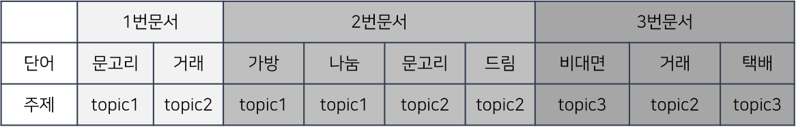
   

2. **토픽-문서의 단어 분포를 계산**

   

     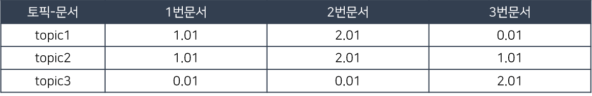
   

​		1번문서의 문고리 단어가 topic1로 배정되어 1의 값이 생기고, LDA 파라미터 값인 α를 0.01로 설정하면 그 값을 같이 더해줍니다.

​		그렇게 1번문서에는 topic3에 배정된게 없지만 최소한의 값을 배정해줍니다.

3. **토픽-단어 분포 계산**

   

     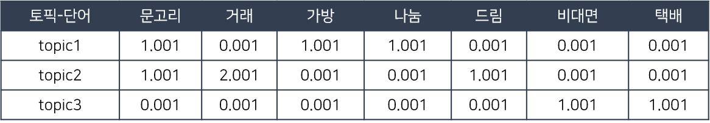
   

   

   임의로 배정된 토픽-단어 분포를 계산해줍니다. 문고리” 단어의 경우 3번 토픽에 지정되어 있지않으나,
   β값을 0.001로 지정함으로써 최소한의 값을 부여합니다.

   

4. **단어 하나를 제외한 나머지 토픽-단어, 문서의 분포를 고정**

   

     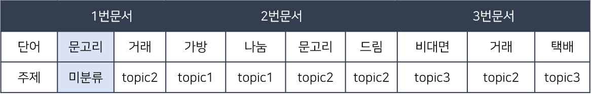
   

   

5. **미분류된 키워드의 토픽 선정**

   1번 문서 내 topic1이 있을 확률 : 1.01/3.03 = 0.333

   1번 토픽 내 단어가 ‘문고리’일 확률 : 1.001/3.007 = 0.332

   1번 문서의 ‘문고리’가 topic1일 확률 0.333*0.332=0.110

   

   위처럼 1번 문서 내 topic2이 있을 확률, 1번 문서 내 topic3이 있을 확률 모두 구해줍니다.

   해당 과정을 모두 반복하면 가장 높은 확률을 가진 토픽에 해당 단어와 문서가 분류됨으로써 LDA학습은 완료가 됩니다.

#### Reference

- [텍스트분석 – 토픽모델링(LDA)](http://bigdata.emforce.co.kr/index.php/2020072401/)

## #10

### SVM은 왜 반대로 차원을 확장시키는 방식으로 동작할까요? SVM은 왜 좋을까요?

SVM(Support Vector Machine)은 데이터를 사상된 공간으로 표현하여, 이 공간에서 데이터간 가장 큰 폭을 갖는 경계(초평면: Hyperplane)를 찾는 알고리즘입니다. 분류와 회귀에 둘 다 적용 가능합니다.

기존의 데이터 차원에서는 적절한 데이터 간의 경계를 구할 수 없기 때문에 kernel trick을 이용해 고차원의 특징 공간으로 사상하여 데이터간 가장 먼 거리를 갖는 초평면(Hyperplane)을 찾습니다.

왼쪽 문제의 경우 선으로 분리 될 수 없기에 가운데의 mapping 함수를 이용해 고차원의 특징공간으로 사상하여 선형으로 분리 될 수있는 초평면을 구합니다. 여기서 주목할 점은 사실 고차원의 공간으로 직접 이동하는것은 많은 연산을 요구하기에 이 점이 실제로 이동하기 보다는 kernel trick을 이용해 문제를 단순화하여 문제를 해결한다.

SVM은 고차원 데이터에서 잘 작동한다는 장점이 있지만 데이터 수가 많아지면 연산이 느려지고 Cross-Validation을 통해 kernel 함수를 정해야 한다는 단점이 있습니다.

#### Reference

- [statquest Youtube SVM](https://www.youtube.com/watch?v=efR1C6CvhmE&t=1028s)
- [커널과 커널트릭](https://sanghyu.tistory.com/14)
- [SVM 설명 블로그](https://excelsior-cjh.tistory.com/66)
- [SVM 장단점](https://www.analyticsvidhya.com/blog/2017/09/understaing-support-vector-machine-example-code/)

## #11

### 다른 좋은 머신 러닝 대비, 오래된 기법인 나이브 베이즈(naive bayes)의 장점을 옹호해보세요.

> 기하학에 피타고라스 정리가 있다면 확률론에는 베이즈 정리가 있다
>
> -해럴드 제프리스 경

제프리스 경이 말한 것처럼 베이즈 정리는 AI와 통계학에 엄청난 영향을 끼친 이론입니다.

- Naive : 예측한 특징이 상호 독립적이라는 가정 하에 확률 계산을 단순화. naive의 순진하다라는 의미를 모든 변수들이 동등하다는 것으로 사용하고 있습니다.
- Bayes : 추론 대상의 사전 확률과 추가적인 정보를 기반으로 사후확률을 추론하는 방법입니다. Statistics/Math 카테고리의
  [Bayesian Estimation](.\1-statistics-math.md#14)에서 좀 더 자세히 알 수 있습니다.
  나이브 베이지안에 대한 더 자세한 예시와 적용은 3번째 reference를 참고하면 됩니다.
> 나이브 베이지안 장점
>
> > 간단하고 빠르고 효율적인 알고리즘
> >
> > 잡음과 누락 데이터를 잘 처리
> >
> > 데이터 크기에 상관 없음
> >
> > 예측을 위한 추정 확률을 쉽게 얻음

> 나이브 베이지안 단점
>
> > 모든 데이터가 독립이라는 가정이 전제 되어야 함
> >
> > nummeric feature이 많은 dataset에는 이상적이지 않음
> >
> > 추정된 확률이 예측된 클래스보다 덜 신뢰

이러한 나이브 베이지안의 단점을 보완하기 위해 Laplace Smoothing, Underflow 등 보정 방법을 활용하곤 한다.

##### References

- [나이브 베이즈 분류](https://needjarvis.tistory.com/621)
- [베이즈 추정](https://bkshin.tistory.com/entry/dd?category=1042793)
- [딥 러닝을 이용한 자연어 처리 입문 : 나이브 베이즈 분류기](https://wikidocs.net/22892)

## #12

### 회귀 / 분류시 알맞은 metric은 무엇일까?

#### 회귀 (Regression)

> **실제 값 VS 모델이 예측하는 값** 의 차이를 통해 평가 진행

1. **RSS** (단순 오차 제곱합)

   : 예측값과 실제 값의 오차의 제곱합

2. **MSE** (평균 제곱 오차)

   : RSS를 데이터의 갯수 만큼 나눈 값

   오차의 제곱이므로, 이상치 (Outlier) 를 잡아내는데 효과적이다.

   

   - RMSE : MSE에 루트를 씌운 값

3. **MAE** (평균 절대값 오차)

   : 예측값과 실제값의 오차의 절대값의 평균

   변동치가 큰 지표와 낮은 지표를 같이 예측하는데 효과적

   

   - RMAE : MAE에 루트를 씌운 값

4. ⭐️ **R2** (결정계수)

   : 위의 MSE와 MAE는 가장 간단한 평가 방법으로 직관적인 해석이 가능하지만, 평균을 그대로 이용하기에 데이터의 크기(N)에 의존한다는 단점 존재 따라서 서로 다른 두 모델의 MSE, MAE만 비교해서는 어떤게 더 좋은 모델인지 판단하기 어려움

   이를 해결하기 위한 metric으로 **R2** 존재

   R2 = **1 - (RSS/전체 분산)** => **회귀 모델의 설명하는 지표** R2의 식에서 분자인 RSS의 근본은 실제값과 예측값의 차이인데 그 값이 0에 가까울 수록 모델이 잘 예측했다는 뜻이 될 수 있다.

   

#### 분류 (Classification)

> 모델이 데이터를 **얼마나 알맞은 클래스로 분류 했느냐** 를 측정하는 **혼동 행렬(Confusion Matrix)** 를 사용한다.

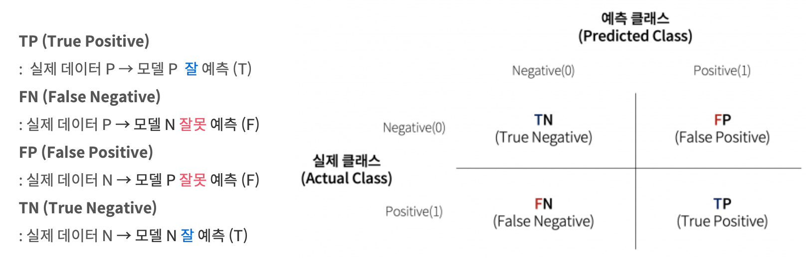

1. **정밀도** (**Precision**) : 모델이 **P라고 분류한 데이터** 중 **실제 데이터가 P** 인 비율

   - N(음성 데이터) 가 중요하여 놓치지 말아야 할 때 사용

   

2. **재현율 (Recall)** : **실제 데이터 P** 중 **모델이 P라고 잘 예측** 한 데이터의 비율
   - P (양성 데이터)가 중요하여 놓치지 말아야 할 때 사용

3. **정확도 (Accuracy)** : 모델이 얼마나 데이터를 잘 분류 했느냐 / 분류 결과가 얼마나 True인가

   

4. **False Positive Rate (FPR)** : **실제로 N인 데이터** 중 에서 **모델이 P라고 잘못 분류** 한 데이터의 비율

   **FPR = FP/(FP+TN)**

5. **F1 score** : **정밀도와 재현율을 혼합**해 사용하기 위하여 만들어진 지표

   정밀도와 재현율의 가중조화평균 값으로 구정되어있다. 아래의 식에서 `alpha` 값으로 정확도와 재현율 중 어느 쪽에 더 가중치를 둘 것이냐를 결정 **F1 score** 는 `alpha = 0.5` 인 경우

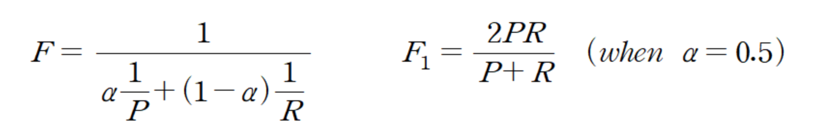

#### Reference

- [회귀 / 분류시 알맞은 metric과 그에 대한 설명](https://mole-starseeker.tistory.com/30)
- [회귀/분류metric , OneHot인코딩, MDP(마르코프 결정 과정)](https://meme2.tistory.com/6#recentEntries)

## #13

### Association Rule의 Support, Confidence, Lift에 대해 설명해주세요.

Support : 전체 경우 중 X,Y가 같이 나오는 비율

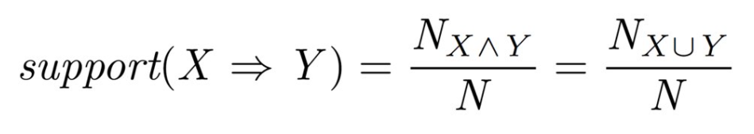

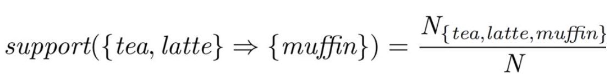

support값이 높을수록 아이템 사이의 관계가 의미있다고 할 수 있다.

Confidence : X가 나온 경우 중 X와 Y가 함께 나올 비율

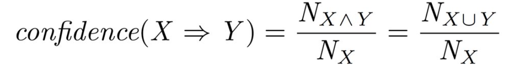

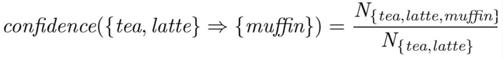

Confidence값은 1에 가까울 수록 아이템 사이의 관계가 의미있다고 할 수 있다.

Lift : X,Y가 같이 나오는 비율을 X가 나올 비율과 Y가 나올 비율의 곱으로 나눈 값

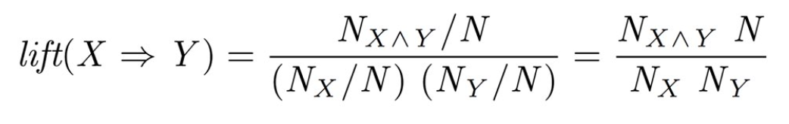

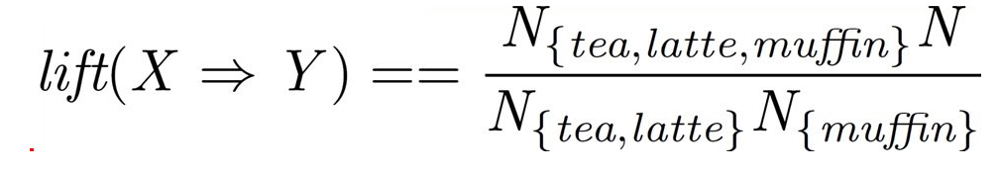

Lift값이 1보다 크면 X를 샀을 때 Y를 살 확률이 높은 것이고,
1미만이면 X를 샀을 때 Y를 사지 않을 확률이 높은 것이다.

##### References

- [Association rule](https://process-mining.tistory.com/34)
- [support,confidence,lift](https://dodonam.tistory.com/167)

## #14

### 최적화 기법중 Newton’s Method와 Gradient Descent 방법에 대해 알고 있나요?

#### Newton's Method

> 방정식 **f(x) = 0의 해**를 근사적으로 찾을 때 유용하게 사용되는 방법

**개념**

뉴턴법(Newton's Method)는 기본적으로 f'(a) 가 x = a 에서의 접선의 기울기라는 미분의 기하학적 해석을 이용한다.

예를 들어 아래와 같은 식이 있을 때,

인수분해도 안되고 정상적인 방법으로 해를 구하기 힘들다. 이때 뉴턴 법을 이용하게 되는데 일단 아무 값이나 x= a를 넣고 f(a)의 값을 살펴본다. 만약 f(a)>0이고 f'(a)>0 이라면 f(x) = 0이 되는 x는 a보다 작은 값일 것이다. 그러니 a의 값을 더 줄이고 대입을 하면서 값의 변화를 살펴보는 식으로 해를 찾아간다.

만약 x= a에서의 |함수값|이 작고 접선의 기울기가 가파르다면 바로 근처에 해가 있을 것이고, 반대로 |함수값|이 크고 접선 기울기가 완만하면 멀리 떨어진 곳에 해가 존재한다.

**특징 및 제약점**

- f(x)가 연속이고 미분이 가능해야한다는 조건 존재

- 만일 f(x) = 0인 해가 여러개 있다면 뉴턴법은 그 중 하나의 해만 찾을 뿐이다.
- 해가 여러개인 경우 초기값을 어떻게 주냐에 따라 찾는 해가 달라질 수 있다.

#### Gradient Descent

> **f'(x) = 0**이 되는 지점을 찾아가는 방법

어떤 다변수 함수의 f(x1, x2, ..., xn)이 있을 때, f의 gradient는 아래와 같이 정의 된다

즉, gradient는 각 변수로의 일차 편미분 값으로 구성되는 벡터이다. 또한 **f의 값이 가장 가파르게 증가하는 방향**을 나타낸다. 이를 통해 어떤 함수를 지역적으로 선형근사 ([linear approximation](https://ko.wikipedia.org/wiki/선형_근사))하거나 gradient descent 방법을 통해 함수의 극점을 찾는 용도로 활용 가능하다.

Gradient Descent는 아래와 같은 식으로 그레디언트의 특성을 이용해 극소값을 찾아 가는 방법이다.

##### Reference

- [뉴턴법/뉴턴-랩슨법의 이해와 활용(Newton's method)](https://darkpgmr.tistory.com/58)
- [Gradient Descent 탐색 방법](https://darkpgmr.tistory.com/133)

## #15

### 머신러닝(machine)적 접근방법과 통계(statistics)적 접근방법의 둘간에 차이에 대한 견해가 있나요?

머신러닝은 예측에 집중한다. overfitting되지 않고, 일반화 성능이 좋길 바란다.

통계학은 해석 가능성을 중요시하고, 모델링과 샘플링의 가정(assumption)에 중점을 둔다.

넷플릭스를 예로 들자면,

넷플릭스에서는 유저의 영화 평가를 다량으로 수집하여 영화를 예측하여 추천해준다. 예측에 필요한 데이터를 이미 가지고 있는 상태에서 넷플릭스의 영화 추천 시스템이 작동하는 것이다. 이에 대한 성공은 믿을만한 영화를 추천해주는지로 평가할 수 있다.

반면 통계학에서는 유저가 왜 특정 영화를 선택하게 되는지를 이해할 수 있게하는 모형을 만드려고 할 것이다. 그 이해라는 것은 가령, A종류의 영화를 좋아하는 사람은 또 B종류의 영화를 좋아하는구나라는 심리학적인 설명을 할 수도 있는 것이다.

머신러닝은 이러한 이유의 해석가능성이 부족하다.

통계학과 기계학습의 차이는 방법론의 차이가 아닌 목표와 전략에서 온다.

통계학은 모델의 신뢰도를 확보하는 것, 즉 정해진 분포나 가정을 통해 실패의 위험을 줄이는 데 주 목적을 둔다.

ML의 목적인 '본 적 없는 새로운 데이터를 분류하는 것'은 통계학에서는 비교적 비중이 낮다.

반면 기계학습의 제 1목적은 데이터의 '패턴'을 분석해, 높은 성공률로 새로운 데이터를 올바르게 분류하는 데 있다.

실패의 위험을 낮추는 것과 성공률을 높이는 것이 같은 말처럼 보일 수 있지만, ML은 실패에 집착하지 않기 때문에 모델에 필요한 갖가지 가정과 검증을 신경쓰는 데서 해방될 수 있다.

##### References

- [통계학과 기계학습의 차이](https://essencehan.tumblr.com/post/166414990009/%ED%86%B5%EA%B3%84%ED%95%99%EA%B3%BC-%EA%B8%B0%EA%B3%84%ED%95%99%EC%8A%B5%EC%9D%98-%EC%B0%A8%EC%9D%B4)

- [머신러닝과 전통적 통계학의 차이](https://medium.com/@hyunseok/%EB%A8%B8%EC%8B%A0%EB%9F%AC%EB%8B%9D%EA%B3%BC-%EC%A0%84%ED%86%B5%EC%A0%81-%ED%86%B5%EA%B3%84%ED%95%99%EC%9D%98-%EC%B0%A8%EC%9D%B4-a560f0708db0)

## #16

### 인공신경망(deep learning 이전의 전통적인)이 가지는 일반적인 문제점은 무엇일까요?

기존 단일 신경망(single layer perceptron)의 경우 xor과 같은 비선형 문제를 해결하지 못하는 문제점이 있었다. 그러나 비선형 활성화 함수와 Multi Layer Perceptron을 통해 xor 문제를 해결 할 수 있게 됬고 MLP를 학습시킬 수 있는 Backpropagation의 등장과 컴퓨팅 파워로 인해 지금의 deeplearning이 가능해졌다.

#### Reference

- [Solving XOR Problem with MLP](https://ynebula.tistory.com/22)
- [Multi Layer Perceptron 설명](http://users.ics.aalto.fi/harri/thesis/valpola_thesis/node43.html)

## #17

### 지금 나오고 있는 deep learning 계열의 혁신의 근간은 무엇이라고 생각하시나요?

- ImageNet과 같은 거대하고 높은 품질의 데이터 
- GPU 등의 컴퓨팅 리소스의 발전(하드웨어의 발전)
- 딥러닝 커뮤니티의 개방과 공유 정신
  - 논문을 무상으로 공개하는 오픈 엑세스
  - 소프트웨어의 소스코드를 공개하는 오픈 소스

빅데이터, 하드웨어의 발전 등의 이유가 있겠지만 논문과 소스 코드 공개 등의 공유 정신이 가장 큰 원동력이라고 생각합니다. 인터넷과 웹의 인프라 구축이 완성되고 참여, 공유, 개방을 하면서 딥러닝이 혁신적으로 발전하게 되었다고 생각합니다.

"내가 멀리 볼 수 있었던 것은, 거인의 어깨 위에 있었기 때문이다" - 아이작 뉴턴

#### Reference

- [최근 딥러닝의 폭발적인 학술적, 기술적 발전의  이유는 뭘까?](https://brunch.co.kr/@justinleeanac/1)

## #18

### ROC 커브에 대해 설명해주실 수 있으신가요?

ROC 커브(Receiver operating characteristic)란 **이진 분류기의 성능을 표현하는 방법**이다. 설명하기 앞서 TPR과 FPR의 개념에 대해 이해해야 한다. TPR은 True Positive Rate, FPR은 False Positive Rate을 의미한다. 쉽게 말하자면, 의사가 환자가 암에 걸렸는지 아닌지를 판별하는 상황을 이진분류라고 가정했을 때, 실제로 암에 걸린 환자를 암에 걸렸다고 진단하는 것이 True Postiive, 암에 걸리지 않은 환자를 암에 걸렸다고 오진하는 것이 False Postive이다. Postive는 암에 걸린 상태, 이것을 잘 예측하면 앞에 True가 붙는 것이다.

ROC Curve 를 나타낸 그래프이다. 위 그래프에서 그래프가 좌측 상단쪽으로 쏠려있을 수록 좋은 True Positive가 1에 수렴하므로 Classifier임을 의미한다.

gif로 보면 이해가 빠르니 아래 2번째 링크에서 확인하면 좋을 것 같다. (저작권 문제로 gif를 가져오지 못함)

##### References

- https://youtu.be/n7EoYT5kDO4
- https://angeloyeo.github.io/2020/08/05/ROC.html
- https://en.wikipedia.org/wiki/Receiver_operating_characteristic

## #19

### 여러분이 서버를 100대 가지고 있습니다. 이때 인공신경망보다 Random Forest를 써야하는 이유는 뭘까요?

     
   

Random Forest는 수많은 의사결정 트리(Decision Tree)로 만들어진 모델입니다. 새로운 데이터 포인트를 각 트리에 동시에 통과시키며 각 트리가 분류한 결과에서 가장 많이 결과를 최종 분류 결과로 선택합니다. 많은 Tree를 만들기 때문에 Forest라는 단어를 쓰기 시작한거죠. random이라는 요소 때문에 overfitting을 방지하는 ensemble효과를 가져옵니다. 수많은 Decision Tree를 만들기 위해 Bagging, Bagging Features 등의 과정을 거칩니다.

인공신경망(Neural Network)은 각 단계별로 의존적인 end-to-end 구조로 하나의 서버에서 이뤄져야 합니다.

서버수의 여유가 있다면 많은 Decision Tree 모델을 병렬적으로 처리하도록 하여 Random Forest를 활용하는 것이 효율적입니다.

#### References

- [Random Forest : iris 데이터 예측](https://myjamong.tistory.com/79)
- [Random Forest 개념 정리](https://eunsukimme.github.io/ml/2019/11/26/Random-Forest/)
- [Interview Question & Answer: 출근 루틴, 하루 3문제](https://yongwookha.github.io/MachineLearning/2021-01-29-interview-question) : 다른 문항들도 보는 것을 추천!

## #20

#### K-means의 대표적 의미론적 단점은 무엇인가요?(계산량 많다는것 말고)

K-means 클러스터링이란?

비지도학습인 클러스터링 알고리즘입니다.  작동방법은 다음과 같습니다.

1. k개의 centroids(중심이 되는 어떤 점)를 임의로 지정하비다.
2. 각 데이터들을 가장 가까운 centroids가  속한 그룹에 할당합니다.
3. 2번 과정에서 할당된 결과를 바탕으로 centroids를 새롭게 지정합니다.
4. 2~3번 과정을 반복하며 centroids가 더이상 변하지 않을때 까지 반복합니다.

**장점**

- 알고리즘의 수행이 간단하고 새로들어온 데이터에 쉽게 적용(Centroid 거리만 계산)할 수 있다.

**단점**

- 클러스터 개수 k값을 미리 지정을 해줘야 한다. K 에 개수에 따라 결과가 심하게 달라 질 수 있기 때문에 문제가 된다.
- 초기값에 민감하여 전역 최소값이 아닌 지역 최소값에 빠질 가능성이 있다.
- 구형(spherical)이 아닌 클러스터를 찾는 데에는 적절하지 않다.

**활용**

- CV: Image Segmentation, NLP: 문서 군집화 (Bag of world)

#### Reference

- [K-menas clustering 개념정리 블로그](https://eunsukimme.github.io/ml/2019/12/16/K-Means/)
- [k means clustering wikepedia](https://ko.wikipedia.org/wiki/K-%ED%8F%89%EA%B7%A0_%EC%95%8C%EA%B3%A0%EB%A6%AC%EC%A6%98)

## #21

### L1, L2 정규화에 대해 설명해주세요.

#### Norm

벡터의 크기 (혹은 길이)를 측정하는 방법(혹은 함수) or 두 벡터 사이의 거리를 측정하는 방법

<h4>
L1 Norm
</h4>
 

     
     

벡터 p,q의 각 원소들의 차이의 절대값의 합

예를 들어 벡터 p=(3,1,-3),q=(5,0,7) 이라면 p,q의 L1 Norm은 13

<h4>
L2 Norm
</h4>

 

     
   

벡터 p,q의 유클리디안 거리(직선 거리)

q가 원점이라면 벡터 p,q의 L2 Norm은 벡터 p의 원점으로부터의 직선거리

위 수식이 q가 원점일 때

<h4>
L1 Norm 과 L2 Norm 의 차이
</h4>

 

     
   

   
L1 Norm은 여러가지 path

L2 Norm Unique shortest path

<h4>
L1 Loss
</h4>

 

     
   

실제값과 예측치 사이의 차이 값의 절대값의 합

=Least absolute deviations(LAD)

=Least absolute Errors(LAE)

=Least absolute value(LAV)

=Least absolute residual(LAR)

=Sum of absolute deviations

<h4>
L2 Loss
</h4>

 

     
 

오차 제곱의 합

=Least squares error(LSE)

<h4>
L1 Loss 와 L2 Loss 의 차이
</h4>

L2 Loss는 직관적으로 오차의 제곱을 더하기 때문에 outlier에 더 큰 영향을 받는다.

outlier가 적당히 무시되길 원한다면 L1 Loss를 사용하고, Outlier에 신경써야 한다면 L2 Loss를 사용하는 것이 좋다.

L1 Loss는 0인 지점에서 미분이 불가능하다는 단점이 있다.

<h4>
Regularization
</h4>

보통 정규화 라고 하지만 일반화 라고 하는 것이 이해에 더 도움이 될 수 있다.

모델 복잡도에 대한 패널티로서, overfitting을 예방하고 generalization성능을 높이는 데 도움을 준다.

regularization방법으로 L1 Regularization, L2 Regularization, Dropout, Early stopping 등이 있다.

<h4>
L1 Regularization
</h4>
 

     

   

<h4>
L2 Regularization
</h4>
  
 

     
   

## #22

### Cross Validation은 무엇이고 어떻게 해야하나요?

**Cross Validation**(교차검증)은 test set은 하나로 고정하는 대신 데이터의 모든 부분을 사용하여 모델을 검증하는 것을 말합니다. train set의 일부를 validation set으로 분리하는 것을 말합니다. 이렇게 dataset을 나눈다면, epoch마다 train set으로 학습한 후, validation set으로 검증하여 모델의 예측을 train하면서 알 수 있게 됩니다.

   

     
   

cross validation을 하지 않으면 dataset은 고정된 train set과 test set만 존재하게 됩니다. 그러면 오로지 train set에 대해서만 잘 작동하는 overfitting이 됩니다. 이를 막기위해 데이터의 모든 부분을 사용하여 모델을 검증하여, 변동성을 낮추고 여러 번의 검증 결과를 결합하여 모델의 예측 성능을 추정하는 cross validation을 사용하게 됩니다.

#### K-fold Cross Validation

   

     
   

대표적인 cross validation입니다. train set을 k개의 fold로 나눕니다. (k-1)개의 fold는 train에 사용하고, 1개의 fold는 validation에 사용합니도. 모든 fold를 validation에 한번씩 사용하요 총 k번의 lteration을 하고 난 후, validation 결과를 평균하여 최종 validation 결과를 도출하게 됩니다.

#### Stratified K-fold Cross Validation

   

     
   

K-fold Cross validation의 매커니즘을 그대로 가져오면서 label 분포가 각 클래스 별로 불균형한 경우 활용할 수 있는 Cross Validation입니다. label 분포가 불균형한 상태에서 sample의 index 순으로 fold를 구성한다면 validation에서 오류가 생깁니다. 이때 label 분포를 고려하여 각 fold가 전체 dataset분포에 근사하여 구성하도록 한 방법을 **Stratified K-fold Cross Validation**이라고 부릅니다.

#### Cross Validation의 장단점

**장점**

- 모든 dataset을 train/validation에 활용할 수 있다.
  - 특정 dataset(test dataset)만 학습하는 data 편중을 막고
  - 좀 더 일반화된 모델을 만들 수 있다.

**단점**

- iteration 횟수가 많기 때문에 시간이 오래 걸린다.
- train dataset에서 validation dataset을 할애해야하기 때문에 train dataset 수가 줄어듬
  - 하지만 train data의 감소보다 Cross Validation의 효과가 더 가치 있다고 평가됨

##### References

- [네이버 블로그 : cross validation](https://m.blog.naver.com/ckdgus1433/221599517834)
- [CLICK AI : cross validation](https://www.clickai.ai/resource/wiki/modeling/crossvalidation_kor)

## #26

#### 좋은 모델의 정의는 무엇일까요?

좋은 모델이란? 내가 정의한 문제에 대하여, 기존에 갖고 있던 데이터로 학습한 모델의 성능이 새로운 상황에서도 동일하게 적용되는 것이다.

예를 들어 내가 예측의 속도나 복잡도는 전혀 신경쓰지 않고 잘 맞추는 것이 목적이라면, 내가 정의한 평가지표(ex: F1-score, Accuracy, AUC..)에  대하여, 기존의 데이터로 학습한 모델의 성능이 새로운 데이터에도 동일한 값을 갖는 경우일것이며

만약 내가 모델의 해석이 목적이라면 변수간의 관계를 잘 설명하여, 그 관계를 올바르게 파악하는 것이될것이다.

#### Reference

- [original answer](https://github.com/boostcamp-ai-tech-4/ai-tech-interview/blob/main/answers/2-machine-learning.md)
- [머신 러닝의 모델 평가와 모델 선택, 알고리즘 선택](https://tensorflow.blog/%EB%A8%B8%EC%8B%A0-%EB%9F%AC%EB%8B%9D%EC%9D%98-%EB%AA%A8%EB%8D%B8-%ED%8F%89%EA%B0%80%EC%99%80-%EB%AA%A8%EB%8D%B8-%EC%84%A0%ED%83%9D-%EC%95%8C%EA%B3%A0%EB%A6%AC%EC%A6%98-%EC%84%A0%ED%83%9D-1/)

## #28

### 스팸 필터에 Logistic Regression을 많이 사용하는 이유는 무엇일까요?

스팸 필터의 경우 결과가 True(1) / False(0) 로 이진으로 구분 되어져 나온다.

**Linear Regression의 경우** outlier과 같은 변수로 인해 분류 전체가 뒤틀리는 결과를 만들어 낼 수 있을 뿐더러 Hypothesis가 H(x) = WX + B 이므로 x값에 매우 민감한 모델이 만들어진다

**Logistic Regression**을 이용하면 결과 값이 0과 1사이의 값이 나오고 이를 통해 linear와 달리 0과 1에 얼마나 가까운지 평가하기 편해지며 x 값에도 덜 민감한 모델이 만들어진다.

##### Reference

- [모두를 위한 딥러닝 (sung kim) lec5 - Logistic Classification (로지스틱 회귀분석)](https://cding.tistory.com/55)
- [선형 회귀 - wiki](https://ko.wikipedia.org/wiki/선형_회귀)
- [로지스틱 회귀 - wiki](https://ko.wikipedia.org/wiki/로지스틱_회귀)
