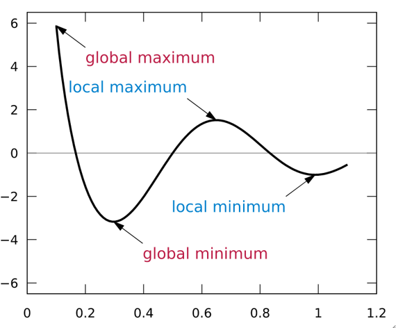
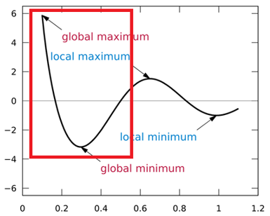
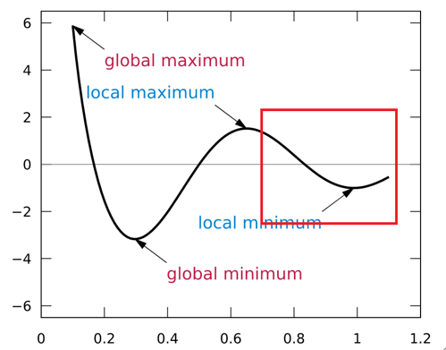

  <h1>🏃‍♀️ Machine Learning 🏃‍♂️</h1>

> 질문은 <strong>[zzsza님의 Datascience-Interview-Questions](https://github.com/zzsza/Datascience-Interview-Questions)</strong>를 참고하였습니다.

---

## Table of Contents

- [알고 있는 metric에 대해 설명해주세요. (ex. RMSE, MAE, recall, precision ...)](#1)
- [정규화를 왜 해야할까요? 정규화의 방법은 무엇이 있나요?](#2)
- [Local Minima와 Global Minima에 대해 설명해주세요.](#3)
- [차원의 저주에 대해 설명해주세요.](#4)
- [dimension reduction 기법으로 보통 어떤 것들이 있나요?](#5)
- [PCA는 차원 축소 기법이면서, 데이터 압축 기법이기도 하고, 노이즈 제거기법이기도 합니다. 왜 그런지 설명해주실 수 있나요?](#6)
- [LSA, LDA, SVD 등의 약자들이 어떤 뜻이고 서로 어떤 관계를 가지는지 설명할 수 있나요?](#7)
- [Markov Chain을 고등학생에게 설명하려면 어떤 방식이 제일 좋을까요?](#8)
- [텍스트 더미에서 주제를 추출해야 합니다. 어떤 방식으로 접근해 나가시겠나요?](#9)
- [SVM은 왜 반대로 차원을 확장시키는 방식으로 동작할까요? SVM은 왜 좋을까요?](#10)
- [다른 좋은 머신 러닝 대비, 오래된 기법인 나이브 베이즈(naive bayes)의 장점을 옹호해보세요.](#11)
- [회귀 / 분류시 알맞은 metric은 무엇일까?](#12)
- [Association Rule의 Support, Confidence, Lift에 대해 설명해주세요.](#13)
- [최적화 기법중 Newton’s Method와 Gradient Descent 방법에 대해 알고 있나요?](#14)
- [머신러닝(machine)적 접근방법과 통계(statistics)적 접근방법의 둘간에 차이에 대한 견해가 있나요?](#15)
- [인공신경망(deep learning이전의 전통적인)이 가지는 일반적인 문제점은 무엇일까요?](#16)
- [지금 나오고 있는 deep learning 계열의 혁신의 근간은 무엇이라고 생각하시나요?](#17)
- [ROC 커브에 대해 설명해주실 수 있으신가요?](#18)
- [여러분이 서버를 100대 가지고 있습니다. 이때 인공신경망보다 Random Forest를 써야하는 이유는 뭘까요?](#19)
- [K-means의 대표적 의미론적 단점은 무엇인가요? (계산량 많다는것 말고)](#20)
- [L1, L2 정규화에 대해 설명해주세요.](#21)
- [Cross Validation은 무엇이고 어떻게 해야하나요?](#22)
- [XGBoost을 아시나요? 왜 이 모델이 캐글에서 유명할까요?](#23)
- [앙상블 방법엔 어떤 것들이 있나요?](#24)
- [feature vector란 무엇일까요?](#25)
- [좋은 모델의 정의는 무엇일까요?](#26)
- [50개의 작은 의사결정 나무는 큰 의사결정 나무보다 괜찮을까요? 왜 그렇게 생각하나요?](#27)
- [스팸 필터에 로지스틱 리그레션을 많이 사용하는 이유는 무엇일까요?](#28)
- [OLS(ordinary least squre) regression의 공식은 무엇인가요?](#29)

---

## #1

#### 알고 있는 metric에 대해 설명해주세요. (ex. RMSE, MAE, recall, precision ...)

week4 민규님

## #2

#### 정규화를 왜 해야할까요? 정규화의 방법은 무엇이 있나요?

normalization, regularization, standardization. 세 용어가 모두 정규화로 번역됩니다. 여기서는 normalization을 집고 넘고 넘어가겠습니다.

#### Normalization

ML 알고리즘의 목적 중 하나는  feature들을 비교하여 데이터의 패턴을 찾는 것입니다. 하지만 feature의 scale이 심하게 차이나는 경우 문제가 발생합니다. 그래서 **모든 데이터가 동일한 정도의 sclae(중요도)로 반영되도록 해주는 게 normalization의 목표**입니다.

1. **Min - Max normalization**

   

     
   

   - 최소값과 최대값을 이용해 값의 범위를 0~1 사이 값으로 바꿉니다.
   - 하지만 outlier(이상치)에 너무 많은 영향을 받습니다.

2. **Z-score normalization**

   

     
   

   - standartdization을 활용해 outlier 문제를 어느정도 해결합니다.
   - 하지만 동일한 척도로 정규화된 데이터를 생성하지 않는다는 문제가 있습니다.

##### References

- [정규화 : normalization, standardization, regularization](https://realblack0.github.io/2020/03/29/normalization-standardization-regularization.html)
- [normalization 쉽게 이해하기](https://hleecaster.com/ml-normalization-concept/)

## #3

#### Local Minima와 Global Minima에 대해 설명해주세요.

오차를 줄이기 위해 경사하강법을 이용하는데, 이는 오차를 계산하는 함수의 최소값을 찾기 위함이다. 이 때 경사하강법은 초기화된 위치에서부터 기울기를 구해 더 아래로 아래로 내려가려 한다. 

이구간에서 최소값을 찾기위해 아래로 내려간다면 global minima에 도달하겠지만

이부분에서 내려간다면 localminimum에 빠져 gradient가 0이 되어도, 오차를 최대로 줄일 수 없다.

##### References

- [Wikipedia](https://en.wikipedia.org/wiki/Maxima_and_minima)

## #4

#### 차원의 저주에 대해 설명해주세요.

week4 재현님

## #5

#### dimension reduction기법으로 보통 어떤 것들이 있나요?

week4 민규님

## #6

#### PCA는 차원 축소 기법이면서, 데이터 압축 기법이기도 하고, 노이즈 제거기법이기도 합니다. 왜 그런지 설명해주실 수 있나요?

PCA(Pricipal Component Analysis: 주성분 분석)는 고차원의 데이터를, 데이터들의 분산을 잘 유지하는 주성분(데이터들의 선형결합으로 이뤄짐)들을 구하고, 이 주성분을 이용해 저차원으로 데이터들을 표현하는 방법이다. 여기서 주성분들은 서로 직교한다.

주성분 분석은 기존의 고차원 데이터들을, 더 적은 차원의 주성분으로 데이터를 표현하므로 차원 축소 기법이라 할 수 있다. 주성분을 구할 때 데이터의 기존의 분산을 전체 다 이용하는 것이 아닌 분산을 설명하는 정도가 큰 몇개의 주성분만을 이용하므로 데이터를 압축한다고 할 수 있고, 이 과정에서 어느정도의 분산이 제거되므로 노이즈가 감소할 수 있다.

 

##### References

- [공돌이의 수학 노트 PCA](https://angeloyeo.github.io/2019/07/27/PCA.html)
- [주성분분석(PCA)의 이해와 활용-다크 프로그래머 블로그](https://darkpgmr.tistory.com/110)
- [PCA Eliminate noise in the data - stackExchange](https://stats.stackexchange.com/questions/247260/principal-component-analysis-eliminate-noise-in-the-data/247271)

