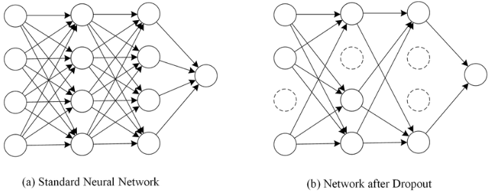

  <h1>🏃‍♀️ Machine Learning 🏃‍♂️</h1>

> 질문은 <strong>[zzsza님의 Datascience-Interview-Questions](https://github.com/zzsza/Datascience-Interview-Questions)</strong>를 참고하였습니다.

---

## Table of Contents

- [딥러닝은 무엇인가요? 딥러닝과 머신러닝의 차이는?](#1)
- [Cost Function과 Activation Function은 무엇인가요?](#2)
- [Tensorflow, PyTorch 특징과 차이가 뭘까요?](#3)
- [Data Normalization은 무엇이고 왜 필요한가요?](#4)
- [알고있는 Activation Function에 대해 알려주세요. (Sigmoid, ReLU, LeakyReLU, Tanh 등)](#5)
- [오버피팅일 경우 어떻게 대처해야 할까요?](#6)
- [하이퍼 파라미터는 무엇인가요?](#7)
- [Weight Initialization 방법에 대해 말해주세요. 그리고 무엇을 많이 사용하나요?](#8)
- [볼츠만 머신은 무엇인가요?](#9)
- [TF, PyTorch 등을 사용할 때 디버깅 노하우는?](#10)
- [뉴럴넷의 가장 큰 단점은 무엇인가? 이를 위해 나온 One-Shot Learning은 무엇인가?](#11)
- [요즘 Sigmoid 보다 ReLU를 많이 쓰는데 그 이유는?](#12)
  - [Non-Linearity라는 말의 의미와 그 필요성은?](#12-1)
  - [ReLU로 어떻게 곡선 함수를 근사하나?](#12-2)
  - [ReLU의 문제점은?](#12-3)
  - [Bias는 왜 있는걸까?](#12-4)
- [Gradient Descent에 대해서 쉽게 설명한다면?](#13)
  - [왜 꼭 Gradient를 써야 할까? 그 그래프에서 가로축과 세로축 각각은 무엇인가? 실제 상황에서는 그 그래프가 어떻게 그려질까?](#13-1)
  - [GD 중에 때때로 Loss가 증가하는 이유는?](#13-2)
  - [Back Propagation에 대해서 쉽게 설명 한다면?](#13-3)
- [Local Minima 문제에도 불구하고 딥러닝이 잘 되는 이유는?](#14)
  - [GD가 Local Minima 문제를 피하는 방법은?](#14-1)
  - [찾은 해가 Global Minimum인지 아닌지 알 수 있는 방법은?](#14-2)
- [Training 세트와 Test 세트를 분리하는 이유는?](#15)
  - [Validation 세트가 따로 있는 이유는?](#15-1)
  - [Test 세트가 오염되었다는 말의 뜻은?](#15-2)
  - [Regularization이란 무엇인가?](#15-3)
- [Batch Normalization의 효과는?](#16)
  - [Dropout의 효과는?](#16-1)
  - [BN 적용해서 학습 이후 실제 사용시에 주의할 점은? 코드로는?](#16-2)
  - [GAN에서 Generator 쪽에도 BN을 적용해도 될까?](#16-3)
- [SGD, RMSprop, Adam에 대해서 아는대로 설명한다면?](#17)
  - [SGD에서 Stochastic의 의미는?](#17-1)
  - [미니배치를 작게 할때의 장단점은?](#17-2)
  - [모멘텀의 수식을 적어 본다면?](#17-3)
- [간단한 MNIST 분류기를 MLP+CPU 버전으로 numpy로 만든다면 몇줄일까?](#18)
  - [어느 정도 돌아가는 녀석을 작성하기까지 몇시간 정도 걸릴까?](#18-1)
  - [Back Propagation은 몇줄인가?](#18-2)
  - [CNN으로 바꾼다면 얼마나 추가될까?](#18-3)
- [간단한 MNIST 분류기를 TF, PyTorch 등으로 작성하는데 몇시간이 필요한가?](#19)
  - [CNN이 아닌 MLP로 해도 잘 될까?](#19-1)
  - [마지막 레이어 부분에 대해서 설명 한다면?](#19-2)
  - [학습은 BCE loss로 하되 상황을 MSE loss로 보고 싶다면?](#19-3)
- [딥러닝할 때 GPU를 쓰면 좋은 이유는?](#20)
  - [GPU를 두개 다 쓰고 싶다. 방법은?](#20-1)
  - [학습시 필요한 GPU 메모리는 어떻게 계산하는가?](#20-2)

---

## #1

### 질문

내용

##### References

- [제목](링크)

## #2

### Cost Function과 Activation Function은 무엇인가요?

#### **1) Cost Function**

**Cost Function**은 label와 prediction의 차이, 즉 loss의 평균을 다루는 함수입니다. loss가 가장 적을 때의 parameter를 정하기 위해 사용합니다. 대표적으로 MSE, Cross-Entropy가 있죠.

Cost Function과 관련 깊은 함수들은 loss function, objective function에 대해서도 정리해보겠습니다.

  - **Loss Fuction**은 label과 prediction의 차이(loss)를 single data set에서 다룹니다.

  - **Cost Function**은 entire data set을 다루죠.

  - **Objective function**은 cost의 best value를 구하는 함수입니다. obtimizer가 이에 해당합니다.

그러면 세 함수가 미묘하게 다르며, 순서대로 포함관계를 갖게 됩니다.

**TMI) label과 Ground-Truth의 차이**

둘 다 정답을 의미해 통용할 줄 알았는데 다르더라구요.

  - **label**은 답이 명확하게 정해져 있는 값이라고 생각하면 됩니다. 그래서 일반적인 정답을 의미하고 싶을 땐 label을 쓰면 됩니다.

  - **Ground-Truth**는 G.T라고 줄여서 말하곤 합니다. '우리가 정한 정답', '모델이 우리가 원하는 답으로 예측해주길 바라는 답'입니다. 영화 cats에서 고양이 분장을 한 사진을 생각해보면, 고양인지 사람인지 정답이 없는 상황입니다. 하지만 모델이 고양이로 분류하길 원한다면 G.T값은 '고양이'가 됩니다.

   

     
   

#### **2) Activation Function**

**Activation Function**은 입력신호를 출력신호로 변환하는 함수입니다. 인공신경망에서 전달하는 신호의 세기를 정한다고 생각하면 됩니다. activation function은 sigmoid, tanh, relu 등이 있으며 각자 다른 특징을 갖고 있습니다.

   

     
   

#### why use activation function?

input layer value(또는 이전 hidden layer value)와 weight은 linear관계로 이어집니다. 하지만 우리가 다룰 다양한 사회적 문제는 복잡한 non-linear관계를 갖습니다. Activation Function은 선형모델을 비선형모델로 만들어줌으로써 모델이 문제를 더욱 잘 표현하도록 합니다.

##### References

- [model과 cost function](https://mangkyu.tistory.com/33)
- [cost function, loss function, objective function](https://ganghee-lee.tistory.com/28)
- [label과 ground trouth](https://mac-user-guide.tistory.com/m/14?category=882578)
- [activation function](https://pozalabs.github.io/Activation_Function/)
- [activation function을 사용하는 이유](https://ganghee-lee.tistory.com/30)

## #4

### Data Normalization은 무엇이고 왜 필요한가요?

데이터를 조작하여 원하는 범위로 제한하는 것.

모든 데이터가 같은 정도의 중요도로 반영되도록 해주기 위하여.

학습을 더 빨리하고 Local minumum에 빠지는 위험을 줄이기 위하여.

   

     
   

##### References

- [정규화의 목적과 방법들]([정규화(Normalization)의 목적과 방법들 (tistory.com)](https://mole-starseeker.tistory.com/31))

- [정규화 설명]([딥러닝 용어 정리, Normalization(정규화) 설명 (tistory.com)](https://light-tree.tistory.com/132))

  

## #5

### 알고있는 Activation Function에 대해 알려주세요. (Sigmoid, ReLU, LeakyReLU, Tanh 등)
#### 1. sigmoid
   

     
   

- 특징
  - 출력 값이 0 ~ 1
  - ReLU 이전, 가장 많이 사용 되던 active function
- 단점
  - saturation(포화)
    - 너무 크거나, 너무 작으면 0에 가까워지는 문제가 발생.
    - vanishing gradient 문제로 이어짐
  - not zero centered
    - gradient w가 비효율적으로 최적해를 탐색
#### 2. tanh
   

     
   

- 특징
  - 출력 값은 -1 ~ 1
  - zero centered
- 단점
  - 여전히 gradient saturation 되는 구간이 있음
#### 3. ReLU
   

     
   

- 특징
  - 양의 값에서 saturated 되지 않음
  - 계산 효율이 빠름 : 미분이 편하니까! sigmoid / tanh보다 6배정도
  - 생물학적 타당성도 가장 높음 : 약간 dropout느낌
- 단점
  - non zero centered
  - 음수 영역에서 saturated
  - dying ReLU
    - 음수 영역에서 모두 0이 되기 때문에 node들이 학습이 되지 않는 현상
    - 이를 해결하기 위해 Leaky ReLU, Parametric ReLU, Exponential LU 등이 나옴

그 외에
 - swish(x) = x * sigmoid(x)
 - mish(x) = x * tanh(ln(1+exp(x)))

 라는 최신(2018년 쯤 나온 듯) activation function도 있답니다! research paper 참조!

##### References

- [cs231n를 참고한 activation functions](https://deepinsight.tistory.com/113)
- [MS engineer가 알려주는 activation functions](https://towardsdatascience.com/everything-you-need-to-know-about-activation-functions-in-deep-learning-models-84ba9f82c253)
- [research paper about activation function - publish in 2018](https://arxiv.org/abs/1811.03378)
- [ReLU 계열 activation function 시각화 설명](https://github.com/jaejunlee96/AIFFEL-Project/blob/master/Fundamental/FD23_Activation_Function.ipynb)
- [swish, mish](https://krutikabapat.github.io/Swish-Vs-Mish-Latest-Activation-Functions/)

## #6

### 오버피팅일 경우 어떻게 대처해야 할까요?

학습 데이터에 모델이 과적합되는 현상은 모델의 성능을 떨어지게 하는 주요 이슈입니다. 특히 새로운 데이터가 입력으로 주어졌을 때 매우 취약한 모습을 보입니다. 이는 모델이 학습 데이터에 대해 과도하게 학습되어 새로운 데이터를 잘 못 맞추는 상태를 말합니다. 지금부터 오버비팅을 해결하기 위한 몇 가지 방법을 알아보겠습니다.

#### 1. 데이터 양 늘리기

데이터의 양이 적을 때 오버피팅이 자주 발생하는 데, 이는 적은 데이터가 모델에 반복적으로 학습되면서 일정한 패턴이 모델에 학습되기 때문입니다. 따라서 데이터의 양이 많다면 무수히 많은 패턴을 학습할 수 있기 때문에 오버피팅이 발생할 확률이 낮아집니다. 

하지만 대규모의 데이터를 수집하거나 구매하는 것은 현실적으로 어렵습니다. 데이터의 양이 적을 때는 의도적으로 기존의 데이터를 조금씩 변형하고 추가하여 데이터의 양을 늘리기도 하는데 이를 데이터 증식 또는 Data Augmentation이라고 합니다. 이미지의 경우에는 Data Augmentation이 많이 사용되는데 이미지를 돌리거나 노이즈를 추가하고, 일부분을 수정하는 등으로 데이터를 증식시킵니다.

#### 2. Regularization

- L1 regularization
- L2 regularization

L1 regularization은 기존의 비용 함수에 모든 가중치에 대해서 를 더 한 값을 비용 함수로 하고, L2 regularization은 기존 비용함수에 모든 가중치에 대해서 를 더 한 값을 비용 함수로 합니다. 는 규제의 강도를 정하는 하이퍼파라미터입니다. 가 크다면 모델이 훈련 데이터에 대해서 적합한 매개 변수를 찾는 것보다 규제를 위해 추가된 항들을 작게 유지하는 것을 우선한다는 의미가 됩니다.

L1 regularization

L2 regularization

#### 3. Dropout

드롭아웃은 학습 과정에서 신경망의 일부를 사용하지 않는 방법입니다. 예를 들어 드롭아웃의 비율을 0.5로 한다면 학습 과정마다 랜덤으로 절반의 뉴런을 사용하지 않고, 절반의 뉴런만을 사용합니다.

#### 4. Early stopping

training loss는 계속 낮아지더라도 validation loss는 올라가는 시점을 overfitting으로 간주하여 학습을 종료하는 방법

#### 5. Label smoothing

모델이 Ground Truth를 정확하게 예측하지 않아도 되게 만들어 주어 정확하지 않은 학습 데이터셋에 치중되는 경향을 막아주는 방법. 쉽게 말하자면, 원래 0과 1이었던 레이블을 0.1 or 0.9로 만들어주는 기법입니다.

#### 6. Batch normalization

활성화 함수의 활성화값 또는 출력값을 정규화하는 방법. 각 hidden layer에서 정규화를 하면서 입력분포가 일정하게 되고, 이에 따라 Learning rate을 크게 설정해도 괜찮아진다. 결과적으로 학습속도가 빨라지게 된다.

#### 7. Noise robustness

노이즈가 낀 데이터가 들어와도 잘 맞출 수 있는 모델을 구축하기 위해 학습단에서 의도적으로 학습데이터에 노이즈를 씌우는 기법. 

##### Reference

- [딥러닝 용어 정리](https://light-tree.tistory.com/125)
- [위키독스](https://wikidocs.net/61374)
- [데이터 분석하는 문과생, 싸코](https://sacko.tistory.com/44)
- [BN Image](http://sanghyukchun.github.io/88/)