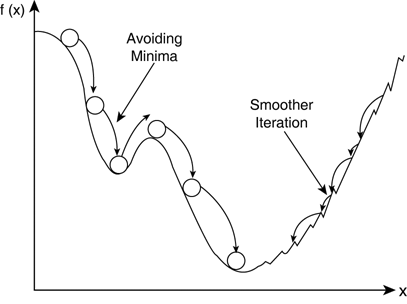

<div align='center'>
  <h1>🏃‍♀️ Machine Learning 🏃‍♂️</h1>

</div>

> 질문은 <strong>[zzsza님의 Datascience-Interview-Questions](https://github.com/zzsza/Datascience-Interview-Questions)</strong>를 참고하였습니다.

---

## Table of Contents

- [딥러닝은 무엇인가요? 딥러닝과 머신러닝의 차이는?](#1)
- [Cost Function과 Activation Function은 무엇인가요?](#2)
- [Tensorflow, PyTorch 특징과 차이가 뭘까요?](#3)
- [Data Normalization은 무엇이고 왜 필요한가요?](#4)
- [알고있는 Activation Function에 대해 알려주세요. (Sigmoid, ReLU, LeakyReLU, Tanh 등)](#5)
- [오버피팅일 경우 어떻게 대처해야 할까요?](#6)
- [하이퍼 파라미터는 무엇인가요?](#7)
- [Weight Initialization 방법에 대해 말해주세요. 그리고 무엇을 많이 사용하나요?](#8)
- [볼츠만 머신은 무엇인가요?](#9)
- [TF, PyTorch 등을 사용할 때 디버깅 노하우는?](#10)
- [뉴럴넷의 가장 큰 단점은 무엇인가? 이를 위해 나온 One-Shot Learning은 무엇인가?](#11)
- [요즘 Sigmoid 보다 ReLU를 많이 쓰는데 그 이유는?](#12)
  - [Non-Linearity라는 말의 의미와 그 필요성은?](#12-1)
  - [ReLU로 어떻게 곡선 함수를 근사하나?](#12-2)
  - [ReLU의 문제점은?](#12-3)
  - [Bias는 왜 있는걸까?](#12-4)
- [Gradient Descent에 대해서 쉽게 설명한다면?](#13)
  - [왜 꼭 Gradient를 써야 할까? 그 그래프에서 가로축과 세로축 각각은 무엇인가? 실제 상황에서는 그 그래프가 어떻게 그려질까?](#13-1)
  - [GD 중에 때때로 Loss가 증가하는 이유는?](#13-2)
  - [Back Propagation에 대해서 쉽게 설명 한다면?](#13-3)
- [Local Minima 문제에도 불구하고 딥러닝이 잘 되는 이유는?](#14)
  - [GD가 Local Minima 문제를 피하는 방법은?](#14-1)
  - [찾은 해가 Global Minimum인지 아닌지 알 수 있는 방법은?](#14-2)
- [Training 세트와 Test 세트를 분리하는 이유는?](#15)
  - [Validation 세트가 따로 있는 이유는?](#15-1)
  - [Test 세트가 오염되었다는 말의 뜻은?](#15-2)
  - [Regularization이란 무엇인가?](#15-3)
- [Batch Normalization의 효과는?](#16)
  - [Dropout의 효과는?](#16-1)
  - [BN 적용해서 학습 이후 실제 사용시에 주의할 점은? 코드로는?](#16-2)
  - [GAN에서 Generator 쪽에도 BN을 적용해도 될까?](#16-3)
- [SGD, RMSprop, Adam에 대해서 아는대로 설명한다면?](#17)
  - [SGD에서 Stochastic의 의미는?](#17-1)
  - [미니배치를 작게 할때의 장단점은?](#17-2)
  - [모멘텀의 수식을 적어 본다면?](#17-3)
- [간단한 MNIST 분류기를 MLP+CPU 버전으로 numpy로 만든다면 몇줄일까?](#18)
  - [어느 정도 돌아가는 녀석을 작성하기까지 몇시간 정도 걸릴까?](#18-1)
  - [Back Propagation은 몇줄인가?](#18-2)
  - [CNN으로 바꾼다면 얼마나 추가될까?](#18-3)
- [간단한 MNIST 분류기를 TF, PyTorch 등으로 작성하는데 몇시간이 필요한가?](#19)
  - [CNN이 아닌 MLP로 해도 잘 될까?](#19-1)
  - [마지막 레이어 부분에 대해서 설명 한다면?](#19-2)
  - [학습은 BCE loss로 하되 상황을 MSE loss로 보고 싶다면?](#19-3)
- [딥러닝할 때 GPU를 쓰면 좋은 이유는?](#20)
  - [GPU를 두개 다 쓰고 싶다. 방법은?](#20-1)
  - [학습시 필요한 GPU 메모리는 어떻게 계산하는가?](#20-2)

---


## #1

### 딥러닝은 무엇인가요? 딥러닝과 머신러닝의 차이는?


#### 1) 딥러닝

- 딥러닝, 즉 심층 학습은 머신러닝에 포함되는 개념으로 "분류를 통한 예측" 을 핵심으로 작동
- 뇌의 뉴런과 유사한 정보 입출력 계층을 활용해 데이터를 학습

#### 2) 머신러닝 

- 머신러닝, 즉 기계학습은 주어진 데이터로 부터 프로그램이 스스로 학습. 
- Learning이라는 단어에서 알 수 있듯, 데이터를 처리하는 것보다는 학습 자체에 중점

#### 3) 예시를 통한 딥러닝과 머신러닝의 차이 - Cat vs. Dog


머신러닝으로 개인지 고양이인지 구분하는 Task 를 예로들면

이를 머신러닝으로 풀경우 동물이 수염이 있는지 없는, 귀가 있는지 없는지, 만일 있다면 솟아있는지 등을 확인 할 것이다. 정리하자면 우리는 시스템으로 feature 중 무엇이 특정 동물을 더 장 묘사하는지 구분할 것이다.

딥러닝은 여기서 한 스텝 더 나아가 분류에 있어 중요한 feature를 자동으로 골라낸다. (머신러닝은 수동적으로 중요한 feature를 제공해야하는 반면)


##### References

- [인공지능 / 머신러닝과 딥러닝의 차이점](https://truman.tistory.com/146)
- [머신러닝(Machine Learning)과 딥러닝(Deep Learning)의 차이.](https://pro-jy.tistory.com/21)
- [추천⭐️ : 딥러닝, 머신러닝의 차이점은?](https://brunch.co.kr/@itschloe1/8)

## #2

### Cost Function과 Activation Function은 무엇인가요?

#### **1) Cost Function**

**Cost Function**은 label와 prediction의 차이, 즉 loss의 평균을 다루는 함수입니다. loss가 가장 적을 때의 parameter를 정하기 위해 사용합니다. 대표적으로 MSE, Cross-Entropy가 있죠.

Cost Function과 관련 깊은 함수들은 loss function, objective function에 대해서도 정리해보겠습니다.

  - **Loss Fuction**은 label과 prediction의 차이(loss)를 single data set에서 다룹니다.

  - **Cost Function**은 entire data set을 다루죠.

  - **Objective function**은 cost의 best value를 구하는 함수입니다. obtimizer가 이에 해당합니다.

그러면 세 함수가 미묘하게 다르며, 순서대로 포함관계를 갖게 됩니다.

**TMI) label과 Ground-Truth의 차이**

둘 다 정답을 의미해 통용할 줄 알았는데 다르더라구요.

  - **label**은 답이 명확하게 정해져 있는 값이라고 생각하면 됩니다. 그래서 일반적인 정답을 의미하고 싶을 땐 label을 쓰면 됩니다.

  - **Ground-Truth**는 G.T라고 줄여서 말하곤 합니다. '우리가 정한 정답', '모델이 우리가 원하는 답으로 예측해주길 바라는 답'입니다. 영화 cats에서 고양이 분장을 한 사진을 생각해보면, 고양인지 사람인지 정답이 없는 상황입니다. 하지만 모델이 고양이로 분류하길 원한다면 G.T값은 '고양이'가 됩니다.

   <div align='center'>
     
   </div>

#### **2) Activation Function**

**Activation Function**은 입력신호를 출력신호로 변환하는 함수입니다. 인공신경망에서 전달하는 신호의 세기를 정한다고 생각하면 됩니다. activation function은 sigmoid, tanh, relu 등이 있으며 각자 다른 특징을 갖고 있습니다.

   <div align='center'>
     
   </div>

#### why use activation function?

input layer value(또는 이전 hidden layer value)와 weight은 linear관계로 이어집니다. 하지만 우리가 다룰 다양한 사회적 문제는 복잡한 non-linear관계를 갖습니다. Activation Function은 선형모델을 비선형모델로 만들어줌으로써 모델이 문제를 더욱 잘 표현하도록 합니다.

##### References

- [model과 cost function](https://mangkyu.tistory.com/33)
- [cost function, loss function, objective function](https://ganghee-lee.tistory.com/28)
- [label과 ground trouth](https://mac-user-guide.tistory.com/m/14?category=882578)
- [activation function](https://pozalabs.github.io/Activation_Function/)
- [activation function을 사용하는 이유](https://ganghee-lee.tistory.com/30)


## #3

### Tensorflow, PyTorch 특징과 차이가 뭘까요?


#### PyTorch

PyTorch는 Facebook AI Research Lab에서 **연구 목적**으로 개발한 라이브러리입니다. 호환되는 언어로 C++, Python이 있습니다. 초기엔 커뮤니티가 비교적 작았지만 폭발적으로 상승하여 학회 논문 자료에서는 Tensorflow를 추월한 상태입니다. PyTorch로 많은 연구 분야의 유저의 이동이 있었던 이유는 **동적 그래프 사용**이 가능한 점이 크게 작용했습니다. 동적 그래프를 통해 실시간으로 데이터를 바꿔 넣어 비교가 가능했기 때문에 RNN, CNN, GAN 연구에 유리 했기 때문입니다. 또한 코드가 Tensorflow에 비해 난이도가 상대적으로 쉽기 때문에 크게 성장했습니다.

#### Tensorflow

Tensorflow는 Google Brain Team이 연구와 **제품 개발을 목적**으로 만들었으며 호환 언어로는 C++, Python, JavaScript, Swift 등이 있습니다. 1.x, 2.x 버전을 거쳐 Stable 2.4 버전까지 출시한 상태입니다. 1.x 와 2.x 버전의 차이점으로는 Session 사용이 거의 불필요해졌으며 선언 최소화 및 Keras가 내재화 되었습니다. 또한 Function화를 통한 속도 개선이 있었습니다. 그 이외에도 Tensorflow-Lite – 모바일/임베딩 지원, TensorflowJS – 브라우저, Node.js 지원 등 많은 변경점들이 있습니다. 하지만 이러한 변화가 기존에 사용했던 사용자의 코드를 변경해야 하는 불편함을 초래했습니다. 물론 변환 하는 모듈을 지원했지만 버그 또한 존재했기 때문에 많은 사용자의 이탈이 있기도 했습니다.


Tensorflow는 여전히 동적 그래프 구성이 비교적 어려우며 디버깅 또한 학습이 필요합니다. PyTorch는 아직 공개 되어 있는 소스가 적고 다른 환경의 지원도 어려우며 배포가 어렵고 무엇보다 산업에서 요구하는 다양한 제약 사항을 맞추기 어렵습니다.

**Tensorflow** – 상품 구축 목적. Browser, Node.js, Embeded, Mobile 환경 지원. 배포 용이. NLP 등.

**Pytorch** – 연구 목적. Python에 익숙한 환경. 비교적 낮은 난이도. RNN, CNN, GAN 등.


##### References

- [Tensorflow vs Pytorch](https://smilegate.ai/2021/07/05/tensorflow-vs-pytorch/)

## #4

### Data Normalization은 무엇이고 왜 필요한가요?

데이터를 조작하여 원하는 범위로 제한하는 것.

모든 데이터가 같은 정도의 중요도로 반영되도록 해주기 위하여.

학습을 더 빨리하고 Local minumum에 빠지는 위험을 줄이기 위하여.

   <div align='center'>
     
   </div>


##### References

- [정규화의 목적과 방법들](https://mole-starseeker.tistory.com/31)

- [정규화 설명](https://light-tree.tistory.com/132)

  

## #5

### 알고있는 Activation Function에 대해 알려주세요. (Sigmoid, ReLU, LeakyReLU, Tanh 등)
#### 1. sigmoid
   <div align='center'>
     
   </div>

- 특징
  - 출력 값이 0 ~ 1
  - ReLU 이전, 가장 많이 사용 되던 active function
- 단점
  - saturation(포화)
    - 너무 크거나, 너무 작으면 0에 가까워지는 문제가 발생.
    - vanishing gradient 문제로 이어짐
  - not zero centered
    - gradient w가 비효율적으로 최적해를 탐색
#### 2. tanh
   <div align='center'>
     
   </div>

- 특징
  - 출력 값은 -1 ~ 1
  - zero centered
- 단점
  - 여전히 gradient saturation 되는 구간이 있음
#### 3. ReLU
   <div align='center'>
     
   </div>

- 특징
  - 양의 값에서 saturated 되지 않음
  - 계산 효율이 빠름 : 미분이 편하니까! sigmoid / tanh보다 6배정도
  - 생물학적 타당성도 가장 높음 : 약간 dropout느낌
- 단점
  - non zero centered
  - 음수 영역에서 saturated
  - dying ReLU
    - 음수 영역에서 모두 0이 되기 때문에 node들이 학습이 되지 않는 현상
    - 이를 해결하기 위해 Leaky ReLU, Parametric ReLU, Exponential LU 등이 나옴

그 외에
 - swish(x) = x * sigmoid(x)
 - mish(x) = x * tanh(ln(1+exp(x)))

 라는 최신(2018년 쯤 나온 듯) activation function도 있답니다! research paper 참조!

##### References

- [cs231n를 참고한 activation functions](https://deepinsight.tistory.com/113)
- [MS engineer가 알려주는 activation functions](https://towardsdatascience.com/everything-you-need-to-know-about-activation-functions-in-deep-learning-models-84ba9f82c253)
- [research paper about activation function - publish in 2018](https://arxiv.org/abs/1811.03378)
- [ReLU 계열 activation function 시각화 설명](https://github.com/jaejunlee96/AIFFEL-Project/blob/master/Fundamental/FD23_Activation_Function.ipynb)
- [swish, mish](https://krutikabapat.github.io/Swish-Vs-Mish-Latest-Activation-Functions/)

## #6

### 오버피팅일 경우 어떻게 대처해야 할까요?

학습 데이터에 모델이 과적합되는 현상은 모델의 성능을 떨어지게 하는 주요 이슈입니다. 특히 새로운 데이터가 입력으로 주어졌을 때 매우 취약한 모습을 보입니다. 이는 모델이 학습 데이터에 대해 과도하게 학습되어 새로운 데이터를 잘 못 맞추는 상태를 말합니다. 지금부터 오버비팅을 해결하기 위한 몇 가지 방법을 알아보겠습니다.

#### 1. 데이터 양 늘리기

데이터의 양이 적을 때 오버피팅이 자주 발생하는 데, 이는 적은 데이터가 모델에 반복적으로 학습되면서 일정한 패턴이 모델에 학습되기 때문입니다. 따라서 데이터의 양이 많다면 무수히 많은 패턴을 학습할 수 있기 때문에 오버피팅이 발생할 확률이 낮아집니다. 

하지만 대규모의 데이터를 수집하거나 구매하는 것은 현실적으로 어렵습니다. 데이터의 양이 적을 때는 의도적으로 기존의 데이터를 조금씩 변형하고 추가하여 데이터의 양을 늘리기도 하는데 이를 데이터 증식 또는 Data Augmentation이라고 합니다. 이미지의 경우에는 Data Augmentation이 많이 사용되는데 이미지를 돌리거나 노이즈를 추가하고, 일부분을 수정하는 등으로 데이터를 증식시킵니다.

#### 2. Regularization

- L1 regularization
- L2 regularization

L1 regularization은 기존의 비용 함수에 모든 가중치에 대해서 를 더 한 값을 비용 함수로 하고, L2 regularization은 기존 비용함수에 모든 가중치에 대해서 를 더 한 값을 비용 함수로 합니다. 는 규제의 강도를 정하는 하이퍼파라미터입니다. 가 크다면 모델이 훈련 데이터에 대해서 적합한 매개 변수를 찾는 것보다 규제를 위해 추가된 항들을 작게 유지하는 것을 우선한다는 의미가 됩니다.

L1 regularization


L2 regularization


#### 3. Dropout

드롭아웃은 학습 과정에서 신경망의 일부를 사용하지 않는 방법입니다. 예를 들어 드롭아웃의 비율을 0.5로 한다면 학습 과정마다 랜덤으로 절반의 뉴런을 사용하지 않고, 절반의 뉴런만을 사용합니다.


#### 4. Early stopping

training loss는 계속 낮아지더라도 validation loss는 올라가는 시점을 overfitting으로 간주하여 학습을 종료하는 방법


#### 5. Label smoothing

모델이 Ground Truth를 정확하게 예측하지 않아도 되게 만들어 주어 정확하지 않은 학습 데이터셋에 치중되는 경향을 막아주는 방법. 쉽게 말하자면, 원래 0과 1이었던 레이블을 0.1 or 0.9로 만들어주는 기법입니다.


#### 6. Batch normalization

활성화 함수의 활성화값 또는 출력값을 정규화하는 방법. 각 hidden layer에서 정규화를 하면서 입력분포가 일정하게 되고, 이에 따라 Learning rate을 크게 설정해도 괜찮아진다. 결과적으로 학습속도가 빨라지게 된다.


#### 7. Noise robustness

노이즈가 낀 데이터가 들어와도 잘 맞출 수 있는 모델을 구축하기 위해 학습단에서 의도적으로 학습데이터에 노이즈를 씌우는 기법. 


##### Reference

- [딥러닝 용어 정리](https://light-tree.tistory.com/125)
- [위키독스](https://wikidocs.net/61374)
- [데이터 분석하는 문과생, 싸코](https://sacko.tistory.com/44)
- [BN Image](http://sanghyukchun.github.io/88/)


## #8

### Weight Initialization 방법에 대해 말해주세요 그리고 무엇을 많이 사용하나요?

weight Initialization은 model의 weight의 값의 초기값을 설정하는 것으로 0, 1, 상수로 초기화 하는 방법이 있고 정규분포나 유니폼 분포에서 값을 얻는 방법이 있으나 주로 사용되는 방법은  **Xavier Initialization**, **He Initialization** 방법이 쓰인다.


<sub>이미지 출처: https://eda-ai-lab.tistory.com/404</sub>

Xavier / He initialization은 정규분포에서 평균은 0 분산은 인풋 아웃풋 노드의 수를 고려한 분산 값을 설정한다.

- Sigmoid, tanh 경우 Xavier 초기화 방법이 효율적이다.
- ReLU계의 활성화 함수 사용 시 He 초기화 방법이 효율적이다.(Dying relu를 막는다.)


**그렇다면 왜 weight initialization이 중요할까?**

- 단순히 0이나 상수값으로 하면 모든 뉴런이 동일한 feature를 학습하게 되어 다른 차이를 구분하지 못하게 된다.
- weight 가 너무 작다면 vanishing gradient가 발생 반대로 weight가 너무 작다면 Vanish exploding 문제 발생
- 적절히 weight initilalization 하면 학습이 잘되더라

**왜 정규분포 이용?**

불분명함..그러나 xavier initialization 논문 참고하면 정규분포를 이용하는것이 activation 값의 분산과 gradient의 분산의 값을 절적하게 유지시켜서 학습이 잘 되더라라는듯

**He initialization Dying relu 반드시 막는다 그런것은 아닌듯**

2019년 논문(Dying ReLU and Initialization: Theory and Numerical Examples)에 따르면 꼭 그런것도 아닌듯 그래서 논문에서 새로운 방법 제시

**dying relu가 모델의 일반화 성능 해결하기도 한다?**

출처: [블로그](https://brunch.co.kr/@kdh7575070/27)

신경망이 충분히 wide한 Sparse 한 효과로 regularization 효과. 이게 출처가 안들어가져서 불확신하나 그럴 수 있을것 같다. drop-out과 비슷한 효과이지 않을까?

#### Reference

- [Deeplearning.AI: **Initializing neural networks** ](https://www.deeplearning.ai/ai-notes/initialization/)
- [Why better weight initialization is important in neural networks?](https://towardsdatascience.com/why-better-weight-initialization-is-important-in-neural-networks-ff9acf01026d)

## # 9

### 볼츠만 머신은 무엇인가요?

"우리가 보고 있는 것들 외에 보이지 않는 것들까지 포함시켜 학습한다면 좀 더 정확한 확률분포를 구할 수 있지 않을까" 라는 가정으로부터 확률분포를 학습하기 위해 만들어졌다.

   <div align='center'>
     
   </div>

##### References

- [**Restricted Boltzmann Machine**](https://angeloyeo.github.io/2020/10/02/RBM.html)
- [Deep learning](https://abipictures.tistory.com/773)
- [Wikipedia](https://en.wikipedia.org/wiki/Boltzmann_machine)
- [볼츠만 머신: 생성모형의 원리](https://horizon.kias.re.kr/18001/)


## #10

### TF, PyTorch 등을 사용할 때 디버깅 노하우는?

- 모델 체크포인트 저장

  체크포인트를 매시간 저장하면서 training해야 서버 오류가 생기가나 GPU가 터졌을 때 손상되는 데이터를 최소화 할 수 있다.

- 모듈식 프로그래밍

  디버깅 가능한 프로그램을 만드는 핵심 기술은 모듈 방식으로 애플리케이션을 구축하는 것이다. 데이터 세트 작업의 하위 집합을 적용하는 동안 데이터 세트를 반복하기만 하면 입력 파이프라인에서 다양한 기능을 테스트할 수 있다.

- 로컬 환경에서 실행

  로컬 환경에서 디버깅하는 것이 원격 시스템이나 클라우드에서 디버깅하는 것보다 쉽다. 모델을 처음 생성할 때 특히 그렇다. 원격 교육을 시작하기 전에 로컬 환경에서 가능한 한 많은 문제를 해결하는 것이 목표여야 한다. 

#### Reference

- [Debugging in TensorFlow](https://towardsdatascience.com/debugging-in-tensorflow-392b193d0b8)

## #11

### 뉴럴넷의 가장 큰 단점은 무엇인가? 이를 위해 나온 One-Shot Learning은 무엇인가?
neural network의 가장 큰 단점은 많은 dataset을 필요로 한다는 것입니다. 이러한 neural network의 학습 방식은 인간과 비교해 효율적이지 않습니다. 

소량의 데이터(few-shot)만으로 좋은 성능을 갖출 수 없을까? 라는 발상에서 진행된 연구가 **few-shot learning**입니다.

   <div align='center'>
     
   </div>

few-shot learning에서의 dataset은, 훈련에 사용되는 support data와, 테스트에 사용되는 query data로 구성됩니다. 이러한 few-shot learning은 N-way K-shot 문제라고 불립니다. N은 범주의 수, K는 범주별 support data의 수를 의미합니다. 위의 경우 2-way 5-shot에 해당합니다.

few-shot learning에는 크게 두가지 network 방식이 있습니다.
먼저 **거리 학습 기반 방식**은 support data와 query data 간의 거리(유사도)를 측정하는 방식을 활용합니다. 데이터 수가 적은 few-shot task에서는 neural network의 가중치를 학습하는 방식이 적합하지 않기 때문입니다. 거리 학습 기반 방식은 대표적으로 아래의 연구가 있습니다.
- Siamese Neural network for one-shot image recognition
- Matching networks for one-shot learning
- Prototypical networks for few-shot learning
- Learning to compare : relation network for few-shot learning

두 번째로는 **그래프 신경망 방식** 이 있습니다. 적은 양의 데이터만으로 분류 성능을 극대화하기 위해, 데이터 간 복잡한 관계 정보를 학습에 활용하는 방식입니다. 그래프에서 node는 데이터, edge는 데이터 간 관계 정보를 나타냅니다. 밀집 그래프는 모든 node가 서로 완전히 연결된 것을 의미합니다. 그래프 신경망 방식의 대표적인 연구는 아래의 방법들이 있습니다.
- Few-shot learning with graph neural networks
- Transductive propagation network for few-shot learning (TPN)

세줄요약
- 신경망 구조는 많은 데이터셋을 요규하므로 훈련 방식에 있어서 비효율적
- 데이터셋 양의 덜 의존적인 few-shot learning(한장이면 one-shot learning)에 관한 연구들이 진행중
- 대표적으로 거리 학습 기반 방식, 그래프 신경망 방식이 있음

##### Reference

- [few-shot learning](https://www.kakaobrain.com/blog/106)


## #12

### (요즘) Sigmoid 보다 ReLU를 많이 쓰는데 그 이유는?


sigmoid 함수는 값이 커질수록 기울기가 0이 되기 때문에 gradient가 소멸되는 문제가 발생한다. 하지만 relu는 값이 커져도 기울기가 상수이기 때문에 gradient가 소멸되지 않는다. 이는 학습이 빨라지는 효과를 갖고 온다. 다른 장점으로는 relu는 input값이 음수일 때 값이 0이 되므로 Sparsity representations효과를 불러오나 sigmoid같은 경우는 정확히 0은 아니기에 dense representations 효과를 나타나게 된다.

#### #12-1 Non-Linearity라는 말의 의미와 그 필요성은?

비선형(non-linearity)의 뜻을 알기 위해서는 우선 선형(linearity)가 무엇인지 알아야 한다. 어떤 모델이 선형적(linearity)라고 한다면 그 모델은 변수  [](https://render.githubusercontent.com/render/math?math=x_1%2C x_2%2C ... %2C x_n)과 가중치  [](https://render.githubusercontent.com/render/math?math=w_1%2C w_2%2C ... %2C w_n)으로  [](https://render.githubusercontent.com/render/math?math=y %3D w_1*x_1 %2B w_2*x_2 %2B ... %2B w_n*x_n)으로 표현할 수 있으며, 가산성(Additreivityly)과 동차성(Homogeneity)을 만족해야 한다.

- **가산성**: 임의의 수  [](https://render.githubusercontent.com/render/math?math=x%2C y)에 대해  [%20%3D%20f(x)%20%2B%20f(y))](https://render.githubusercontent.com/render/math?math=f(x%2By) %3D f(x) %2B f(y))가 성립
- **동차성**: 임의의 수 $x, \alpha$에 대해  [%20%3D%20%5Calpha%20f(x))](https://render.githubusercontent.com/render/math?math=f(\alpha x) %3D \alpha f(x))가 성립

이를 만족하지 못하는 모델을 비선형 관계에 있는 모델이라고 한다.

딥러닝에서 이런 비선형 관계는 비선형 활성화 함수(non-linear activation function)을 도입함으로써 표현할 수 있다. 비선형 활성화 함수가 없다면 아무리 많은 레이어를 쌓아도 단순 선형연산의 반복이기 떄문에 하나의 레이어를 쌓은것이랑은 차이가 없다. 

그럼 비선형 관계 즉, 활성화 함수가 왜 필요할까?  

바로 **활성화 함수를 사용해 여러 층을 쌓아서 더 복잡한 표현을 하기 위해서**이다. 현실의 문제들은 선형관계로 해결되지 않기 때문에 복잡한 비선형 모델을 고려해야한다.

#### #12-2 ReLU로 어떻게 곡선 함수를 근사하나?

ReLU는 양수일 때 [](https://render.githubusercontent.com/render/math?math=y%3Dx)인 선형 함수와 음수일 때 [](https://render.githubusercontent.com/render/math?math=y%3D0)인 선형 함수 두 개를 결합된 형태이다. 그렇지만 ReLU는 선형 함수가 갖는 가산성을 만족하지 못하기 때문에 비선형 함수로 볼 수 있다. 하지만 ReLU가 어떻게 곡선 함수를 근사할 수 있을까?


ReLU를 여러 개 결합하면, 특정 지점에서 특정 각도만큼 선형 함수를 구부릴 수 있다. 이 성질을 이용하여 곡선 함수 뿐만 아니라 모든 함수에 근사를 할 수 있게 된다.

#### #12-3 ReLU의 문제점은?

ReLU는 양수일때만 backporbagation이 이뤄지고 다른 경우에는 0의 값을 갖는다 이는 2가지 문제점으로 이어진다.

1) **Dead Neurons** : 입력값이 음수인경우 gradient 값이 0으로 되기 때문에 학습이 이뤄지지 않는다(Dead nurerons). 이러한 문제는 음의 기울기를 설정하여 해결하거나(leaky relu) 음수의 기울기를 parameter로 설정하여 학습하는 PRelu로 문제를 해결할 수 있습니다.
2) **Bias Shift** : relu는 주로 0이상의 값을 출력하기 때문에 positive한 방향으로 편향되는 경향이 있다. 이러한 positive mean shift는 학습을 느리게 만든다. 이러한 문제는 평균을 0으로 만들어주는 batch-normalization 이나 Elu나 Selu 같은 activation function 을 이용해 문제를 해결할 수 있다. -> [CS231n 6강 8:46](https://youtu.be/wEoyxE0GP2M?t=526)을 참고!

#### #12-4 Bias는 왜 있는걸까?


편향(bias)는 활성화 함수가 왼쪽 혹은 오른쪽으로 이동한다. 가중치(weight)는 활성화 함수의 가파른 정도 즉, 기울기를 조절하는 반면, 편향(bias)는 **활성화 함수를 움직임으로써 데이터에 더 잘 맞도록 한다.**

#### Reference

-  [12.1 sigmoid 대신 relu를 쓰는 이유 from stack overflow](https://stats.stackexchange.com/questions/126238/what-are-the-advantages-of-relu-over-sigmoid-function-in-deep-neural-networks)
-  [12.1~4 기존답변](https://github.com/boostcamp-ai-tech-4/ai-tech-interview/blob/main/answers/3-deep-learning.md#8)
-  [12.2 nonlinear activation function을 쓰는 이유 stack overflow](https://stackoverflow.com/questions/9782071/why-must-a-nonlinear-activation-function-be-used-in-a-backpropagation-neural-net)
-  [12.2 relu 작동원리 설명](https://towardsdatascience.com/if-rectified-linear-units-are-linear-how-do-they-add-nonlinearity-40247d3e4792)
-  [12.3 Disadvantage of RELU](https://www.quora.com/What-are-the-disadvantages-of-using-the-ReLu-when-using-Neural-Networks)

## # 13

### Gradient Descent에 대해서 쉽게 설명한다면?

- 왜 꼭 Gradient를 써야 할까? 그 그래프에서 가로축과 세로축 각각은 무엇인가? 실제 상황에서는 그 그래프가 어떻게 그려질까?
- GD 중에 때때로 Loss가 증가하는 이유는?
- Back Propagation에 대해서 쉽게 설명 한다면?


Gradient Descent는 함수의 기울기(즉, gradient)를 이용해 x의 값을 어디로 옮겼을 때 함수가 최소값을 찾는지 알아보는 방법이라고 할 수 있다.

기울기가 양수라는 것은 x 값이 커질 수록 함수 값이 커진다는 것을 의미하고, 반대로 기울기가 음수라면 x값이 커질 수록 함수의 값이 작아진다는 것을 의미한다고 볼 수 있다.

또, 기울기의 값이 크다는 것은 가파르다는 것을 의미하기도 하지만, 또 한편으로는 x의 위치가 최소값/최댓값에 해당되는 x 좌표로부터 멀리 떨어져있는 것을 의미하기도 한다.

#### # 13-1


위 그림은 흔히 볼 수 있는 gradient descent를 설명할 때 나오는 그래프이다. x축은 weight, y축은 cost_function output을 의미한다. 기본적인 신경망 계산의 원리는 input x가 들어왔을 때 weight와 행렬곱을 통해 output을 생성해낸다. cost_function: J(w)는 input x가 들어왔을 때 실제 y값과 예측된 y값의 차이를 미리 정의한 loss함수를 통해 구하는 것을 의미한다. 따라서 실제 y값과 예측된 y값의 차이가 최소가 되면 모델이 잘 학습이 된 것이기 때문에 loss 함수의 최소값을 구하면 되고 이는 convex한 형태의 최소값, 즉 미분값(기울기)가 0이 되는 곳을 찾으면 그곳이 최적의 weight값이 된다.

#### # 13-2

Gradient Descent 중에 때때로 Loss가 증가하는 이유는 아래 그림을 통해 알아보자.



위 함수의 모양을 보면 gradient가 0이 되는 곳이 크게 2곳이 있다. 왼쪽 부분을 local minima라고 하고 오른쪽 가장 깊은 곳을 global minima 라고 하며 local minima에서 global minima로 가기위해 gradient가 잠깐 양수가 되는 것을 알 수 있다. 이때 loss가 증가하는 것이다.

#### # 13-3

> Backpropagation computes the [gradient](https://en.wikipedia.org/wiki/Gradient) in [weight space](https://en.wikipedia.org/wiki/Parameter_space) of a feedforward neural network, with respect to a [loss function](https://en.wikipedia.org/wiki/Loss_function).

Backpropagation은 weight space에서 loss 함수에 대해 gradient를 계산하는 것이다. 쉽게 설명하자면 신경망 왼쪽에서 오른쪽으로 가는 forward propagation을 통해 Loss를 구할 수 있고, 다시 오른쪽에서 왼쪽으로 편미분 과정을 통해 미분값을 구하는 과정을 Backpropagation이라 한다. Optimizer와 헷갈릴 수 있는데 optimizer는 계산된 미분값을 더하거나 빼는 과정을 통해 가중치를 갱신하는 것이고, backpropagation은 단지 gradient, 즉 미분값을 구하는 것이다.

## #15

### Training set과 Test set을 분리하는 이유는?

**Training set과 Test set을 분리하는 이유는 정확한 성능 측정을 위해서이다**. 예컨대, 데이터가 100개가 있고 100개를 모두 학습시키면 학습된 100개의 데이터는 잘 맞출지라도 새로운 데이터에 대해 어떤 성능을 보일지 예측이 불가능하다. 따라서 통상적으로 8:2 정도로 Train과 Test set을 분리하여 80%를 학습에 사용하고 20%를 테스트에 사용하여 학습때 모델이 보지못한 새로운 데이터로 모델의 성능을 측정할 수 있다.

#### #15-1

**Validation set이 따로 있는 이유는?**

앞서 언급한 Train, Test 2가지로 데이터를 분류하는 것의 한계점도 있다. Train 데이터로 모델을 학습시키고 Test Data로 모델을 평가하여 80% 정도의 성능을 측정했다고 가정해보자. 그렇다면 hyper-parameter tuning이나 어떠한 기법을 써서 모델의 성능을 향상시키기 위한 실험을 했을 때, 또 이전에 사용했던 Test set을 사용하여 성능 측정을 하게 된다. 이렇게 되면 모델의 성능이 Test set의 성능에만 의존하게 되는 상황이 발생한다. 따라서 Test set은 최종 성능 측정에만 사용되도록 완전히 독립적으로 존재하도록 보존해야한다. 학습과정에서는 Train으로 학습, Validation Data로 성능을 측정, 이 과정을 반복하여 모델의 성능을 올리고 최종적으로 Test set으로 성능 평가가 이루어 져야 한다.

#### #15-2

**Test set이 오염되었다는 말의 뜻은?**

데이터를 수집하다보면 Test set이 Train set으로 부터 완전히 독립적인 상태가 아닌 경우가 있다. 이 것을 Test set이 오염되었다고 한다. 예컨대 마스크를 쓴 사람을 분류하는 image classification task가 주어졌다고 할 때 사람 A, B, C 각각 5장의 마스크를 쓴 사진이 있다고 하자. 

```shell
data/
	\---A
		\---1.jpg
		\---2.jpg
    \---3.jpg
    \---4.jpg
		\---5.jpg
	\---B
	\---C
```

위 구조로 데이터가 존재하고 모든 이미지를 가져와서 train set과 test set을 분리하게 되면 

```shell
train/
	\---A_1.jpg
	\---A-2.jpg
	
test/
	\---A_3.jpg
	\---A_4.jpg
```

이렇게 분류될 수가 있다. Train Data에서 학습된 A라는 사람을 test에서 보게되니 model 성능이 보다 높게 나올 가능성이 높다는 것이다. 따라서 Test set이 오염되지 않기 위해서는 아래와 같이 데이터를 분리해야 한다.

```shell
train\
	\---A_1.jpg
	\---A_2.jpg
  \---A_3.jpg
	\---A_4.jpg
	\---A_5.jpg

test\
	\---B_1.jpg
  \---B_2.jpg
	\---B_3.jpg
	\---B_4.jpg
	\---B_5.jpg
```

#### #15-3

**Regularization이란 무엇인가?**

모델이 학습 데이터에 오버피팅 되지 않게 loss값에 어떤 값을 더해주어 loss를 의도적으로 크게 만드는 기법이다. 대표적으로 L1, L2, Drop-out 과 같은 기법이 있다.

## #20

#### 딥러닝할 때 GPU를 쓰면 좋은 이유는?


**CPU**는 **복잡한 연산을 수행**하고 데이터를 **직렬(Sequential) 처리** 방식에 특화된 구조를 갖고 있고 내부 면적이 절반 이상이 캐시로 채워져 있기 때문에 GPU에 비해 상대적으로 ALU(Arithmetic logic unit)가 차지할 수 있는 공간이 더 적다. 즉 코어수가 많지 않다.

**GPU**는 **단순한 연산을 수행**하고 여러 명령을 동시에 처리하는 **병렬 처리 방식**에 특화된 구조를 갖고있다. 캐시 메모리 비중이 크지 않고 연산을 수행할 수 있는 ALU(코어) 개수가 많다. 

딥러닝은 weight를 곱하고 bias를 더하는 단순한 사칙연산이 동시에 무수히 많이 일어난다.(행렬연산) 따라서 이러한 연산을 빠르게 하기 위해서는 CPU보다는 GPU를 이용하여 학습하는것이 더 빠른 계산을 수행할 수 있다.

#### #20-1

#### GPU를 두개 다 쓰고 싶다. 방법은?

각각의 GPU에 데이터를 분산처리하여 연산을 수행하면 된다.

Pytorch의 경우 `torch.nn.DataParallel`을 사용하여 여러 개의 GPU를 사용할 수 있다. [공식문서 참조](https://pytorch.org/tutorials/intermediate/dist_tuto.html)

--------

단순히 위의 방법으로 처리할 경우 여러 문제가 생길 수 있다. 예를 들면 로스를 계산하기 위해 gradient를 첫번째 GPU에 모은다. 이경우 GPU memory 사용량에 첫 번째 GPU에 집중되는 문제가 있다. 따라서 여러개의 GPU를 효율적으로 사용하는 방법에는 여러가지 방법이 존재한다. 예로 Loss 함수도 병렬 처리 하도록 커스터마이징. 다른 예시는 아래 reference 참고


#### #20-2

#### 학습시 필요한 GPU 메모리는 어떻게 계산하는가?

GPU 메모리 사용량에 영향을 주는 요인은 여러가지가 있다. 

ex) 모델의 (trainable) parameter 수, 데이터의 사이즈(예를 들면 이미지 해상도, 문장의 길이), batch size, floating point type(FP16 or FP32), activation 함수의 수와 같은 것들이 GPU 메모리 사용량에 영향을 미친다.


#### Reference

- [CPU와 GPU 차이 블로그](https://light-tree.tistory.com/25)
- [블로그: Pytorch Multi-GPU 제대로 학습하기](https://medium.com/daangn/pytorch-multi-gpu-%ED%95%99%EC%8A%B5-%EC%A0%9C%EB%8C%80%EB%A1%9C-%ED%95%98%EA%B8%B0-27270617936b)

- [How to estimate how much GPU memory required for deep learning?](https://stackoverflow.com/questions/60934350/how-to-estimate-how-much-gpu-memory-required-for-deep-learning)

