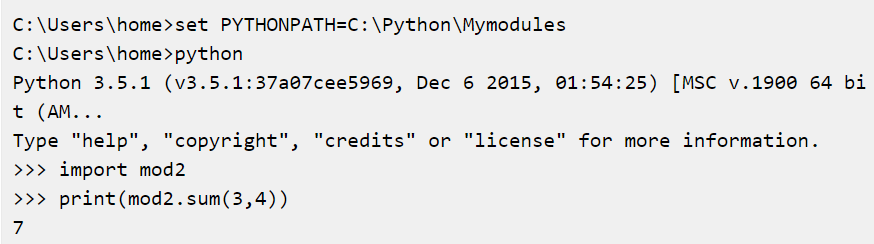
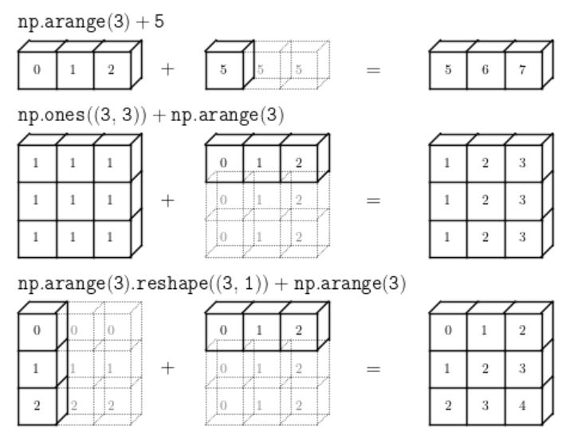

<div align='center'>
  <h1>🐍 Python Programming Language 🐍</h1>
</div>

> 질문은 <strong>[Top 100 Python Interview Questions You Must Prepare In 2021 - edureka!](https://www.edureka.co/blog/interview-questions/python-interview-questions/)</strong>을 참고하였으며, 질문에 대한 답변 중 일부는 위의 사이트의 답변을 참고하여 작성되었습니다.

## Table of Contents

- [What is the difference between list and tuples in Python?](#1)
- [What are the key features of Python?](#2)
- [What type of language is python? Programming or scripting?](#3)
- [Python an interpreted language. Explain.](#4)
- [What is pep 8?](#5)
- [How is memory managed in Python?](#6)
- [What is namespace in Python?](#7)
- [What is PYTHONPATH?](#8)
- [What are python modules? Name some commonly used built-in modules in Python?](#9)
- [What are local variables and global variables in Python?](#10)
- [Is python case sensitive?](#11)
- [What is type conversion in Python?](#12)
- [How to install Python on Windows and set path variable?](#13)
- [Is indentation required in python?](#14)
- [What is the difference between Python Arrays and lists?](#15)
- [What are functions in Python?](#16)
- [What is `__init__`?](#17)
- [What is a lambda function?](#18)
- [What is self in Python?](#19)
- [How does break, continue and pass work?](#20)
- [What does `[::-1]` do?](#21)
- [How can you randomize the items of a list in place in Python?](#22)
- [What’s the difference between iterator and iterable?](#23)
- [How can you generate random numbers in Python?](#24)
- [What is the difference between range & xrange?](#25)
- [How do you write comments in python?](#26)
- [What is pickling and unpickling?](#27)
- [What are the generators in python?](#28)
- [How will you capitalize the first letter of string?](#29)
- [How will you convert a string to all lowercase?](#30)
- [How to comment multiple lines in python?](#31)
- [What are docstrings in Python?](#32)
- [What is the purpose of is, not and in operators?](#33)
- [What is the usage of help() and dir() function in Python?](#34)
- [Whenever Python exits, why isn’t all the memory de-allocated?](#35)
- [What is a dictionary in Python?](#36)
- [How can the ternary operators be used in python?](#37)
- [What does this mean: `*args`, `**kwargs`? And why would we use it?](#38)
- [What does len() do?](#39)
- [Explain split(), sub(), subn() methods of “re” module in Python.](#40)
- [What are negative indexes and why are they used?](#41)
- [What are Python packages?](#42)
- [How can files be deleted in Python?](#43)
- [What are the built-in types of python?](#44)
- [What advantages do NumPy arrays offer over (nested) Python lists?](#45)
- [How to add values to a python array?](#46)
- [How to remove values to a python array?](#47)
- [Does Python have OOps concepts?](#48)
- [What is the difference between deep and shallow copy?](#49)
- [How is Multithreading achieved in Python?](#50)
- [What is the process of compilation and linking in python?](#51)
- [What are Python libraries? Name a few of them.](#52)
- [What is split used for?](#53)
- [How to import modules in python?](#54)
- [Explain Inheritance in Python.](#55)
- [How are classes created in Python?](#56)
- [What is monkey patching in Python?](#57)
- [Does python support multiple inheritance?](#58)
- [What is Polymorphism in Python?](#59)
- [Define encapsulation in Python?](#60)
- [How do you do data abstraction in Python?](#61)
- [Does python make use of access specifiers?](#62)
- [How to create an empty class in Python?](#63)
- [What does an object() do?](#64)
- [What is map function in Python?](#65)
- [Is python numpy better than lists?](#66)
- [What is GIL in Python language?](#67)
- [What makes the CPython different from Python?](#68)
- [What are Decorators in Python?](#69)
- [What is object interning?](#70)
- [What is @classmethod, @staticmethod, @property?](#71)

---

## #1

### What is the difference between list and tuples in Python?

- 리스트는 [], 튜플은 ()로 작성
- 리스트는 값을 수정할 수 있지만 , 튜플은 값을 변경할 수 없다.

리스트와 튜플의 가장 **큰 차이점은 값을 변경할 수 있는가의 여부**이므로, 프로그램이 실행되는 동안 **값이 변경되면 안 되는 경우 튜플**을 사용한다. 튜플은 리스트에 비해 더 적은 메모리를 필요로 하고, 속도가 빠르다.

## #2

### What are the key features of Python?

#### Features of Python

- Script Language
  - 스크립트 언어란, 컴파일 과정 없이 실행과정에서 번역과 실행이 동시에 일어나는 언어입니다.
  - 수정이 빠르지만 컴파일 언어보다 느린 실행속도를 보여줍니다.
  - 자세한건 [4번](#4)으로!
- Dynamic typing
  - 변수의 자료형을 지정하지 않고 선언하는 것만으로 사용할 수 있음
  - 개발 당시엔 편리하지만 type error debuging이 발생할 수 있음
  - 하지만 저는 전자의 편리함이 더 크다고 생각합니다 ^^
  ```c
  # C, java
  int a = 10
  ```
  ```python
  # Python
  a = 10
  ```
- platform-independent
  - linux, unix, windows, mac... 대부분 OS에서 모두 잘 동작합니다.
  - 컴파일 할 필요가 없기 때문에!
- Multi paradigm
  - 절차적, 객체지향, 함수형, 관점형 프로그래밍 모두 가능

#### Pros

- 사용하기 쉽기에 빠른 개발속도(생산성)
- 높은 확장성, 이식성
  - 고성능이 필요하다면 C/C++언어와 결합해 사용 가능
- 활발한 생태계
  - 수많은 라이브러리 존재
  - 인기가 많기 때문

#### Cons

- 느리다
  - Script Language이기 때문
- type error
  - Dynamic typing 이기 때문

#### Reference

- [파이썬(Python) 특징 및 장/단점 정리](https://velog.io/@jnine/%ED%8C%8C%EC%9D%B4%EC%8D%ACPython-%ED%8A%B9%EC%A7%95-%EB%B0%8F-%EC%9E%A5%EB%8B%A8%EC%A0%90-%EC%A0%95%EB%A6%AC)
- [python 바로 알기](https://library.gabia.com/contents/9256/)

## #3

### What type of language is python? Programming or scripting?

**파이썬 스크립트 언어이자 프로그래밍 언어이다.**

파이썬은 소스코드를 기계어로 먼저 번역하는 컴파일 과정을 거치지 않기 때문에 스크립트 언어로 볼 수 있다. 하지만 많은 사람들이 파이썬이 Java, C++과 같은 언어를 대체하여 개발에 사용될 수 있기 때문에 프로그래밍 언어라고도 한다. 프로그래밍 언어라는 말 자체가 스크립트 언어를 포함하기 때문에 파이썬도 해당된다고 생각한다.

**References**

[codingninjas](https://www.codingninjas.com/blog/2018/12/08/difference-between-a-programming-language-and-a-scripting-language/)

[ThePythonGuru](https://thepythonguru.com/is-python-a-programming-language-or-scripting-language/)

[Javatpoint](https://www.javatpoint.com/scripting-vs-programming)

## #4

### Python an interpreted language. Explain.

#### 컴파일러 vs 인터프리터

컴파일된 언어는 컴파일러를 통해 구현되며 소스 코드를 기계어로 바꾸는 과정을 사전에 처리 하여 빠르게 컴퓨터에서 구동될 수 있도록 한 방법 이며, 인터프리터 언어는 대부분 소스코드를 기계어로 컴파일하지 않고 인터프리터를 통해 소스코드 실행시 각 스테이트먼트(소스코드 구문)를 하나 이상의 서브루틴 순서로 변환한 후, 기계어나 바이트코드등 다른 언어로 변환되어 구현

<div align='center'>


</div>

## #5

### What is pep 8?

PEP8(Python Enhencement Propsals)란 가독성이 좋은 파이썬 코딩을 하고자 제시된 스타일 가이드
사람마다 각자 다른 코딩스타일이 있기에 스타일간 충돌을 피하고자 파이썬 코딩 가이드를 제시했다. from 귀도 반 로썸

example)

- Indentation(4개 공백),
- Maximul Line Length(한 줄에 최대 79자, 주석 72자)
- Whitesapece in Expressions and Statements(필요 없는 공백 제거)
- etc...(또 다른 여러 방법이 있다.)

code example)

```python
# example-1) 반환되지 않는 return 문도 None으로 리턴문을 명시해 줘야한다.
# Wrong:
def foo(x):
    if x >= 0:
        return math.sqrt(x)

# Correct:
def foo(x):
    if x >= 0:
        return math.sqrt(x)
    else:
        return None

# example-2) 객체 타입의 비교는 isinstance 이용한다 직접비교 대신에
# Correct:
if isinstance(obj, int):

# Wrong:
if type(obj) is type(1):

# example-3) Sequence(strings, lists, tuples)의 경우 빈 sequence는 false라는 사실을 이용한다.
# Correct:
if not seq:
if seq:

# Wrong:
if len(seq):
if not len(seq):

```

#### Reference

- [PEP8 공식사이트](https://www.python.org/dev/peps/pep-0008/#maximum-line-length)

## #6

### How is memory managed in Python?

CPython에서의 메모리 관리와 Garbage Collection은 두 가지 측면이 있다.

1. 레퍼런스 카운팅(Reference counting)
2. 세대별 가비지 컬렉션(Generational garbage collection)

CPython에서의 주요 garbage collection mechanism은 [reference counts](https://docs.python.org/3.6/c-api/intro.html#reference-counts) 방식이다. Python에서 객체를 만들 때마다 기본 C 객체에서는 Python 유형(list, dict 또는 function)과 reference count가 생성된다.

매우 기본적으로 Python 객체의 reference count는 객체가 참조될 대마다 증가하고 객체의 참조가 해제될 때 감소한다. 객체의 reference count가 0이 되면 객체의 메모리 할당이 해제된다.

CPython은 사이드로 세대별 가비지 컬렉션이라는 기능도 있다.

이것은 참조는 되어 있지만, 접근할 수 없는 객체를 메모리에서 릴리즈하는 역할을 한다. 순환참조(Circular References) 에서 나타날 수 있는데..

```
l = []
l.append(l)
del
```

위처럼 참조는 되어 있지만, 해당 객체에 접근할 수 없는 경우를 해결한다.

다음을 읽어보면 좋겠다.

[python memory allocation](https://leemoney93.tistory.com/25)

#### Reference

- [Garbage Collection in Python](https://medium.com/dmsfordsm/garbage-collection-in-python-777916fd3189)
- [[PYTHON] Garbage Collector ](https://dingrr.com/blog/post/python-garbage-collector)

## #7

### What is namespace in Python?

## #8

### What is PYTHONPATH?

import로 다른 파이썬 파일을 불러올 때, python은 내부적으로 파일을 찾기 위해 **sys.path**와 **PYTHONPATH**에 있는 경로를 탐색합니다.

**sys.path**는 directory path 문자열을 모아둔 리스트입니다. 이 리스트에 path를 추가하면 해당 path에 있는 python 파일을 import할 수 있습니다.

```python
sys.path.append('/tttangmin/hobby')

# /tttangmin/hobby/badminton.py
import badminton
```

#### sys.path의 기본값 (우선순위 순)

- 현재 .py 파일이 속한 directory의 absolute path
- PYTHONPATH 환경변수에 추가된 path
  - sys.path.append()는 **일시적으로** path를 추가하는 것이라면
  - PYTHONPATH 환경변수는 **영구적으로** path를 추가하는 것
  - OS에 따라 추가하는 방법이 다름. reference 참고
- 기타 기본 path
  - 여러 내장 모듈들을 위한 path
  - os, python version에 따라 다름

#### Reference

- [sys.path, PYTHONPATH: 파이썬 파일 탐색 경로](https://www.bangseongbeom.com/sys-path-pythonpath.html)
- [PYTHONPATH 추가하는 방법](https://pybasall.tistory.com/201)

## #9

### What are Python modules? Name some commonly used built-in modules in Python?

**Module**이란 Python 코드를 포함하는 파일로써, 함수나 변수 또는 클래스를 모아 놓은 파일이다. 모듈은 다른 파이썬 프로그램에서 불러와 사용할 수 있게끔 만든 파이썬 파일이라고도 할 수 있다. 실행 가능한 코드를 포함하는, 파이썬 확장자 `.py`로 만든 파이썬 파일은 모두 모듈이다. 모듈을 사용하면, 다른 코드에 적용하기가 쉬워지므로 이식성이 좋아진다.

**Built-in modules**란 파이썬에서 제공하는 공식 내장 라이브러리다. 로컬의 어느곳에서 파일을 작성하던지 이 내장 모듈들은 어디서나 사용할 수 있다.

- 자주 사용되는 built-in module 의 예시
  - os
  - sys
  - math
  - random
  - datetime
  - JSON
  - itertools

#### Reference

- [모듈이란?](https://yganalyst.github.io/data_handling/Py_study14/)
- [패키지,모듈](https://fierycoding.tistory.com/m/60?category=942731)

## #10

### What are local variables and global variables in Python?

함수 안에서 만들어진 변수를 **지역변수(local variable)** 라 하고 함수 밖에서 만들어진 변수를 **전역변수(global variable)** 라 한다.

이 두 변수는 아래와 같이 두 가지 차이점이 존재한다.

1. **메모리에 존재하는 시간**

   지역 변수는 해당 지역에서 선언되는 순간 메모리가 생성되고 해당 지역을 벗어나면 자동으로 소멸

   전역 변수는 코드가 시작되어 선언되는 순간 메모리 생성, 코드 전체 끝날때 까지 메모리를 차지

2. **변수에 접근할 수 있는 범위**

   지역 변수는 선언 된 함수 내에서만 사용이 가능

   전역 변수는 프로그램 실행 중에 쓰이는 모든 함수가 사용 가능

#### Reference

- [3.3 지역변수, 전역변수](https://wikidocs.net/62)
- [전역변수와 지역변수](https://edu.goorm.io/learn/lecture/2010/한-눈에-끝내는-고랭-기초/lesson/174452/전역변수와-지역변수)

## #11

### Is Python case sensitive?

대소문자 구분한다.

PHP 같은 경우 변수이름은 대소문자 구분이 있고, 함수이름엔 없다. 함수를 소문자로 정의하고 대문자로 호출하는 것이 가능하다.

#### Reference

- [Wikipedia](https://en.wikipedia.org/wiki/Case_sensitivity#:~:text=are%20strictly%20lowercase.-,In%20programming%20languages,Ruby%2C%20Python%20and%20Swift)

## #12

### What is type conversion in Python

Type conversion은 데이터 타입을 다른 타입으로 바꾸는 것을 의미한다.

~~(데이터 타입의 종류: int, float, complex, string, fuple, set, list, dictionary, .... )~~

Python에서는 2가지의 type conversion이 존재한다.

1. Implicit Type Conversion(암시적 형 변환)
2. Explicit Type Conversion(명시적 형 변환)

**Implicit Type Conversion**

Implicit Type Conversion은 Python이 자동으로 형 변환을 실행한다. 이 때 data의 loss를 줄이기 위해 lower data type(int)를 higher data type으로 바꿔준다.

```python
num_int = 123
num_flo = 1.23

num_new = num_int + num_flo

print("datatype of num_int:",type(num_int)) # -> <class 'int'>
print("datatype of num_flo:",type(num_flo)) # -> <class 'float'>

print("Value of num_new:",num_new) # -> 24.23
print("datatype of num_new:",type(num_new)) # -> <class 'float'>
```

(참고로 문자열이랑 숫자랑 더하면 오류(TypeError)나기 때문에 이떄는 명시적 형 변환을 해줘야 한다.)

**Explicit Type Conversion**

사용자가 객채의 타입을 명시적으로 바꿔주는 것. 사전 정의된 `int`(), `float()`, `str()`, etc 함수를 이용한다.

이러한 type of conversion은 유저가 직접 객채의 data type을 cast(change) 해주기 때문에 typecasting이라고도 불린다.

```python
num_int = 123
num_str = "456"

print("Data type of num_int:",type(num_int))#  --> <class 'int'>
print("Data type of num_str before Type Casting:",type(num_str)) #  --> <class 'str'>

num_str = int(num_str)
print("Data type of num_str after Type Casting:",type(num_str)) #  --> <class 'int'>

num_sum = num_int + num_str

print("Sum of num_int and num_str:",num_sum) #  --> 579
print("Data type of the sum:",type(num_sum)) #  --> <class 'int'>
```

#### Reference

[Type-conversion & Casting](https://www.programiz.com/python-programming/type-conversion-and-casting)

## #14

### Is indentation required in python?

들여쓰기. python에서는 들여쓰기는 **문법적인 강제사항**입니다.
다른 프로그램 언어에서는 {}를 사용하여 영역을 지정합니다.

```c
if (victor(human)) {
human_wins++;
printf("I am your humble servant.\n");
} else {
computer_wins++;
printf("Your destiny is under my control!\n");
}
```

물론 c언어에서도 indentation을 적용할 수 있습니다만, ;를 사용해야 합니다.

```c
if (victor(human)) {
	human_wins++;
	printf("I am your humble servant.\n");
} else {
	computer_wins++;
	printf("Your destiny is under my control!\n");
}
```

python 에서는 {}나 ;를 쓰지 않는 대신, indentation으로 코드의 영역을 지정합니다.

```python
if victor == 'human':
    human_win++
    print("I am your humble servant.\n")
else:
    computer_wins++;
	print("Your destiny is under my control!\n");
```

indentation의 방법은 띄어쓰기 한칸, 두칸, 4칸, 탭 등 여러가지 방법이 있지만,

> 중요한 것은 같은 블록 내에서는 들여쓰기 칸 수가 같아야 합니다.
>
> 위반시 Indentation Error가 출력됩니다.

#### Reference

- [python 계단밟기 : 들여쓰기(indent)](https://wikidocs.net/20368)
- [c indentation](https://www2.cs.arizona.edu/~mccann/indent_c.html)

## #15

### What is the difference between Python Arrays and lists?

파이썬에서는 배열이라는 부분이 없지만 배열의 편의성 때문에 `array` 라는 모듈을 제공하고 있습니다.

**array**와 **list**는 동일한 방식으로 데이터를 저장하지만

**array**는 **단일 데이터 타입 요소**만을 포함할 수 있는 반면,

**list**는 **다양한 타입의 요소**들이 들어갈 수 있습니다.

array는 `arrayName = arrary(type, [Values])`처럼 자료형을 저장하고, 지정한 자료형만을 넣을수 있습니다.

list는 변수에 []로 여러 타입의 변수를 묶어서 선언할 수 있습니다.

#### Reference

- [파이썬[Python] 036 Array(배열) 사용하기](https://appia.tistory.com/125)

## #16

### What are functions in Python?

**Python에서 함수란 특정 작업을 수행하는 관련 명령문의 그룹이다.**

함수를 사용함으로써 프로그램을 더 작고 **모듈화**되게 나누는데 도움이 되고 프로그램을 보다 **체계적**이고 **관리하기 쉽게** 만들 수 있다.

또한 반복을 피하고 **코드를 재사용**하기 용이해진다.

문법은 아래와 같다.

```python
def function_name(parameters):
	"""docstring"""
	statement(s)
```

1. `def` : 함수의 헤더의 시작을 알리는 키워드
2. 함수의 이름은 기능을 잘 나타낼 수 있게 정해야한다.
3. `parameters` : 함수에 값을 전달하는 매개변수 (선택사항)
4. `:` : 함수 헤더의 끝을 표시
5. `docstring` : 함수가 하는 일을 설명하는 문자열 (선택사항)
6. `statemet` : 함수의 본문을 구선하는 하나 이상의 파이썬 문, 들여쓰기 정도가 같아야한다.
7. `return` : 함수에서 값을 반환하는 반환문 (선택사항)

#### Reference

- [Python Functions (def): Definition with Examples - Programiz](https://www.programiz.com/python-programming/function)

## #17

### What is \_\_init\_\_?

- 초기화 함수
- 인스턴스를 생성할 때 반드시 처음에 호출되는 함수
- 생성자로서 클래스마다 하나존재

#### Reference

- [python 문법](https://wikidocs.net/89)
- [python self와 init](https://engineer-mole.tistory.com/190)
- [inflearn](https://www.inflearn.com/questions/4642)

## #18

### What is a lambda function?

람다함수는 이름 없이 정의되는 익명 함수(anonymous functions)입니다. `def`를 이용하여 정의 되는 일반 함수와 달리 `lambda` 키워드를 이용하여 정의됩니다. 보통 한줄로 함수를 표현하기에 코드가 간결해지고 한 번 사용되고 다시 사용 할 수 없기에 메모리를 절약 할 수 있지만 여러줄로 표현할 수 없고 함수에 대한 설명을 적을 수 없는 단점이 있습니다.(doc string 불가). 이런 경우 def 함수를 이용하여 함수를 정의 해야 한다.

```python
# 예시1
my_list = [1, 5, 4, 6, 8, 11, 3, 12]
new_list = list(filter(lambda x: (x%2 == 0) , my_list)) # [4,6,8,12]

# 예시2
my_list = [1, 5, 4, 6, 8, 11, 3, 12]
new_list = list(map(lambda x: x * 2 , my_list)) # [2, 10, 8, 12, 16, 22, 6, 24]

# 오직 하나의 arguemnt가 필요한 함수를 쓸 경우 labmda 사용 필요 없다.
#Bad
map(lambda x:abs(x), list_3)
#Good
map(abs, list_3)

# 함수 정의한다면 def를 사용하는 것이 좋다
#Bad
triple = lambda x: x*3
#Good
def triple(x):
     return x*3
```

#### Reference

- [파이썬 익명함수 예시: Programiz](https://www.programiz.com/python-programming/anonymous-function)
- [Towards Data Science: Lambda Functions with Practical Examples in Python](

## #19

### What is self in Python

클래스 내에 정의된 self는 클래스 인스턴스이다.

예시를 통한 이해

```python
class Foo:
    def func1():
        print("function 1")

    def func2(self):
        print(id(self))
        print("function 2")
```

클래스 내에 정의된 함수를 메소드라 부르고 메소드의 첫 인자는 보통 self 이다. 그러나 항상 self 이어야 하는것은 아니다 차이를 한 번 살펴보자

```python
a = Foo()

## example-1
a.func1()
>> TypeError: func1() takes 0 positional arguments but 1 was given

a.func2()
>> 140660141772432
>> function 2

FOO.func1()
>> function 1

## example-2
id(a)
>> 140660141772432

## example-3
Foo.func2()
>> TypeError: func2() missing 1 required positional argument: 'self'


Foo.func2(a) ## == a.func2()
>> 140660141772432
>> function 2
```

1. - 메소드를 호출할 때 self에 대한 값은 파이썬이 자동으로 넘겨주기 때문에 a.func1() == a.func1(self)와 동일하다 그런데 함수 func1은 인자를 받지 않기 때문에 오류가 난다.

   - func1을 호출하려면 인스턴스 메소드가 아닌 class 메소드로 불러주면 func1을 호출 할 수 있다

2. 추가적으로 self는 인스턴스임을 확이낳기 위해 func2에 있느 id(self)와 id(a)를 비교하면 인스턴스의 주소값이 동일한 것을 알 수 있다.

3. 클래스 이름을 이용한 메소드 호출 self 부분에 인스턴스 넣어주면 해결

#### Reference

- [self 이해하기 - 파이썬으로 배우는 알고리즘 트레이딩](

## #20

### How does break, continue and pass work?

break 문이 존재하는 루프를 종료하기 위해 사용됨.

continue 문 다음의 루프 내부 코드는 건너뛰고 루프의 다음 반복으로 넘어감.

pass 문은 명령이나 코드를 실행하고 싶지 않지만 구문을 채워야 할 때 사용됨.

#### Reference

- [break, continue and pass in Python](https://www.geeksforgeeks.org/break-continue-and-pass-in-python/#break)

## #21

### What does `[::-1]` do?

파이썬 시퀀스 자료형은 값이 연속적으로 이어진 자료형으로, **리스트, 튜플, range, 문자열**이 있다. 시퀀스 자료형은 시퀀스 객체의 일부를 잘라낼 수 있는 **슬라이싱(slicing)**이라는 기능을 쓸 수 있다. 슬라이싱은 `seq[start:end:step]`처럼 쓸 수 있으며, `start`는 시작 인덱스, `end`는 끝 인덱스, `step`은 인덱스 증감폭을 말한다. `step`이 양수이면 증가하고, 음수이면 감소한다.

`seq[::-1]`은 `start`와 `end`는 시작 인덱스와 끝 인덱스를 생략하였는데, 이럴 경우 전체 시퀀스를 가져온다. 즉, `seq[::-1]`은 전체 시퀀스를 역전(reverse)시킨다.

#### Reference

- [시퀀스 자료형 활용하기](https://dojang.io/mod/page/view.php?id=2205)
- [슬라이스 사용하기](https://dojang.io/mod/page/view.php?id=2208)

## #22

### How can you randomize the items of a list in place in Python?

**random 모듈의 `shuffle` 함수** 를 사용하면 구현할 수 잇다. `random.shuffle` 은 시퀀스 객체의 요소를 임의로 섞어서 해당 시퀸스를 반환한다.

```python
import random

random.seed(42) # 42는 통상적으로 사용하는 시드 고정 수이다. 딱히 의미는 없고 여러 가설이 존재함.
lst = list(range(10))
print(lst) # [0, 1, 2, 3, ... , 9]
random.shuffle(lst)
print(lst) # [2, 7, 9, 3, 0, ...]
```

## #23

### What’s the difference between iterator and iterable?

#### Iterable

- Iterable 객체라고 함. 반복가능한 객체
- 대표적으로 ist, dict, set, str, bytes, tuple, range이 있음
- 아래의 방법으로 iterable 객체 정확히 확인

```python
  # iterable 한 타입
  >>> var_list = [1, 3, 5, 7]
  >>> isinstance(var_list, collections.Iterable)
  True

  # iterable하지 않은 타입
  >>> var_int = 932
  >>> isinstance(var_int, collections.Iterable)
  False
```

#### Iterator

- Iterator 객체라고 함. 값을 차례대로 꺼낼 수 있는 객체입니다.
- iterable한 객체를 내장함수 또는 iterable객체의 메소드로 객체를 생성할 수 있습니다.

```python
>>> a = [1, 2, 3]

# 파이썬 내장함수 iter()
>>> iter(a)

# iterable객체는 매직메소드 __iter__()
>>> a.__iter__()
```

- next()함수로 값을 순서대로 꺼낼수 있음(pop)

```python
>>> next(a_iter)
1
>>> next(a_iter)
2
>>> next(a_iter)
3
>>> next(a_iter)
Traceback (most recent call last):
  File "<stdin>", line 1, in <module>
StopIteration
```

#### Reference

- [파이썬-기본을 갈고 닦자! : 38. Iterable 과 Iterator](https://wikidocs.net/16068)
- [Python(파이썬) 기본 - 19. for in 반복문, Range, enumerate](https://suwoni-codelab.com/python%20%EA%B8%B0%EB%B3%B8/2018/03/03/Python-Basic-for-in/)

## #24

### How can you generate random numbers in Python?

파이썬 내장 모듈인 `random` 을 통해 사용할 수 있음.

**정수** 에 대해서는, 범위에서 균일한 선택이 있음.

**시퀀스** 에 대해서는, 무작위 요소의 균일한 선택, 리스트를 제자리(in-place)에서 임의 순열을 생성하는 함수 및 중복 없는(without replacement) 무작위 표본 추출(sampling)을 위한 함수가 있음.

**실수** 에 대해서는, 균일(uniform), 정규(normal) (가우시안(Gaussian)), 로그 정규(lognormal), 음의 지수(negative exponential), 감마(gamma) 및 베타(beta) 분포를 계산하는 함수가 있음.

#### 기본적인 random 메소드

1. random.seed(_a=None_, _version=2_)

   : 난수 생성기를 초기화합니다.

2. 정수 함수

   1. **random.randrange(_stop_), random.randrange(_start_, _stop_[, *step*])**

      `range(start, stop, step)`에서 임의로 선택된 요소를 반환. `choice(range(start, stop,step))`와 동등하지만, 실제로 range 객체를 만들지는 않음.

   2. **random.randint(_a_, _b_)**

      `a <= N <= b`를 만족하는 임의의 정수 *N*을 반환

3. 시퀸스 함수

   1. **random.choice(_seq_)**

      비어 있지 않은 시퀀스 *seq*에서 임의의 요소를 반환

   2. **random.choices**(_population_, _weights=None_, *\*\*, *cum_weights=None*, *k=1\*)

      *population*에서 중복을 허락하면서(with replacement) 선택한 _k_ 크기의 요소 리스트를 반환합니다. *population*이 비어 있으면, [`IndexError`](https://docs.python.org/ko/3/library/exceptions.html#IndexError)를 발생

   3. **random.shuffle(_x_[, *random*])**

      시퀀스 *x*를 제자리에서 섞음. 즉, x 자체 안에서 섞이게 됨 sorted, sort 중 sort라 보면 됨

   4. **random.sample**(_population_, _k_, *\*\*, *counts=None\*)

      population 시퀀스나 집합에서 선택한 고유한 요소의 _k_ 길이 리스트를 반환. 중복 없는(without replacement) 무작위 표본 추출(sampling)에 사용.

4. 실수 함수

   1. **random.random()**

      [0.0, 1.0) 구간에서 다음 임의의 부동 소수점 숫자를 반환.

   2. **random.uniform(_a_, _b_)**

      `a <= b` 일 때 `a <= N <= b`, `b < a` 일 때 `b <= N <= a`를 만족하는 임의의 부동 소수점 숫자 *N*을 반환

   3. **random.normalvariate(_mu_, _sigma_)**

      정규 분포. *mu*는 평균이고, *sigma*는 표준 편차

#### 예제

```python
>>> random()                             # Random float:  0.0 <= x < 1.0
0.37444887175646646

>>> uniform(2.5, 10.0)                   # Random float:  2.5 <= x <= 10.0
3.1800146073117523

>>> expovariate(1 / 5)                   # Interval between arrivals averaging 5 seconds
5.148957571865031

>>> randrange(10)                        # Integer from 0 to 9 inclusive
7

>>> randrange(0, 101, 2)                 # Even integer from 0 to 100 inclusive
26

>>> choice(['win', 'lose', 'draw'])      # Single random element from a sequence
'draw'

>>> deck = 'ace two three four'.split()
>>> shuffle(deck)                        # Shuffle a list
>>> deck
['four', 'two', 'ace', 'three']

>>> sample([10, 20, 30, 40, 50], k=4)    # Four samples without replacement
[40, 10, 50, 30]
```

#### Reference

- [python 공식 document - random (의사 난수 생성)](https://docs.python.org/ko/3/library/random.html)

## #25

#### What is the difference between range & xrange?

> 파이썬2에서는 `range`와 `xrange` 모두 존재하지만, 파이썬3부터는 `range`가 내부적으로 `xrange`로 동작하도록 바뀌어서 `range`만 존재한다. 그러므로 **파이썬2**를 기준으로 `range`와 `xrange`를 설명한다.

`range` 객체는 입력으로 받은 정수 범위의 값을 요소로 같는 리스트를 말한다. 그러므로 `range(3)`과 `[0, 1, 2]`는 완전히 동일하다.

(a type of iterable)

```
# python2
r = range(5)
print(r)            # [0, 1, 2, 3, 4]
print(type(r))      # <type 'list'>
print (sys.getsizeof(r)) # 112
```

`xrange`는 제너레이터 객체로, 오직 루프를 돌때만 해당 범위의 정수를 하나씩 반환한다. 제너레이터에 관한 설명은 [여기](https://github.com/boostcamp-ai-tech-4/ai-tech-interview/blob/main/answers/4-python.md#28)에서! (lazy evaluation으로 불리기도함 요구에 의해서만 값을 반환하기에)

```
#python2
r = xrange(5)
print(r)            # xrange(5)
print(type(r))      # <type 'xrange'>
print (sys.getsizeof(r)) # 48

for i in r:
    print i,
# >> 0 1 2 3 4
```

- xrange는 제너레이터이기 떄문에 값을 반환하고 이전 값은 메모리에서 지운다. 하지만 range는 list type이기 떄문에 모든 값을 메모리에 저장하기 때문에 메모리가 효율적이지 못하다.

- range는 리스트 이기 때문에 리스트와 관련한 indexiing, list 연산이 가능하지만 xrange는 그렇지 못하다.

#### Reference

- [원본 답변](https://github.com/SEOzizou/ai-tech-interview)
- [range() vs xrange() in Python](https://www.geeksforgeeks.org/range-vs-xrange-python/)

## #26

### How do you write comments in Python?

라인 맨 앞에 #을 사용하거나, 여러줄을 한번에 처리하고 싶다면 """ ... """ 또는 '''...'''형태로 사용할 수 있다.

#### Reference

- [Python Statement, Indentation and Comments](https://www.programiz.com/python-programming/statement-indentation-comments)

## #27

### What is pickling and unpickling?

파이썬 객체를 파일에 저장하는 과정을 **pickling,**

파일에서 객체를 읽어오는 과정을 **unplicking** 이라고 한다.

pickle 모듈을 이용하면 원하는 데이터를 자료형의 변경없이 파일로 저장하여 그대로 로드할 수 있고,

pickle로 데이터를 저장하거나 불러올 때는 파일을 **바이트 형식으로 읽거나 써야**한다.(wb,rb)

또한 pickle은 모든 파이썬 객체를 저장하고 읽을 수 있다.

#### Reference

- [파이썬 객체를 파일에 저장하기, 가져오기](https://dojang.io/mod/page/view.php?id=2327)
- [pickle 모듈](https://wayhome25.github.io/cs/2017/04/04/cs-04/)

## #28

### What are the generators in python?

Generator란 Iterator 객체를 간단히 만들 수 있는 함수를 말한다. 제너레이터는 다음과 같이 (1) yield문과 함수, (2) 표현식 형태로 만들 수 있다.

> yield문과 함수

- 제너레이터 함수 정의

```python
def generator_list(value):
  for i in range(value):
    # 값을 반환하고 여기를 기억
    yield i
```

- 제너레이터 객체 생성 및 next 함수로 호출

```python
gen = generator_list(2)
print(next(gen)) # 0
print(next(gen)) # 1
print(next(gen)) # StopIteration 에러 발생
```

> 표현문

```python
value = 2
gen = (i for i in range(value))
print(next(gen)) # 0
print(next(gen)) # 1
print(next(gen)) # StopIteration 에러 발생
```

**_왜 리스트 대신 제너레이터를 사용할까?_**

- 리스트를 사용하면 리스트의 크기만큼 메모리에 공간이 할당된다. 반면 제너레이터는 말 그대로 next 함수로 호출될 때 값을 생성하고 해당 값만 메모리에 올린다. 즉, 메모리를 절약할 수 있다. 작은 데이터라면 상관없지만 큰 데이터에서는 제너레이터 사용이 필수이다.

**References**

- [ㅍㅍㅋㄷ](https://bluese05.tistory.com/56)

## #29

### How will you capitalize the first letter of string?

문자열 메소드 `capitalize` 사용하면 됩니다.

```python
s = 'purple'
v = 'is'
o = 'best'
print(capitalize(s) + capitalize(v) + capitalize (o)) # PurpleIsBest
```

#### Reference

- [Python String Methods](https://www.w3schools.com/python/python_ref_string.asp)

## #30

### How will you convert a string to all lowercase?

`str` 의 `lower('text')` 를 통해 모든 케이스의 문자를 소문자로 변환하며 문자열의 복사본을 돌려 받아 string을 모두 lowercase로 바꿀 수 있다.

#### Reference

- [Python 공식 document - str.lower()](https://docs.python.org/ko/3/library/stdtypes.html?highlight=lower#str.lower)

## #31

### How to comment multiple lines in python?

여러 줄을 주석(comment)하는 방법은 크게 2가지가 있다.

**첫째,** `#` **이용하기**

한 줄을 주석하는 `#` 을 여러번 반복하여 사용을 통해 여러 줄을 주석이 가능하다.

**둘째,** `""" """` **이용하기**

docstring으로도 사용하는 """ """을 이용하여 여러 줄을 주석 할 수 있다.

**참고,** `/*`, `*/`

`/*`, `*/` 는 Java, C, C++ 에서는 여러줄 주석으로 많이 사용이 되지만 <u>Python에서는 사용이 불가능 하다.</u>

#### Reference

- [Python Comment Block: How To Write Multi-Line Comments](https://appdividend.com/2021/02/23/python-comment-block-how-to-write-multi-line-comments/)

## #32

### What are Docstrings in Python?

Document string은 Python module, class, function or method의 정의를 설명하는 문자열 로 코드를 문서화 하기위해 사용된다. 보통 """ """를 이용하여 작성되고 `__doc__` 속성이나 `help()` 내장 함수로 접근할 수 있습니다.

보통 첫줄에는 간단한 설명, 그 뒤에 자세한 설명을 적고 추가적으로 Parameter는 어떤게 있는지 어떤값을 return 하는지를 추가적으로 적는다.

예시

```python
def function_with_pep484_type_annotations(param1: int, param2: str) -> bool:
    """Example function with PEP 484 type annotations.

    The return type must be duplicated in the docstring to comply
    with the NumPy docstring style.

    Parameters
    ----------
    param1
        The first parameter.
    param2
        The second parameter.

    Returns
    -------
    bool
        True if successful, False otherwise.

    """
function_with_pep484_type_annotations.__doc__
help(function_with_pep484_type_annotations)
```

추가

- sphinx라는 프로그램 이용하면 Docstring 자동으로 문서화 Pytorch 공식문서 또한 이러한 방식으로 작성 된듯
- Docstring Guide 고정된건 아닌듯..

#### Reference

- [코딩하는펭귄 답변](https://github.com/boostcamp-ai-tech-4/ai-tech-interview/blob/main/answers/4-python.md)
- [Sphinx 용 numpydoc 확장과 함께 사용되는 독스트링](https://numpydoc.readthedocs.io/en/latest/format.html)

## #33

### What is the purpose of is, not and in operators?

`is`는 객체를 비교하는 **Identity Operator**입니다.

```python
# 같으면
a = 1
b = 1
print(a is b) # True
```

```python
# 다르면
a = 1
b = 2
print(a is b) # False
```

`not`은 logic value를 반대로 return하는 **Logical Operator**입니다.

```python
print(not True) # False
```

`in`은 value가 sequence의 있는지 확인하는 **Membership Operator**입니다.

```python
purple_list = ['Purple', 'Lavandula', 'Bora']
print('Red' in purple_list) # False
```

#### Reference

- [Python Operators](https://www.w3schools.com/python/python_operators.asp)

## #34

### What is the usage of help() and dir() function in Python?

`help()` 는 docstring을 작성하였다면 docstring을 출력한다.

```python
def myfunc(x):
	  """x에 1을 더해서 출력하는 함수

    Args:
        x (int): [int형 정수]

    Returns:
        x+1: [x에 1을 더해서 리턴]
    """
    return x+1

help(myfunc) # docstring이 출력됨
```

`dir()` 은 인자로 넣은 객체의 속성과 메서드를 문자열로 변환하고 그것을 요소로 갖는 정렬된 리스트를 반환한다. `dir` 은 사용할 객체의 메서드와 속성에 대한 정보를 얻고 싶을 때 유용하다. 다만 인자가 없다면 현재 지역 스코프에서 정의된 함수와 변수들의 리스트를 반환한다.

```python
def myfunc(x):
  return x

a = 3
print(dir(a)) # ['__abs__', '__add__', '__and__', '__bool__', '__ceil__', '__class__', ...]
print(dir(myfunc)) # ['__annotations__', '__call__', '__class__', '__closure__', '__code__', ]
print(dir()) # ['In', 'Out', '_', '__', '___', '__builtin__', '__builtins__',...]

print(a.__add__(3)) # 6
```

## #35

### Whenever Python exits, why isn’t all the memory de-allocated?

파이썬이 좋료되면 파이썬에 내장된 매커니즘이 작동하여 다른 객체를 할당 해제하려고 시도합니다.

하지만 C라이브러리에서 예약한 메모리부분을 할당 해제할 수 없기 때문에 다른 객체 또는 전역 네임스페이스에서 참조되는 객체에 대한 **순환 참조**가 있는 파이썬 모듈이 할당 해제되지 않습니다.

#### Reference

- [Whenever Python exits, all the memory isn’t deallocated. Why is it so?](https://madanswer.com/48777/whenever-python-exits-all-the-memory-isnt-deallocated-why-is)

## #36

### What is a dictionary in python?

immutable한 key와 mutable한 value로 맵핑되어 있다.

파이썬 3.6부터 입력한 순서가 유지된다.

#### Reference

- [dictionary](https://wikidocs.net/16043)

## #37

### How can the ternary operators be used in python?

대부분 다른 언어에서는 condition이 참이면 true_value 값을 거짓이면 false_value 값을 취함

```java
[condition] ? [true_value] : [false_value]
```

파이썬에서는 위 형태 지원 X. 아래와 같이 사용

```python
[true_value] if [condition] else [false_value]
```

예시

```python
n=155
value = 'ten' if n==10 else 'not ten'
# value = 'not ten'
```

#### Reference

- [PEP 308: Conditional Expressions](https://docs.python.org/2.5/whatsnew/pep-308.html)

## #38

### What does this mean: `*args`, `**kwargs`? And why would we use it?

### \*args

`*args`는 `*arguments`의 줄임말로 args를 꼭 사용할 필요 없이 \*만 붙이면 된다.

`*args`는 함수에 전달되는 argument의 수를 알 수 없거나, list나 tuple의 argument를 함수에 전달할 때 사용한다.

```python
def name(*args):
    print(args)

name('민규', '재욱', '성민', '나경', '재현', '동진')
```

```
('민규', '재욱', '성민', '나경', '재현', '동진')
```

### \*\*kwargs

`**kwargs`는 `**keyword arguments`의 줄임말로 역시 \*\*뒤에 이름을 다르게해도 상관없다.

`**kwargs`는 함수에 전달되는 keyword argument의 수를 모르거나, dictionary의 keyword argument들을 함수에 전달할 때 사용한다.

```python
def name(**kargs):
    print(kwargs)

name( m = '민규', n = '나경', d = '동진', j = '재욱', s = '성민')
```

```
{'m': '민규', 'n': '나경', 'd': '동진', 'j': '재욱', 's': '성민'}
```

\*args와 \*\*kargs를 함께 사용할 때는 args가 kwargs보다 앞에온다.

## #39

### What does len() do?

파이썬 공식문서

> Return the length (the number of items) of an object. The argument may be a sequence (such as a string, bytes, tuple, list, or range) or a collection (such as a dictionary, set, or frozen set).

번역하자면 객체의 길이(아이템의 수)를 리턴한다.

```python
a = '123'
b = [1, 2, 3]
c = {'first': 1, 'second':2}

print(len(a)) # 3
print(len(b)) # 3
print(len(c)) # 2
```

## #40

### Explain split(), sub(), subn() methods of “re” module in Python.

`re` module은 파이썬의 정규표현식 모듈입니다. 정규표현식을 담은 문자열을 처리하기 위해 `re.split()`, `re.sub()`, `re.subn()` 메소드를 사용합니다.

- re.split(pattern, string))
  - pattern을 구분자로 string을 분리하여 리스트로 반환합니다.

```python
>>> re.split('<[^<>]*>', '<html> Wow <head> header </head> <body> Hey </body> </html>')
['', ' Wow ', ' header ', ' ', ' Hey ', ' ', '']
```

- re.sub(pattern, repl, string[, count=0])
  - string에서 pattern과 일치하는 부분에 대하여 repl로 교체하여 결과 문자열을 반환합니다.

```python
>>> re.sub('\d{4}', 'XXXX', '010-1234-5678')
'010-XXXX-XXXX'
```

- re.subn(pattern, repl, string, count=0)
  - sub와 동일하나, 결과로 (결과문자열, 매칭횟수)를 튜플로 반환합니다.

```python
>>> re.subn('\d{4}', 'XXXX', '010-1234-5678')
('010-XXXX-XXXX', 2)
```

#### Reference

- [파이썬 정규표현식 모음](https://devanix.tistory.com/296)
- [파이썬 정규표현식 중급](<https://greeksharifa.github.io/%EC%A0%95%EA%B7%9C%ED%91%9C%ED%98%84%EC%8B%9D(re)/2018/08/04/regex-usage-05-intermediate/>)

## #41

### What are negative indexes and why are they used?

negative index는 index로 접근할 수 있는 container에서(list, tuple, string...) 시작이 아닌 끝에서부터 접근할수 있도록 해주는 방법입니다. container의 마지막 element의 index가 -1이고 뒤에서 앞으로 올 수록 -1씩 index가 감소합니다.

더욱더 효율이 좋고 가독성이 좋을때가 있습니다.

```python
>>> l = [0,1,2,3,4,5] # negative index [-6,-5,-4,-3,-2,-1]
# ex-1
>>> l[-1]
5
>>> l[len(l) - 1]
5

# ex-2
>>> l = [0,1,2,3,4,5]
>>> l[-3:-1]
[3,4]

# ex-3
>>> l = [0,1,2,3,4,5]
>>> l[-1:-4:-1]
[5,4,3]

```

#### Reference

- [What is negative index in python from Quora](https://www.quora.com/What-is-negative-index-in-Python)

## #42

### What are Python packages?

#### 의미

Python package는 여러 module로 구성이 된다.

Package는 module을 포함하는 폴더이며 그 안에 더 많은 폴더와 모듈을 포함 할 수도 있다.

개념적으로는 namespace로 볼 수 있다. 즉, 패키지의 모듈이 참조될 수 있는 패키지 이름으로 함께 묶여 있음을 의미

#### 구성

Package 폴더에는 일반적으로 Python에 "이 디렉토리는 package입니다!" 라고 알려주는 `__init__.py` 가 하나 들어가 있다.

`__init__.py` 이 파일 안에는 코드가 없이 비어 있을 수도 있고, package 초기화시 실행할 코드가 포함 될 수도 있다.

##### namespace

: 변수 이름이나 함수 이름과 같이 명칭을 사용하는 공간, 소속을 타나낸다고 표현할 수 있다.

#### Reference

- [What Is a Python Package?](https://www.udacity.com/blog/2021/01/what-is-a-python-package.html)
- [namespace 관련](https://thinkpro.tistory.com/22)

## #43

### How can files be deleted in Python?

os 모듈을 import 하고, os.remove()함수를 사용하여 파일을 삭제한다.

```python
import os
os.remove('interview.txt')
```

- os.rmdir() : 인자값으로 삭제할 디렉토리 경로를 받는다. 이때 해당 디렉토리가 비어있으면 삭제되고 파일이 있으면 에러가 난다.
- shutil.rmtree: 디렉토리 및 파일을 모두 지운다. 디렉토리에 파일이 있더라도 에러를 발생시키지 않고 삭제한다.

#### Reference

- [How to Delete a File in Python](https://www.dummies.com/programming/python/how-to-delete-a-file-in-python/)
- [파이썬 디렉토리 및 파일 삭제](https://hongku.tistory.com/305)

## #44

### What are the built-in types of python?

- bulit-in type of python : 파이썬 내장 자료형
  - bulit-in type 중에서는 mutable한 자료형도 있고, bulit-in methood를 활용해 편리하게 programming을 할 수 있습니다.
- boolean, numeric type, sequence type, text type, binary sequence type, set type, mapping type 등이 있습니다.

#### ##1 boolean type

- False인 경우
  - None
  - zero of any numeric
    - 0, 0.0
    - 0j : complex, 복소수
    - Decimal(0) : 십진법 부동소수점
    - Fraction(0, 1) : 유리수, Fraction(분자, 분모)
  - empty sequences and collections
    - ''
    - ()
    - []
    - {}
    - set()
    - range(0)

#### ##2 numeric type

- int
- float
- complex : 복소수

#### ##3 sequence type

- list
- tuple
- range

#### ##4 text sequence type

- str

#### ##5 binary sequence types

- bytes
- bytearray
- memoryview

#### ##6 set type

- set
- frozenset : 수정 불가능한 set
  - tuple의 set버전

#### ##7 mapping type

- dictionary

#### Reference

- [ python document : built in type](https://docs.python.org/3/library/stdtypes.html)

## #45

### What advantages do NumPy arrays offer over (nested) Python lists?

Python은 배열(array)를 지원하지 않는다. 일반적으로 착각하기 쉬운 부분으로 List와 Array는 정확히는 다른 것이다. 또한 `Numpy`를 사용하면 `Array`를 Python에서 사용할 수 있다.

**Array**

- 정적할당(고정된 크기를 갖는다. Size를 변화하려면 기존의 array를 삭제하고 새로운 array를 생성해야 함)

**List**

- 동적할당(고정된 크기를 갖지 않고 동적으로 Size 조절이 가능함)

#### NumPy Array의 장점

- 강력한 N-차원 배열 객체를 사용할 수 있다.
- C 언어 베이스로 작성되어 있기 때문에 메모리를 효과적으로 사용하며 빠르다.
- 다른 라이브러리와 연관성이 매우 높다. 다양한 파이썬 패키지들이 numpy의 ndarray를 기본 자료형으로 사용한다.
- 정교한 브로드캐스팅 기능
- 선형대수, 푸리에 변환, 난수 기능이 유용하다.
- For문과 같이 반복적인 연산 작업을 vectorized operation을 사용하여 효율적인 코딩이 가능하다.

#### References

- https://medium.com/@5eo1ab/numpy-%EC%93%B0%EB%8A%94-%EC%9D%B4%EC%9C%A0-37895f4fdc03
- https://chancoding.tistory.com/10

## #46

### How to add values to a python list?

**append()**, **extend()** 그리고 **insert (i,x)** 함수를 이용하여 values를 더할 수 있다.

- `By using append() function`: array의 끝에다가 elements를 더한다.
- `By using insert() function`: 주어진 index에 elements를 넣는다.
- `By using extend() function`: 리스트의 elements를 붙임으로써 리스트를 잇는다.

- `By using + operator`: 두 어레이를 element의 concat한다. (list, array 해당, numpy array이는 element 덧셈)

**append**

```python
import array

s1 = array.array('i', [1, 2, 3])
s2 = array.array('i', [4, 5, 6])

s3 = s1 + s2
print(s3)
>> array.array('i', [1, 2, 3, 4, 5, 6])

s1.append(4)
print(s1)
>> array.array('i', [1, 2, 3, 4])
# a = [1,2,3]; b = [4, 5, 6]
# a.append(4) -> [1,2,3,4]
# a.append(b) -> [1,2,3,[4,5,6]]

s1.insert(0, 10)
print(s1)
>> array.array('i', [10, 1, 2, 3, 4])

s1.extend(s2)
print(s1)
>> array.array('i', [10, 1, 2, 3, 4, 4, 5, 6])
```

#### Reference

- [Python add elements to an array](https://www.askpython.com/python/array/python-add-elements-to-an-array)

## #47

### How to remove values to a python array?

크게 4가지의 방법으로 array의 값을 제거할 수 있다.

#### list.pop()

`list.pop()` : Index를 사용하여 List의 element를 제거할 수 있다

```python
a_list = ["a", "b", "c"]
a_list.pop(1)
print(a_list)
# ['a', 'c']
```

#### del

`del` : `pop()`과 같이 index를 사용하여 List의 element를 제거 할 수 있다.

```python
a_list = ["a", "b", "c"]
del a_list[1]

print(a_list)
# ['a', 'c']
```

#### list.remove()

`list.remove(value)` : list에서 가장 먼저 나타나는 value를 제거

```python
a_list = ["a", "b", "c"]
a_list.remove("b")

print(a_list)
# ['a', 'c']
```

#### np.delete()

`np.delete(arr, obj)` : numpy array에서 element를 제거

`arr` 에서 index `obj` 의 element를 제거한다.

```python
array = np.array([1, 2, 3])
array = np.delete(array, 2)

print(array)
[1 2]
```

#### Reference

- [How to remove an element from an array in Python](https://www.kite.com/python/answers/how-to-remove-an-element-from-an-array-in-python)

## #48

### Does Python have OOps concepts?

class라는 기능을 이용해서 객체를 만들 수 있습니다.

객체 지향 프로그래밍을 하면 프로그램 변경을 용이하게 할 수 있습니다.

객체 지향의 특성

1. 추상화

   객체들의 공통적인 특징(속성, 기능)을 도출하는 것으로 클래스를 정의하는 것이라 할 수 있다.

2. 캡슐화

   객체 내부를 숨겨 외부로부터의 엑세스를 차단. 파이썬은 캡슐화를 지원하지 않지만 약속의 개념으로 변수에 직접접근을 막는다.

3. 상속성

   부모 클래스를 물려받아 코드재사용성을 높임.

4. 다형성

   하나의 객체가 여러개의 타입을 가리킬 수 있는 것. 상속을 통해 이루어질 수 있음.

#### Reference

- [객체 지향 프로그래밍 개념1](https://seungjuitmemo.tistory.com/50)
- [객체 지향 프로그래밍 개념2](https://seungjuitmemo.tistory.com/51)

## #49

### What is the difference between deep and shallow copy?

**Shallow copy**

- Shallow copy는 새로운 객체를 만든 후에 원본에 접근할 수 있는 reference를 입력한다.
  - 이런 경우 서로 다른 변수명이지만 본질적으로 서로 같은 대상을 의미하므로 하나의 변수 역시 수정이 된다.
- 가변형(mutable) 자료형에 대해서 적용이 가능하다.
  - 가변형(mutable) 자료형은 같은 주소에서 값(value)이 변경 가능하기 때문에 얕은 복사가 가능하다.
  - 불변형(immutable) 자료형은 본질적으로 변경이 불가능하므로 재배정을 통해 변수를 바꾼다. 따라서 재배정이 이루어지므로 객체가 서로 달라진다.

```python
a = [1,2,3]
b = a
a[1] = 0
print(a, b)
```

```
[0,2,3] [0,2,3]
```

**Deep copy**

- Deep copy는 내부에 객체들까지 모두 새롭게 copy 한다.
  - 서로 값만 같을 뿐 본질적으로 서로 다르기 때문에 한 변수가 수정될 시 다른 변수가 수정되지 않는다.
  - copy.deepcopy메소드를 사용한다.

```python
import copy

a = [1,2,3]
b = cop.deepcopy(a)
a[1] = 0
print(a, b)
```

```
[0,2,3] [1,2,3]
```

#### Reference

- [파이썬 - 기본을 갈고 닦자!](https://wikidocs.net/16038)

## #50

### How is multithreading achieved in python?

python의 multithreading모듈은 threading모듈(high level)과 thread모듈(low level)이 있지만, 지금은 주로 threading모듈을 사용합니다.

multi threading을 사용하면 병렬적 처리 덕분에 속도가 빨라진다고 생각하겠지만 python의 GIL(Global Interpreter Lock)정책 때문에 속도는 single threading과 별반 차이가 없습니다.

하나의 자원에 여러 프로세스가 아무런 규칙없이 접근하면, 자원 동기화 문제가 발생할 수 있습니다. 이를 방지하기 위해서 자원에 lock을 두는데, Python은 모든 자원의 lock을 global하게 관리하고 있습니다. 그래서 python은 쓰레드 하나에 CPU자원을 다 쓰기 때문에 multithreading의 이점을 온전히 가져올 순 없습니다.

하지만 I/O작업은 CPU작업이 아니라서 GIL 영향을 받지 않습니다. 그래서 I/O작업(입출력, 파일 다운로드 등)으로 이루어진 작업은 multi threading으로 성능을 개선할 수 있습니다. 참고로 파일쓰기는 I/O작업이 아닙니다.

부가적으로 python의 multiprocessing모듈은 multiprocessing모듈, concurrent모듈 등이 있습니다.

#### Reference

- [python multithreading, multiprocessing](https://monkey3199.github.io/develop/python/2018/12/04/python-pararrel.html)

- [python multithreading, multiprocessing 쉬운 예제](https://zephyrus1111.tistory.com/111)

- [예제로 배우는 파이썬 프로그래밍 - 쓰레드 (Thread)](http://pythonstudy.xyz/python/article/24-%EC%93%B0%EB%A0%88%EB%93%9C-Thread)

## #51

### What is the process of compilation and linking in python?

파이썬 파일(.py)를 실행하면, 소스 코드는 바이트 코드(byte code)로 변환되며, `.pyc` , `.pyo` 파일 형식으로 저장된다. 이 때 소스 코드를 바이트 코드로 변환하는 과정을 **컴파일(compilation) 단계** 라고 한다.

파이썬 가상머신(Python Virtual Machine)이 바이트 코드를 기계어(Machine code)로 변환하여 어떤 운영체제든 실행할 수 있도록 한다. 이 때 우리의 코드와 인터프리터가 필요한 라이브러리를 연결시키는 과정이 있는데, 이를 **링크(linking) 단계**라고 한다.

참고 `dis` 모듈을 사용하여 소스 코드가 어떤 바이트 코드로 변환되는지 확인할 수 있다.

> 소스코드

```python
import dis

def mult(a, b):
  return a*b

dis.dis(mult)
```

> 출력 결과

```shell
4				0 LOAD_FAST				0 (a)
				2 LOAD_FAST				1 (b)
				4 BINARY_MULTIPLY
				6 RETURN_VALUE
```

#### References

- https://www.tutorialspoint.com/what-is-the-process-of-compilation-and-linking-in-python
- https://github.com/boostcamp-ai-tech-4/ai-tech-interview/blob/main/answers/4-python.md#51

## #52

### What are Python libraries? Name a few of them.

- Module: 모듈은 기본적으로 확장자가 .py인 파일에 저장된 관련 코드 묶음, 함수, 클래스, 변수등이 정의 되어 있다.
- Packages: Python 패키지는 기본적으로 모듈을 모아둔 디렉토리, \_\_init\_\_.py 정의 되어 있음
- libraray: Python 라이브러리에는 관련 모듈 및 패키지 모음, 종종 Package랑 동일한 의미로 쓰인다.(package도 subpackage 포함 가능) 그러나 일반적으로 패키지는 모듈 모음이고 라이브러리는 패키지 모음
  - Matplotlb, Pytorch, Beautiful Soup, ..
- Franework: Python 프레임워크는 프로그래머가 개발 프로세스를 빠르게 추적하는 데 도움이 되는 모듈 및 패키지 모음, 프레임워크는 일반적으로 라이브러리보다 더 복잡, 라이브러리에는 특정 작업을 수행하는 패키지가 포함되어 있지만 프레임워크에는 애플리케이션의 기본 흐름과 아키텍처가 포함
  - Flask, Django, Bottle

#### Reference

- [Difference Between Python Modules, Packages, Libraries, and Frameworks](https://learnpython.com/blog/python-modules-packages-libraries-frameworks/)
- [프레임워크와 라이브러리의 차이점](https://webclub.tistory.com/458)

## #53

### What is split used for?

String을 각 지정한 `separator` 를 기준으로 나눈 단어들의 list로 만들어 준다.

```python
string.split(separator, maxsplit)
```

`separator` : 문자열을 나눌 때 사용할 구분 기호, default : whitespace(공백 기호)

`maxsplit` : 몇 개로 나눌지 지정, default : -1 (나워지는 모든 경우)

#### Reference

- [Python String split() Method](https://www.w3schools.com/python/ref_string_split.asp)

## #54

### How to import modules in python?

파이썬 확장자 .py로 만든 파이썬 파일은 모두 모듈이다.

```python
import [module]
```

module.py라는 파일을 import할 때 위와 같이 사용할 수 있다.

module.py안에 있는 함수를 사용하려면

```python
module.add(1,2)
```

과 같이 사용해야 한다.

module.add() 가 아닌 add() 로 사용하고 싶다면

```python
from module import add
```

와 같이 import 해야 한다.

```python
from module import *
```

으로 사용하면 module파일안에 있는 모든 함수를 add() , sub()등으로 파일 이름을 안 붙이고 사용할 수 있다.

특정 디렉터리의 모듈 모두를 \*을 이용하여 import 할 때는 디렉터리\_\_init\_\_.py

에 \_\_all\_\_ 변수를 설정하고 모듈을 정의해 주어야 한다.

```python
>>> import sys
>>> sys.path
[..., `'/usr/lib/python36.zip'`, `'/usr/lib/python3.6'`, `'/usr/lib/python3.6/lib-dynload'`,
`'/usr/local/lib/python3.6/dist-packages'`, `'/usr/lib/python3/dist-packages'`]

```

sys.path는 파이썬 라이브러리들이 설치되어 있는 디렉터리들을 보여 준다. 파이썬 모듈이 위의 디렉터리에 들어 있다면 모듈이 저장된 디렉터리로 이동할 필요없이 바로 불러서 사용할 수 있다.

현재 경로에 없는 /opt/ml/detection.py를 사용하려고 할때

```python
import sys
sys.path.append("/opt/ml")
import detction
```

과 같이 사용할 수 있다.

파이썬 코드 내에서 위처럼 사용했다면, 코드 밖에서 sys.path를 조작할 수 있다.

PYTHONPATH를 이용하여 sys.path에 경로를 동시에 여러개 추가할 수 있다.

윈도우에서는 /foo;/bar 과 같이 경로를 구분할 수 있다.

<div align='center'>
     
   </div>

#### Reference

- [모듈](https://wikidocs.net/29)
- [패키지](https://wikidocs.net/1418#9595all9595)
- [sys.path,PYHONPATH](https://www.bangseongbeom.com/sys-path-pythonpath.html)

## #55

### Explain Inheritance in Python.

#### Inheritance

클래스에서 상속이란 물려주는 클래스(**Parent Class, Super class**)의 내용(**속성과 메소드**)을 물려받는 클래스(**Child class, sub class**)가 가지게 되는 것이다.

파이썬은 부모 클래스 A 를 자식 클래스 B 가 상속하는 **Single Inheritance**, 부모 클래스 A 를 자식 클래스 B 가 다시 B 를 자식 클래스 C 가 상속하는 **Multi-level Inheritance**, 부모 클래스 A 가 여러 자식 클래스에 상속되는 **Hierarchical Inheritance**, 하나의 자식 클래스가 여러 부모 클래스를 상속하는 **Multiple Inheritance** 가 있다.

#### Reference

- [파이썬 - 기본을 갈고 닦자!](https://wikidocs.net/16073)

## #56

### How are classes created in Python?

python에서는 `class`키워드를 활용해서 class를 만들 수 있습니다.

`__init__`이라는 magic method를 활용해 객체(instance)가 선언될 때 멤버변수들을 초기화 할 수 있습니다.

또한 class method를 정의할 때, 첫 인자는 항상 `self`여야 합니다. 그 이유는 [python #19](#19)에 정리되어 있습니다. 간단하게 언급하자면 self에 객체(instance)를 담아 두고, instance의 method를 실행할 때 self가 필요하기 때문입니다.

아래 예시를 보자면 처음에 `FourCal`라는 사칙연산 클래스를 만들었습니다.

그리고 FourCal 클래스를 `상속(inheritance)`받는 `MoreFourCal`라는 클래스를 만들었습니다. MoreFourCal 클래스에서는 FourCal 클래스의 method를 모두 사용할 수 있으며, 제곱연산을 하는 `pow` method를 새로 추가할 수 있습니다. 또한 FourCal 클래스의 div method를 재정의하는 `method overriding`을 할 수도 있답니다.

```python
class FourCal:
     def __init__(self, first, second):
         self.first = first
         self.second = second
     def setdata(self, first, second):
         self.first = first
         self.second = second
     def add(self):
         result = self.first + self.second
         return result
     def mul(self):
         result = self.first * self.second
         return result
     def sub(self):
         result = self.first - self.second
         return result
     def div(self):
         result = self.first / self.second
         return result


class MoreFourCal(FourCal): # Inheritance FourCal class
   def pow(self): # set new method
      result = self.first ** self.second
      return result
   def div(self): # method overriding : div -> floor div
      result = self.first // self.second
      return reslut
```

#### Reference

- [점프투파이썬 class](https://wikidocs.net/28)

## #57

### What is monkey patching in Python?

주로 테스트를 위해 많이 사용되는 방법으로, 어떤 클래스나 모듈의 일부 (함수나 변수 등)를 로컬에서 런타임으로만 instance를 통해 수정하는 방법을 말한다.

예시로 test.py 파일의 A 클래스에 a 라는 함수가 있는데, 다른 파일에서 A를 import하여 a 함수 대신 new_a를 할당하여 사용하는 방법이 있다.

```python
from test import A

A.a = new_a
my_A = A() # A 클래스 객체 할당
my_A.a # new_a가 동작
```

Monkey patching은 위와 같이 간단하다. 그렇다면 언제 사용할까? 구체적인 예시는 아래 링크를 통해 확인하자.

#### Reference

- https://newbiestory.tistory.com/60

## #58

### Does Python support multiple inheritance?

자식 클래스가 여러개의 부모 클래스로 부터 상속 받았을 때, 이를 multiple inheritance라고 합니다.

```python
# Python example to show the working of multiple
# inheritance
class Base1(object):
    def __init__(self):
        self.str1 = "Geek1"
        print("Base1")

class Base2(object):
    def __init__(self):
        self.str2 = "Geek2"
        print("Base2")

class Derived(Base1, Base2):
    def __init__(self):

        # Calling constructors of Base1
        # and Base2 classes
        Base1.__init__(self)
        Base2.__init__(self)
        print("Derived")

    def printStrs(self):
        print(self.str1, self.str2)


ob = Derived()
ob.printStrs()


>> Base1
>> Base2
>> Derived
>> Geek1 Geek2
```

Multi-level inheritance

child and grandchild 관계를 갖게 될 때

```python
# A Python program to demonstrate inheritance

# Base or Super class. Note object in bracket.
# (Generally, object is made ancestor of all classes)
# In Python 3.x "class Person" is
# equivalent to "class Person(object)"
class Base(object):

    # Constructor
    def __init__(self, name):
        self.name = name

    # To get name
    def getName(self):
        return self.name


# Inherited or Sub class (Note Person in bracket)
class Child(Base):

    # Constructor
    def __init__(self, name, age):
        Base.__init__(self, name)
	# super().__init__(name) # 위와 동일한 결과
	# super(Child, self).__init__(name)
        self.age = age

    # To get name
    def getAge(self):
        return self.age

# Inherited or Sub class (Note Person in bracket)
class GrandChild(Child):

    # Constructor
    def __init__(self, name, age, address):
        Child.__init__(self, name, age)
	# super().__init__(name, age) # 위와 동일한 결과
	# super(GrandChild, self).__init__(name, age)
        self.address = address

    # To get address
    def getAddress(self):
        return self.address

# Driver code
g = GrandChild("Geek1", 23, "Noida")
print(g.getName(), g.getAge(), g.getAddress())
>> Geek1 23 Noida
```

#### Reference

- [inheritance-in-python](https://www.geeksforgeeks.org/inheritance-in-python/)

## #59

### What is Polymorphism in Python?

Polymorphism(다형성) 이란 같은 단어(함수)이더라도 다른 형태를 행할 수 있는 것을 말한다.

```python
# Python program to demonstrate in-built poly-
# morphic functions

# len() being used for a string
print(len("geeks"))

# len() being used for a list
print(len([10, 20, 30]))
```

Python에서 Polymorphism을 사용하면 부모 class에서 정의된 것과 동일한 이름을 가진 자식 클래스의 method를 정의 할 수 있다. 즉, 자식 class는 부모 class의 모든 method를 상속한다.

하지만 어떤 경우에는 상속 받은 method가 자식 class에 맞지 않는 경우가 있는데 이땐 자식 class에서 다시 구현해야한다. (_Method Overriding_)

```python
class Bird:
     def intro(self):
       print("There are different types of birds")

     def flight(self):
       print("Most of the birds can fly but some cannot")

class parrot(Bird):
     def flight(self):
       print("Parrots can fly")

class penguin(Bird):
     def flight(self):
       print("Penguins do not fly")

obj_bird = Bird()
obj_parr = parrot()
obj_peng = penguin()

obj_bird.intro()
obj_bird.flight()

obj_parr.intro()
obj_parr.flight()

obj_peng.intro()
obj_peng.flight()

# output :
# There are different types of birds
# Most of the birds can fly but some cannot
# There are different types of bird
# Parrots can fly
# There are many types of birds
# Penguins do not fly
```

#### Reference

- [What is Polymorphism in OOPs programming?](https://www.edureka.co/blog/polymorphism-in-python/)
- [Polymorphism in Python](https://www.geeksforgeeks.org/polymorphism-in-python/)

## #60

### Define encapsulation in Python?

객체 안에 있는 데이터가 외부로부터 영향을 받지 않음.

객체가 독립적으로 역할을 할 수 있도록 데이터와 기능을 하나로 묶음.

이를 통해 사용자가 변수와 메소드에 직접적으로 접근하여 실수/고의로 데이터를 변경하는 행위를 미연에 방지.

1. 변수나 함수 앞에 \_\_(언더바 두개)를 쓰면 외부로부터 직접접근을 막을 수 있다. (함수 중 앞 뒤로 두개 있는 것은 접근 가능) :private

   -->\_{클래스이름}\_\_{변수이름} 으로 접근할 수 있도록 속성이 바뀐 것

2. 변수 앞에 \_(언더바 한개)가 있다면 변수를 건드리지 말자고 약속 (해당 클래스 내부와 하위 클래스에서만 사용하자) :protect

#### Reference

- [Encapsulation](https://velog.io/@kyeongraekim/Python-TIL14-Encapsulation)
- [객체지향 프로그래밍 개념](https://seungjuitmemo.tistory.com/51)

## #62

### Does python make use of access specifiers?

- access specifier : 접근 제한자, access modifier라고도 함

간단히 접근 제한자에 대해 언급하겠습니다. 

접근 제한자는 접근할 권한의 범위를 정해주는 수식어로 캡슐화의 한 방법입니다.

|access specifier|클래스 내부|동일 패키지|하위 클래스|그 외의 영역|
|-----|-----|-----|-----|-----|
|public|O|O|O|O|
|protected|O|O|O|X|
|default|O|O|X|X|
|private|O|X|X|X|

#### python의 access specifier

python은 접근 제한자를 따로 갖지 않습니다. 하지만 언더바(_)를 활용해 접근제한자를 사용할 수 있습니다.

기본적으로 모든 멤버가 public입니다. python은 변수 앞에 언더바(_)를 naming하는 것으로 변수의 접근을 제어한다. 

언더바 하나(_)를 쓰면 protected member로 사용할 수 있습니다.

언더부 두개(__)를 쓰면 private member로 사용할 수 있습니다.

#### Reference
- [Python 접근제어자](https://lambda2.tistory.com/3)
- [객체지향 (public, private, protected)](https://www.fun-coding.org/PL&OOP1-5.html)
- [Python 접근제어자](https://lambda2.tistory.com/3)


## #63 

### How to create an empty class in Python?

```python
# jaewook.py
class Jaewook:
```

위 파일을 실행하면 아래 에러가 발생한다.

> SyntaxError: unexpected EOF while parsing

빈 클래스를 생성하려면 `pass` 를 사용하면 된다!!

```python
# jaewook.py
class Jaewook:
  	pass
```

`pass` 는 파이썬에서 아무 동작도 하지 않는 special statement이다. 빈 함수나 클래스를 사전 정의할때 사용된다.

## #64

#### What does an object() do?

파이썬은 모든것이 객체로 어떠한 value(속성값)과 method(행동)을 가지고 있는 데이터이다.

**Python object() function** 빈 객체를 리턴한다 그리고 어떠한 parameter도 받지 않는다.

```python
# declaring the object of class object
obj = object()

# printing its type
print("The type of object class object is : ")
print(type(obj))

# printing its attributes
# dir() 내장 함수는 어떤 객체를 인자로 넣어주면 해당 객체가 어떤 변수와 메소드(method)를 가지고 있는지 나열해줍니다.
print("The attributes of its class are : ")
print(dir(obj))

>> The type of object class object is :
>> <class 'object'>
>> The attributes of its class are :
>> [‘__class__’, ‘__delattr__’, ‘__dir__’, ‘__doc__’, ‘__eq__’, ‘__format__’, ‘__ge__’, ‘__getattribute__’, >> ‘__gt__’, ‘__hash__’, ‘__init__’, ‘__le__’, ‘__lt__’, ‘__ne__’, ‘__new__’, ‘__reduce__’, ‘__reduce_ex__’, >> ‘__repr__’, ‘__setattr__’, ‘__sizeof__’, ‘__str__’, ‘__subclasshook__’]
```

**Properties of object()**

- Objects of object class 새로운 속성을 더할 수 없다.
- object 클래스로 만들어진 객체들은 유일하게 만들어진다. 즉 동일한 객체가 아니다.
- the object acts as a base class for all the custom objects that we make. (우리가 만드는 객체들의 base class가 된다는 듯)

```python
# declaring the objects of class object
obj1 = object()
obj2 = object()

# checking for object equality
print("Is obj1 equal to obj2 : " + str(obj1 == obj2))

# trying to add attribute to object
obj1.name = "GeeksforGeeks"

>> Is obj1 equal to obj2 : False
>> Traceback (most recent call last):
>>  File "/home/46b67ee266145958c7cc22d9ee0ae759.py", line 12, in
>>    obj1.name = "GeeksforGeeks"
>> AttributeError: 'object' object has no attribute 'name'
```

#### Reference

- [객체란? - 제대로 파이썬](https://wikidocs.net/20457)

- [python-object-method from geeksforgeeks](https://www.geeksforgeeks.org/python-object-method/)

## #65

### What is map function in Python?

Python의 `map()`은 일반적으로 mapping 할 때 쓰이는 `for loop`을 사용하지 않고 iterable 한 각 items을 처리하고 변환할 수 있는 내장 함수이다.

또한 파이썬에서 함수형 프로그래밍 스타일을 지원하는 tool 중 하나이다.

map()은 함수 객체와 iterable(또는 여러 iterables)를 arguments롤 갖고, 요청시 변환 항목을 생성하는 iterator를 반환 (generator 처럼 yield 로 반환)

예시는 아래와 같다.

```python
map(function, iterable[, iterable1, iterable2,..., iterableN])
```

여기서 주의 할 점은 map() 의 첫번째 인자는 function object(함수 객체) 이기 때문에 함수를 호출하지 않고 넣어야 한다. <u>즉, 한 쌍의 괄호를 넣으면 안된다.</u>

코드 사용 예시

```python
# for 로 구현 시
>>> numbers = [1, 2, 3, 4, 5]
>>> squared = []

>>> for num in numbers:
...     squared.append(num ** 2)
...

>>> squared
[1, 4, 9, 16, 25]

# for를 사용하지 않고 map만 사용하여 구현 시
>>> def square(number):
...     return number ** 2
...

>>> numbers = [1, 2, 3, 4, 5]

>>> squared = map(square, numbers)

>>> list(squared)
[1, 4, 9, 16, 25]
```

전체적인 동작 구조는 `for` 와 같아 빅오 계산도 for와 같다.

#### Reference

- [Python's map(): Processing Iterables Without a Loop](https://realpython.com/python-map-function/)
- [빅오 계산 비교 Loop vs Map vs List](https://leadsift.com/loop-map-list-comprehension/)

## #66

### Is Python numpy better than lists?

한 array에서 정수(int), 부호없는 정수(uint), 실수(float), 복소수(complex), 논리(bool), 문자형(string)의 동일한 자료형만을 다루고, 동적으로 크기 조정이 필요없다면 numpy가 좋다.

1. 메모리

<div align='center'>
     
   </div>

```python
import numpy as np
import sys

py_arr = [1,2,3,4,5,6]
numpy_arr = np.array([1,2,3,4,5,6])

sizeof_py_arr = sys.getsizeof(1) * len(py_arr)           # Size = 168
sizeof_numpy_arr = numpy_arr.itemsize * numpy_arr.size   # Size = 48
```

```python
# For NumPy arrays elements limited to 1 Byte / 8 Bits
numpy_arr = np.array([1,2,3,4,5,6], dtype = np.int8)
sizeof_numpy_arr = numpy_arr.itemsize * numpy_arr.size   # Size = 6

# For NumPy arrays elements limited to 2 Bytes / 16 Bits

numpy_arr = np.array([1,2,3,4,5,6], dtype = np.int16)
sizeof_numpy_arr = numpy_arr.itemsize * numpy_arr.size   # Size = 12
```

사용하려는 데이터에 맞게 자료형 지정 가능

=> 메모리 절약

2. 브로드캐스팅

   <div align='center'>
        
      </div>

## #67

### What is GIL in Python language?

멀티쓰레딩을 할 때, 공유 자원에 대해 여러 쓰레드가 동시에 접근한다면 갱신된 내용이 유실되는 등의 문제가 발생할 수 있다. 이를 막기 위해 파이썬은 GIL (Global Interpreter Lock) 을 통해 python interpreter 에 한 쓰레드만 접근하여 모든 자원을 사용할 수 있게 한다.

정확히는 멀티 쓰레드가 bytecode(=instruction) 한 라인씩을 들고 있기 때문에, 한 쓰레드의 bytecode 한 줄에 대해서만 GIL 은 허용한다.

#### References

- [[python\] GIL, Global interpreter Lock은 무엇일까? - 수학과의 좌충우돌 프로그래밍](https://ssungkang.tistory.com/entry/python-GIL-Global-interpreter-Lock은-무엇일까)
- [왜 Python에는 GIL이 있는가 - 개발새발블로그](https://dgkim5360.tistory.com/entry/understanding-the-global-interpreter-lock-of-cpython)

## #68

### What is the CPython?

C로 작성된 파이썬 구현체를 의미합니다. 가장 널리 사용되는 파이썬 구현체입니다.

C파이썬은 인터프리트 과정 이전에 파이썬 코드를 바이트코드로 컴파일하기 때문에 인터프리터이기도 하고 컴파일러이기도 하다. C를 포함한 여러 언어의 외부 함수 인터페이스를 보유하고 있으며 여기서 파이썬 외의 언어로 바인딩을 명시적으로 작성해야 합니다. CPython외에 Jyto, Pypy 등이 있습니다.

#### Reference
- [C파이썬 - 위키백과, 우리 모두의 백과사전](https://ko.m.wikipedia.org/wiki/C%ED%8C%8C%EC%9D%B4%EC%8D%AC)
- [1. Introduction - Python 3.10.0 documentation](https://docs.python.org/ko/3/reference/introduction.html)   
  

## #69 

### What are Decorators in Python?

**데코레이터는 다른 함수를 꾸며주는 함수!**

***언제 쓸까?***

- 기존 structure는 건드리지 않고 함수의 동작 방식에 제약이나 변화를 주고싶을 때 사용

***예시***

가령 함수의 실행 속도를 측정하고 싶다고 하자. 코드마다 time.time()을 사용하는 방법도 있지만 데코레이터를 사용하면 훨씬 간단하게 해결가능하다!

```python
def time_decorator(func):
  def decorated():
    start_time = time.time()
    func()
    end_time = time.time()
    print(end_time - start_time)
  return decorated

@time_decorator
def my_func1():
  print('my func1 is running')

@time_decorator
def my_func2():
  print('my func2 is running')

@time_decorator
def my_func3():
  print('my func3 is running')
  
  
'''실행결과
my func1 is running
0.24ms
my func2 is running
0.22ms
my func1 is running
0.27ms
'''
```

#### Reference

- [ㅍㅍㅋㄷ](https://bluese05.tistory.com/30)

## #70

### What is object interning?

Interning이란 이미 생성된 객체(object)를 재사용(reuse)하는 것을 말하는데, 보통 Immutable 객체(ex: int, string, tuple)에 대해 Interning을 사용한다. 파이썬은 기본적으로 몇가지 제한된 경우에 대해 디폴트로 Interning을 사용하고 있으며, 또한 개발자가 필요한 경우 함수를 써서 Interning을 지정할 수도 있다.

아주 많이 사용되는 Immutable 객체의 경우 Interning을 사용하게 되면 메모리를 줄일 수 있는 효과가 있다.

- 파이썬은 기본적으로 몇가지 경우에 대해 시스템 디폴트로 Object Interning을 사용한다.
  - 문자열: 20자 미만의 공백을 포함하지 않은 문자열
  - 정수: -5부터 256 사이의 숫자

```python
a = "Test"   # string intern
b = "Test"   # string intern
# id(a), id(b) 는 동일한 메모리 가리킴
print(id(a), id(b))  # 2611825223136 2611825223136

i = 10
j = 10
print(id(i), id(j), i is j) #2008444256 2008444256 True

x = 257
y = 257
print(id(x), id(y), x is y) #2611825055632 2611825055568 False
```

```python
from sys import intern  # Python 3
c = intern("Alex Lee")
d = "Alex Lee"
print(id(c), id(d), c is d) # 2987210077360 2987210078704 False

e = intern("Alex Lee")
print(id(c), id(e), c is e) # 2987210077360 2987210077360 True
```

#### Reference

- [파이썬-Object-Interning](http://pythonstudy.xyz/python/article/512-%ED%8C%8C%EC%9D%B4%EC%8D%AC-Object-Interning)

#### @classmethod

method를 class method로 변환

class method는 instance method가 instance를 받는 것 처럼, class(`cls`)를 첫번째 인수로 받는다.

```python
class C:
    @classmethod
    def f(cls, arg1, arg2, ...): ...
```

그리고 @classmethod는 @staticmethod와 함께 `정적메소드`라 불리는데 이는 아래에 설명하겠다.

#### 정적메소드

- 정적메소드라 함은 클래스에서 직접 접근할 수 있는 메소드이다.

- 파이썬에서는 클래스에서 직접 접근할 수 있는 메소드가 두가지 있다. (staticmethod와 classmethod) - 클래스 변수와 마찬가지로 객체를 생성하지 않고 **클래스명, 메서드명** 으로 호출이 가능하다

- 클래스 내부에 정의하지만, 인스턴스에는 속하지 않는다.

**비교 예시**

```python
class CustomClass:

    # instance method
    def add_instance_method(self, a,b):
        return a + b

    # classmethod
    @classmethod
    def add_class_method(cls, a, b):
        return a + b

    # staticmethod
    @staticmethod
    def add_static_method(a, b):
        return a + b


# instance method안에 instance 변수에 접근하기 위해서는 첫번째 인자에 객체를 할당 해야한다(None 처럼)
>>> from static_method import CustomClass
>>> CustomClass.add_instance_method(None, 3, 5)
8

# 첫번째 인자가 클래스지만 생략하고 접근해야한다.
>>> CustomClass.add_class_method(CustomClass, 3, 5)
Traceback (most recent call last):
  File "<stdin>", line 1, in <module>
TypeError: add_class_method() takes 3 positional arguments but 4 were given


>>> CustomClass.add_class_method(3, 5)
8

# staticmethod도 마찬가지
>>> CustomClass.add_static_method(3, 5)
8

```

#### @classmethod와 @staticmethod 의 차이

둘의 차이는 **상속** 에서 두드러지게 나타난다.

**예시**

```python
class Language:
    default_language = "English"

    def __init__(self):
        self.show = '나의 언어는' + self.default_language

    @classmethod
    def class_my_language(cls):
        return cls()

    @staticmethod
    def static_my_language():
        return Language()

    def print_language(self):
        print(self.show)


class KoreanLanguage(Language):
    default_language = "한국어"

```

```python
>>> from language import *
>>> a = KoreanLanguage.static_my_language()
>>> b = KoreanLanguage.class_my_language()
>>> a.print_language()
나의 언어는English
>>> b.print_language()
나의 언어는한국어
```

여기서 볼 수 있듯, static method는 부모 클래스의 클래스 속성 값을 가져오지만 class method에서는 cls인자를 활용하여 cls의 클래스 속성을 가져온다.

#### @property

**파이썬 객체 지향 프로그래밍** 에서 게터(getter)와 세터(setter)를 쉽게 사용할 수 있게 파이썬 다운 방법을 제공

##### Gatter와 Setter가 없는 클래스

먼저 예시로 객체를 생성하고 temperature attribute를 사용

```python
class Celsius:
    def __init__(self, temperature) -> None:
        self.temperature = temperature

    def to_fahrenheit(self):
        return (self.temperature * 1.8) + 32

# 객체 만들기
human = Celsius()

# 온도 세팅
human.temperature = 37

# 온도 읽기
print(human.temperature)

# to_fahrenheit 메서드 실행
print(human.to_fahrenheit)

# 37
# 98.6
```

위와 같이 temperature와 같은 객체 attribute를 할당(assign, set)하거나 검색(retrieve, get) 할 때마다 파이썬은 객체의 빌트인 `__dict__` 딕셔너리 속성(attribute)에서 검색한다.

```python
>>> human.__dict__
{'temperature' : 37}
```

따라서 human.temperature는 내부적으로 `human.__dict__['temperature']` 로 저장이 됨

##### Getter 및 Setter의 사용

예시

```python
class Celsius:
    def __init__(self, temperature = 0) -> None:
        self.set_temperature(temperature)

    def to_fahrenheit(self):
        return (self.get_temperature() * 1.8) + 32

    # getter 메서드
    def get_temperature(self):
        return self._temperature

    # setter 메서드
    def set_temperature(self, value):
        if value < -273.15:
            raise ValueError("-273.15 미만의 온도는 없습니다.")
        self._temperature = value

# 객체 생성, __init__()가 내부적으로 set_temperature()를 호출
human = Celsius(37)

# getter를 사용해 temperature attribute를 구한다.
print(human.get_temperature())

# 화씨 변환을 위하여 to_fahrenheit 메서드 사용, get_temperature()가 호출된다.
print(human.to_fahrenheit())

# 37
# 98.6
```

이런식으로 getter와 setter를 사용하게 업데이트를 하게 되면 이전에 getter, setter가 없던 클래스에서

#### Reference

- [[Python 문법] 데코레이터 (Decorator)](https://nachwon.github.io/decorator/)

- [Python 공식 doc](https://docs.python.org/3/library/functions.html?highlight=classmethod#classmethod)

- [44. class 정리 - 정적메소드 @classmethod와 @staticmethod의 정리](https://wikidocs.net/16074)

- [Static method VS Instance method](https://jihyehwang09.github.io/2020/03/21/java-static-method-and-instance-method/)

- [OOP-@property 데코레이터(decorator)](https://m.blog.naver.com/hankrah/221976126435)

## #71

### What is @classmethod, @staticmethod, @property?

#### 들어가기 전에 @(decorator) 가 무엇이냐?

`@` 가 들어간 것은 decorator라 불린다. decorator란?

- 어떤 함수를 받아 명령을 추가한 뒤 이를 다시 함수의 형태로 반환하는 함수
- 어떤 함수의 내부를 수정하지 않고 기능에 변화를 주고 싶을 때 사용
- <u>**말 그대로 다른 함수를 꾸며주는 함수!**</u>

**데코레이터의 기본 구조**

```python
def 데코레이터이름(func):  # 기능을 추가할 함수를 인자로 받아온다.
    def 내부함수이름(*args, **kwargs):
        기존 함수에 추가할 명령
        return func(*args, **kwargs)
    return 내부함수이름
```

**예시**

```python
def decorator(func):
    def wrapper(*args, **kwargs):
        print('Hello')
        return func(*args, **kwargs)
    return wrapper

@decorator  # 데코레이터 함수를 적용할 함수 바로 위에 '@데코레이터이름'을 붙여준다.
def introduce(name):
    print(f'My name is {name}!')

introduce('JaeHyun')
# 결과 :
# Hello
# My name is JaeHyun!
```