<div align='center'>
  <h1>🌐 Network 🌐</h1>
</div>

> 질문 중 일부는 <strong>[WeareSoft님의 tech-interview](https://github.com/WeareSoft/tech-interview)</strong>를 참고하였습니다.

---

## Table of Contents

- [TCP/IP의 각 계층을 설명해주세요.](#1)
- [OSI 7계층와 TCP/IP 계층의 차이를 설명해주세요.](#2)
- [Frame, Packet, Segment, Datagram을 비교해주세요.](#3)
- [TCP와 UDP의 차이를 설명해주세요.](#4)
- [TCP와 UDP의 헤더를 비교해주세요.](#5)
- [TCP의 3-way-handshake와 4-way-handshake를 비교 설명해주세요.](#6)
- [TCP의 연결 설정 과정(3단계)과 연결 종료 과정(4단계)이 단계가 차이나는 이유가 무엇인가요?](#7)
- [만약 Server에서 FIN 플래그를 전송하기 전에 전송한 패킷이 Routing 지연이나 패킷 유실로 인한 재전송 등으로 인해 FIN 패킷보다 늦게 도착하는 상황이 발생하면 어떻게 될까요?](#8)
- [초기 Sequence Number인 ISN을 0부터 시작하지 않고 난수를 생성해서 설정하는 이유가 무엇인가요?](#9)
- [HTTP와 HTTPS에 대해서 설명하고 차이점에 대해 설명해주세요.](#10)
- [HTTP 요청/응답 헤더의 구조를 설명해주세요.](#11)
- [HTTP와 HTTPS 동작 과정을 비교해주세요.](#12)
- [CORS가 무엇인가요?](#13)
- [HTTP GET과 POST 메서드를 비교/설명해주세요.](#14)
- [쿠키(Cookie)와 세션(Session)을 설명해주세요.](#15)
- [DNS가 무엇인가요?](#16)
- [REST와 RESTful의 개념을 설명하고 차이를 말해주세요.](#17)
- [소켓(Socket)이 무엇인가요? 자신 있는 언어로 간단히 소켓 생성 예시를 보여주세요.](#18)
- [Socket.io와 WebSocket의 차이를 설명해주세요.](#19)
- [IPv4와 IPv6 차이를 설명해주세요.](#20)
- [MAC Address가 무엇인가요?](#21)
- [라우터와 스위치, 허브의 차이를 설명해주세요.](#22)
- [SMTP가 무엇인가요?](#23)
- [노트북으로 `www.google.com`에 접속을 했습니다. 요청을 보내고 받기까지의 과정을 자세히 설명해주세요.](#24)
- [여러 네트워크 topology에 대해 간단히 소개해주세요.](#25)
- [subnet mask에 대해서 설명해주세요.](#26)
- [data encapsulation이 무엇인가요?](#27)
- [DHCP를 설명해주세요.](#28)
- [routing protocol을 몇 가지 설명해주세요. (ex. link state, distance vector)](#29)
- [이더넷(ethernet)이 무엇인가요?](#30)
- [client와 server의 차이점을 설명해주세요.](#31)
- [delay, timing(jitter), throughput 차이를 설명해주세요.](#32)

---


## #1

### TCP/IP 각 계층을 설명해주세요.

<div align='center'>
     
   </div>

데이터 전송을 담당하는 

1. 네트워크 인터페이스 계층

2. 인터넷 계층

3. 전송계층


전송된 데이터의 내용을 보고 사용자가 이용할 수 있는 서비스를 제공하는

4. 응용계층


 응용계층은 애플리케이션이 제공하는 서비스마다 개별적인 기능을 구현하기 때문에 다른 계층과 달리 하나의 계층으로서 두드러진 특징이 있다기보다 애플리케이션마다 별개로 존재하는 프로토콜들이 독자적인 특징을 갖고있음.

 수많은 컴퓨터와 네트워크 장비가 연결된 인터넷에서 네트워크 인터페이스 계층이 ① 물리적으로 직접 연결된 기기 간의 데이터 통신을 제어하고, 인터넷 계층이②직접 연결되지 않은 컴퓨터까지 데이터를 전송하기 위해 네트워크 간의 데이터 통신을 구현하며, 전송 계층이 ③송신지에서 수신지까지 데이터의 흐름을 제어하고 수신지 컴퓨터에 도착한 데이터가 어떤 애플리케이션에서 사용하는 것인지 판단해서 데이터를 배분함으로써 데이터 통신 기능이 구현됨.

#### Reference

+ [TCP/IP의 개요](https://better-together.tistory.com/70?category=887984)

- [TCP/IP 계층의 특징과 역할 및 프로토콜](https://better-together.tistory.com/82)

## #2

### OSI 7계층과 TCP/IP 계층의 차이를 설명해주세요.

<div align='center'>
     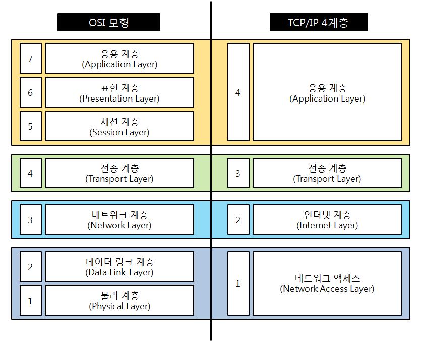
   </div>

### OSI 7계층

1. **물리계층 (Physical Layer)**
   - **전기적, 기계적, 기능적인 특성을 이용하여 통신 케이블로 데이터를 전송**한다.
2. **데이터 링크계층 (DataLink Layer)**
   - **물리 계층을 통해 송수신되는 정보의 오류와 흐름을 관리하여 안전한 정보의 수행을 도와주는 역할**을 한다.
3. **네트워크 계층 (Network Layer)**
   - 데이터를 목적지까지 가장 안전하고 빠르게 전달하는 기능을 한다.
   - **경로를 선택하고 주소를 정하고 경로에 따라 패킷을 전달해주는 역할**을 한다.
   - 대표적인 장비로 라우터, (라우팅 기능이 포함된)스위치가 있으며, **IP 주소를 사용**한다.
4. **전송 계층 (Transport Layer)**
   - **통신을 활성화하기 위한 계층**이다. 보통 **TCP 프로토콜을 사용**하며, 포트를 열어서 응용 프로그램을 전송한다.
5. **세션 계층 (Session Layer)**
   - **데이터가 통신하기 위한 논리적인 연결**을 한다.
   - **세션 설정, 유지, 종료, 전송 중단시 복구 등의 기능**이 있다.
6. **표현 계층 (Presentation Layer)**
   - **데이터 표현이 상이한 응용 프로세스의 독립성을 제공하고, 암호화**한다.
   - 해당 데이터가 텍스트인지, 그림인지, GIF인지, JPG인지의 구분 등의 역할을 한다.
7. **응용 계층 (Application Layer)**
   - 최종 목적지로서 HTTP, FTP, SMTP, Telnet 등과 같은 프로토콜이 있다.
   - **응용 프로세스와 직접 관계하여 일반적인 응용 서비스를 수행**한다.
   - 네트워크 소프트웨어의 UI 부분, 사용자의 입출력 부분을 담당한다.


OSI 계층은 TCP/IP 계층의 응용 계층을 더 세분화한 것이다. 

네트워크 전송시 **테이터 표준을 정리**한 것이 **OSI계층**이라면, 이 이론을 실제로 사용하는 **인터넷 표준**이 **TCP/IP**계층이다.

#### Reference

- [OSI 7계층, TCP/IP 4계층 모델](https://devowen.com/344)


## #3

### Frame, Packet, Segment, Datagram을 비교해주세요.
(❊ TCP/IP 5계층 기준으로 설명한다.)

Frame, Packet, Segment, Datagram은 데이터를 송수신할 때, TCP/IP 5계층에서 각각 만들어지는 데이터 입니다.

**Packet**은 pack과 bucket의 합친 말입니다. 우체국에서 화물을 적당한 덩어리로 나눠 행선지를 표시하는 꼬리를 붙이는데, 이 과정을 데이터 통신에 접목한 것입니다.

큰 데이터는 대역폭을 너무 많이 차지하기 때문에 쪼개서 트래픽이 많아집니다. 그래서 데이터를 Packet들로 분할하게 됩니다. 이러한 교환 방식을 **패킷 교환 방식**이라고 합니다.

#### #데이터 송신

<div align='center'>
     
   </div>
1. 응용 계층에서 요청 데이터가 만들어진다.

2. 전송 계층에서 신뢰할 수 있는 통신을 구현하기 위한 헤더를 데이터에 붙인다. 이렇게 만들어진 데이터를 **세그먼트**라고 한다.

3. 네트워크 계층에서 다른 네트워크와 통신하기 위한 헤더를 세그먼트에 붙인다. 이렇게 만들어진 데이터를 **패킷** 또는 **데이터그램**이라고 한다.

4. 데이터 링크 계층에서 물리적인 통신 채널을 열기 위해 패킷에 헤더와 트레일러를 붙인다. 여기서 트레일러는 데이터를 전달할 때 데이터 끝부분에 붙이는 정보로, 주로 에러 검출에 쓰인다. 이렇게 만들어진 데이터를 **프레임**이라고 한다.

5. 이렇게 만들어진 프레임을 최종적으로 물리 계층에서 0, 1의 비트로 구성된 전기 신호로 변환해 수신 컴퓨터 쪽에 전송한다.

- 이 단계를 **캡슐화**라고 합니다

#### #데이터 수신

<div align='center'>
     
   </div>

- 데이터 수신할 땐, 반대로 헤더를 제거하며 데이터를 전달하는 **역캡슐화** 과정을 거칩니다.


### References

- [패킷이란 무엇일까? 패킷의 정의와 구조 - Jay's Blog](https://enlqn1010.tistory.com/9)
- [[네트워크] TCP/IP 5계층에서 일어나는 일 (1) - 코알라일락's BLOG](https://zion830.tistory.com/104)

## #4

### TCP와 UDP의 차이를 설명해주세요

**TCP(Transmission Control Protocol)** 

> 인터넷상에서 데이터를 메세지의 형태로 보내기 위해 IP와 함께 사용하는 프로토콜

**UDP(User Datagram Protocol)**

> IP를 사용하는 네트워크 내에서 컴퓨터들 간에 메시지들이 교환될 때 제한된 서비스만을 제공하는 통신 프로토콜

<div align='center'>
     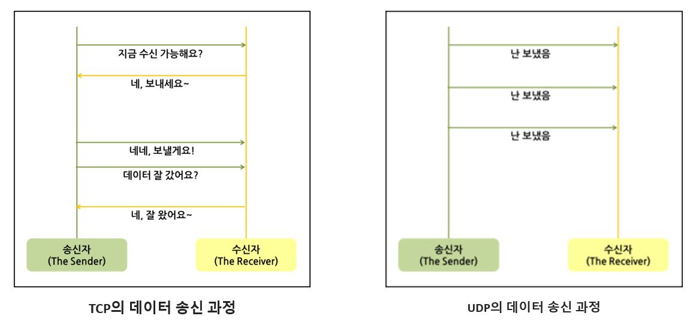
   </div>

UDP는 TCP에 비해 일방적인 프로토콜이다.

**신뢰성이 요구되는 애플리케이션에서는 TCP를 사용하고** **간단한 데이터를 빠른 속도로 전송하고자하는 애플리케이션에서는 UDP를 사용한다.**

**TCP UDP 사용 예**
- TCP는 순서를 보장한다는 점과 신뢰도가 있다는 점에서 대부분의 HTTP 통신, 이메일이나 파일전송처럼 순서대로 도착해야 하는 상황에서 사용된다.
- UDP는 순서는 보장해주지 못하지만 실시간으로 반응해야하는 실시간 동영상 플레이어나 게임, 혹은 DNS에서 사용. DNS의 경우 누군가 도메인을 쳤을때마다 그때 그때 서버와 클라이언트가 커넥션을 맺으면 속도가 느려지기 때문에 UDPf를 사용한다.

## #5

### TCP와 UDP의 헤더를 비교해주세요.

TCP(Transmission Control Protocol) Vs UDP(User Datagram Protocol)

두 프로토콜은 모두 [패킷](https://velog.io/@hidaehyunlee/TCP-와-UDP-의-차이)을 한 컴퓨터에서 다른 컴퓨터로 전달해주는 `IP 프로토콜`을 기반으로 구현되어 있지만, 서로 다른 특징을 갖는다.

<div align='center'>
     
   </div>

TCP는 데이터를 확실히 송 수신 했는지 확인하고 송 수신 속도를 조절한다면 UDP는 일방적으로 데이터를 송신하기만 한다.

따라서  **신뢰성이 요구되는 애플리케이션에서는 TCP를 사용**하고 **간단한 데이터를 빠른 속도로 전송하고자 하는 애플리케이션에서는 UDP를 사용**한다.

<div align='center'>
     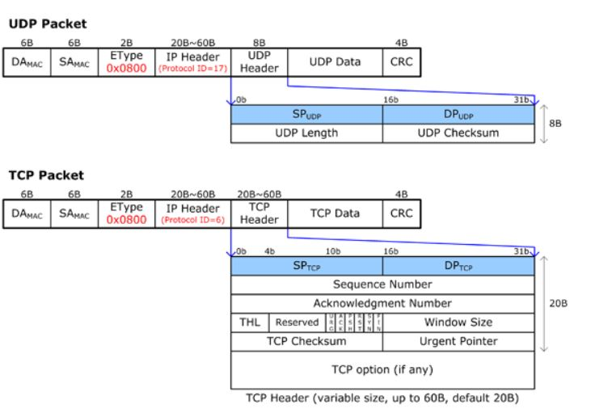
   </div>


### TCP 헤더 정보

| **필드**                      | **크기** | **내용**                                                     |
| ----------------------------- | -------- | ------------------------------------------------------------ |
| 송수신자의 포트 번호          | 16       | TCP로 연결되는 가상 회선 양단의 송수신 프로세스에 할당되는 포트 주소 |
| 시퀀스 번호 (Sequence Number) | 32       | 송신자가 지정하는 순서 번호, 전송되는 바이트 수를 기준으로 증가 SYN = 1 : 초기 시퀀스 번호가 된다. ACK 번호는 이 값에 1을 더한값 SYN = 0 : 현재 세션의 이 세그먼트 데이터의 최초 바이트 값의 누적 시퀀스 번호 |
| 응답 번호 (ACK Number)        | 32       | 수신 프로세스가 제대로 수신한 바이트 수를 응답하기 위해 사용 |
| 데이터 오프셋 (Data Offset)   | 4        | TCP 세그먼트의 시작 위치를 기준으로 데이터의 시작 위치를 표현(TCP 헤더의 크기) |
| 예약 필드(Reserved)           | 6        | 사용을 하지 않지만 나중을 위한 예약 필드이며 0으로 채워져야한다. |
| 제어 비트(Flag Bit)           | 6        | SYN, ACK, FIN 등의 제어 번호                                 |
| 윈도우 크기(Window)           | 16       | 수신 윈도우의 버퍼 크기를 지정할 때 사용. 0이면 송신 프로세스의 전송 중지 |
| 체크섬(Checksum)              | 16       | TCP 세그먼트에 포함되는 프로토콜 헤더와 데이터에 대한 오류 검출 용도 |
| 긴급 위치(Urgent Pointer)     | 16       | 긴급 데이터를 처리하기 위함, URG 플래그 비트가 지정된 경우에만 유효 |

### UDP의 헤더정보

| **필드**           | **크기** | **내용**                                 |
| ------------------ | -------- | ---------------------------------------- |
| 송신자의 포트 번호 | 16       | 데이터를 보내는 어플리케이션의 포트 번호 |
| 수신자의 포트 번호 | 16       | 데이터를 받을 어플리케이션의 포트 번호   |
| 데이터의 길이      | 16       | UDP 헤더와 데이터의 총 길이              |
| 체크섬(Checksum)   | 16       | 데이터 오류 검사에 사용                  |

- UDP 헤더는 8B(바이트)이고 TCP 헤더는 20B이다. 

- 두 헤더 모두 첫 2B가 Source Port Number(SP)이고, 다음 2B가 Destination Port Number(DP)이다. 
- 데이터에 대한 오류를 체크한다.
- TCP헤더의 경우 송수신(연결)을 통해 데이터를 전달하기 때문에 더 많은 정보를 필요로 한다.(뇌피셜..)
- 또한 TCP는 순서를 보장하기 때문에 시퀀스 정보가 필요


#### Reference

- [TCP 와 UDP 차이를 자세히 알아보자](https://velog.io/@hidaehyunlee/TCP-%EC%99%80-UDP-%EC%9D%98-%EC%B0%A8%EC%9D%B4)

- [Ethernet, IP, TCP/UDP 헤더 소개](https://www.netmanias.com/ko/post/blog/5372/ethernet-ip-ip-routing-network-protocol/packet-header-ethernet-ip-tcp-ip)

## #6

### TCP의 3-way-handshake와 4-way-handshake를 비교 설명해주세요.

#### 한 줄 요약

1. 3-way-handshake : TCP의 연결을 초기화 할 때 사용
2. 4-way-hadeshake : 세션을 종료하기 위해 사용

#### 1. TCP 3 way handshake

**의의** : TCP/IP 프로토콜을 이용해서 통신을 하는 응용프로그램이 데이터 전송 전에 먼저 정확한 전송을 보장하기 위해 수신하는 컴퓨터와 사전에 세션을 수립하는 과정

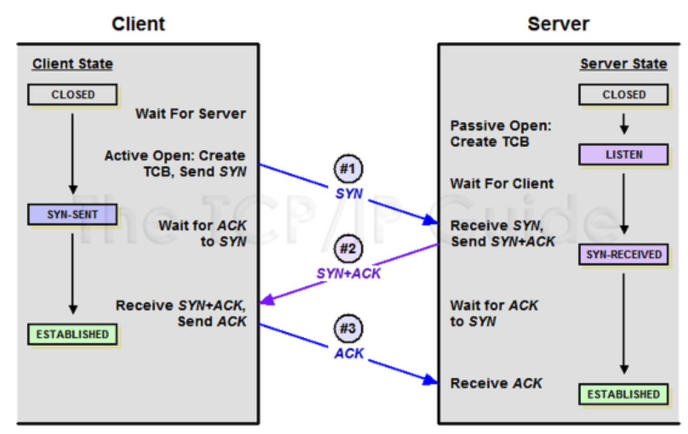

##### 과정

**[Step 1]**  *Client > Server*

A클라이언트는 B서버에 접속 요청을 하는 ***SYN*** (Synchornize Sequence Number) 패킷을 보낸다.

이때 A클라이언트는 **SYN** 을 보내고 SYN/ACK 응답을 기다리는 **SYN_SENT** 상태, B 서버는 **Wait for Client** 상태이다.

**[Step 2]**  *Server > Client*

B서버는 SYN 요청을 받고 A클라이언트에게 요청을 수락한다는 ***ACK*** (ACKnowlegment) 와 SYN flag가 설정된 패킷을 발송, 

A가 다시 ACK으로 응답하기를 기다린다. 이때 B서버는 **SYN_RECEIVED** 상태가 된다.

**[Step 3]**  *Client > Server*

A클라이언트는 B서버에게 ACK를 보내고 이후로부터는 연결이 이뤄지고 데이터가 오가게 됨

이떄의 B서버 상태가 **ESTABLISHED** 상태가 된다.

#### 2. TCP 4 way hanshake

**의의** : 세션을 종료하기 위해 진행되는 절차

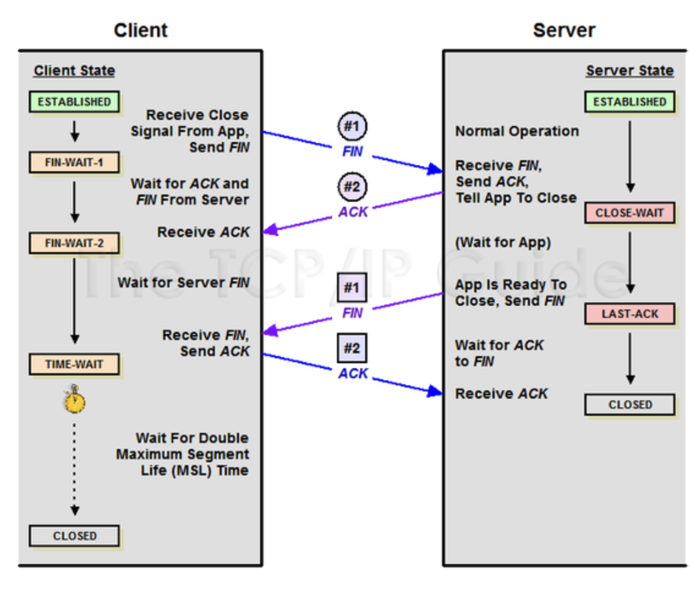

##### 과정

**[Step 1]**  *Client > Server*

클라이언트가 연결을 종료하겠다는 **FIN** flag 전송. 이때 A 클라이언트는 **FIN-WAIT** 상태가 된다

**[Step 2]**  *Server > Client*

B서버는 SYN 요청을 받고 A클라이언트에게 요청을 수락한다는 ***ACK*** (ACKnowlegment) 와 **SYN** flag가 설정된 패킷을 발송, 

서버는 FIN flag를 받고, 확인메시지 **ACK** 를 클라이언트에 보난다. 그리고 자신의 통신이 끝날때 까지 기다리는데 이 상태를

서버의 **CLOSE_WAIT** 상태이다.

**[Step 3]**  *Server > Client*

연결을 종료할 준비가 되면 연결해지를 위한 준비가 되었음을 알리기 위해 클라이언트에게 FIN flag를 전송한다. 이때 서버의 상태는 **LAST_ACK** 이다.

**[Step 4]**  *Client > Server*

클라이언트는 해지준비가 되었다는 ACK를 확인했다는 메시지를 보낸다.

클라이언트의 상태가 **FIN-WAIT -> TIME-WAIT** 으로 상태가 바뀐다.


##### if !

만약 <u>server에서 **FIN** 을 전송하기 전에 전송한 패킷이 routing 지연이나 패킷 유실로 인한 재전송 등으로 FIN 패킷 보다 늦게 도착하는 상황</u>이 발생한다면?

=> Client에서 세션을 종료시킨 후 뒤늦게 도착하는 패킷이 있다면 이 패킷은 Drop되고 데이터는 유실 될 것.

=> 이러한 현상에 대비하기 위해 client는 server로 부터 FIN을 수신하더라도 일정시간 동안 세션을 남겨 놓고 잉여 패킷을 기다리는 과정을 거치게 됨 - 이 과정을 **TIME-WAIT** 이라 한다.

-> 일정 시간이 지나면, 세션을 만료하고 연결을 종료, **CLOSE** 상태로 변화


#### Reference

- [[네트워크] 3-way / 4-way Handshake 란? ](https://bangu4.tistory.com/74#comment16493602) 


## #7

### TCP의 연결 설정 과정(3단계)과 연결 종료 과정(4단계)이 단계가 차이나는 이유가 무엇인가요?

<div align='center'>
     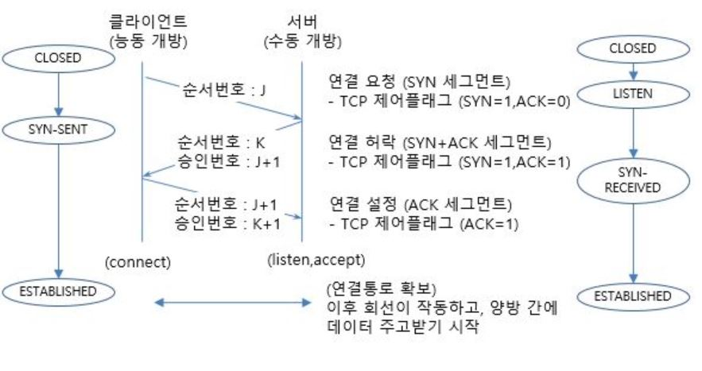
   </div>

<div align='center'>
     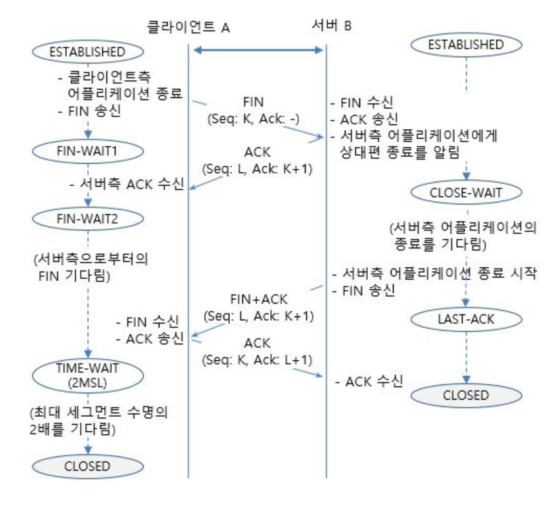
   </div>

서버에서 TCP 구현할 때 클라이언트의 SYN 플래그를 승인해야 하기 때문에 두가지 일이 동일한 세그먼트에서 수행될 수 있다.

종료시에도 TCP가 세 개의 세그먼트(FIN, FIN-ACK, ACK)만 사용하여 "4방향" 종료를 수행하는 것도 가능하다.

그러나 일반적으로 4단계로 일어나는 이유는 클라이언트가 FIN을 보냈을때, 응답은 바로 해야하지만, 서버가 언제 종료할 지는 클라이언트 종료가 조건이 아니고 애플리케이션에 의해 결정된다. FIN을 수신하면 애플리케이션에 이를 알리고(예: EOF 사용)  애플리케이션은 자체 바이트 스트림을 종료하게 되는데( 예: shutdown() 또는 close()) 이 결정이 매우 빠르지 않는 한 TCP는 이미 FIN에 대한 ACK을 보냈을 것이다. 따라서 애플리케이션이 종료될 때 TCP는 FIN과 함께 두번째 세그먼트를 보내야 한다. 

근본적으로 TCP 연결과 종료과정은 모두 4방향 교환이나, 이를 4개의 세그먼트를 사용하거나 3개로 압축할 수 있다. 

#### Reference

- [Quora](https://www.quora.com/Why-is-the-TCP-connection-terminated-in-a-4-way-handshake)
- [TCP 연결 종료](http://www.ktword.co.kr/test/view/view.php?no=2436)

## #8

### 만약 Server에서 FIN 플래그를 전송하기 전에 전송한 패킷이 Routing 지연이나 패킷 유실로 인한 재전송 등으로 인해 FIN 패킷보다 늦게 도착하는 상황이 발생하면 어떻게 될까요?

Client에서 세션을 종료시킨 후 뒤늦게 도착하는 패킷이 있다면 이 패킷은 Drop되고 **데이터는 유실**될 것이다.

이러한 현상에 대비하여 Client는 Server로부터 **FIN**을 수신하더라도 일정시간동안 세션을 남겨놓고 잉여 패킷을 기다리는 과정을 거치게 되는데 이 과정을 **TIME_WAIT** 라고 한다. 일정 시간이 지나면, 세션을 만료하고 연결을 종료시킨다.

#### References

- [[네트워크\] 3-way / 4-way Handshake 란? - 방구의 개발냄새](https://bangu4.tistory.com/74)

## #9

### 초기 Sequence Number인 ISN을 0부터 시작하지 않고 난수를 생성해서 설정하는 이유가 무엇인가요?

- SYN : SYnchronize sequence Number
  - TCP 연결의 포트 번호로 이해하면 됩니다!

#### #첫번째 이유

Connection을 맺을 때 사용하는 포트는 유한 범위 내에서 사용하고 시간이 지남에 따라 재사용됩니다.

따라서 두 통신 호스트가 과거에 사용된 포트 번호 쌍을 사용하는 가능성이 존재합니다.

서버 측에서는 패킷의 SYN을 보고 패킷을 구분하게 되는데 난수가 아닌 순차적인 number가 전송된다면 이전의 connection으로부터 오는 패킷으로 인식할 수 있습니다.

이러한 문제가 발생할 가능성을 줄이기 위해서 난수로 ISN을 설정하는 것입니다.

#### #두번째 이유

0에서 시작하는 ISN은 이어지는 Sequence number를 쉽게 예측할 수 있게 되어 보안에 취약하게 됩니다. 이를 방지하기 위해 난수의 ISN을 사용하는 것입니다.

### References

- [[Network] (TCP) 3-way-handshake & 4-way-handshake - 어제보다 한 걸음 더](https://k39335.tistory.com/21)
- [TCP - Connection Establishment/Termination](https://nogan.tistory.com/22)


## #10 

### HTTP와 HTTPS에 대해서 설명하고 차이점에 대해 설명해주세요.

**HTTP(Hyper Text Transfer Protocol)**

> 서버/클라이언트 모델을 따라 데이터를 주고 받기 위한 프로토콜

즉, HTTP는 인터넷에서 하이퍼텍스트를 교환하기 위한 통신 규약으로, 80번 포트를 사용하고 있다. 따라서 HTTP 서버가 80번 포트에서 요청을 기다리고 있으며, 클라이언트는 80번 포트로 요청을 보내게 된다.

HTTP의 구조

- HTTP는 애플리케이션 레벨의 프로토콜로 **TCP/IP 위에서 작동**한다. HTTP는 상태를 가지고 있지 않는 Stateless 프로토콜이며 Method, Path, Version, Headers, Body 등으로 구성된다.

하지만 HTTP는 암호화가 되지 않은 평문 데이터를 전송하는 프로토콜이였기 때문에, HTTP로 비밀번호나 주민등록번호 등을 주고 받으면 제3자가 정보를 조회할 수 있었다. 그리고 이러한 문제를 해결하기 위해 HTTPS가 등장하게 되었다.


**HTTPS(Hyper Text Transfer Protocol Secure)**

> HTTP에 데이터 암호화가 추가된 프로토콜

HTTPS는 HTTP와 다르게 443번 포트를 사용하며, 네트워크 상에서 중간에 제3자가 정보를 볼 수 없도록 공개키 암호화를 지원하고 있다.


**HTTP와 HTTPS**

HTTP는 암호화가 추가되지 않았기 때문에 보안에 취약한 반면, HTTPS는 안전하게 데이터를 주고받을 수 있다. 하지만 HTTPS를 이용하면 암호화/복호화의 과정이 필요하기 때문에 HTTP보다 속도가 느리다.(오늘날에는 거의 차이를 못느낄 정도이다.) 또한 HTTPS는 인증서를 발급하고 유지하기 위한 추가 비용이 발생하다.

***그렇다면 언제 HTTP를 쓰고, 언제 HTTPS를 쓰는 것이 좋겠는가?***

개인 정보와 같은 민감한 데이터를 주고 받아야 한다면 HTTPS를 이용해야 하지만, 단순한 정보 조회 등만을 처리하고 있다면 HTTP를 이용하면 된다.


**Reference**

- [망나니개발자](https://mangkyu.tistory.com/98)

## #11

#### HTTP 요청/응답 헤더의 구조를 설명해주세요.


HTTP 메시지는 서버와 클라이언트 간에 데이터가 교환되는 방식입니다. 메시지 타입은 두 가지가 있습니다. 요청(*request)은* 클라이언트가 서버로 전달해서 서버의 액션이 일어나게끔 하는 메시지고, 응답(*response)은 요청*에 대한 서버의 답변입니다. 두 메시지는 공통 포맷을 가지고 있고 HTTP 헤더와 HTTP 본문을 포함합니다.

**HTTP 요청/응답 메시지**

<div align='center'>
     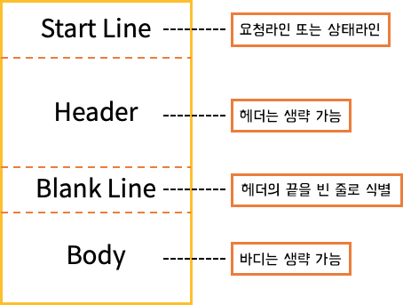
   </div>

- 스타트라인(Start Line): 실행되어야 할 요청, 또은 요청 수행에 대한 성공 또는 실패가 기록되어 있습니다. 이 줄은 항상 한 줄로 끝납니다. 요청 메시지일 때 요청라인(request line)이라고 하고, 응답 메시지일 때 상태라인(status line)이라고 합니다.

- 헤더(Header): 여기에는 요청에 대한 설명, 혹은 메시지 본문에 대한 설명이 들어갑니다. 각 행의 끝에 줄 바꿈 문자인 CRLF(Carriage Return Line Feed)가 있으며, 헤더와 바디는 빈 줄로 구분합니다.
- 빈 줄(blank line): 요청에 대한 모든 메타 정보가 전송되었음을 알리는 줄

- 헤더와 바디(Body): 생략할 수 있고, 바디에는 텍스트뿐만 아니라 바이너리 데이터도 들어갈 수 있습니다. 요청과 관련된 내용(HTML 폼 콘텐츠 등)이 옵션으로 들어가거나, 응답과 관련된 문서(document)가 들어갑니다. 본문의 존재 유무 및 크기는 첫 줄과 HTTP 헤더에 명시
<div align='center'>
     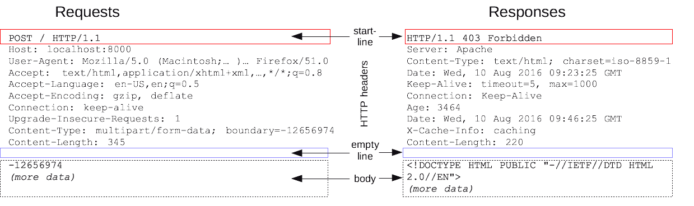
</div>

Header는 General Header, Request/Response Header, Entity Header

#### **HTTP Requests**

**start line** 

- 첫번째는 HTTP 메서드로, 영어 동사([`GET`](https://developer.mozilla.org/ko/docs/Web/HTTP/Methods/GET), [`PUT`](https://developer.mozilla.org/ko/docs/Web/HTTP/Methods/PUT),[`POST`](https://developer.mozilla.org/ko/docs/Web/HTTP/Methods/POST)) 혹은 명사([`HEAD`](https://developer.mozilla.org/ko/docs/Web/HTTP/Methods/HEAD), [`OPTIONS`](https://developer.mozilla.org/ko/docs/Web/HTTP/Methods/OPTIONS))를 사용해 서버가 수행해야 할 동작을 나타냄

- 두번째로 오는 요청 타겟은 주로 [URL](https://developer.mozilla.org/ko/docs/Glossary/URL), 또는 프로토콜, 포트, 도메인의 절대 경로로 나타낼 수도 있으며 이들은 요청 컨텍스트에 의해 특정지어 집니다. 요청 타겟 포맷은 HTTP 메소드에 따라 달라집니다.
- 마지막으로 HTTP 버전이 들어갑니다.

**Header**

요청 헤더는 요청한 URL, 메소드 (GET, POST, HEAD), 요처

요청에 들어가는 [HTTP 헤더](https://developer.mozilla.org/en-US/docs/Web/HTTP/Headers)는 HTTP 헤더의 기본 구조를 따릅니다. 대소문자 구분없는 문자열 다음에 콜론(`':'`)이 붙으며, 그 뒤에 오는 값은 헤더에 따라 달라집니다. 헤더는 값까지 포함해 한 줄로 구성되지만 꽤 길어질 수 있습니다.

다양한 종류의 요청 헤더가 있는데, 이들은 다음과 같이 몇몇 그룹으로 나눌 수 있습니다.


<div align='center'>
     
   </div>

- General 헤더: 전송되는 HTTP 본문 컨텐츠와 관련없고, HTTP 통신에 대한 일반적인 정보 포함(ex: 날짜, 메세지 전송시 보안 적용 )
- Request 헤더: 요청헤더는 요청한 URL, 메소드(GET, POST, HEAD), 요청 생성에 사용 된 브라우저 및 기타 정보와 같은 요청에 대한 정보 포함
- Entity 헤더: 실제 메시지 또는 전송중인 HTTP 본문에 대한 정보를 포함 (ex: 콘텐츠 길이,  만료날짜 ...) 

**body**

해당 reqeust의 실제 메세지/내용. Body가 없는 request도 많다.

**HTTP Response**

**start line** 

1. *프로토콜 버전:* 보통 `HTTP/1.1`입니다.
2. 상태 코드: 요청의 성공 여부를 나타냅니다. 2xx, 3xx, 4xx
3. 상태 텍스트: 짧고 간결하게 상태 코드에 대한 설명을 글로 나타내어 사람들이 HTTP 메시지를 이해할 때 도움이 됩니다.

**Header**

구성 요소는 request header와 동일

응답 헤더는 사용자가 특정 페이지 또는 리소스에 대한 요청을 보낸 후 서버에서 브라우저에 의해 수신되며 컨텐츠에 사용 된 인코딩, 서버 시스템에서 응답을 생성하는 데 사용되는 서버소프트웨어 및 기타정보를 포함한합니다.


<div align='center'>
     
   </div>
**body**

- Response의 body와 일반적으로 동일, 모든 response가 body가 있지는 않다. 데이터를 전송할 필요가 없을경우 body가 비어있게 된다.

**한줄 정리**

> 헤더엔 General 헤더, request/response header, entity header 존재 제너럴은 일반적인 정보(날짜) 포함 request/response는 요청/반응에 대한 브라우저 정보, 인코딩 정보 포함, Entity는반응/요청에 따른 본문에 대한 내용(콘텐츠 길이) 포함

#### Reference

- [메시지 구조와 함께 HTTP 프로토콜 이해하기](https://deepwelloper.tistory.com/entry/HTTP-%EB%A9%94%EC%8B%9C%EC%A7%80-%EA%B5%AC%EC%A1%B0%EC%99%80-%ED%95%A8%EA%BB%98-HTTP-%ED%94%84%EB%A1%9C%ED%86%A0%EC%BD%9C-%EC%9D%B4%ED%95%B4%ED%95%98%EA%B8%B0)
- [HTTP-구조-및-핵심-요소](https://velog.io/@teddybearjung/HTTP-%EA%B5%AC%EC%A1%B0-%EB%B0%8F-%ED%95%B5%EC%8B%AC-%EC%9A%94%EC%86%8C)
- [HTTP 구조 헤더와 본문](https://blueyikim.tistory.com/1999)

- [HTTP 메시지](

## #12

### HTTP와 HTTPS 동작 과정을 비교해주세요

#### HTTP와 HTTPS의 차이점

HTTP : TCP와 UDP사용, 80번 포트 사용

HTTPS : HTTP에서 SSL(Secure Sokcket Layer)추가, SSL이나 TLS 프로토콜을 통해 세션 암호화. 기본TCP/IP 포트 443

#### 1. HTTP의 동작과정

1. 사용자가 웹 브라우저에 URL 주소 입력

2. DNS 서버에 웹 서버의 호스트 이름을 IP 주소로 변경 요청

3. 웹서버와 TCP 연결 시도 - [3way handshaking](#6)

   

   <div align='center'>
        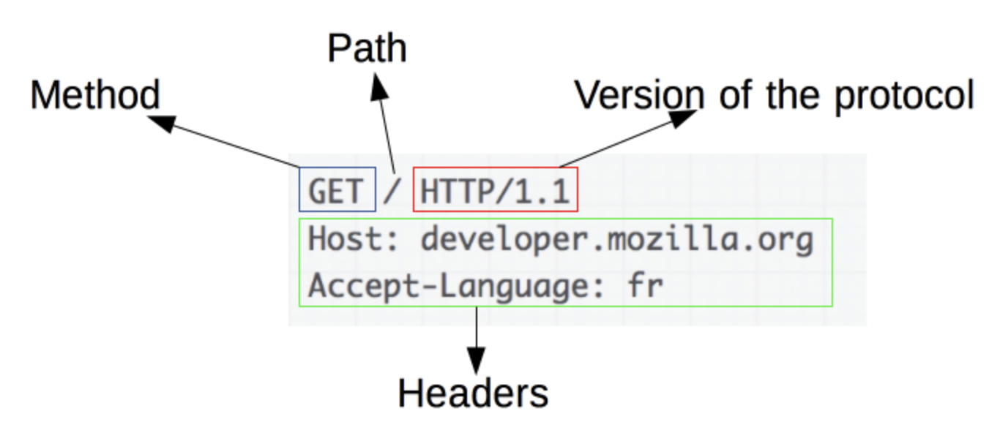
      </div>

4. 클라이언트가 서버에 요청

   - **HTTP Request Message = Request Header + 빈 줄 + Request Body**

     - **Request Header** : 요청 메소드 + 요청 URL + HTTP 프로토콜 버전
       - ​	`GET /background.png HTTP/1.0` , `POST / HTTP 1.1`
       - Header 정보(key-value 구조)

     - **빈줄** : 요청에 대한 모든 메타 정보가 전송되었음을 알리는 용도

     - **Request Body** : 데이터 업데이트 요청과 관련된 내용 (HTML 폼 콘텐츠 등)
       - GET, HEAD, DELETE, OPTIONS처럼 리소스를 가져오는 요청은 바디 미포함

5. 서버가 클라이언트에게 데이터를 응답
   - **HTTP Response Message = Response Header + 빈 줄 + Response Body**
     - **Response Header** : HTTP 프로토콜 버전 + 응답 코드 + 응답 메시지
       - ex) `HTTP/1.1 404 Not Found.`
       - Header 정보(key-value 구조)
     - **빈줄** : 요청에 대한 모든 메타 정보가 전송되었음을 알리는 용도
     - **Response Body** :  응답 리소스 데이터
       - 201, 204 상태 코드는 바디 미포함
6. 서버 클라이언트 간 연결 종료 - [4 way handshake](#6)
7. 웹 브라우저가 웹 문서 출력

##### 요청 메소드

서버에게 요청의 종류를 알려주기 위해 사용한다.

- GET : 정보를 요청하기 위해 사용(SELECT)
- POST : 정보를 밀어넣기 위해 사용(INSERT)
- PUT : 정보를 업데이트하기 위해서 사용(UPDATE)
- DELETE : 정보를 삭제하기 위해서 사용(DELETE)
- HEAD : (HTTP)헤더 정보만 요청. 해당 자원이 존재하는지 혹은 서버에 문제가 없는지를 확인하기 위해 사용.
- OPTIONS : 웹 서버가 지원하는 메서드의 종류를 요청.
- TRACE : 클라이언트의 요청을 그대로 반환. 주로 echo 서비스로 서버 상태를 확인하기 위한 목적으로 사용.


#### 2. HTTPS(SSL)의 동작 과정

공개키 암호화 방식과 대칭키 암호화 방식의 장점을 활용해 하이브리드 사용

- 데이터를 대칭키 방식으로 암복호화하고, 공개키 방식으로 대칭키 전달

<div align='center'>
     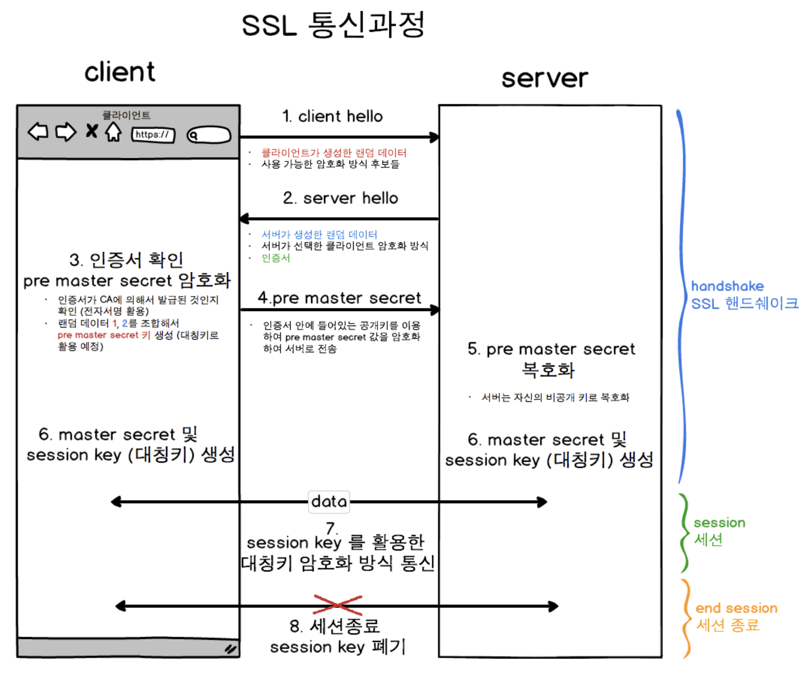
   </div>

1. **클라이언트가 서버 접속하여 Handshaking 과정에서 서로 탐색**
   1.  **Client Hello** : 클라이언트가 서버에게 전송할 데이터
      - 클라이언트 측에서 생성한 **랜덤 데이터**
      - 클라이언트 - 서버 암호화 방식 통일을 위해 **클라이언트가 사용할 수 있는 암호화 방식**
      - 이전에 이미 Handshaking 기록이 있다면 자원 절약을 위해 기존 세션을 재활용하기 위한 **세션 아이디**
   2. **Server Hello** : Client Hello에 대한 응답으로 전송할 데이터 
      - 서버 측에서 생성한 **랜덤 데이터**
      - **서버가 선택한 클라이언트의 암호화 방식**
      - **SSL 인증서**
   3. **Client 인증 확인**
      - 서버로부터 받은 인증서가 CA( *Certificate Authority* )에 의해 발급되었는지 본인이 가지고 있는 목록에서 확인하고, 목록에 있다면 CA 공개키로 인증서 복호화
      - 클라이언트 - 서버 각각의 랜덤 데이터를 조합하여 pre master secret 값 생성(데이터 송수신 시 대칭키 암호화에 사용할 키)
      - pre master secret 값을 공개키 방식으로 서버 전달(공개키는 서버로부터 받은 인증서에 포함)
      - 일련의 과정을 거쳐 session key 생성
   4. **Server 인증 확인**
      - 서버는 비공개키로 복호화하여 pre master secret 값 취득(대칭키 공유 완료)
      - 일련의 과정을 거쳐 session key 생성

2.  **데이터 전송** : 서버와 클라이언트는 session key를 활용해 데이터를 암복호화하여 데이터 송수신
3. **연결 종료 및 session key 폐기**


💡 SSL의 동작방식은 reference의 두번째 링크 확인

#### Reference

- [[네트워크] HTTP와 HTTPS 동작 과정](https://velog.io/@averycode/네트워크-HTTP와-HTTPS-동작-과정)
- [[네트워크]HTTP와 HTTPS의 차이점 그리고 동작 방식](https://devdy.tistory.com/14)


## #13

#### CORS가 무엇인가요?

<div align='center'>
     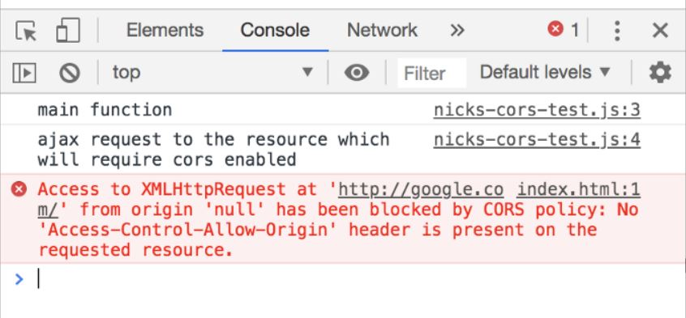
   </div>

url에서 다른 서비스에 api로 정보를 받아오기 위해 프론트에서 http요청을 보냈을 때, 미리 어떤 설정을 해주지 않으면 CORS에 막힌다.

사실 SOP(Same-Origin Policy)가 동일 출처에서만 api등의 데이터 접근이 가능하도록 막는 거고, CORS(Cross-Origin Resource Sharing)이 다른 출처간에 리소스를 공유할 수 있도록 하는 것이다.

미리 해야하는 어떤 설정이라는 것은 요청을 받는 백엔드쪽에서 이걸 허락한 다른 출처들을 미리 명시해두면 된다. 각 백엔드 프레임워크의 문서에서 CORS 옵션을 넣는 방법을 알 수 있다.

#### Reference

- [ERROR](https://ichi.pro/ko/gandanhan-lokeol-cors-teseuteu-dogu-92698556174789)
- [CORS](https://www.youtube.com/watch?v=bW31xiNB8Nc)

## #14

### HTTP GET과 POST 메서드를 비교/설명해주세요.

### GET 

- 클라이언트에서 서버로 어떠한 리소스로 부터 정보를 요청하기 위해 사용되는 method
- 요청을 전송할 때 URL 주소 끝에 파라미터로 포함되어 전송되며, 이 부분을 **쿼리 스트링**이라고 한다. 

```
www.example-url.com/resources?name1=성민&name2=동진
```

위 예는 쿼리 스트링을 포함한 URL이다. 파라미터인 name1과 name2를 통해 값을 전달받고 &로 연결한다.

- GET은 데이터를 읽을때만 사요하고 수정할 때는 사용하지 않는다.


### POST

- 리소스를 생성/업데이트하기 위해 서버에 데이터를 보낼때 사용
- 전송할 데이터를 HTTP 메세지의 Body에 담아서 전송
- HTTP 메세지의 Body는 길이의 제한없이 데이터를 전송할 수 있다. 그래서 `POST` 요청은 `GET`과 달리 대용량 데이터를 전송할 수 있다.


<div align='center'>
     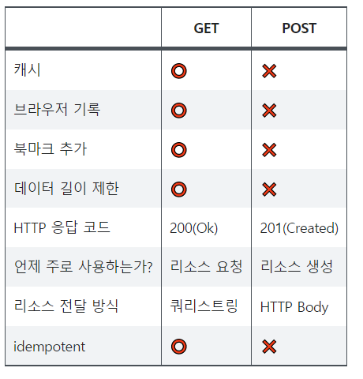
   </div>

#### References

- [Get과 Post의 차이를 아시나요?](https://velog.io/@songyouhyun/Get%EA%B3%BC-Post%EC%9D%98-%EC%B0%A8%EC%9D%B4%EB%A5%BC-%EC%95%84%EC%8B%9C%EB%82%98%EC%9A%94)


## #15

### 쿠키(Cookie)와 세션(Session)을 설명해주세요.

**쿠키(Cookie)**

쿠키는 **클라이언트(브라우저) 로컬에 저장되는 키와 값이 들어있는 작은 데이터 파일**입니다.

사용자 인증이 유효한 시간을 명시할 수 있으며, 유효 시간이 정해지면 브라우저가 종료되어도 인증이 유지된다는 특징이 있습니다.

쿠키는 클라이언트의 상태 정보를 로컬에 저장했다가 참조합니다.

Response Header에 Set-Cookie 속성을 사용하면 클라이언트에 쿠키를 만들 수 있습니다.

쿠키는 사용자가 따로 요청하지 않아도 브라우저가 Request 시에 Request Header를 넣어서 자동으로 서버에 전송합니다.

- 쿠키의 구성 요소
  - 이름 : 각각의 쿠키를 구별하는 데 사용되는 이름
  - 값 : 쿠키의 이름과 관련된 값
  - 유효시간 : 쿠키의 유지시간
  - 도메인 : 쿠키를 전송할 도메인
  - 경로 : 쿠키를 전송할 요청 경로


- 쿠키의 동작 방식
    1. 클라이언트가 페이지를 요청
    2. 서버에서 쿠키를 생성
    3. HTTP 헤더에 쿠키를 포함 시켜 응답
    4. 브라우저가 종료되어도 쿠키 만료 기간이 있다면 클라이언트에서 보관
    5. 같은 요청을 할 경우 HTTP 헤더에 쿠키를 함께 보냄
    6. 서버에서 쿠키를 읽어 이전 상태 정보를 변경할 필요가 있을 때 쿠키를 업데이트하여 변경된 쿠키를 HTTP 헤더에 포함시켜 응답

- 쿠키의 사용 예
  - 방문 사이트에서 로그인 시, "아이디와 비밀번호를 저장하시겠습니까?"
  - 쇼핑몰의 장바구니 기능
  - 자동로그인, 팝업에서 "오늘 더 이상 이 창을 보지 않음" 체크, 쇼핑몰의 장바구니

**세션(Session)**

세션은 쿠키를 기반하고 있지만, 사용자 정보 파일을 브라우저에 저장하는 쿠키와 달리 세션은 **서버 측에서 관리**합니다.

서버에서는 클라이언트를 구분하기 위해 세션 ID를 부여하며 웹 브라우저가 서버에 접속해서 브라우저를 종료할 때까지 인증 상태를 유지합니다.

접속 시간에 제한을 두어 일정 시간 응답이 없다면 정보가 유지되지 않게 설정이 가능하다.

사용자에 대한 정보를 서버에 두기 때문에 쿠키보다 보안에 좋지만, 사용자가 많아질수록 서버 메모리를 많이 차지하게 된다.

즉 동접자 수가 많은 웹 사이트인 경우 서버에 과부하를 주게 되므로 성능 저하의 요인이 된다.

클라이언트가 Request를 보내면, 해당 서버의 엔진이 클라이언트에게 유일한 ID를 부여하는 데 이것이 세션 ID다.

- 세션의 동작 방식
    1. 클라이언트가 서버에 접속 시 세션 ID를 발급
    2. 클라이언트는 세션 ID에 대해 쿠키를 사용해서 저장하고 가지고 있음
    3. 클라이언트는 서버에 요청할 때, 이 쿠키의 세션 ID를 서버에 전달해서 사용
    4. 서버는 세션 ID를 전달받아서 별다른 작업 없이 세션 ID로 세션에 있는 클라언트 정보를 가져옴
    5. 클라이언트 정보를 가지고 서버 요청을 처리하여 클라이언트에게 응답

- 세션의 사용 예
  - 로그인 같이 보안상 중요한 작업을 수행할 때 사용

- **차이점**
    - 사용자의 정보가 저장되는 위치
        - 쿠키는 서버의 자원을 전혀 사용하지 않으며, 세션은 서버의 자원을 사용한다.
    - 보안
        - 쿠키는 클라이언트 로컬에 저장되기 때문에 변질되거나 request에서 스니핑 당할 우려가 있어서 보안에 취약하다.
        - 세션은 쿠키를 이용해서 세션 ID만 저장하고 그것으로 구분해서 서버에서 처리하기 때문에 비교적 보안성이 좋다.
    - 라이프 사이클
        - 쿠키는 만료시간이 있지만 파일로 저장되기 때문에 브라우저를 종료해도 계속해서 정보가 남아 있을 수 있다. 또한 만료 기간을 넉넉하게 잡아두면 쿠키 삭제를 할 때까지 유지될 수도 있다.
        - 반면에 세션도 만료시간을 정할 수 있지만 브라우저가 종료되면 만료시간에 상관없이 삭제된다.
    - 속도
        - 쿠키에 정보가 있기 때문에 서버에 요청 시 속도가 빠르다.
        - 세션은 정보가 서버에 있기 때문에 처리가 요구되어 비교적 느린 속도를 낸다.

세션은 서버의 자원을 사용하기 때문에 무분별하게 만들다 보면 서버의 메모리가 감당할 수 없어질 수가 있고 속도가 느려질 수 있기 때문에 쿠키를 함께 사용한다.

### References

- [쿠키와 세션 개념 - 라이언 서버](https://interconnection.tistory.com/74)


## #16

### DNS가 무엇인가요?

**DNS(Domain Name System)** 은 사람이 읽을 수 있는 도메인 이름(e.g. www.amazon.com)을 머신이 읽을 수 있는 IP 주소(e.g. 192.0.2.44)로 변환한다.

#### DNS 기본 사항

스마트폰이나 노트북부터 대규모 소매 웹 사이트의 콘텐츠를 서비스하는 서버에 이르기까지 인터넷상의 모든 컴퓨터는 숫자를 사용하여 서로를 찾고 통신합니다. 이러한 숫자를 **IP 주소**라고 합니다. 웹 브라우저를 열고 웹 사이트로 이동할 때는 긴 숫자를 기억해 입력할 필요가 없습니다. 그 대신 example.com과 같은 **도메인 이름**을 입력해도 원하는 웹 사이트로 갈 수 있습니다.

Amazon Route 53과 같은 DNS 서비스는 전 세계에 배포된 서비스로서, www.example.com과 같이 사람이 읽을 수 있는 이름을 192.0.2.1과 같은 숫자 IP 주소로 변환하여 컴퓨터가 서로 통신할 수 있도록 합니다. 인터넷의 DNS 시스템은 이름과 숫자 간의 매핑을 관리하여 마치 전화번호부와 같은 기능을 합니다. DNS 서버는 이름을 IP 주소로 변환하여 도메인 이름을 웹 브라우저에 입력할 때 최종 사용자를 어떤 서버에 연결할 것인지를 제어합니다. 이 요청을 **쿼리**라고 부릅니다.

#### Reference

- [AWS](https://aws.amazon.com/ko/route53/what-is-dns/)

## #17

#### REST와 RESTful의 개념을 설명하고 차이를 말해주세요.

#### REST(REpresentational State Transfer)

 URI로 자원(Resource)을 명시하고 HTTP 메서드(행위)를 통해 해당 자원에 대한 CRUD(Create, Read, Update, Delete) 연산을 적용하는 것을 의미한다.

**REST 구성요소**

- 자원(Resource)-URI: 
  - 해당 소프트웨어가 관리하는 모든 것(문서, 그림, 데이터, 해당 소프트웨어 자체 등).  at server
  - URI라는 고유한 ID 존재
  - Client는 URI를 통해 해당 자원의 상태(정보)에 대한 조작 server에 요청 
- 행위(Verb) - MeTHOD
  - HTTP 프로토콜의 method를 사용
  - HTTP 프로토콜은 GET, POST, PUT, PATCH, DELETE의 Method를 제공합니다.
- 표현 ( Representation of Resource ) 
  - Client와 Server가 데이터를 주고받는 형태로 JSON, XML, TEXT, RSS 등이 있습니다.
  - JSON, XML을 통해 데이터를 주고 받는 것이 일반적입니다.

REST는 기본적으로 웹의 기존 기술과 HTTP 프로토콜을 그대로 활용하기 때문에, 웹의 장점을 최대한 활용할 수 있는 아키텍처 스타일. 즉 REST는 네트워크 상에서 Client와 Server 사이의 통신 방식 중 하나이다.

#### REST API

- API(Application Programming Interface)란?
  -  데이터와 기능의 집합을 제공하여 컴퓨터 프로그램간 상호작용을 촉진하며, 서로 정보를 교환가능 하도록 하는 것
- REST API란?
  REST 기반으로 서비스 API를 구현한 것

#### RESTful이란?

- RESTful은 일반적으로 REST라는 아키텍처를 구현하는 웹 서비스를 나타내기 위해 사용되는 용어이다.
- ‘REST API’를 제공하는 웹 서비스를 ‘RESTful’하다고 할 수 있다.
- RESTful은 REST를 REST답게 쓰기 위한 방법으로, 누군가가 공식적으로 발표한 것이 아니다.
  즉, REST 원리를 따르는 시스템은 RESTful이란 용어로 지칭된다.(API도제공)


#### Reference

- [REST란? REST API 와 RESTful API의 차이점?](https://dev-coco.tistory.com/m/97)
- [[Network] REST란? REST API란? RESTful이란?](https://gmlwjd9405.github.io/2018/09/21/rest-and-restful.html)
- [REST API란? (RESTful,REST)](https://www.lostcatbox.com/2021/01/19/basic-api/)

## #18

### 소켓(Socket)이 무엇인가요? 자신 있는 언어로 간단히 소켓 생성 예시를 보여주세요

**네트워크 소켓** : 프로그램이 네트워크에서 데이터를 송수신할 수 있도록, "네트워크 환경에 연결할 수 있게 만들어진 연결부"

즉, 소켓은 통신을 위한 프로토콜(Protocol)에 맞게 만들어야 함. 보통 **OSI 7 Layer** (Open System Interconnection 7 Layer)의 네 번째 계층인 TCP(Transport Control Protocol) 상에서 동작하는 소켓을 주로 사용하는데, 이를 "TCP 소켓" 또는 "TCP/IP 소켓"이라고 부른다. (UDP에서 동작하는 소켓은 "UDP 소켓"이라 함)

소켓은 **데이터를 요청하는 소켓** ( *클라이언트 소켓* ), **연결 요청을 받아들이는 소켓** ( *서버 소켓* )이 존재하는데 두 소켓은 역할과 구현 절차 구분을 위해 다르게 부르는 것일 뿐 두 소켓은 동일하다. 또한 닫 소켓은 요청 연결을 받아들이는 역할만 할 뿐, 직접적인 데이터 송수신은 서버 소켓의 연결 요청 수락의 결과로 만들어지는 새로운 소켓을 통해 처리

#### 소켓 생성 예시

웹캠에서 캡쳐한 이미지를 전송하는 서버와 클라이언트

1. image-server.py

```python
import socket 
import cv2
import numpy
from queue import Queue
from _thread import *


enclosure_queue = Queue()


# 쓰레드 함수 
def threaded(client_socket, addr, queue): 

    print('Connected by :', addr[0], ':', addr[1]) 

    while True: 

        try:
            data = client_socket.recv(1024)

            if not data: 
                print('Disconnected by ' + addr[0],':',addr[1])
                break

            stringData = queue.get()
            client_socket.send(str(len(stringData)).ljust(16).encode())
            client_socket.send(stringData)

        except ConnectionResetError as e:

            print('Disconnected by ' + addr[0],':',addr[1])
            break
             
    client_socket.close() 


def webcam(queue):


    capture = cv2.VideoCapture(0)

    while True:
        ret, frame = capture.read()

        if ret == False:
            continue


        encode_param=[int(cv2.IMWRITE_JPEG_QUALITY),90]
        result, imgencode = cv2.imencode('.jpg', frame, encode_param)

        data = numpy.array(imgencode)
        stringData = data.tostring()

        queue.put(stringData)

        cv2.imshow('image', frame)
        
        key = cv2.waitKey(1)
        if key == 27:
            break


HOST = '127.0.0.1'
PORT = 9999

server_socket = socket.socket(socket.AF_INET, socket.SOCK_STREAM) 
server_socket.setsockopt(socket.SOL_SOCKET, socket.SO_REUSEADDR, 1)
server_socket.bind((HOST, PORT)) 
server_socket.listen() 

print('server start')

start_new_thread(webcam, (enclosure_queue,))


while True: 

    print('wait')


    client_socket, addr = server_socket.accept() 
    start_new_thread(threaded, (client_socket, addr, enclosure_queue,)) 

server_socket.close() 
```

2. image-client.py

```python
import socket 
import numpy as np
import cv2


def recvall(sock, count):
    buf = b''
    while count:
        newbuf = sock.recv(count)
        if not newbuf: return None
        buf += newbuf
        count -= len(newbuf)
    return buf


HOST = '127.0.0.1'
PORT = 9999

client_socket = socket.socket(socket.AF_INET,socket.SOCK_STREAM) 

client_socket.connect((HOST, PORT)) 


while True: 

    message = '1'
    client_socket.send(message.encode()) 
  
    length = recvall(client_socket,16)
    stringData = recvall(client_socket, int(length))
    data = np.frombuffer(stringData, dtype='uint8') 

    decimg=cv2.imdecode(data,1)
    cv2.imshow('Image',decimg)
    
    key = cv2.waitKey(1)
    if key == 27:
        break


client_socket.close() 
```


#### Refrence

- [파이썬 소켓 프로그래밍 - 클라이언트 / 서버 예제](https://webnautes.tistory.com/1381)
- [소켓 프로그래밍. (Socket Programming)](https://recipes4dev.tistory.com/153)

## #19

#### Socket.io와 WebSocket의 차이를 설명해주세요.

**WebSocket**

- HTML5 웹 표준 기술
- 매우 빠르게 작동하며 통신할 때 아주 적은 데이터를 이용함
- 이벤트를 단순히 듣고, 보내는 것만 가능함

**Socket.io**

- 표준 기술이 아니며, 라이브러리임
- 소켓 연결 실패 시 fallback을 통해 다른 방식으로 알아서 해당 클라이언트와 연결을 시도함
- 방 개념을 이용해 일부 클라이언트에게만 데이터를 전송하는 브로드캐스팅이 가능함


서버에서 연결된 소켓(사용자)들을 세밀하게 관리해야하는 서비스인 경우에는 Broadcasting 기능이 있는 socket.io을 쓰는게 유지보수 측면에서 훨씬 이점이 많다.

반면 가상화폐 거래소같이 데이터 전송이 많은 경우에는 빠르고 비용이 적은 표준 WebSocket을 이용하는게 바람직하다. 실제로 업비트나 바이낸스 소켓 API를 사용해보면 정말 엄청나게 많은 데이터가 들어온다.

#### Reference

- [IP주소와 MAC주소 개념](https://www.crocus.co.kr/1515)

## #20

### IPv4와 IPv6 차이를 설명해주세요.

- IPv4와 IPv6는 **인터넷 프로토콜(IP)의 버전**을 말하며, IPv4는 IP의 4번째 버전, IPv6는 IP의 6번째 버전을 말한다. 

- 현재 네트워크 계층의 프로토콜은 IPv4를 사용하고 있다. 32비트로 이루어진 IPv는 약 43억개의 주소를 부여하기 때문에 기하급수적으로 늘어나는 사용자의 수를 감안하여 IPv6가 나오게 되었다. 

-   IPv6는 서비스에 따라 각기 다른 대역폭을 확보할 수 있도록 지원, 일정한 수준의 서비스 품질(QoS)을 요구하는 실시간 서비스를 더욱 쉽게 제공할 수 있고 인증, 데이터 무결성, 데이터 기밀성을 지원하도록 보안기능을 강화하였다.
- IPv6는 인터넷 주소를 기존의 「A, B, C, D」와 같은 클래스별 할당이 아닌 **유니캐스트·애니캐스트·멀티캐스트** 형태의 유형으로 할당하기 때문에 할당된 주소의 낭비 요인이 사라지고 더욱 간단하게 주소를 자동 설정할 수 있다

<div align='center'>
     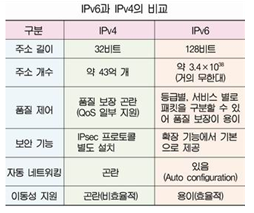
   </div>

#### Reference

- [개발자를 꿈꾸는 프로그래머](https://jwprogramming.tistory.com/28)

## #21

### MAC Address가 무엇인가요?

`MAC 주소(Media Access Control Address)`는 [네트워크 세그먼트의 데이크 링크 계층](#2)에서 통신을 위해 네트워크 인터페이스에 할당된 고유 식별자입니다.

IP주소와 마찬가지로 네트워크 통신에서 통신기기의 식별번호를 나타냅니다. 하지만 IP주소는 통신기기마다 고유하게 할당된 것이 아니라 통신사업자에게 받아오는 것이기에 바뀔 수 있습니다.

MAC주소는 통신기기 하드웨어 자체에 부여된 고유한 식별번호입니다. 하드웨어의 랜카드에 종속되므로 해킹하지 않는 한 고유한 번호를 갖습니다.

그럼 비슷한 기능을 하는 IP주소와 MAC주소. 왜 둘 다 필요한걸까요?

MAC주소는 바로 옆사람과의 통신에서만 쓰입니다. 저 멀리 미국에 있는 컴퓨터 A에게 가려면 MAC주소로는 판단할 수 없습니다. 그래서 IP주소로 어디로 가야할지 그 방향성을 정하고, 근처에 갔을 때 MAC주소로 통신하고자 하는 컴퓨터A를 찾는거죠!

#### Reference

- [위키백과 : MAC주소](https://ko.wikipedia.org/wiki/MAC_%EC%A3%BC%EC%86%8C)
- [IP주소와 MAC주소 개념](https://www.crocus.co.kr/1515)
- [IP주소와 MAC주소의 쉬운 설명](https://jhnyang.tistory.com/404)


## #22

### 라우터와 스위치, 허브의 차이를 설명해주세요.

**허브**

- 컴퓨터와 컴퓨터 사이를 이어준다. 네트워크에 존재하는 컴퓨터들의 중심에 위치하는 장비. 
- **데이터 패킷을 받으면 연결된 모든 장치들에게 모두 보낸다.**
- A, B, C, D 라는 컴퓨터가 있다고 가정할때, A가 B와 통신하고 싶다면 허브로 B로 연결해달라는 요청을 보냄. 하지만 허브는 연결된 컴퓨터를 구분할 수 없기 때문에 B, C, D 모두에게 요청을 보내고 각 컴퓨터들이 자신에 대한 요청인지 구분하여 응답한다. 이 예시에서 알 수 있듯이 C, D로 가는 불필요한 트레픽이 발생하기 때문에 대규모 네트워크에는 적합하지 않고 소규모 네트워크에 주로 사용된다. 이 문제점은 스위치를 활용하면 해결된다.

**스위치**

- 허브와 마찬가지로 컴퓨터끼리 연결해주지만 방식의 차이가 있다.
- **원하는 목적지에 데이터 패킷을 전송하는 장치**
- 스위치는 컴퓨터들의 고유한 번호인 맥 주소(MAC Address)를 수집해 해당 포트만 연결해준다. 따라서 불필요한 트래픽이 발생하지 않는다.

**라우터**

- 라우터는 LAN(Local Area Network:근거리 통신망)을 연결해주는 장치로써, 데이터를 전송할 때 **최종 목적지에 가기 위하여 거쳐야 하는 많은 경로들 중에 적절한 통신 경로를 결정하기 위하여 한 통신망에서 다른 통신망으로 데이터 패킷을 전송하는 장치**
- 우리가 흔히 알고 있는 ‘[www.naver.com’와](http://www.naver.xn--com-to0a3042h/) 같은 도메인을 통하여 접속을 하면, 도메인 서버를 통하여 IP를 얻을 수 있다. 이 IP를 이용하여 요청을 보내면, 라우터에서는 **‘다음은 여기 라우터로 가야됩니다!’** 라고 판단하고 데이터 패킷을 다른 라우터에게 전송해준다. 이런 과정을 여러번 진행하면서 수많은 라우터들을 거치고, 최종 목적지인 **네이버**로 도착하게 되는 것이다.

## #23

#### SMTP가 무엇인가요?

SMTP는 Simple Mail Transfer Protocol의 약자로 인터넷을 통해 한 이메일 계정에서 다른 이메일 계정으로 보내기 위해 사용되는 프로토콜입니다. (Gmail, Apple Mail, Outlook의 대부분 이메일 클라이언트 SMTP 사용하여 통신)


##### SMTP 작동방법

- SMTP 서버가 설정되면 전자 메일 클라이언트가 해당 서버에 연결하여 통신

- 사용자가 이메일 메시지에서 "보내기"를 누르면 이메일 클라이언트가 서버에 대한 SMTP 연결을 열어 보냄
- 거기에서 SMTP 클라이언트는 명령을 사용하여 보낸 사람의 전자 메일 주소, 받는 사람의 전자 메일 주소 및 전자 메일 내용과 같은 데이터를 전송하고 수행할 작업을 서버에 지시
- 메일 전송 에이전트 또는 메시지 전송 에이전트(MTA)는 두 이메일 주소가 gmail.com과 같은 동일한 이메일 도메인에서 온 것인지 확인
  - 그렇다면 즉시 이메일을 보냅니다.
  - 그렇지 않은 경우 서버는 DNS(Domain Name System)를 사용하여 받는 사람의 도메인을 식별한 다음 올바른 서버로 보냅니다.

<div align='center'>
     
</div>

**SMTP 명령어 예시**

- HELO - 클라이언트가 HELO 명령어 전송하여 SMTP를 식별하고 대화 시작 

- MAIL FROM: 보낸이 메일주소 지정. 새 메일 트랜잭션이 시작되고 있는다는 것을 SMTP서버에 알리고 서버가 모든상태 테이블과 버퍼 등을 재설정하도록 한다.

- RCPT TO: 받는이 메일주소 지정. 주어진 전자메일 메세지에 대해 여러번 반복하여 메세지 전달 가능.

- DATA: 메세지 본문내용의 전송 시작.

- RSET: RSET명령이 전자메일 서버로 보내지면 현재메일 트랜잭션이 중단된다. 연결은 닫히지 않지만 보낸이,받는이 및 전자메일 데이터에 대한 모든정보가 초기화 되고 버퍼/상태 테이블이 삭제된다. 

- VRFY: 서버에 지정된 사용자 이름이나 사서함이 유효한지 확인하도록 요청한다. 

- NOOP: 서버가 연결되어 있고 클라이언트와 통신할 수 있는지 확인한다. NOOP명령은 수신자가 OK응답을 보내도록 하는 것 외에는 수행하지 않음. 

- QUIT: 연결 종료.

  **SMTP 통신의 예**

  클라이언트에서 호스트인 www.example.com으로 SMTP 연결이 시작될 수 있다.

> ```
> S: 220 smtp.example.com ESMTP Postfix
> C: HELO relay.example.com
> S: 250 smtp.example.com, I am glad to meet you
> C: MAIL FROM:<bob@example.com>
> S: 250 Ok
> C: RCPT TO:<alice@example.com>
> S: 250 Ok
> C: RCPT TO:<theboss@example.com>
> S: 250 Ok
> C: DATA
> S: 354 End data with <CR><LF>.<CR><LF>
> C: From: "Bob Example" <bob@example.com>
> C: To: Alice Example <alice@example.com>
> C: Cc: theboss@example.com
> C: Date: Tue, 15 January 2008 16:02:43 -0500
> C: Subject: Test message
> C: 
> C: Hello Alice.
> C: This is a test message with 5 header fields and 4 lines in the message body.
> C: Your friend,
> C: Bob
> C: .
> S: 250 Ok: queued as 12345
> C: QUIT
> S: 221 Bye
> {The server closes the connection}
> ```


**SMTP와 다른 email Protocol들 과의 차이**

**SMTP**는 많은 email protocol 중에 하나로 다른 것의 예씨로는 **POP3**와 **IMAP**이 있다.

가장 주된 차이는 SMTP는 메일 서버로 부터 다른 곳으로 이메일을 sending or pushing하는 유일한 protocol이다. POP3와 IMAP은 자신의 이메일 서버로부터 수신자의 메일을 수신하거나 pulling 하는 protocol이다. 따라서 POP3 및 IMAP은 메일 전송을 확인만 하는것.

<div align='center'>
     
</div>

**POP**: Post Office Protocol의 약자로 들어오는 메시지를 수신하는 데 사용됩니다. 가장 최신 버전은 [POP3](https://whatismyipaddress.com/pop3) 이며 1988년에 마지막으로 업데이트되었습니다.  POP3는 이메일을 수신하고 고객이 받을 때까지 보관합니다. 모든 이메일은 로컬에 다운로드 및 저장되므로 한 대의 컴퓨터만 사용하여 이메일을 확인하는 사람에게 편리한 솔루션입니다

**IMAP**

IMAP은 이메일 서버에 메시지를 저장하지만 사용자가 이 서버에 액세스하여 이메일을 확인하고 구성할 수 있습니다. 이것과 POP의 차이점은 IMAP이 클라우드 서버를 사용하므로 모든 장치에서 이메일을 인증하고 분류할 수 있다는 것입니다. 많은 이메일 사용자는 편의성과 효율성 때문에 POP보다 IMAP을 선호


#### Reference

- [SMTP에 대해 알아야할 모든것](https://postmarkapp.com/guides/everything-you-need-to-know-about-smtp)
- [SMTP 위키백과](https://ko.wikipedia.org/wiki/%EA%B0%84%EC%9D%B4_%EC%9A%B0%ED%8E%B8_%EC%A0%84%EC%86%A1_%ED%94%84%EB%A1%9C%ED%86%A0%EC%BD%9C)
- [**SMTP 기본 명령어**](https://cheershennah.tistory.com/133)

## #24

### 노트북으로 `www.google.com`에 접속을 했습니다. 요청을 보내고 받기까지의 과정을 자세히 설명해주세요.

#### 요약

> 1. 사용자가 브라우저에 url 입력
> 2. url에서 도메인 name 부분을 DNS 서버에서 검색
> 3. DNS 서버에서 해당 domain name에 해당하는 ip 주소를 찾아 url 정보와 함께 전달
> 4. 웹페이지 url 정보와 전달받은 ip 주소는 http 프로토콜을 사용해 http 요정 메시지를 생성
> 5. 4번에서 생성된 http 요청 메시지를 TCP 프로토콜을 사용해 인터넷을 거쳐 ip주소의 컴퓨터로 전송
> 6. 도착한 http 요청 메시지는 HTTP 프로토콜을 사용해 HTTP 응답을 만듦
> 7. 만들어진 HTTP 메시지를 다시 TCP 프로토콜을 사용해 원래 컴퓨터로 전송
> 8. 도착한 HTTP 응답 메시지는 HTTP 프로토콜을 사용해 웹 페이지 데이터로 변환
> 9. 변환된 웹페이지의 데이터는 웹 브라우저에 의해 렌더링 되어 출력

#### URL (Uniform Resource Loacation)

네트워크 상에 자원(파일 등)이 어디에 위치하는지 알려주는 규칙

주소에 접속하려면 url에 맞는 프로토콜을 알아야하고 동일한 프로토콜로 접속해야한다.

##### URL 문법

<div align='center'>
     
   </div>

ex) https://www.naver.com : url의 맨 첫부분 `https` 는 프로토콜 이름, 위의 문법에서는 `scheme` 에 해당, gopher, telnet, ftp, usenet 등이 있다.

​	프로토콜 이후엔 `:` 로 구분, ip 혹은 domain name 정보가 필요한 프로토콜인 경우 `//` 를 추가

<div align='center'>
     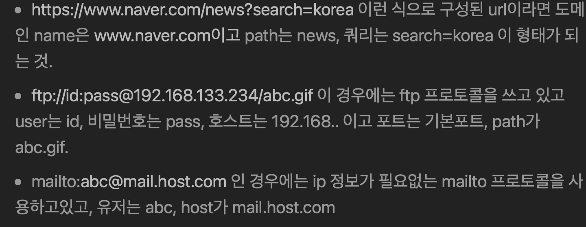
   </div>

#### DNS

<u>ip주소를 192.168. ... 에서 naver.com 이런식으로 사람이 이해하기 쉽게 바꿔주는 서버</u>


1. 만약 브라우저에 캐싱된 url이면 dns 서버에 요청을 보내지 않고, 
   캐싱되어 있지 않으면 로컬에 저장되어 있는 hosts 파일 중 참조할 수 있는 도메인이 있는지 확인
   이것도 실패시, dns 시스템에 따라 root - ild 서버 - authoriative 서버에 요청을 보내 ip 주소를 알아냄

2. ip 주소를 받으면 ARP(Address Resolution Protocol : ip -> MAC 주소로 바꿔주는 프로토콜, 자세한 것은 reference 3번째 링크 참조)를 통해 ip주소를 할당 받은 MAC 주소 알아냄
   subnet(하나의 네트워크가 분할되어 나눠진 작은 네트워크이다.)인지 판단하고 라우터 내 존재한다면 routing table을 추적해 MAC 주소 알아냄
   로컬 네트워크 아니면 gateway를 통해 밖에서 MAC 주소 검색. 이때 ARP를 broadcast. 이때 OSI 2계층(링크 계층)에 ARP 요청을 보냄.
   주소를 받으면 다시 DNS프로세스 시작, UDP을 기본으로 하지만 데이터 용량이 크면 TCP로 진행

<div align='center'>
        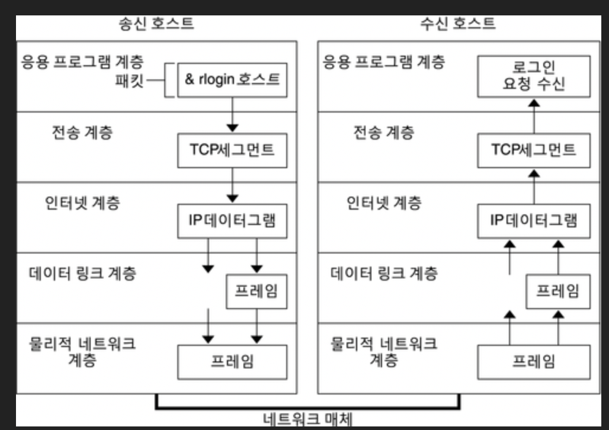
      </div>

3. MAC 주소를 받았다면 TCP 통신을 통해 소켓 열어야함.
   OSI 7계층을 통해 클라이언트에서 서버까지 데이터 전달하고 세션 연결
   먼저 IP주소를 브라우저가 알았으므로 포트번호를 가져와 TCP 소켓 스트임을 요청. 이때 전송계층(4번 층)에 TCP 세그먼트 전달, 대상포트가 헤더에 추가
   이걸 보낼 수 있게 잘게 자르고 네트워크 계층(3번 층)으로 전달한 다음 세그먼트 헤더에 대상 컴퓨터와 현재 컴퓨터의 ip주소를 추가한 패킷을 만든다. 패킷을 링크 계층(2번 층)으로 보내고 맥주소와 gateway(local router)의 MAC 주소를 포함하는 frame 헤더 추가. (없다면 ARP를 이용해 찾음)
4. 위 패킷을 네트워크를 통해 전송하고 패킷 로컬 subnet 라우터에 도착하면 AS(Autonomous System) 경계 라우터에서 패킷의 ip헤더의 타겟 주소 추출, 라우터마다 TTL을 하나씩 감소
5. 데이터를 잘 받았는지 handshake 과정 진행

#### HTTP 프로토콜 요청

HTTP면 connection setup 이후, HTTPS면 set up & TLS 후에 다음과 같은 형식으로 요청 시작

```
GET / HTTP/1.1
Host: google.com
Connection: close
[other headers]
```

여기서 other headers는 콜론(:) 으로 구분된 key, value 쌍을 말하며 HTTP 사양에 따라 형식이 지정되고 단일의 한 행으로 구분된다. ([HTTP ](https://developer.mozilla.org/ko/docs/Web/HTTP/Headers)[header 목록](https://developer.mozilla.org/ko/docs/Web/HTTP/Headers))

영구 연결을 지원하지 않는 HTTP / 1.1 은 응답이 완료된 후 연결이 닫히도록 하는 close 연결 옵션을 포함해야 한다.


#### HTTPS 서버 응답

 HTTPD(HTTP daemon) 서버는 요청 / 응답을 처리하는 서버이다. 가장 일반적인 HTTPD 서버는 Linux의 경우 Apache 또는 Nginx이고 Windows의 경우 IIS이다.

1) HTTPD 서버가 요청을 수신

2) 서버는 요청을 다음 매개변수로 구분

   - HTTP method (GET, POST, PUT, DELETE, CONNECT, OPTIONS, TRACE, HEAD). 주소 표시줄에 직접 입력한 url의 경우는 GET

   - 도메인 (여기서는 google.com)

   - 요청 된 경로 ( /path 형태, 여기서는 /, 기본경로)

3) 서버는 google.com에 해당하는 서버에 구성된 가상 호스트가 있는지 확인 (하나에 서버에서 여러 도메인을 서비스 할 수 있음)

4) 서버는 google.com이 GET 요청을 수락할 수 있는지 확인

5) 서버는 클라이언트가 IP, 인증 등을 통해 이 method를 사용할 수 있는지 확인

6) 서버에 rewrite module이 설치 돼 있으면 (예 : Apache의 경우 mod_rewrite, IIS의 경우 URL Rewrite) 요청 된 rule 중 하나와 일치하도록 시도, 일치하는 rule 이 있는 경우 서버는 해당 rule을 사용하여 요청을 다시 작성

7) 서버는 요청에 해당하는 콘텐츠를 가져오고, 여기서는 "/"가 기본 경로이므로 이 경우 index파일을 해석

8) 서버는 핸들러에 따라 파일을 구문 분석한다. php인 경우는 php를 사용하여 index파일 해석 후 출력을 클라이언트로 스트리밍


보다 자세한 내용은 referece의 맨 마지막 링크 확인

#### Reference

- [웹사이트가 브라우저에 뜨는 과정 - 구운밤](https://donologue.tistory.com/380)
- [네트워크 / 웹 사이트에 접속하는 과정](https://ecsimsw.tistory.com/entry/TCPIP-모델-웹-사이트에-접속하는-과정)
- [ARP(Address Resolution Protocol)](https://www.stevenjlee.net/2020/06/07/이해하기-arp-address-resolution-protocol-프로토콜/)
- [[Network\]서브넷(Subnet)](https://hyoje420.tistory.com/32)
- [AS 관련](https://한국인터넷정보센터.한국/jsp/resources/asInfo.jsp)
- [TTL 정리된 글](https://m.blog.naver.com/ljsun4336/220644328870)
- [TSL](https://reakwon.tistory.com/106)
- [⭐️  추천 ! 웹 브라우저에 URL을 입력하면 어떤 일이 일어날까?](https://owlgwang.tistory.com/1)

## #25

#### 여러 네트워크 topology에 대해 간단히 소개해주세요.

토폴로지

- LAN을 구성하는 다양한 종류의 장치들을 물리적으로 연결해놓은 형태
- 네트워크에 연결된 장비들의 배치 형태

+ 노드 : 네트워크의 연결점, 데이터 송신의 재분배점 또는 끝점.
  LAN에 연결되어 참여하는 장비와 컴퓨터를 통틀어 이르는 말.
  링크 : 노드 간 물리적인 연결

<div align='center'>
     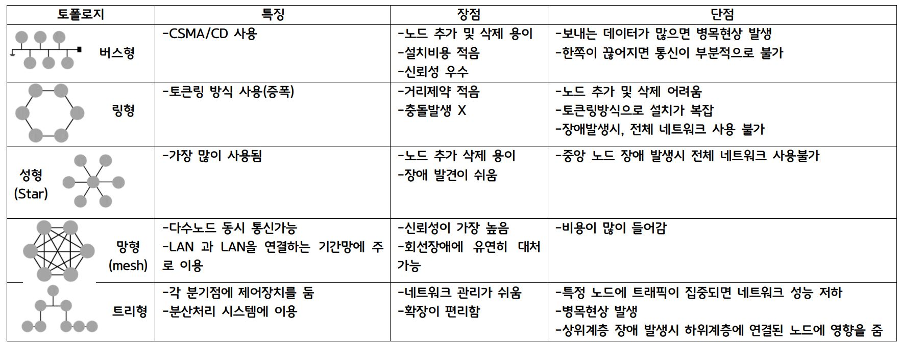
   </div>

#### Reference

- [토폴로지](https://dajjang.tistory.com/22)

## #26

#### Subnet mask에 대해서 설명해주세요.

#### Subnetting

- ****네트워크 관리자가 네트워크 성능을 향상시키기 위해, 자원을 효율적으로 분배하는 것(네트워크 영역과 호스트 영역을 분할 하는 것)**
- 너무 큰 브로드캐스트 도메인은 네트워크 환경에서 패킷전송을 느리게하고 성능저하를 발생시키기 때문에 네트워크를 쪼개서 통신 성능을 보장하는 것
- 필요한 네트워크 주소만 호스트 IP로 할당 할 수 있게 만들어 네트워크 낭비를 방지


#### Subnet mask

- IP Address에서 첫비트부터 **어디까지가 네트워크 부분인가 알려주는 역할**
-  IP주소에 마스크를 씌워서 어디까지가 네트워크 부분인가를 표시하는 것
-  IP Address처럼 32비트로 구성되며, **네트워크 부분**을 표시하는 비트는 **1**, **호스트 부분은 0**
-  연속성이 존재해서 네트워크 부분 중간에 0이 들어갈 수 없다.
- 예를 들어, IP주소 192.168.1.1에 서브넷마스크가 255.255.255.0라면 255로 표시된 부분인 192.168.1. 까지는 네트워크 부분이고 0으로 표시된 부분인 .1은 호스트 부분이다. 다시 말해, **255는 이진법**으로 표시하면 **11111111**이기 때문에 **네트워크 부분**
- 서브네팅한 네트워크 부분을 확인할 때는 IP주소와 Subnet mask를 AND연산해서 구한다.  AND연산은 각 비트를 비교해서 모두 1인 경우에만 1값을 반환한다.
- AND연산을 통해서 네트워크 부분을 구하게 될 경우 Network Address를 구할 수 있으며, 이때 호스트 부분을 모두 1로 바꿀 경우 Braodcast Address를 구할 수 있다. 이 두가지 주소의 경우 호스트에 할당 할수 없으며 이를 제외한 나머지 IP주소가 호스트에 할당 가능한 주소(Assigned Address)이다.

#### Reference

- [삽질블로그](https://limkydev.tistory.com/166)


## #27

### data encapsulation이 무엇인가요?

[송신하기 위해 데이터를 생성](#3)하는 과정입니다. 송신을 하기 위해 계층을 지나야하는데 그 계층을 지나기 위해 header를 붙이게 됩니다.

데이터에 header를 붙이는 작업들을 데이터 캡슐화라고 합니다.

#### Reference

- [토폴로지](https://dajjang.tistory.com/22)


## #28
### DHCP를 설명해주세요.
DHCP (Dynamic Host Configuration Protocol) 는 동적으로 IP 주소나 기타 정보들을 관리해주는 프로토콜을 말한다. 관리해야하는 컴퓨터가 많고 이들의 IP 를 모두 직접 할당하고 관리하려면 상당히 복잡하고 시간이 많이들지만, DHCP 를 사용하면 이러한 문제점을 해결할 수 있다.

DHCP 는 UDP 를 사용하여 클라이언트/서버 구조로 통신한다. 그 과정은 아래와 같다.

DHCP discover
: 컴퓨터가 동일 서브넷으로 브로드캐스팅(255.255.255.255) 으로 DHCP 서버를 찾음
DHCP offer
: DHCP 가 사용가능한 IP 주소의 리스트를 컴퓨터에게 전달함
DHCP request
: 컴퓨터가 리스트 중 하나의 IP 주소를 선택하여 서버에 전달
DHCP ack
: DHCP 가 컴퓨터에게 해당 IP 주소를 허락/거절하는 메세지를 전달
장점
DHCP 서버에서 자동으로 IP 를 관리해주므로 편리함
IP 에 변동이 있을 때, DHCP 에만 정보를 입력하면 됨
자동 할당
사용중인 컴퓨터에 대해서만 할당하므로 효율적임
단점
DHCP 서버에 의존하기 때문에 서버가 다운되는 경우 모든 컴퓨터에서 인터넷을 할 수 없음
초기 DHCP 세팅 시간 및 트래픽이 큼
단말 컴퓨터를 끌 경우, 완전히 주소가 release 될 때 까지 해당 IP 를 사용할 수 없음
References
DHCP 열심히 정리한 글 :) - Don't forget your time
DHCP란 그 개념부터 알아보자 - 네트워크보안�


## #29

#### routing protocol을 몇 가지 설명해주세요. (ex. link state, distance vector)

**라우팅이란?**

Routing이란 패킷(Packet)을 전송하기 위한 수많은 경로 중에서 한 가지 경로를 결정하는 것이다. 라우팅에는 동적 라우팅(Dynamic Routing)과 정적 라우팅(Static Routing)으로 나누는데 정적 라우팅은 주로 사람이 수동으로 미리 경로를 지정하는 방식이고, 동적 라우팅은 변화하는 상황에 맞추어 라우터가 경로를 재설정하는 방식으로 이루어진다.

**라우팅 프로토콜(Routing Protocol)의 개념**

라우팅을 위해서 네트워크 상의 모든 라우터(Router)들은 목적지에 따라서 패킷을 보낼 Interface를 선 계산해 놓아야 하는데 이 계산해 놓은 것을 라우팅 테이블이라고 한다.

> **라우팅 테이블을 생성, 유지, 업데이트, 전달하는 프로토콜**은 라우팅 프로토콜이라고 한다

라우팅 프로토콜 구성

1) Routing Table

- 패킷을 목적지로 라우팅 할 때 참조하는 테이블
- 목적지 주소, Output I/F, Metric 값

2) Message

- 라우터 간 라우팅을 위해 교환하는 메세지
- 이웃 도달 메세지, 라우팅 정보

3) Metric

- 라우팅 테이블 생성 및 업데이트 시 최적의 경로를 결정하는 기술
- 경로 길이, 홉(Hop) 수, 대역폭, 비용, 신뢰성

#### 라우팅 프로토콜의 종류
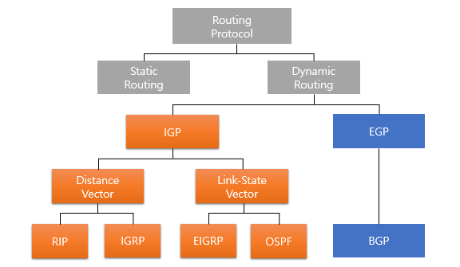

1. 라우팅 경로 고정 여부  

   Static Routing Protocol

   - 수동식, 사람이 일일이 경로를 입력, 라우터 부하경감, 고속 라우팅 가능
   - 관리자의 관리부담 증가 및 정해진 경로 문제 발생시 라우팅 불가능

   Dynamic Routing Protocol

   - 라우터가 스스로 라우팅 경로를 동적으로 결정
   - RIP, IGRP, OSPF, EIGRP

2. 내/외부 라우팅  

  Interior Gateway Protocol

  - 네트워크 집합에서 동일 그룹 내에서의 라우팅을 담당하는 라우팅 프로토콜
  - RIP, IGRP, OSPF, EIGRP

  Exterior Gateway Protocol	

  - 네트워크 집합에서 서로 다른 네트워크 그룹 사이에서 사용되는 라우팅 프로토콜
  - BGP, EGP

3. 라우팅 테이블 관리  
    Distance Vector Algorithm

  - 라우팅 Table에 목적지까지 가는데 필요한 거리와 방향만을 기록 (인접 라우터)
  - RIP, IGRP

  Link State Algorithm

  - 라우터가 목적지까지 가는 경로를 SPF(Shortest Path First) 알고리즘을 통해 모든 라우팅 테이블에 기록해 두는 것 (모든 라우터)
  - OSPF

#### Reference

- [라우팅 프로토콜](https://needjarvis.tistory.com/159)


## #31

#### client와 server의 차이점을 설명해주세요.

한 컴퓨터가 네트워크로 연결된 다른 하나, 또는 그 이상의 컴퓨터들에게 뭔가를 해주면

그 server해주는 컴퓨터가 서버(server)

그 서비스를 받는 컴퓨터가 클라이언트(client)

