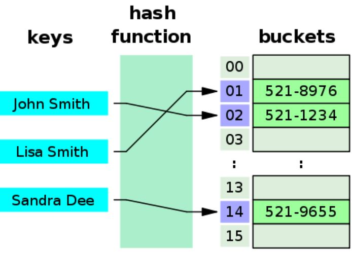
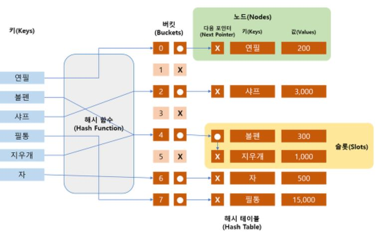
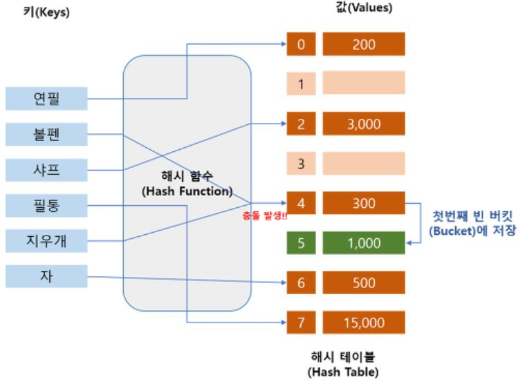

<div align='center'>
  <h1>🗂 Data Structure 🗂</h1>
</div>

> 질문은 <strong>[WeareSoft님의 tech-interview](https://github.com/WeareSoft/tech-interview)</strong>를 참고하였으며, 질문에 대한 답변은 직접 작성하였습니다.

---

## Table of Contents

- [linked list](#1)
  - [single linked list](#1-1)
  - [double linked list](#1-2)
  - [circular linked list](#1-3)
- [hash table](#2)
- [stack](#3)
- [queue](#4)
  - [circular queue](#4-1)
- [graph](#5)
- [tree](#6)
  - [binary tree](#6-1)
  - [full binary tree](#6-2)
  - [complete binary tree](#6-3)
  - [bst(binary search tree)](#6-4)
- [heap(binary heap)](#7)
  - [min heap](#7-1)
  - [max heap](#7-2)
- [Red-black Tree](#8)
- [B-Tree](#9)

---

## #2

### hash table

key, value의 데이터를 
key를 해시함수를 이용해 고정된 크기값에 맵핑한 데이터 구조

다른 내용의 데이터가 같은 키를 갖는 경우가 많으면 해시 충돌 --> 성능 하락.



충돌방지

체이닝 방식(separate chaining)



선형검색(linear probing)



각각의 key값은 해시함수에 의해 고유한 index를 가지게 되어 바로 접근할 수 있으므로 보통 O(1)의 시간복잡도로 데이터를 조회할 수 있다. 하지만 충돌이 발생한 경우 연결된 리스트들까지 검색해야하므로 O(N)까지 시간복잡도가 증가할 수 있다.

### Reference

+ [Hash Table interview](https://www.fullstack.cafe/blog/hash-tables-interview-questions)

## #4
### queue(큐) : 순차 queue

<div align='center'>
     
   </div>

- FIFO(First In First Out) 구조 : 먼저 삽입된 item이 먼저 삭제됨
  - 한쪽 끝(Rear)에서는 삽입연산만 이뤄지고
  - 다른 한쪽 끝(Front)에서는 삭제만 이뤄지는 리스트
- 초기에는 `Front == Rear == -1`로 초기화
- 공백일 땐 `Front == Rear`
- 삽입될 땐 Rear가 점차 증가하며 `Rear == n-1`인 경우 꽉 찬 상태

##### 순차 queue의 문제점
- 정말 `Rear == n-1`일 때 queue는 꽉 찼을까?
  - front에서 삭제가 일어났다면 그만큼 공간이 비어있을 것!
- 따라서 `Rear == n-1`인 상태에는 queue의 첫번째 원소의 위치를 0번 index로 이동시켜줘야 한다.
  - queue 원소 이동에 따른 비용이 발생

#### Reference
- [진짜 개발자 : 자료구조 Queue](https://galid1.tistory.com/483)
## #4-1
### circular queue

<div align='center'>
     
   </div>

- queue를 원형으로 구현
- 초기에는 `Front == Rear == 0`로 초기화
- 공백일 땐 `Front == Rear`
- 삽입될 땐 Rear가 점차 증가하며 `Rear+1 == Front`인 경우 꽉 찬 상태
  - 원형이기 때문에 full상태에서 원소 이동이 필요 없어짐!!!

 ### python deque
- python에는 queue를 쉽게 쓸 수 있는 collections.deque 클래스가 있음
- deque는 양방향 queue
  - 양방향으로 삽입할 수 있으며
    - `deque.append(item)` : deque의 오른쪽으로 append
    - `deque.appendleft(item)` : deque의 왼쪽으로 append
  - 양뱡향으로 삭제할 수 있음
    - `deque.pop()` : deque의 맨 오른쪽 원소 pop
    - `deque.popleft() : deque의 맨 왼쪽 원소 pop
      - 리스트의 경우 pop(0)을 하면 같음
##### 그러면 리스트 쓰면 될 것이지, 굳이 deque 왜 씀?
  - 빠르니까!
    - 리스트는 ***O(N)***
    - deque는 ***O(1)*** 연산을 수행
 ```python
from collections import deque
d = deque([1,2,3,4,5])
d.append(6)
print(d) #deque([1, 2, 3, 4, 5, 6])

d.appendleft(0)
print(d) #deque([0, 1, 2, 3, 4, 5, 6])

d.pop() #6

print(d) #deque([0, 1, 2, 3, 4, 5])

d.popleft() #0

print(d) #deque([1, 2, 3, 4, 5])
 ```

#### Reference
- [진짜 개발자 : 자료구조 Queue](https://galid1.tistory.com/483)
- [원형큐](https://daeguowl.tistory.com/112)

## #6

### Tree

트리는 **비선형(non-linear)** 계층 데이터 구조로 node로 구성되어 있고, 각 node는 edge로 연결되어 있다. 

**why tree data structure?**

배열, 연결리스트, 스택, 큐 같은 경우는 선형 구조로 데이터를 순차적으로 저장한다. 이는 데이터 사이즈가 커짐에 따라 연산 속도가 느려 질 수 있다. 트리는 비선형 구조를 사용함으로써 더 빠르게 데이터에 접근하여 연산을 수행할 수 있다

<div align='center'>
     
</div>


- 노드(node): 트리를 구성하는 기본 원소
- 루트 노드(root node/root): 트리에서 부모가 없는 최상위 노드, 트리의 시작점
- 부모 노드(parent node): 루트 노드 방향으로 직접 연결된 노드
- 자식 노드(child node): 루트 노드 반대 방향으로 직접 연결된 노드
- 형제 노드(siblings node): 같은 부모 노드를 갖는 노드들
- 잎 노드(leaf node)/단말 노드(terminal node): 자식이 없는 노드
- 경로(path): 한 노드에서 다른 한 노드에 이르는 길 사이에 있는 노드들의 순서
- 길이(length): 출발 노드에서 도착 노드까지 거치는 노드의 개수
- 깊이(depth): 루트 경로의 길이
- 레벨(level): 루트 노드(level=1)부터 노드까지 연결된 링크 수의 합
- 높이(height): 가장 긴 루트 경로의 길이
- 차수(degree): 각 노드의 자식의 개수
- 트리의 차수(degree of tree): 트리의 최대 차수 = max[deg1, deg2, ..., degn]
- 크기(size): 노드의 개수
- 너비(width): 가장 많은 노드를 갖고 있는 레벨의 크기

 **Tree Traversal - inorder, preorder and postorder**

트리 순회 방법, 데이터에 어떻게 접근하는지

<div align='center'>
     
</div>


- [그림출처](https://www.google.com/url?sa=i&url=https%3A%2F%2Finner-game.tistory.com%2F463&psig=AOvVaw0Mp-f95KClJKIjTORmzP43&ust=1642050702523000&source=images&cd=vfe&ved=0CAsQjRxqFwoTCICV2dm5q_UCFQAAAAAdAAAAABAD)

### 6 - 2

#### Binary Tree

Binary tree(이진 트리)는 부모 노드가 최대 2개의 자식 노드를 갖고 있는 트리 데이터 구조로 각 노드는 데이터, 왼쪽 자식 노드 주소, 오른쪽 자식 노드 주소로 구성되어 있다.

이진트리의 종류는 다음과 같다.

<div align='center'>
     
</div>


[이미지출처](https://miro.medium.com/max/16000/1*CMGFtehu01ZEBgzHG71sMg.png) 

- **Full Binary Tree**: full binary tree는 모든 부모 노드/internal 노드가 두 개의 자식노드를 갖거나 또는 아예 자식 노드를 가지지 않는 특수한 유형의 이진 트리입니다.
- **Perfect Binary Tree**: perfect binary tree는 모든 internal node가 정확히 2개의 자식 노드를 갖고 모든 leaf node가 동일한 level에 있는 이진 트리입니다.
- **Complete Binary Tree**: 마지막을 제외한 모든 level에서 반드시 completely filled(완전히 채워져) 있어야 하고 모든 leaf는 왼쪽을 먼저 채운다. 마지막 leaf node는 right sibling node를 가질 필요는 없다. full binary tree는 complete binary tree될 수 있으나 역은 x
- **Degenerate or Pathological Tree**: 왼쪽 으른쪽 자식 상관없이 하나의 자식 노드만 갖는 트리 구조
- **Balanced Binary Tree(height-balanced binary tree)**: Height-balanced binary tree로도 불리는 balanced binary tree는 어떤 node의 왼쪽과 오른쪽 subtree의 높이 차이가 1 이하인 binary tree 이다. 

### 6 - 3

#### Binary Search Tree(BST)

Binary Search Tree는 정렬된 숫자 목록을 빠르게 유지 관리할 수 있는 데이터 구조입니다.

- 각 트리 노드에는 최대 두 개의 하위 노드가 있기 때문에 이진 트리라고 합니다.
- 숫자가 있는지 검색하는 데 사용할 수 있기 때문에 검색 트리라고 합니다. 이 때의 시간 복잡도는 $O(log(n))$

Binary search tree와 일반적인 binary tree를 구분하는 속성은 다음과 같다.

- 왼쪽 subtree의 모든 노드가 루트 노드보다 작습니다.
- 오른쪽 subtree의 모든 노드가 루트 노드보다 큽니다.
- 각 노드의 두 하위 트리도 BST입니다. 즉, 위의 두 가지 속성을 가집니다

아래의 과정 그림으로 이해 [참고 사이트](https://www.programiz.com/dsa/binary-search-tree)

> 탐색(Search)

- 검색하고자 하는 값을 루트 노드와 먼저 비교하고, 일치할 경우 루트 노드를 리턴한다.
  - 불일치하고 검색하고자 하는 값이 루트 노드의 값보다 작을 경우 왼쪽 서브트리에서 재귀적으로 검색한다.
  - 불일치하고 검색하고자 하는 값이 루트 노드의 값보다 큰 경우 오른쪽 서브트리에서 재귀적으로 검색한다.

> 삽입(Insert)

- 삽입을 하기 전, 탐색을 수행한다.
- 트리를 탐색한 후 키와 일치하는 노드가 없으면 마지막 노드에서 키와 노드의 크기를 비교해서 왼쪽이나 오른쪽에 새로운 노드를 삽입한다.

> 삭제(Delete)

삭제하려는 노드의 자식 수에 따라

- 자식 노드가 없는 노드(리프 노드) 삭제: 해당 노드를 단순히 삭제한다.
- 자식 노드가 1개인 노드 삭제: 해당 노드를 삭제하고 그 위치에 해당 노드의 자식 노드를 대입한다.
- 자식 노드가 2개인 노드 삭제: 삭제하고자 하는 노드의 값을 해당 노드의 왼쪽 서브트리에서 가장 큰 값으로 변경하거나, 오른쪽 서브트리에서 가장 작은 값으로 변경한 뒤, 해당 노드(왼쪽 서브트리에서 가장 큰 값을 가지는 노드 또는 오른쪽 서브트리에서 가장 작은 값을 가지는 노드)를 삭제한다.

> 복잡도

BST의 탐색, 삽입, 삭제의 복잡도는 모두 [)](https://render.githubusercontent.com/render/math?math=O(h))이다. (h: BST의 높이(height))

BST는 평균 시간 복잡도가 [)](https://render.githubusercontent.com/render/math?math=O(\log_2 n))이지만 최악의 경우 [)](https://render.githubusercontent.com/render/math?math=O(n))이다. (skewed tree 이면 node의 수만큼 시간이 소요됨)

- tree가 complete binary tree 거나 full binary tree 이면 [)](https://render.githubusercontent.com/render/math?math=O(\log_2 n)), skewed tree 이면 [)](https://render.githubusercontent.com/render/math?math=O(n))

### Reference

- [Programiz - Tree](https://www.programiz.com/dsa/trees)

- [ai-tech-interview](https://github.com/SEOzizou/ai-tech-interview/blob/main/answers/7-data-structure.md#6)
- [balanced - binary tree 보충설명](https://www.programiz.com/dsa/balanced-binary-tree)

