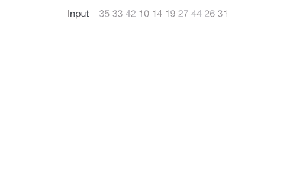
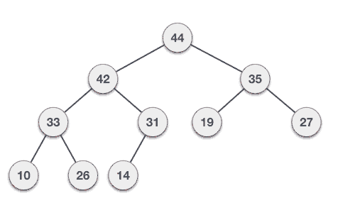
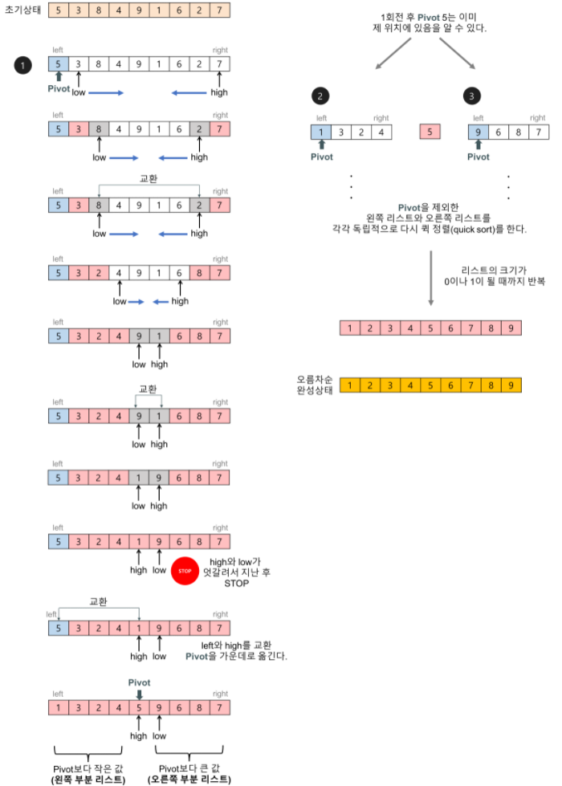
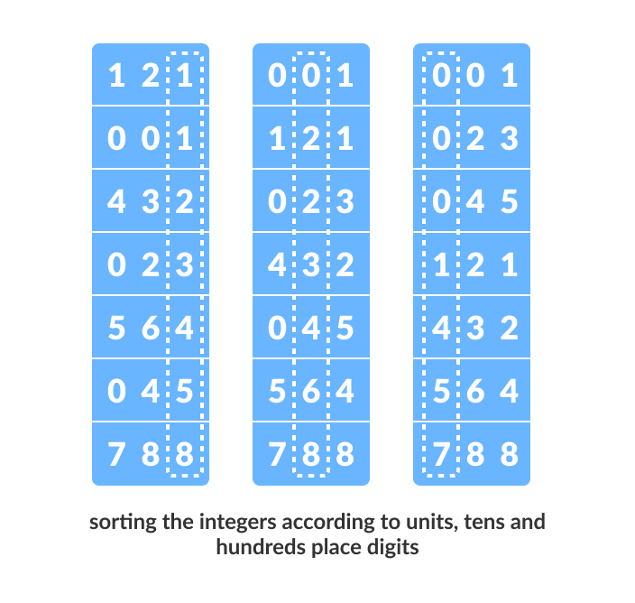
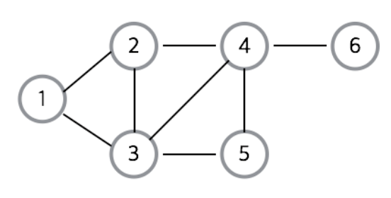
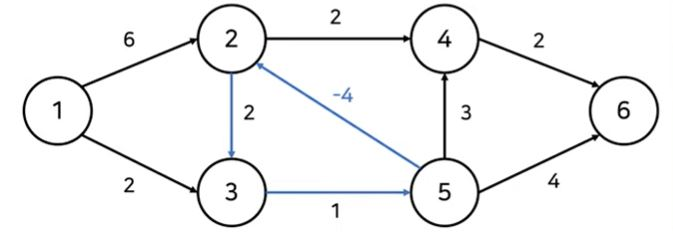

<div align='center'>
  <h1>🔻 Algorithm 🔻</h1>
</div>

> 질문은 <strong>[WeareSoft님의 tech-interview](https://github.com/WeareSoft/tech-interview)</strong>를 참고하였으며, 질문에 대한 답변은 직접 작성하였습니다.

---

## Table of Contents

- [시간, 공간 복잡도](#1)
- Sort Algorithm
  - [Bubble Sort](#2-1)
  - [Selection Sort](#2-2)
  - [Insertion Sort](#2-3)
  - [Merge Sort](#2-4)
  - [Heap Sort](#2-5)
  - [Quick Sort](#2-6)
  - [Counting Sort](#2-7)
  - [Radix Sort](#2-8)
- [Divide and Conquer](#3)
- [Dynamic Programming](#4)
- [Greedy Algorithm](#5)
- [Graph](#6)
  - [Graph Traversal: BFS, DFS](#6-1)
  - [Shortest Path](#6-2)
    - [Dijkstra](#6-2-1)
    - [Floyd-Warshall](#6-2-2)
    - [Bellman-Ford](#6-2-3)
  - [Minimum Spanning Tree](#6-3)
    - [Prim](#6-3-1)
    - [Kruskal](#6-3-2)
  - [Union-find](#6-4)
  - [Topological Sort](#6-5)

---

## #1

### 시간, 공간 복잡도

복잡도는 알고리즘 성능 평가의 척도
- 시간 복잡도 : 알고리즘의 연산 횟수
- 공간 복잡도 : 알고리즘의 메모리 공간

복잡도는 점근적 표기법(Asymptotic Notation)으로 나타냄

<div align='center'>
    
</div>

y축 : 복잡도(시간이나 메모리) -> 낮을수록 좋음
- 빅오(O) 표기법
  - 상한선 : 최악의 경우
- 오메가(Ω) 표기법
  - 하한선 : 최상의 경우
- 세타(θ) 표기법
  - 상한선과 하한선의 교집합 : 평균의 경우


#### References

- [점근적 표기법](https://ledgku.tistory.com/31)

---

## #2-1

#### Bubble Sort

<div align='center'>
    
    
</div>

> 시간복잡도

$O(N^2)$

> 파이썬 구현

```python
def bubbleSort(alist):
    for passnum in range(len(alist)-1, 0, -1):
        for i in range(passnum):
            if alist[i] > alist[i+1]:
                temp = alist[i]
                alist[i] = alist[i+1]
                alist[i+1] = temp
```

#### References
- https://yabmoons.tistory.com/241


## #2-2

#### Selection Sort

**선택 정렬**(selection sort)은 정렬 알고리즘의 하나로, 다음과 같은 순서로 이루어진다.

1. 주어진 리스트 중에 최소값을 찾는다.
2. 그 값을 맨 앞에 위치한 값과 교체한다(패스(pass)).
3. 맨 처음 위치를 뺀 나머지 리스트를 같은 방법으로 교체한다.

- n개의 주어진 리스트를 이와 같은 방법으로 정렬하는 데에는 $Θ(n^2) $만큼의 시간 복잡도를 갖는다.(n개의 원소  n-1번 비교)

- 선택 정렬은 알고리즘이 단순하며 사용할 수 있는 메모리가 제한적인 경우에 사용시 성능 상의 이점이 있다.
- 입력 배열이 이미 정렬되어 있건 말건 관계없이 동일한 연산량을 가지고 있기 때문에 최적화 여자가 적어서 다른 `O(N^2)` 대비해도 성능이 떨어지는 편으로 실전에서 거의 쓰이지 않는다.

<div align='center'>
    
</div>


**Python Code**

```python
def selection_sort(arr):
    for i in range(len(arr) - 1):
        min_idx = i
        for j in range(i + 1, len(arr)):
            if arr[j] < arr[min_idx]:
                min_idx = j
        arr[i], arr[min_idx] = arr[min_idx], arr[i]
```

#### References

- [선택 정렬(Selection Sort) 이란?](https://gmlwjd9405.github.io/2018/05/06/algorithm-selection-sort.html)
- [ 선택 정렬 - Selection Sort](https://www.daleseo.com/sort-selection/)
- [선택 정렬 from wikipedia](https://ko.wikipedia.org/wiki/%EC%84%A0%ED%83%9D_%EC%A0%95%EB%A0%AC)

## #2-3

### Insertion Sort

#### 정의

삽입 정렬(insertion sort)은 배열의 모든 요소를 앞에서부터 차례대로 이미 정렬도니 배열 부분과 비교하여 자신의 위치를 찾아 삽입하며 정렬을 완성하는 알고리즘


#### 특징

- 배열이 길어질수록 효율이 떨어진다.
- 구현이 간단하다
- 선택 정렬이나 거품 정렬(bubble 정렬)과 같은 O(n^2) 알고리즘에 비해 빠르며, 안정 정렬이고 in-place 알고리즘이다

#### 코드

```python
def insert_sort(x):
	for i in range(1, len(x)):
		j = i - 1
		key = x[i]
		while x[j] > key and j >= 0:
			x[j+1] = x[j]
			j = j - 1
		x[j+1] = key
	return x
```


+) 안정 정렬 / 불안정 정렬

- **안정 정렬** : 중복된 입력 값이 있을 때 입력 순서를 유지하여 정렬하는 알고리즘 (삽입정렬, 병합정렬, 버블 정렬, 계수 정렬 등이 있다)
- **불안정 정렬** : 중복된 입력 값이 있을 때 입력 순서 유지가 보장이 되지 않고 정렬되는 알고리즘 (퀵정렬, 선택 정렬 등이 있다.)

+) 정렬 알고리즘 시간 복잡도 비교

<div align='center'>
    
</div>

#### Reference

- [위키 백과 - 삽입 정렬](https://ko.wikipedia.org/wiki/삽입_정렬)

- https://gmlwjd9405.github.io/2018/05/10/algorithm-heap-sort.html)
- https://hongl.tistory.com/9

## #2-4

### Merge Sort

+ 분할 단계와 병합 단계로 나눌 수 있으며, 중간인덱스를 찾아야하는 분할 비용보다 각 단계마다 값들을 모두 비교해서 병합해야 하는 비용이 크다.

+ 각 단계에서 모든 값을 비교해야 하므로 N*단계의 수 logN시간이 필요하다. 비교 = NlogN

  각 단계에서 임시배열에 복사했다가 다시 가져와야 하므로 이동 연산 2N

  이동 = 2NlogN (연결리스트로 구성하면 링크 인덱스만 변경되므로 데이터의 이동은 무시할 수 있을 정도로 작아진다.)

  총 시간 복잡도는 O(NlogN)

**References**

+ [병합 정렬](https://www.daleseo.com/sort-merge/)
+ [합병 정렬](https://gmlwjd9405.github.io/2018/05/08/algorithm-merge-sort.html)

## #2-5

### Heap Sort

**완전 이진트리를 기본으로 하는 힙 자료구조를 기반으로한 정렬**


-  정렬해야 할 n개의 요소를 최대 또는 최소 힙을 구성한다.
- 현재 힙의 root에는 최대 또는 최소가 존재한다. 루트의 값을 말단 노드와 바꾼 후에, 힙의 사이즈를 하나 줄인다.
- 힙의 사이즈가 1보다 크면 이 과정을 반복한다.


이렇게 되면 마지막 노드를 제외한 트리에 대해 루트 노드에 들어간 새로운 값의 적절한 위치를 찾는 과정이 반복된다. 이와 같은 방식으로 최대 값을 하나씩 뽑아내면서 정렬하는 것을 **힙소트(Heap Sort)**라고 한다.


### 삽입 

<div align='center'>
    
</div>

### 삭제

<div align='center'>
    
</div>


- Heap sort는 시간 복잡도가 좋은편이다
- Heap sort가 유용한 경우는 **가장 큰 값 몇개만 필요할 때** 이다.
- 시간복잡도 -  **O(nlog₂n)**

#### References

- [힙 정렬](https://m.blog.naver.com/adamdoha/222014528828)
- [힙 정렬이란](https://gmlwjd9405.github.io/2018/05/10/algorithm-heap-sort.html)

## #2-6

### Quick Sort

퀵 정렬의 과정
- 분할(Divide): 입력 배열을 피벗을 기준으로 비균등하게 2개의 부분 배열(피벗을 중심으로 왼쪽: 피벗보다 작은 요소들, 오른쪽: 피벗보다 큰 요소들)로 분할한다.
- 정복(Conquer): 부분 배열을 정렬한다. 부분 배열의 크기가 충분히 작지 않으면 순환 호출 을 이용하여 다시 분할 정복 방법을 적용한다.
- 결합(Combine): 정렬된 부분 배열들을 하나의 배열에 합병한다.
순환 호출이 한번 진행될 때마다 최소한 하나의 원소(피벗)는 최종적으로 위치가 정해지므로, 이 알고리즘은 반드시 끝난다는 것을 보장할 수 있다.

<div align='center'>
    
</div>

- pivot : 기준점
- left : 부분리스트의 제일 왼쪽
- right : 부분리스트의 제일 오른쪽
- low : left부터 시작하며 pivot보다 큰 요소에서 멈춤
- high : right부터 시작하며 pivot보다 작은 요소에서 멈춤

#### References

- [Quick sort 개념](https://gmlwjd9405.github.io/2018/05/10/algorithm-quick-sort.html)
- [Quick sort visualization](https://www.hackerearth.com/practice/algorithms/sorting/quick-sort/visualize/)


## #2-7

#### Counting Sort(계수 정렬)

Counting Sort는 정렬 알고리즘으로 $O(N)$의 시간복잡도를 갖습니다. 반면 일반적 상황에서 가장 빠른 정렬 알고리즘인 Quick Sort의 평균시간복잡도는 $O(NlogN)$입니다 (최악의 경우는 $N^2$).

> 동작원리

리스트 예시 : $$[5,5,3,4,5,1,0,4,1,3,0,2,4,2,3,0]$$

1. 각 숫자가 몇 번 등장하는지 세어준다.


2. 등장 횟수를 누적합으로 바꿔준다.


3. 리스트를 뒤쪽에서부터 순회하며 각 숫자를 누적합을 index로 취급하여 넣어준다.

> 1. 리스트 예시에서 맨 뒤쪽 숫자는 0
> 2. 누적합은 3, 따라서 [ , , 0, , , ,] 의 형태로 새로운 리스트에 삽입
> 3. 그리고 누적합 -1
> 4. 0 다음에는 3이고 3의 누적합은 10임
> 5. 따라서 [ , , 0, , , , , , , 3, , , ,]
> 6. 3의 누적합 -1
> 7. 위 과정 반복


Counting Sort는 어떻게 이렇게 빠를까요? 

#### 그럼 왜 대부분의 정렬이 필요한 상황에서 더 빠른 Counting Sort를 안 쓰고 Quick Sort를 쓸까요?

`Counting Sort` 알고리즘의 시간복잡도는 O(n) 으로 `Quick Sort`보다 훨씬 유리해보입니다. 그러나 `세상에 공짜는 없다`는 말처럼 `Counting Sort`는 대부분의 상황에서 엄청난 `메모리 낭비`를 야기할 수 있습니다.

누적합 배열에 대한 접근을 O(1)에 달성하기 위해 정렬할 배열에 포함된 숫자의 최댓값 만큼의 메모리를 필요로 합니다. 아까 추가로 예시든 $$[0, 2, 0, 100, 2, 0]$$배열에 Counting Sort 알고리즘으로 정렬하기 위해서는 누적합 배열의 길이를 100으로 잡는 낭비를 해야합니다. 만약 배열에 최댓값으로 10억이 포함되어 있다면 엄청난 낭비가 되겠죠.

따라서 `Counting Sort`는 위에서든 예시처럼

$$[5,5,3,4,5,1,0,4,1,3,0,2,4,2,3,0]$$

정렬하는 숫자가 `특정한 범위`(위 예시 : 0~5) 안에 있을 때 사용하게 됩니다.

#### References

- [이론](https://bowbowbow.tistory.com/8)
- [시각화](https://www.cs.usfca.edu/~galles/visualization/CountingSort.html)


## #2-8

#### Radix Sort(기수 정렬)

기수 정렬(Radix Sort)은 입력값의 자릿수(d) 각각에 대해 카운팅 정렬을 적용하여 입력 데이터의 최댓값인 k가 커질수록 효율이 떨어지는 카운팅 정렬의 단점을 보완한 정렬 알고리즘이다. 

Radix(기수)는 '자리수'를 의미하는 것으로 기수 정렬은 다음과 같은 순서로 이뤄진다.

**1. 1의 자릿수를 보면서 각각의 버킷에 알맞게 담아준다. 버킷에서 순차적으로 뺀다면 1의 자릿수에 맞게 정렬이된다.**

**2. 1)에 의해서 정렬된 배열에서, 10의 자릿수를 비교해서 버킷에 담고 순차적으로 빼준다.**

**3. 2)에 의해서 정렬된 배열에서, 100의 자릿수를 비교해서 버킷에 담고 순차적으로 빼준다.**

**4. 최대 자릿수까지 계속해서 반복한다..**

`[121, 432, 564, 23, 1, 45, 788]`가 주어졌을 때 radix sort를 적용한 과정과 결과는 다음과 같다.

<div align='center'>
    
</div>

위 예시의 과정

1. 주어진 리스트의 최대값을 찾고 최대값의 자리수(Radix)를 계산한다. 여기서는 788로 자리수는 3이다.

2. 각 자리수에 대해 counting sort를 적용한다. 첫번째는 1의 자리에 대해서 counting sort 적용

   <div align='center'>
       
   </div>

3. 2의 결과를 이용하여 10의 자리에 대해서 counting sort를 적용

<div align='center'>
    
</div>

4. 3의 결과를 이용하여 100의 자리에 대해서 counting sort를 적용

   <div align='center'>
       
   </div>

Radix sort의 경우 중간에 counting sort를 사용하기 때문에 시간 복잡도는 `O(d(n+k))` 이다. 여기서 `d`는 최대값의 자리수(cycle의 횟수)이고 `n+k`는 counting sort에서 오는 시간 복잡도인데 Radix sort는 k = 10이다.

빠르고 counting sort을 개선한 방법이지만 여전히 추가적인 메모리가 필요하고 데이터 타입이 바뀌면 새로 정의해주어야 한다.(10진수 -> 16진수)

**Python Code**
Version 1
```python
from collections import deque

def radix_sort(nums):
    buckets = [deque() for _ in range(10)]

    max_val = max(nums)
    Q = deque(nums)
    cur_ten = 1

    while max_val >= cur_ten:
        while Q:
            num = Q.popleft()
            buckets[(num // cur_ten) % 10].append(num)

        for bucket in buckets:
            while bucket:
                Q.append(bucket.popleft())

        cur_ten *= 10
    return list(Q)

print(radix_sort([15, 27, 64, 25, 50, 17, 39, 28]))
```

Version 2
```python
# Radix sort in Python


# Using counting sort to sort the elements in the basis of significant places
def countingSort(array, place):
    size = len(array)
    output = [0] * size
    count = [0] * 10

    # Calculate count of elements
    for i in range(0, size):
        index = array[i] // place
        count[index % 10] += 1

    # Calculate cumulative count
    for i in range(1, 10):
        count[i] += count[i - 1]

    # Place the elements in sorted order
    i = size - 1
    while i >= 0:
        index = array[i] // place
        output[count[index % 10] - 1] = array[i]
        count[index % 10] -= 1
        i -= 1

    for i in range(0, size):
        array[i] = output[i]


# Main function to implement radix sort
def radixSort(array):
    # Get maximum element
    max_element = max(array)

    # Apply counting sort to sort elements based on place value.
    place = 1
    while max_element // place > 0:
        countingSort(array, place)
        place *= 10


data = [121, 432, 564, 23, 1, 45, 788]
radixSort(data)
print(data)
```


#### References

- [기수 정렬 설명 블로그 - 1](https://yabmoons.tistory.com/248l)
- [기수 정렬 설명 블로그 - 2](https://week-year.tistory.com/206)
- [Radix-sort Algorithm from programiz](https://www.programiz.com/dsa/radix-sort)

## #3

### Divide and Conquer

#### 정의

그대로 해결할 수 없는 문제를 작은 문제로 **분할** 하여 문제를 해결하는 방법

#### 구현 방법

보통 **재귀 함수**를 통해 구한다.

```
function F(x):
  if F(x)의 문제가 간단 then:
    return F(x)을 직접 계산한 값
  else:
    x를 y1, y2로 분할
    F(y1)과 F(y2)를 호출
    return F(y1), F(y2)로부터 F(x)를 구한 값
```

재귀호출을 사용하면 함수 호출 오버헤드 떄문에 실행 속도가 늦어지기 때문에 스택, 큐 등의 자료구조를 이용하여 구현도 가능하다.

#### 전략

1) **Divide** : 문제가 분할이 가능한 경우, 2개 이상의 문제로 나눈다.
2) **Conquer** : 나누어진 문제가 여전히 분할이 가능하면, 또 다시 Divide를 수행한다. 그렇지 않으면 문제를 푼다.
3) **Combine** : Conquer한 문제들을 통합하여 원래 문제의 답을 얻는다.

#### Reference

- [위키백과 - 분할 정복 알고리즘](https://ko.wikipedia.org/wiki/분할_정복_알고리즘)
- [분할 정복](https://janghw.tistory.com/entry/알고리즘-Divide-and-Conquer-분할정복)

## #4

### Dynamic Programming

큰 문제에 대한 답을 얻기 위해 동일한 문제이지만 크기가 더 작은 문제들을 먼저 해결한 뒤, 그 결과들을 이용해 큰 문제를 비교적 간단하게 해결하는 기법

Top down with Memoization

Bottom up with Tabulation


테이블 - 초기값 - 점화식

초기값 = 경우의 수가 유일

시간복잡도(tabulation) = 칸의개수(푸는 문제 개수) * 한 칸마다 걸리는 시간

#### References

+ [Dynamic Programming](https://www.interviewbit.com/courses/programming/topics/dynamic-programming/)

## #5

### Greedy Algorithm

- 최적의 해에 가까운 값을 구하기 위해 사용됨
- 여러 경우 중 하나를 결정해야할 때마다, **매순간 최적이라고 생각되는 경우를 선택**하는 방식으로 진행해서, 최종적인 값을 구하는 방식


### 동전문제

지불해야 하는 값이 4720원 일 때 1원 50원 100원, 500원 동전으로 동전의 수가 가장 적게 지불하시오.	

- 가장 큰 동전부터 최대한 지불해야 하는 값을 채우는 방식으로 구현 가능
- 탐욕 알고리즘으로 매순간 최적이라고 생각되는 경우를 선택하면 됨

```python
coin_list = [500, 100, 50, 1]

def min_coin_count(value, coin_list):
    total_coin_count = 0
    details = list()
    coin_list.sort(reverse=True)
    for coin in coin_list:
        coin_num = value // coin
        total_coin_count += coin_num
        value -= coin_num * coin
        details.append([coin, coin_num])
    return total_coin_count, details
```

```python
min_coin_count(4720, coin_list)
```

```python
(31, [[500, 9], [100, 2], [50, 0], [1, 20]])
```


### Greedy Algotithm의 한계

- 탐욕 알고리즘은 근사치 추정에 활용
- 반드시 최적의 해를 구할 수 있는 것은 아니기 때문
- 최적의 해에 가까운 값을 구하는 방법 중의 하나임

## #6

### Graph

- 그래프 관련 용어
    - 정점(node, vertex) : 자료
    - 간선(edge) : 정점 간의 관계
    - 가중치(weight) : 간선의 거리
    - 차수(degree) : 그래프와 연결된 간선의 개수
    - 단순경로(simple path) : 하나의 정점을 최대 한 번씩만 방문한 경로
    - cycle : 단순 경로의 출발점과 도착점이 같은 경우
- 그래프 종류
    - 양방향 그래프(=무방향 그래프)
    - 방향 그래프
    - 완전 그래프 : 각 정점에서 자신을 제외한 모든 정점과 연결된 그래프
        - 간선의 개수 : $\frac{V(V-1)}{2}$
    - 다중 그래프 : 두 정점 사이에 여러개의 간선이 있는 그래프
    - 사이클 없는 방향 그래프
    - 부분 그래프 : 정점이나 간선을 제외하여 만든 그래프
    - 이분 그래프 : 인접 정점까지 서로 다른 색으로 칠했을 때, 모든 정점을 두 가지 색으로 칠할 수 있는 그래프
- 그래프 표현
   <div align='center'>
       
   </div>

  - 인접 리스트
  ```python
  # index 0은 비워둠
  graph = [[],
            [0, 0, 1, 1, 0, 0, 0],
            [0, 1, 0, 1, 1, 0, 0],
            [0, 1, 1, 0, 1, 1, 0],
            [0, 0, 1, 1, 0, 1, 1],
            [0, 0, 0, 1, 1, 0, 0],
            [0, 0, 0, 0, 1, 0, 0]]
  ```
  - 인접 행렬
  ```python
  # index 0은 비워둠
  graph = [[],
            [2, 3],
            [1, 3, 4],
            [1, 2, 4, 5],
            [2, 3, 5, 6],
            [3, 4],
            [4]]
  ```

### #6-1

#### Graph Traversal: DFS, BFS

DFS: Depth First Search (깊이 우선 탐색)

BFS: Breadth First Search (너비 우선 탐색)

 

> DFS

*최대한 깊이 내려간 뒤, 더 이상 깊이 갈 곳이 없을 경우 옆으로 이동*


**DFS의 특징**

- 모든 노드를 방문하고자 하는 경우 사용
- 깊이 우선 탐색(DFS)가 너비 우선 탐색(BFS) 보다 좀 더 간단함
- 검색 속도 자체는 너비 우선 탐색(BFS)에 비해서 느림


> BFS

*최대한 넓게 이동한 다음, 더 이상 갈 수 없을 때 아래로 이동*


**BFS의 특징**

- 주로 두 노드 사이의 **최단 경로**를 찾고 싶을 때 이 방법을 선택


> BFS vs DFS

|                        DFS                        |                   BFS                   |
| :-----------------------------------------------: | :-------------------------------------: |
| 현재 정점에서 갈 수 있는 점들까지 들어가면서 탐색 | 현재 정점에 연결된 가까운 점들부터 탐색 |
|             스택 또는 재귀함수로 구현             |           큐를 이용해서 구현            |

## #6-2-1

#### Dijkstra

- 다익스트라( DiJkstra) 알고리즘은 **다이나믹 프로그래밍**을 활용하는 대표적인 최단 경로 탐색 알고리즘 입니다.

- 특징으로는 특정 하나의 정점에서 다른 모든 정점으로 가는 **최단 경로**를 알려준다. 다만 이 때 음의 간선(Edge)를 포함할 수는 없다. 
- 현실 세계에서는 음의 간선이 존재하지 않기 때문에 다익스트라는 현실 세계에 사용하기에 매우 적합한 알고리즘 중 하나라고 할 수 있다. GPS에 사용

- 다익스트라 알고리즘이 다이나믹 프로그래밍 문제인 이유는 '**최단 거리는 여러 개의 최단 거리로 이뤄져 있기 때문**입니다.'.

- 작은 문제가 큰 문제의 부분 집합에 속해있다고 볼 수 있습니다. 기본적으로 다익스트라는 하나의 최단 거리를 구할 때 이전까지 구했던 최단 거리 정보를 그대로 사용 한다는 특징을 갖고 있습니다.

  [그림](https://blog.naver.com/PostView.naver?blogId=ndb796&logNo=221234424646&redirect=Dlog&widgetTypeCall=true&directAccess=false)

다익스트라 알고리즘을 실행 하는 중에는 **방문하지 않은 인접 노드**를 방문하는 부분이 있습니다. 이 부분에서 **우선순위 큐(Heap)** 를 사용 하면, **지금까지 발견된 가장 짧은 거리의 노드에 대해서 먼저 계산** 할 수 있으며, **더 긴 거리로 계산 되었을 시 스킵** 또한 가능합니다.(단순 선형탐색시 시간 복잡도 $O(n^2)$ 힙 구조를 사용하면 $O(nlogn)$

우선순위 큐는 `heapq` 모듈을 이용해 구현 할 수 있습니다.

### Code

**Version 1**

[블로그](https://techblog-history-younghunjo1.tistory.com/247)

선형탐색 방법 시각 복잡도 O(N^2)

**Version 2**

**힙구조 이용**

```python
import heapq
import sys
input = sys.stdin.readline
INF = int(1e9)

# 노드 개수, 간선 개수 입력받기
n, m = map(int, input().split())
# 시작 노드 번호 입력받기
start = int(input())
# 각 노드에 연결되어 있는 노드에 대한 정보를 담는 리스트 만들기
graph = [[] for i in range(n+1)]
# 최단 거리 테이블을 모두 무한으로 초기화
distance = [INF] * (n+1)

# 모든 간선 정보 입력받기
for _ in range(m):
    a, b, c = map(int, input().split())
    # a 번 노드에서 b 번 노드로 가는 비용이 c 라는 의미
    graph[a].append((b, c))

def dijkstra(start):
    q = []
    # 시작 노드로 가기 위한 최단 경로는 0 으로 설정하여, 큐에 삽입
    heapq.heappush(q, (0, start))
    distance[start] = 0
    while q: # 큐가 비어있지 않다면
        # 가장 최단 거리가 짧은 노드에 대한 정보 꺼내기
	dist, now = heapq.heappop(q)
	# 현재 노드가 이미 처리된 적이 있는 노드면 무시
	if distance[now] < dist:
	    continue
	    # 현재 노드와 연결된 다른 인접한 노드들을 확인
	    for to_other in graph[now]:
	        cost = dist + to_other[1]
		if distance[to_other[0]] > cost:
		distance[to_other[0]] = cost
		heapq.heappush(q, (cost, to_other[0]))

# 다익스트라 알고리즘 수행
dijkstra(start)

# 모든 노드로 가기 위한 최단 거리를 출력
for i in range(1, n+1):
# 도달할 수 없는 경우, 무한으로 출력
	if distance[i] == INF:
		print("INFINITY")
	else:
		print(distance[i])
```


### Reference

- [다익스트라 알고리즘 From 동빈나 blog](https://blog.naver.com/PostView.naver?blogId=ndb796&logNo=221234424646&redirect=Dlog&widgetTypeCall=true&directAccess=false)
- [다익스트라 알고리즘 From Programiz](https://www.programiz.com/dsa/dijkstra-algorithm)
- [인터뷰 다른 답변](https://github.com/SEOzizou/ai-tech-interview/blob/main/answers/8-algorithm.md#6-2-1)


## #6-2-2

### Floyd-Warshall

#### 정의

변의 가중치가 ***음*** 이거나 양인 가중 그래프에서 최단 경로들을 찾는 알고리즘이다. 알고리즘을 한 번 수행하면 모든 꼭짓점 쌍 간의 최단 경로의 길이 (가중치의 합)을 찾는다.

##### 핵심 아이디어

'거쳐가는 정점'을 기준으로 최단 거리를 구하는 것

#### 알고리즘 과정

<div align='center'>
     
   </div>

위 그래프에서 각각의 정점이 다른 정점으로 가는 비용을 이차원의 배열 형태로 보이면 아래와 같다.

|    0    |    5    |  INF  |    8    |
| :-----: | :-----: | :---: | :-----: |
|  **7**  |  **0**  | **9** | **INF** |
|  **2**  | **INF** | **0** |  **4**  |
| **INF** | **INF** | **3** |  **0**  |

이 표가 의미하는 것은 **현재까지 계산된 최소 비용** 이다. 이러한 이차원 한배열을 반복적으로 갱신하여 최종적으로는 모든 최소 비용을 구해야한다.

이러한 반복의 기준이 되는 것은 <u>거쳐가는 정점</u> 이다.

##### 1) Node 1을 거쳐가는 경우

|    0    |     5      |    INF     |     8      |
| :-----: | :--------: | :--------: | :--------: |
|  **7**  |   **0**    | ***갱신*** | ***갱신*** |
|  **2**  | ***갱신*** |   **0**    | ***갱신*** |
| **INF** | ***갱신*** | ***갱신*** |   **0**    |

**갱신** : **X에서 Y로 가는 최소 비용 VS X에서 노드 1로 가는 비용 + 노드 1에서 Y가는 비용** 둘 중 적은 비용

결과

|    0    |            5            |           INF           |           8           |
| :-----: | :---------------------: | :---------------------: | :-------------------: |
|  **7**  |          **0**          |  **<u>9</u> vs 7+INF**  | **INF vs <u>7+8</u>** |
|  **2**  |  **INF vs <u>2+5</u>**  |          **0**          |  **<u>4</u> vs 2+8**  |
| **INF** | **<u>INF</u> vs INF+5** | **<u>3</u> vs INF + 5** |         **0**         |

위와 같은 방식으로 Node 2, 3, 4에 대해서도 수행하면 된다.

**최종 결과**

|   0   |   5    |  11   |   8    |
| :---: | :----: | :---: | :----: |
| **7** | **0**  | **9** | **13** |
| **2** | **7**  | **0** | **4**  |
| **5** | **10** | **3** | **0**  |

#### 간단히 구현한 코드 (python)

```python
# 초기 배열
arr = [
    [0, 5, float("inf"), 8],
    [7, 0, 9, float("inf")],
    [2, float("inf"), 0, 4],
    [float("inf"), float("inf"), 3, 0],
]
# 결과 그래프 초기화
result_arr = []
for i in range(len(arr)):
    result_arr.append(arr[i][:])

# k : 거쳐가는 노드
for k in range(len(arr)):
    # i : 출발 노드
    for i in range(len(arr)):
        # j : 도착 노드
        for j in range(len(arr)):
            if result_arr[i][k] + result_arr[k][j] < result_arr[i][j]:
                result_arr[i][j] = result_arr[i][k] + result_arr[k][j]

```


#### 응용 

- 알고리즘 자체는 경로를 반환하지는 않지만, 알고리즘을 변형하면 경로를 찾을 수 있다.
- 가중 그래프의 모든 꼭짓점 쌍 간의 최대 폭 경로를 찾는 것이 가능하다.

#### Reference

- [위키 백과 - 플로이드-워셜 알고리즘](https://ko.wikipedia.org/wiki/플로이드-워셜_알고리즘)
- [나동빈님 블로그 - 플로이드 워셜 알고리즘](https://blog.naver.com/ndb796/221234427842)


## #6-2-3

### Bellman-Ford

<div align='center'>
    
</div>

1. 출발 노드 설정

2. 최단 거리 테이블 초기화
3. 다음의 과정 N-1번 반복
   1. 전체 간선 E개를 하나씩 확인
   2. 각 간선을 거쳐 다른 노드로 가는 비용을 계산하여 최단 거리 테이블 갱신
4. 음수 간선 순환이 발생하는지 체크하고 싶다면 3번의 과정을 한 번 더 수행
   + 이때 최단 거리 테이블이 갱신된다면 음수 간선 순환이 존재하는 것.


+ 매번 모든 간선을 전부 확인

​		=> 다익스트라 알고리즘에서의 최적의 해를 항상 포함

+ 시간 복잡도 O(VE) 정점의 개수 * 간선의 개수

+ 다익스트라 알고리즘에 비해서 시간이 오래 걸리지만 음수 간선 순환 탐지 가능

<div align='center'>
    
</div>

#### Reference

+ [코딩 테스트를 위한 벨만 포드 알고리즘 7분 핵심 요약](https://www.youtube.com/watch?v=Ppimbaxm8d8)


## #6-4

#### Union-find

- Union-Find(유니온-파인드)는 대표적인 그래프 알고리즘으로, **'합집합 찾기'**라는 의미를 갖는다.
- **서로소 집합(Disjoint-Set) 알고리즘**이라고도 한다.
- 여러개의 노드가 존재할 때 **두 개의 노드를 선택해서, 현재 이 두노드가 서로 같은 그래프에 속하는지 판별**하는 알고리즘

Union-Find(유니온-파인드)알고리즘은 합집합(Union)과 찾기(Find) 연산을 제공

- **합집합(Union)**: 두 개의 집합을 하나의 집합으로 합친다.
- **찾기(Find)**: 노드가 속한 집합을 반환한다.

#### **Code**

```python
# 특정 원소가 속한 집합을 찾기
def find_parent(parent, x):
    # 루트 노드가 아니라면, 루트 노드를 찾을 때까지 재귀적으로 호출
    if parent[x] != x:
        parent[x] = find_parent(parent, parent[x])
    return parent[x]

# 두 원소가 속한 집합을 합치기
def union_parent(parent, a, b):
    a = find_parent(parent, a)
    b = find_parent(parent, b)
    if a < b:
        parent[b] = a
    else:
        parent[a] = b

# 노드의 개수와 간선(Union 연산)의 개수 입력 받기
v, e = map(int, input().split())
parent = [0] * (v + 1) # 부모 테이블 초기화하기

# 부모 테이블상에서, 부모를 자기 자신으로 초기화
for i in range(1, v + 1):
    parent[i] = i

# Union 연산을 각각 수행
for i in range(e):
    a, b = map(int, input().split())
    union_parent(parent, a, b)

# 각 원소가 속한 집합 출력하기
print('각 원소가 속한 집합: ', end='')
for i in range(1, v + 1):
    print(find_parent(parent, i), end=' ')

print()

# 부모 테이블 내용 출력하기
print('부모 테이블: ', end='')
for i in range(1, v + 1):
    print(parent[i], end=' ')
```

> **유니온-파인드 자료구조의 활용**

유니온-파인드 자료구조를 이용해 **무방향 그래프 내에서의 사이클**을 판별할 수 있다. 합집합 연산은 그래프의 간선으로 대응된다고 할 때, 다음과 같은 알고리즘으로 사이클을 판별할 수 있다.

- 간선으로 연결된 두 노드의 루트 노드를 확인한다.
- 만약 루트 노드가 서로 다르다면 합집합 연산을 수행한다.
- 만약 루트 노드가 같다면 사이클이 발생했다고 판단한다.

구현 방법은 [서로소 집합을 활용한 사이클 판별 - 이것이 취업을 위한 코딩테스트다](https://github.com/ndb796/python-for-coding-test/blob/master/10/4.py) 구현 코드를 참고!

#### References

- [동빈나 블로그 Union-Find](https://blog.naver.com/ndb796/221230967614)

- [Chapter 10. 그래프 이론 - 이것이 취업을 위한 코딩테스트다](http://www.yes24.com/Product/Goods/91433923)

- [기존답변](https://github.com/SEOzizou/ai-tech-interview/blob/main/answers/8-algorithm.md)
